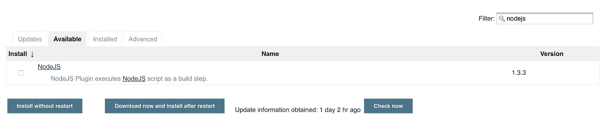
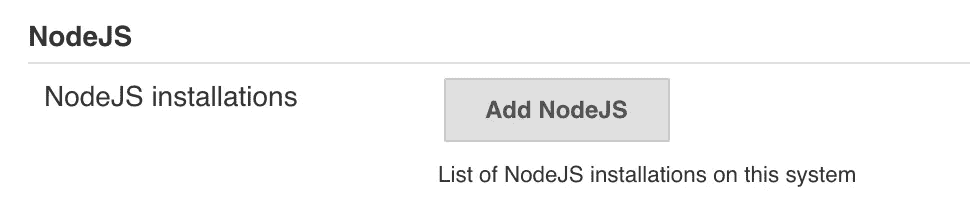
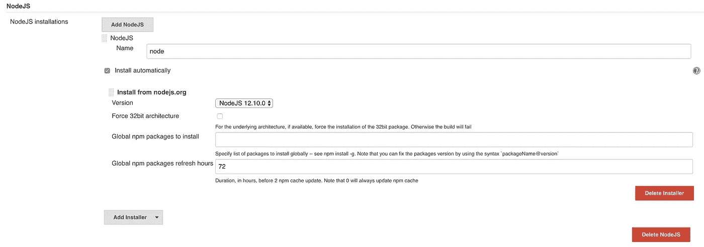
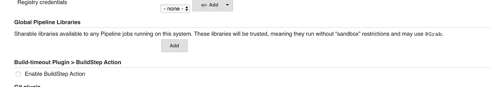
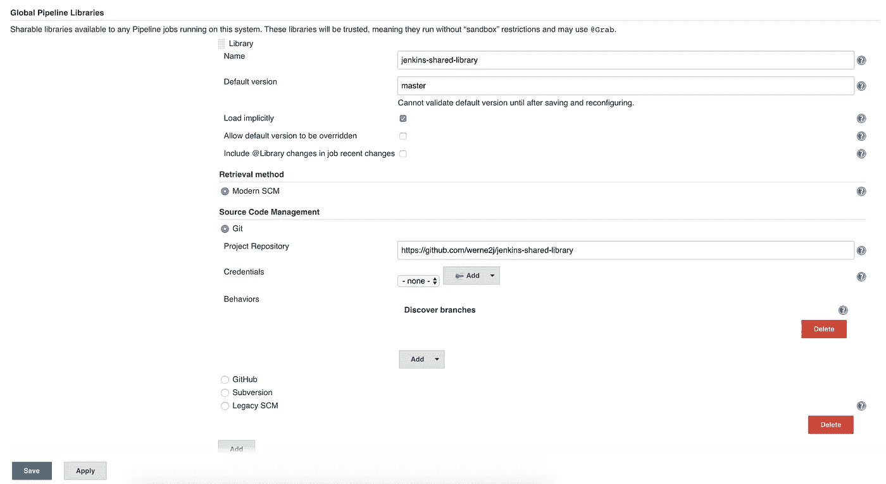
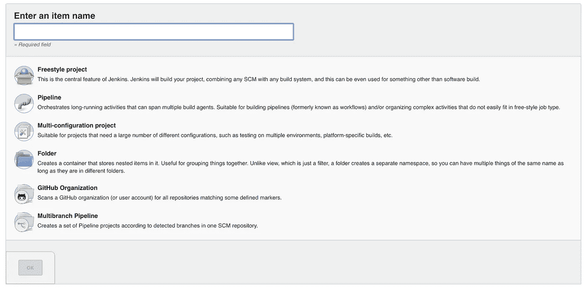
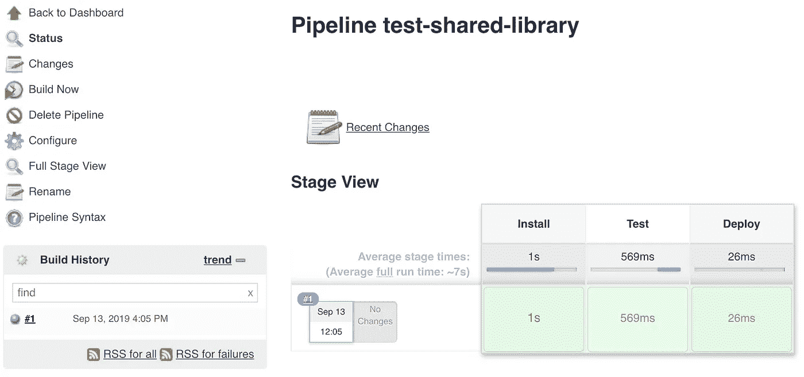
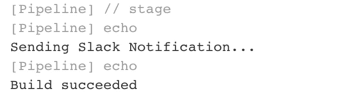

# 如何构建自己的 Jenkins 共享库

> 原文：<https://itnext.io/how-to-build-your-own-jenkins-shared-library-9dc129db260c?source=collection_archive---------0----------------------->

## 我的 Jenkins 共享库系列的第二部分


[https://jenkins.io/](https://jenkins.io/)

在我的 Jenkins 共享库系列的第一篇文章[中，我描述了什么是共享库以及为什么你应该开始利用它们。在这篇文章中，我将一步一步地介绍如何构建自己的](https://medium.com/@werne2j/jenkins-shared-libraries-part-1-5ba3d072536a) [Jenkins 共享库](https://jenkins.io/doc/book/pipeline/shared-libraries/)。

**免责声明**:我不会在本教程中向你展示如何设置 Jenkins。在这篇文章的其余部分，我将假设你有詹金斯运行。你可以按照[官方 Jenkins 文档](https://jenkins.io/doc/book/installing/)进行 Jenkins 设置

# 先决条件

本教程要求我们在 Jenkins 实例上安装 Node JS。因此，在我们开始创建 Jenkins 共享库之前，我将向您展示我们如何进行设置。

*   从 Jenkins 主屏幕，导航至`Manage Jenkins`，然后导航至`Manage Plugins`。
*   点击`Available`选项卡，然后使用过滤器，通过`nodejs`进行过滤。



*   选中`Install`下方的复选框，然后点击`Install without restart`。
*   安装完成后，导航回`Manage Jenkins`。
*   导航至`Global Tool Configuration`，然后向下滚动，直到看到`Node JS`。



*   点击`Add NodeJS`。
*   填写表单，如下所示:



*   点击`Save`。现在节点 JS 应该可供我们在 Jenkins 上使用了！

# **入门**

要做的第一件事是为我们的共享库规划变量。在本例中，我们将看几个不同的场景:

*   我们要处理的第一个场景是共享一个完整的管道。对于可能有相似部署策略的团队来说，共享完整的管道可能是有益的。这可以让团队拥有像一行代码一样简单的 Jenkinsfile。
*   第二个场景是共享某种助手代码的例子。这在不同的团队可能不共享同一个 Jenkinsfile，但他们可能共享代码块的情况下很有用。

在本系列的第一部分中，我描述了共享库所需的目录结构。我们将需要一个`src`和`vars`目录。

首先，打开您的终端，切换到您想要共享库代码的目录。我喜欢把我所有的代码放在一个`Developer`目录中。一旦进入您选择的目录，我们将为我们的共享库创建必要的目录，然后`cd`进入项目目录。

这方面的一个例子是:

```
mkdir -p ~/Developer/jenkins-shared-library/{src, vars}
cd ~/Developer/jenkins-shared-library
```

`src`目录应该看起来像标准的 Java 目录结构。因此，对于我们的示例，我们将添加子目录`org/example`到`src`。为此，运行`mkdir -p src/org/example.`

此时，您的目录结构应该是这样的:

```
├── jenkins-shared-library
│   ├── src
│   │   ├── org
│   │   │   ├── example
│   ├── vars
```

# **创建管道变量**

我们要创建的第一个变量将被称为`buildJavascriptApp`，如果这看起来很熟悉，那是因为这是我在本系列第一部分中使用的一个例子。

使用您选择的编辑器，在`vars`目录中创建一个名为`buildJavascriptApp.groovy`的文件，并粘贴以下代码:

```
def call(Map config=[:], Closure body) {
    node {
        git url: "[https://github.com/werne2j/sample-nodejs](https://github.com/werne2j/sample-nodejs)" stage("Install") {
            sh "npm install"
        } stage("Test") {
            sh "npm test"
        } stage("Deploy") {
            if (config.deploy) {
                sh "npm publish"
            }
        } body()
    }
}
```

如果有些没有意义，请不要担心，我们将遍历每一段代码。

从文件的顶部开始，我们有了`call()`方法。这是 Jenkins 所要求的，它告诉 Jenkins 当从 Jenkinsfile 调用 var 时要运行什么方法。所以所有的变量都必须有一个调用方法。

我们的变量有两个参数，一个名为`config`的映射和一个名为`body`的闭包。`config`参数允许我们将命名参数传递给调用方法。在这个例子中，我们只关心一个名为`deploy`的参数，它告诉我们是否要运行发布命令。

当被调用时，这看起来像是:

```
buildJavascriptApp deploy: true
```

另一个参数是一个 [Groovy 闭包](https://groovy-lang.org/closures.html)。这使得消费者能够通过传递我们想要执行的代码块来“扩展”这个变量，这可以像普通方法一样通过调用`body()`来完成。

当从 Jenkinsfile 调用变量并传递闭包时，它看起来像这样:

```
buildJavascriptApp {
  stage(“extra step”) {
    …
  }
}
```

变量的其余部分由基本的 Jenkins 步骤组成。我们使用`git`步骤来检查我们的样本节点 JS 项目的源代码。然后我们使用`sh`步骤来执行`npm install`和`npm test`。最后一个阶段检查部署变量是否被设置为真，如果是，运行`npm publish`命令。

这是第一个变量！

# **创建辅助变量**

对于这个变量，我们将创建一个`notify`变量，它封装了通过 Slack 或 email 发送通知的代码。在您选择的编辑器中，在`vars`目录下创建一个名为`notify.groovy`的文件。在这个例子中，我们不打算写一个全功能的通知变量，而是写一些简单的`if/else`逻辑，但是这个变量可以很容易地调整，以处理复杂的现实世界的逻辑。

对于这个变量，我们将利用位于`src`目录中的一些代码。在`src/org/example`中，创建一个名为`Constants.groovy`的文件，这将是一个导出常量供我们在变量中使用的类。

打开，`Constants.groovy`并添加此代码:

```
package org.exampleclass Constants {
  static final String SLACK_MESSAGE = "Sending Slack Notification"
  static final String EMAIL_MESSAGE = "Sending Email"
}
```

`src`目录可以用于这样的事情，或者甚至用于存放您的共享库的大部分逻辑，您可以在本系列的第 3 部分中读到更多。

现在，回到变量，打开`notify.groovy`并添加以下代码:

```
import org.example.Constantsdef call(Map config=[:]) {
    if (config.type == "slack") {
        echo Constants.SLACK_MESSAGE
        echo config.message
    } else {
        echo Constants.EMAIL_MESSAGE
        echo config.message
    }
}
```

这个变量接受一个名为 config 的参数。像第一个例子一样，这是一个映射，允许我们将命名参数传递给变量。

我们还从`src`目录导入了 Constants 类，这样我们就可以访问我们创建的常量。

这个变量中的逻辑非常简单，如果我们要发送的通知类型是`slack`，我们将打印出`Sending Slack Notification`，否则我们将假设要发送一封电子邮件，并将打印出`Sending Email`。我们还打印出一条传递给变量的消息。

在 Jenkinsfile 中，可以这样调用此变量:

```
notify type: “slack” message: “a slack notification”
```

这就是我们的第二个变量！我们现在有两个不同的变量可以使用！

# **将我们的共享库加载到 Jenkins 中**

现在是时候将共享库加载到 Jenkins 中，看看它们是否工作！

*   点击`Manage Jenkins -> Configure System`。
*   滚动直到你看到`Global Pipeline Libraries`，这是我们加载库的地方。



*   点击`Add`。
*   我们将这个库命名为`jenkins-shared-library`，并将默认版本设置为`master`。
*   确保选择复选框`Load Implicitly`。[标记为](https://jenkins.io/doc/book/pipeline/shared-libraries/#using-libraries) `[Load Implicitly](https://jenkins.io/doc/book/pipeline/shared-libraries/#using-libraries)` [的共享库允许管道立即使用任何此类库定义的类或全局变量。](https://jenkins.io/doc/book/pipeline/shared-libraries/#using-libraries)
*   选择`Modern SCM`，然后选择`Git`。我将从 https://github.com/werne2j/jenkins-shared-library.git 加载库。如果你愿意的话，你可以试着把你的库推到 Github 并加载进去。
*   将库的存储库 url 放在`Project Repository`中。
*   点击`Save`。

库现在加载到詹金斯！



# 从 Jenkins 作业测试共享库

最后要做的事情是创建一个 Jenkins 作业并测试库。

*   在詹金斯首页点击`create new job`。



*   输入您的工作名称，我将使用`test-shared-library`。
*   选择`Pipeline`作为工作类型，然后点击`OK`。
*   创建作业后，您将进入该作业的配置页面。向下滚动直到看到`Pipeline`。
*   我们将选择`Pipeline Script`,这样我们就可以测试这个库，而不必从 Git 加载 Jenkinsfile。
*   在脚本区域，我们将测试`buildJavascriptApp`变量，同时将`notify`变量作为闭包的一部分进行传递。一旦写出来就都说得通了。
*   在管道脚本区域粘贴以下代码:

```
node {
    env.NODEJS_HOME = "${tool 'node'}"
    env.PATH = "${env.NODEJS_HOME}/bin:${env.PATH}"

    buildJavascriptApp deploy: false, {
        notify type: "slack", message: "Build succeeded"
    }
}
```

希望这段代码现在有意义了。这里唯一不同的是变量调用上面的两行。我们需要告诉 Jenkins 使用我们的 Node JS 配置，我们通过在 path 环境变量上设置 Node JS 工具来做到这一点。

*   点击屏幕底部的`Save`。考验的时候到了！
*   您将被带到工作的主页。到达后，单击`Build Now` 测试管道脚本。

几秒钟后，你应该会看到管道出现，如果你看到所有的绿色，那么恭喜你，你已经成功地创建了你的第一个共享库！



我们可以查看控制台输出，看看发生了什么。单击构建作业编号旁边的蓝色圆圈，在本例中为`#1`。这将带您到构建的控制台输出。

如果你向下滚动，你应该会看到 Jenkins 从 Github 检查出样本节点 JS 应用程序，然后运行`npm install`和`npm test`。这表明这些阶段只是通过在管道脚本中包含`buildJavascriptApp`来执行的。

再往下一点，你会看到另一个变量在起作用。



在管道脚本中，我们声明希望在传递给`buildJavascriptApp`的闭包中运行类型 slack 的`notify`，正如我们在这里看到的，我们从`src`中的 constants 类获得 slack 通知常量，以及传递给`notify`的消息。

希望本教程能够为您提供一些技能，让您能够开始创建自己的 Jenkins 共享库！

感谢您阅读我的 Jenkins 共享库系列的第二部分。

在我的 Jenkins 共享库系列的第三部分中，我们将讨论如何为共享库编写测试。

## 我的詹金斯共享图书馆系列

[](https://medium.com/@werne2j/jenkins-shared-libraries-part-1-5ba3d072536a) [## 什么是 Jenkins 共享库，为什么你应该使用它们

### Jenkins 共享库系列文章的第 1 部分

medium.com](https://medium.com/@werne2j/jenkins-shared-libraries-part-1-5ba3d072536a) [](https://medium.com/@werne2j/how-to-build-your-own-jenkins-shared-library-9dc129db260c) [## 如何构建自己的 Jenkins 共享库

### 我的 Jenkins 共享库系列的第二部分

medium.com](https://medium.com/@werne2j/how-to-build-your-own-jenkins-shared-library-9dc129db260c) [](https://medium.com/@werne2j/unit-testing-a-jenkins-shared-library-9bfb6b599748) [## Jenkins 共享库的单元测试

### Jenkins 共享库系列文章的第三部分

medium.com](https://medium.com/@werne2j/unit-testing-a-jenkins-shared-library-9bfb6b599748) [](https://medium.com/@werne2j/collecting-code-coverage-for-a-jenkins-shared-library-c2d8f502732e) [## 收集 Jenkins 共享库的代码覆盖率

### 我的 Jenkins 共享库系列的第四部分

medium.com](https://medium.com/@werne2j/collecting-code-coverage-for-a-jenkins-shared-library-c2d8f502732e)