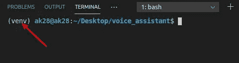
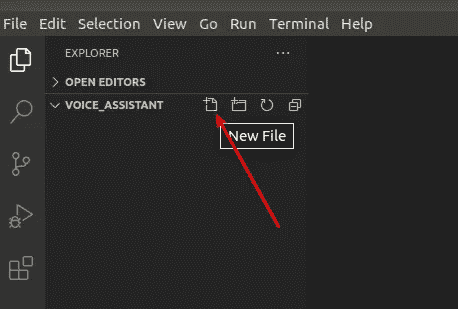
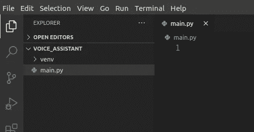
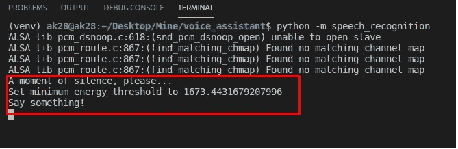
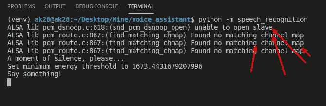

# 如何构建自己的 Python 语音助手| thecodingpie

> 原文：<https://itnext.io/how-to-build-your-own-python-voice-assistant-thecodingpie-eaa1f70aabb6?source=collection_archive---------1----------------------->


让我们建造它！

这篇文章最初发表在我的博客——[https://thecodingpie.com](https://thecodingpie.com/)

有没有兴趣像电影《钢铁侠》中的贾维斯一样，打造自己的虚拟语音助手？如果你有兴趣建立一个，那么你来对地方了。

大家好，在本教程中，你将学习如何使用 Python 构建自己的个人语音助手，比如 Jarvis。

您可以从我的 Github repo — [最终版本下载完成的项目代码。](https://github.com/the-coding-pie/voice_assistant)

现在，在开始之前，让我们了解一下我们要构建什么…

# 了解我们要建造什么？

我们将要构建的语音识别程序将能够识别这些命令:

*   名称—告知其名称。
*   日期—显示日期。
*   时间—显示当前时间。
*   你好吗？—会说“我很好……”。
*   搜索—将使用 Google 进行搜索。
*   最后，如果我们说“退出”或“退出”，它将终止。

为了实现所有这些功能，我们将主要使用 3 个 python 模块:

*   **语音识别** —识别我们的语音，并使用谷歌的网络语音 API 将其转换为文本格式。
*   **PyAudio** —用于使用麦克风。
*   **pyttsx3** —用于将给定文本转换为语音(即用于生成计算机语音)

# 我们该如何建造它？

基本上很简单。我们只需要创建 3 个函数，仅此而已！

*   第一个函数`recognize_voice()`，将负责捕获我们的声音(我们通过麦克风输入的)，识别它，并返回它的“文本”版本。
*   然后，我们将把语音的“文本”版本交给另一个名为`reply()`的功能，它将负责回复我们，并做各种其他疯狂的事情(如搜索谷歌，告诉当前时间等)。).
*   最后，一个名为`speak()`的函数，它将接受我们给它的任何文本并将其转换成语音。

我们将无限重复上述功能，直到用户说“退出”或“退出”。

# 要求

*   你应该擅长 python3。
*   您应该在计算机上安装 python3.3 或更高版本。
*   你应该已经安装了 **venv** 。如果您使用的是 Python 3.3 或更新版本，那么 **venv** 已经包含在 Python 标准库中，不需要额外安装。
*   你应该有一个麦克风(笔记本电脑的内置麦克风或者耳机上的麦克风就可以了)
*   你应该需要一个互联网连接。
*   最后，你应该有一个像 visual studio 代码这样的现代代码编辑器。

有了这些东西，我们开始吧。

# 初始设置

*   首先，在计算机上的任意位置创建一个名为`voice_assistant`的文件夹。
*   然后在 visual studio 代码中打开它。

现在让我们使用 **venv** 创建一个新的虚拟环境并激活它。为此:

*   打开**端子>新建端子**。
*   然后键入:

```
python3 -m venv venv
```

这个命令将为我们创建一个名为 **venv** 的虚拟环境。

*   要激活它，如果您在**窗口**上，请键入以下内容:

```
venv\Scripts\activate.bat
```

*   如果您使用的是 **Linux/Mac** ，那么:

```
source venv/bin/activate
```

现在，您应该会看到类似这样的内容:



这意味着您已经成功激活了虚拟环境

**注意:**像 **venv** 这样的虚拟环境有助于我们将所有与当前项目相关的依赖关系都保存在与主计算机隔离的环境中。这是我们使用它的主要原因之一。

*   最后，直接在 voice_assistant 文件夹中创建一个名为“`main.py`”的新文件，如下所示:



点击此图标并创建文件

*   现在，您将看到与此类似的内容:



main.py 文件

就这样，现在让我们安装那些需要的模块。

# 安装需求

为了识别我们的声音并将其转换为文本，我们需要一些额外的模块，如 **SpeechRecognizer** ，所以让我们安装它。在终端中键入以下命令:

```
pip install SpeechRecognition
```

现在，如果您使用麦克风作为输入源，在我们的例子中，我们需要安装 [PyAudio 包](https://people.csail.mit.edu/hubert/pyaudio/)。

安装 **PyAudio** 的过程会因你的操作系统而异。

对于 **Linux** :

```
sudo apt-get install python-pyaudio python3-pyaudiopip install pyaudio
```

如果你在苹果电脑上:

```
brew install portaudiopip install pyaudio
```

如果你在**窗口**上:

```
pip install pyaudio
```

如果您在 Windows 上安装 **PyAudio** 时遇到任何错误，请参考此[堆栈溢出解决方案](https://stackoverflow.com/questions/52283840/i-cant-install-pyaudio-on-windows-how-to-solve-error-microsoft-visual-c-14)。如果你在不同的机器上，那么尝试谷歌错误。如果你仍然有这些错误，请在下面随意评论。

一旦您安装了 **PyAudio** ，您可以通过键入以下命令从终端测试安装:

```
python -m speech_recognition
```

请确定您的默认麦克风已打开且未静音。如果安装工作正常，您应该会看到如下内容:



成功消息

如果你使用的是 Ubuntu，那么你可能会得到一些“ **ALSA 库[…]未知的 PCM** ”这样的错误:



ALSA 误差

要抑制那些错误，请看*[***这个 Stackoverflow 的答案***](https://stackoverflow.com/questions/7088672/pyaudio-working-but-spits-out-error-messages-each-time) ***。****

*现在，为了让程序能够说话，我们必须安装 **pyttsx3** 模块:*

```
*pip install pyttsx3*
```

***pyttsx3** 是 Python 2 和 3 的文本到语音(TTS)库。它的工作没有互联网连接或延迟。它还支持多种 TTS 引擎，包括 Sapi5、nsss 和 espeak。*

*就这样，我们已经安装并设置了所有的先决条件。现在是写程序本身的时候了，让我们开始吧。*

# *识别声音()*

*首先，该进口的都要进口。*

*在`main.py`文件中键入以下代码:*

```
*# all our imports
import speech_recognition as sr
from time import sleep
from datetime import datetime
import webbrowser
import pyttsx3*
```

*   *首先，我们将`speech_recognition`模块作为`sr`导入。*
*   *然后我们从`time`模块导入`sleep()`函数。我们一会儿将使用它来制造一个假延迟。*
*   *然后为了知道当前的日期和时间，我们需要那个`datetime`模块。*
*   *然后打开浏览器进行谷歌搜索，我们需要`webbrowser`模块的帮助。*
*   *然后就像我之前说的，要把文本转换成语音，我们需要`pyttsx3`。*

*SpeechRecognition 的所有神奇之处都发生在`Recognizer`类上。接下来让我们实例化它:*

```
*# make an instance of Recognizer class
r = sr.Recognizer()*
```

*现在配置`pyttsx3`:*

```
*# confs for pyttsx3
engine = pyttsx3.init()*
```

*   *pyttsx3 将负责生成计算机语音。查看/破解性别、年龄、速度等。在生成的计算机声音中，[阅读此描述](https://pypi.org/project/pyttsx3/)。*

*现在让我们创建那个`recognize_voice()`函数。此`recognize_voice()`功能将执行以下操作:*

*   *听我们的麦克风。*
*   *借助`recognize_google()`功能识别我们的声音。*
*   *将其转换为文本格式。*
*   *然后返回我们声音的那个`text`版本。*

*创建如下的`recognize_voice()`函数:*

```
*""" fn to recognize our voice and return the text_version of it"""
def recognize_voice():
  text = '' # create an instance of the Microphone class
  with sr.Microphone() as source:
    # adjust for ambient noise
    r.adjust_for_ambient_noise(source) # capture the voice
    voice = r.listen(source) # let's recognize it
    try:
      text = r.recognize_google(voice)
    except sr.RequestError:
      speak("Sorry, the I can't access the Google API...")
    except sr.UnknownValueError:
      speak("Sorry, Unable to recognize your speech...")
  return text.lower()*
```

*   *如果发生了一些错误，比如你的网络连接不好，它就会发出适当的信息。*

*记住`speak()`函数不是一个内置函数。我们必须创建它，我们将在最后完成它，因为它是一个小函数。*

*还要记住这个`speak()`函数会将给定的文本转换成语音(计算机生成的声音)。*

*现在，在文件的最底部，键入以下内容:*

```
*# wait a second for adjust_for_ambient_noise() to do its thing
sleep(1)while True:
  speak("Start speaking...")
  # listen for voice and convert it into text format
  text_version = recognize_voice() # give "text_version" to reply() fn
  reply(text_version)*
```

*   *延迟 1 秒后，我们开始一个无限循环。*
*   *然后`speak()`消息“开始讲话……”，这就像是对终端用户的提示。*
*   *然后我们监听语音，并使用我们刚刚创建的`recognize_voice()`函数将其转换成文本格式。*
*   *现在我们有了输入语音的`text_version`。所以我们可以用这个来生成响应，比如告诉日期，当前时间，根据我们的要求搜索谷歌。*
*   *这就是`reply()`函数要做的事情。*

*现在让我们创建那个`reply()`函数。*

# *回复()*

*该函数将接受`text_version`作为参数，然后相应地执行操作。在我们之前创建的`recognize_voice()`函数下键入以下代码:*

```
*""" fn to respond back """
def reply(text_version):
  # name
  if "name" in text_version:
    speak("My name is JARVIS")

  # how are you?
  if "how are you" in text_version:
    speak("I am fine...") # date
  if "date" in text_version:
    # get today's date and format it - 9 November 2020
    date = datetime.now().strftime("%-d %B %Y")
    speak(date) # time
  if "time" in text_version:
    # get current time and format it like - 02 28 
    time = datetime.now().time().strftime("%H %M")
    speak("The time is " + time)

  # search google
  if "search" in text_version:
    speak("What do you want me to search for?")
    keyword = recognize_voice() # if "keyword" is not empty
    if keyword != '':
      url = "https://google.com/search?q=" + keyword # webbrowser module to work with the webbrowser
      speak("Here are the search results for " + keyword)
      webbrowser.open(url)
      sleep(3)

  # quit/exit
  if "quit" in text_version or "exit" in text_version:
    speak("Ok, I am going to take a nap...")
    exit()*
```

*   *看这很简单。我们所做的只是检查给定的`text_version`中是否存在“任何文本片段”。如果我们找到了我们正在寻找的某些文本，那么我们将像`speak()`一样相应地行动——像这样打开`webbrowser`搜索当前时间或日期。*
*   *再次看到，我们正在使用`speak()`函数，但是还没有创建它。这就是我们接下来要做的。*

# *说话()*

*在`reply()`功能的上方/下方键入以下代码:*

```
*""" speak (text to speech) """
def speak(text):
  engine.say(text)
  engine.runAndWait()*
```

*   *很简单，不是吗？在这里，我们使用前面实例化的`engine`，来`say()`我们给出的文本。这是我们在`speak()`函数中唯一做的事情。*

*就这样，你已经在很短的时间内成功地创建了自己的 python 语音助手！*

*现在我们来测试一下。在底部的终端窗口中键入以下代码:*

```
*python main.py*
```

*继续，问几个问题，比如“你叫什么名字？”，“今天几号？”、“搜索谷歌”之类的。*

*尽情享受吧…*

# *最终代码*

*这里是`main.py`文件的最终版本。如果您有任何错误，请用下面的代码交叉检查您的代码:*

```
*# all our imports
import speech_recognition as sr
from time import sleep
from datetime import datetime
import webbrowser
import pyttsx3 # make an instance of Recognizer class
r = sr.Recognizer() # confs for pyttsx3
engine = pyttsx3.init() """ speak (text to speech) """
def speak(text):
  engine.say(text)
  engine.runAndWait() """ fn to recognize our voice and return the text_version of it"""
def recognize_voice():
  text = '' # create an instance of the Microphone class
  with sr.Microphone() as source:
    # adjust for ambient noise
    r.adjust_for_ambient_noise(source) # capture the voice
    voice = r.listen(source) # let's recognize it
    try:
      text = r.recognize_google(voice)
    except sr.RequestError:
      speak("Sorry, the I can't access the Google API...")
    except sr.UnknownValueError:
      speak("Sorry, Unable to recognize your speech...")
  return text.lower() """ fn to respond back """
def reply(text_version):
  # name
  if "name" in text_version:
    speak("My name is JARVIS")

  # how are you?
  if "how are you" in text_version:
    speak("I am fine...") # date
  if "date" in text_version:
    # get today's date and format it - 9 November 2020
    date = datetime.now().strftime("%-d %B %Y")
    speak(date) # time
  if "time" in text_version:
    # get current time and format it like - 02 28 
    time = datetime.now().time().strftime("%H %M")
    speak("The time is " + time)

  # search google
  if "search" in text_version:
    speak("What do you want me to search for?")
    keyword = recognize_voice() # if "keyword" is not empty
    if keyword != '':
      url = "https://google.com/search?q=" + keyword # webbrowser module to work with the webbrowser
      speak("Here are the search results for " + keyword)
      webbrowser.open(url)
      sleep(3)

  # quit/exit
  if "quit" in text_version or "exit" in text_version:
    speak("Ok, I am going to take a nap...")
    exit() # wait a second for adjust_for_ambient_noise() to do its thing
sleep(1)while True:
  speak("Start speaking...")
  # listen for voice and convert it into text format
  text_version = recognize_voice() # give "text_version" to reply() fn
  reply(text_version)*
```

# *包扎*

*我希望你喜欢这个教程。有些地方，我有意跳过了解释部分。因为这些代码简单明了。所以我让你自己去解码。*

*真正的学习发生在你自己尝试的时候。仅仅跟随教程不会让你成为更好的程序员。你得用你自己的大脑。*

*如果你仍然有任何错误，首先尝试通过谷歌搜索自己解码。*

*如果你没有找到任何解决方案，那就在下面评论一下吧。因为你应该知道如何自己找到并解决一个 bug，这是每个程序员都应该具备的技能！*

*仅此而已，谢谢；)*