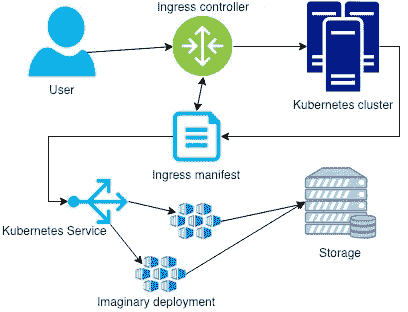
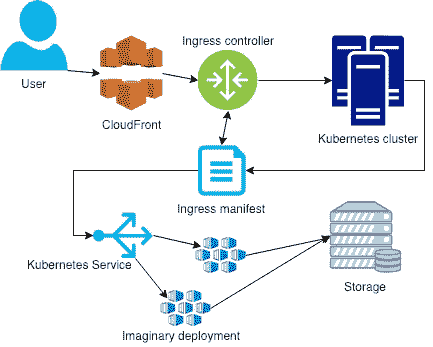

# 如何使用 Imaginary 和 Kubernetes 构建自己的安全图像处理服务

> 原文：<https://itnext.io/how-to-build-your-own-secure-image-processing-service-with-imaginary-and-kubernetes-cf124649047c?source=collection_archive---------2----------------------->

前一段时间，有人让我看一下关于用亚马逊 CloudFront & Lambda@Edge 调整图片大小的文章，看看是否有用。

我对它有一些想法，因为它涉及 lambda 函数，该函数将在每个图像请求上执行&向 s3 存储桶读写文件

Lambda 在每次开始执行请求以响应事件通知或 invoke 调用(包括来自控制台的测试调用)时都对请求进行计数。您需要为所有职能部门的请求总数付费

持续时间是从您的代码开始执行的时间开始计算，直到它返回或终止，四舍五入到最接近的 100 毫秒。
价格取决于你分配给函数的内存量

λ@ Edge 函数以 50 毫秒的粒度进行计量

我们还将在 S3 驱动器中填充越来越多的图像，以满足每个分辨率的要求，因为它们将在图像处理后由 Lambda 函数写回存储器，并为其提供服务

> 有了一些闲置的 CPU 站着烧钱，用它来处理我们自己的图像岂不是很酷？

我发现[是虚构的](https://github.com/h2non/imaginary)，它已经有了所有 docker 的东西，所以把它放在 Kubernetes 是一件轻而易举的事情，所以这个 PoC 诞生了

# 虚构的

[Fast](https://github.com/h2non/imaginary#benchmarks) HTTP [微服务](http://microservices.io/patterns/microservices.html)用 Go 编写，用于高层图像处理，由 [bimg](https://github.com/h2non/bimg) 和 [libvips](https://github.com/jcupitt/libvips) 支持。`imaginary`可作为私有或公共的 HTTP 服务用于海量图像处理，对[Docker](https://github.com/h2non/imaginary#docker)&[Heroku](https://github.com/h2non/imaginary#heroku)提供一流支持。它几乎是无依赖性的，并且只使用`[net/http](http://golang.org/pkg/net/http/)`本地包，没有额外的抽象，以获得更好的[性能](https://github.com/h2non/imaginary#performance)

支持作为简单的 [HTTP API](https://github.com/h2non/imaginary#http-api) 公开的多个[图像操作](https://github.com/h2non/imaginary#supported-image-operations)，具有额外的可选特性，如 API 令牌授权、URL 签名保护、HTTP 流量节流策略和对 web 客户端的 CORS 支持

`imaginary`可以从 HTTP POST 有效负载、服务器本地路径或远程 HTTP 服务器读取图像，支持 JPEG、PNG、WEBP，如果`libvips@8.3+`使用正确的库绑定进行编译，还可以选择 TIFF、PDF、GIF 和 SVG 格式

`imaginary`能够输出 JPEG、PNG 和 WEBP 格式的图像，包括它们之间的透明转换

`imaginary`还可选地支持图像占位符回退机制，以防图像处理错误或任何性质的服务器错误，因此即使在错误的情况下，图像也将始终由服务器根据 HTTP 响应正文和内容 MIME 类型返回，透明地匹配预期的图像大小和格式

它在内部使用了`libvips`，这是一个用 C 编写的强大而高效的图像处理库，需要[低内存占用](http://www.vips.ecs.soton.ac.uk/index.php?title=Speed_and_Memory_Use)，通常比使用最快的 ImageMagick 和 GraphicsMagick 设置或 Go native `image`包快 4 倍，在某些情况下，它甚至比处理 JPEG 图像快 8 倍

首先，看一下[安装](https://github.com/h2non/imaginary#installation)步骤、[使用](https://github.com/h2non/imaginary#command-line-usage)案例和 [API](https://github.com/h2non/imaginary#http-api) 文档

# 将它部署到 Kubernetes

我的假想部署看起来像这样

如果你咨询想象中的医生，会有更多的选择

我们需要一个服务来连接入口

最后是一个入口(不要忘记更新域)

# 签名图像 url

Imaginary 的文档中有一个很好的例子，在 Go how to sign your URL 中(不要忘记请求字段的顺序)

这是我的版本，做了一点改动，给了我一个更好的复制/粘贴网址

应用到集群后，您应该能够通过加载来测试影像服务

[http:// <你的服务 url > /resize？no crop = true&type = JPEG&URL = https % 3A % 2F % 2f www . Google . com % 2f GOOS % 2f oodles % 2f 2015% 2f Googles-new-logo-5078286822539264.3-hp2x . gif&width = 200&sign = 9 rawdy 5 gemqgtrgxuo 7 ffmyegivisvsd 1 jnsujjljy2pm](http://localhost:9000/resize?nocrop=true&type=jpeg&url=https%3A%2F%2Fwww.google.com%2Flogos%2Fdoodles%2F2015%2Fgoogles-new-logo-5078286822539264.3-hp2x.gif&width=200&sign=9Rawdy5gEmqGTRgxUOO7fFMYegivSQd1jNSuJljY2PM)

请注意，上面的示例 URL 假设您在我的示例中使用 signKey。如果您使用了不同的密钥，则需要生成新的 URL 签名

# 全部缓存！

如果你使用的是 AWS，你可以在整个设置的前面放一个 CloudFront 发行版，并在边缘利用图像缓存来减轻后端的负载。只有当图像由于 LRU 而从缓存中掉出时，才会发生图像操作，因此图像越受欢迎，从后端请求的图像就越少

我想象谷歌有一些类似于 [CloudFront](https://aws.amazon.com/cloudfront/) 和 [CloudFlare](https://www.cloudflare.com) 的服务，可能也能提供这项服务

# 结束语

我在这篇文章中随意引用了入口清单。实际上，根据您的环境，让 Kubernetes 中的 ingress 工作起来可能是一个非常复杂的设置，我建议您花时间适当地研究一下哪种解决方案最适合您的使用情况

我个人推荐扎兰多的 [Skipper。在我们工作的生产环境中，这对我很有帮助。顺便说一句，你可以在这里读到关于](https://github.com/zalando/skipper)[的文章](https://medium.com/@roffe/kubernetes-in-production-shopgun-2c280f0c0923)