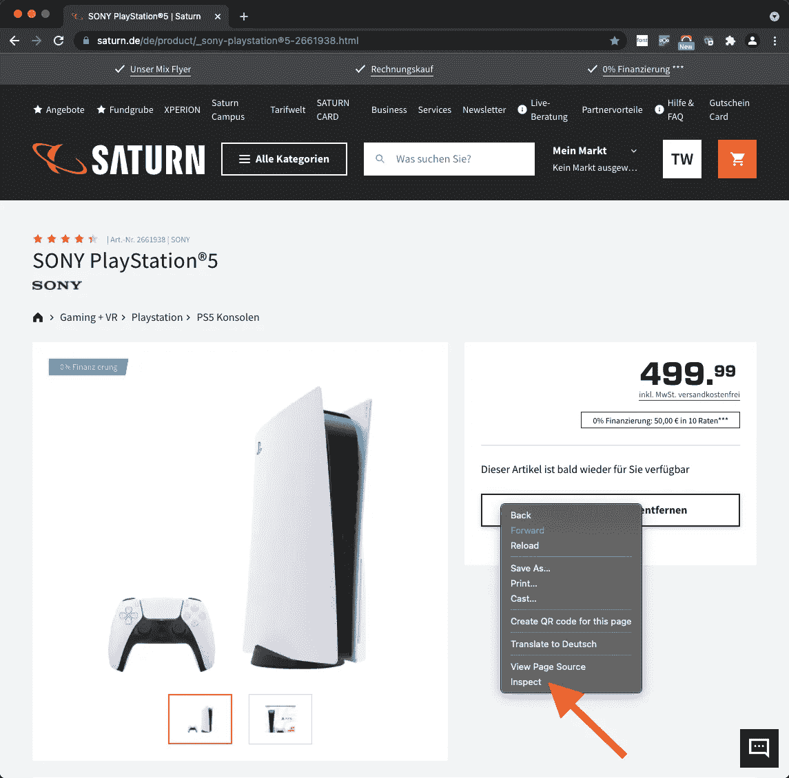
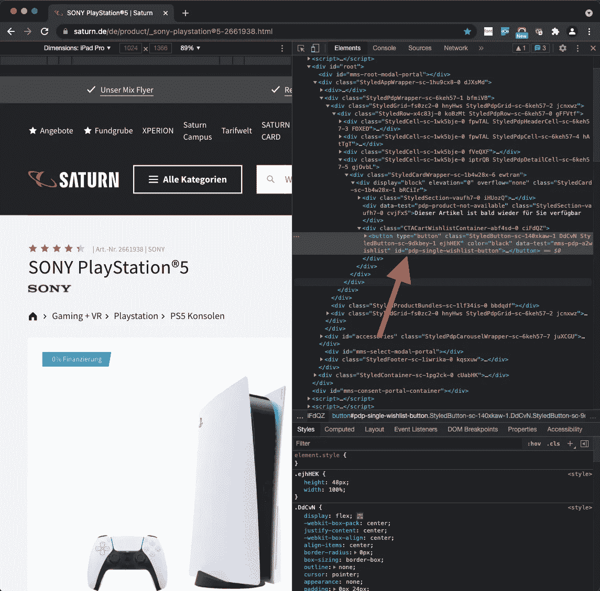
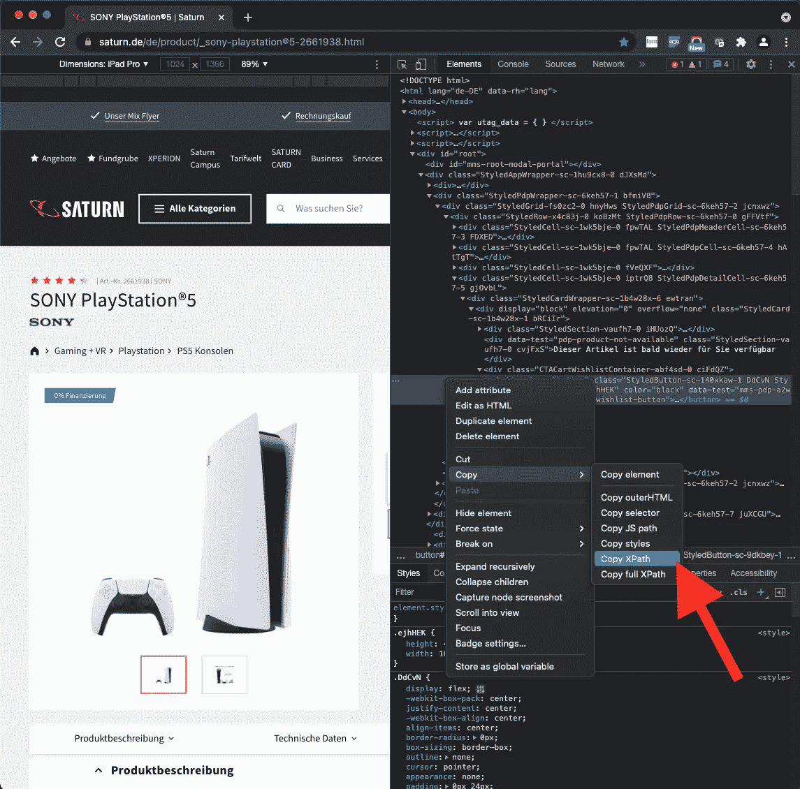

# 如何在睡梦中买到 Playstation 5

> 原文：<https://itnext.io/how-to-buy-a-playstation-5-in-your-sleep-83a25bad22c7?source=collection_archive---------1----------------------->

## 在 Python 中用 Selenium 创建 Web 机器人的初级教程


由 [Unsplash](https://unsplash.com?utm_source=medium&utm_medium=referral) 上 [Kerde Severin](https://unsplash.com/@kseverin?utm_source=medium&utm_medium=referral) 拍摄的照片

你想要一个 Playstation 5 但是

*   你厌倦了不断点击网络浏览器的“刷新”按钮来查看商店是否有货，
*   它总是在一些网上商店提供后一分钟就销售一空，
*   你完全被那些创造了那些能立刻买下所有 Playstations 的机器人的软件开发者惹恼了？

好吧，为什么不以牙还牙，写你自己的机器人呢？

这篇文章是关于如何用 Python 创建 Selenium 网络机器人的教程。这个机器人将不断地检查德国一家受欢迎的网店的 Playstation 5 的产品页面。

我制作了一个视频，展示了两个场景。首先，浏览器定期刷新并检查 Playstation 5 的产品页面，如果它可用的话。当然，此时它是不可用的。因此，为了演示购买过程的其余部分，我选择了一个可用的产品。

【https://youtu.be/VdGhRhCtzbA 

不要担心，如果你需要一个机器人为另一个商店。代码非常简单，很容易修改。在文档末尾的“参考资料”部分有一些链接，可能会帮助您更深入地了解这个问题。

代码可以从这里下载:[https://github.com/twissmueller/playstation-bot](https://github.com/twissmueller/playstation-bot)

*免责声明*:请检查代码库中的许可证。简而言之:代码按原样提供。你可以用代码做任何你想做的事，但如果你不小心清空了你的银行账户，可别怪我。

你需要的是一台带有

*   Python 3 和 PIP
*   Chrome 和 ChromeDriver

请确保你的 Chrome 版本符合 ChromeDriver 的版本。

```
$ chromedriver --version
ChromeDriver 94.0.4606.41 (333e85df3c9b656b518b5f1add5ff246365b6c24-refs/branch-heads/4606@{#845})
```

当一切就绪后，进入目录并激活 Python 环境。

```
cd playstation-bot
source bin/activate
```

然后，可以安装以下要求:

```
python3 -m pip install -r requirements.txt
```

现在，编辑脚本并提供商店的用户名和密码以及您想要购买的正确产品。请参见第 6 行到第 9 行。

最后，脚本可以运行:

```
python3 app.py
```

现在，根据要处理的产品，脚本要么定期刷新页面，要么将产品放入购物篮并继续结帐过程。

不过有一点需要注意的是，该脚本不会在整个支付过程中运行，因为这取决于首选的支付选项。此外，一些支付提供商，如 Paypal，可能会使用双因素认证，这使流程变得复杂。

因此，要实现其余的，还需要做更多的工作，但至少产品已经在篮子里了。随意叉回购，做该做的事。

## 它是如何工作的？

让我们稍微深入一下技术细节。

什么是 Selenium，如何用它来购买 Playstation？

从 Selenium 网站:

```
Selenium is a suite of tools for automating web browsers.
```

就是这么简单。

它模仿用户，所以我们可以自动完成某些任务，例如测试完整的网站。

分解一下，在本教程中，我们模拟用户在访问网站时通常会做的三个简单任务:

*   打开浏览器并导航至产品页面
*   点击几个按钮
*   填写表格

简单，后面没多少了。真的。

打开产品页面的代码片段是

```
PRODUCT = "<product_link>"
driver = webdriver.Chrome()
driver.get(PRODUCT)
```

为了使脚本适应另一个产品，只需要修改`PRODUCT`-变量。Xbox 有人吗？

现在，带有产品页面的浏览器已经打开，接下来的步骤，例如检查“添加到购物车”按钮是否可以按下，就可以执行了。

页面上的元素可以很容易地通过其 ID 来寻址，例如

```
element = driver.find_element_by_id("mms-login-form__email")
```

如果一个元素没有 ID 怎么办？然后我们可以通过 XPATH 选择元素。在代码中，这是在单击按钮的函数中完成的:

```
element = driver.find_element(By.XPATH, f'//button[text()="{button_text}"]')
```

通过代码`element.click()`，按钮被“点击”，但有时这在页面上不起作用，这与开发人员如何为他们的按钮使用 JavaScript 有关。

因此，我必须添加不同的代码来点击按钮:

```
driver.execute_script("arguments[0].click();", element)
```

最后，我想说明的最后一个动作是如何填写表单元素，例如电子邮件地址的表单元素。

```
driver.find_element_by_id("mms-login-form__email").send_keys(username)
```

不过，可能还有最后一个问题。我们如何知道这些元素的 id？

打开 Chrome 页面上你尝试识别的元素，右键点击，点击“选择”。然后检查这个元素的“id”字段。



然后，会打开一个侧栏，显示包含所选元素的源代码。



如果没有`id`标签呢？再次右键单击并选择“Copy - > XPath”。



## 结论

首先，抱歉，用一个“clickbaity”标题引诱你进入 web 前端测试领域。

我希望这篇教程能让你对如何自动完成各种用途的浏览器任务有所了解。代码真的不多，很容易理解，对吧？

我真正希望的是，如果你从未接触过编码，这可能是你的一个开始。编程和测试软件可能看起来很乏味，但它是一项了不起的技能，可以帮助你和其他人完成如此多的日常任务。

无论如何，希望你喜欢这个教程！

如果你喜欢这篇文章，请给我买杯咖啡。

今天到此为止。

## 资源

*   [硒](https://www.selenium.dev)
*   [初学 Python](https://www.python.org/about/gettingstarted/)
*   [安装包](https://packaging.python.org/tutorials/installing-packages/)
*   [虚拟环境和包](https://docs.python.org/3/tutorial/venv.html)
*   [ChromeDriver](https://chromedriver.chromium.org)
*   [Selenium WebDriver](https://www.selenium.dev/documentation/webdriver/)
*   [Selenium Python 教程](https://www.geeksforgeeks.org/selenium-python-tutorial/)
*   [硒元素不可见异常](https://stackoverflow.com/a/27931726/1065468)