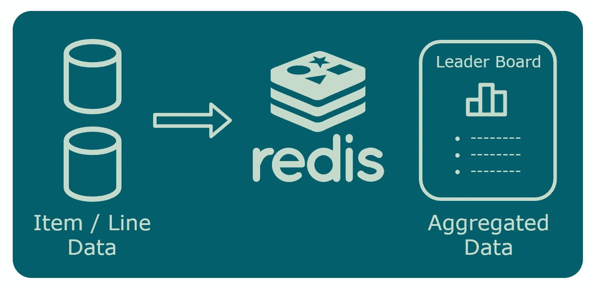

# 如何使用 Redis 和 Lua 脚本为扩展的微服务架构缓存聚合数据

> 原文：<https://itnext.io/how-to-cache-aggregated-data-with-redis-and-lua-scripts-for-a-scaled-microservice-architecture-2b791289e911?source=collection_archive---------1----------------------->



一个基于微服务的扩展应用程序拥有**大量不断增长的数据**，它面临着**挑战，要有效地交付像 top lists 这样的聚合数据**。

在本文中，**我将向您展示如何使用 Redis 来缓存聚合数据**。而数据库将项目/行数据存储为“真实的来源”,并使用分片进行缩放。

> 一个 Redis 实例每秒可以处理大约 100，000 次操作

我的带有用户、帖子和类别的示例数据模型可以作为您自己的用例的基础。

## 内容

1.  示例用例及数据模型
2.  设置 Redis 并实现顶级类别
3.  顶级用户、最新用户帖子和收件箱模式
4.  原子性的 Lua 脚本
5.  最后的想法和展望

# 1.示例用例及数据模型

在示例中，微服务应用程序用户可以按类别写帖子。他们也可以按类别阅读文章，包括作者姓名。最新的帖子在最上面。类别是固定的，很少改变。

> 如果您对示例应用程序的源代码和更多细节感兴趣，请参见我之前的帖子“如何使用数据库分片和扩展 ASP.NET 核心微服务架构”。

**逻辑数据模型:**


目前，有 100 万用户。每个用户每天大约写十篇文章。

## 十大类别

前 10 个类别将显示在主页上。对于 MySql 来说，这需要一个这样的语句:

```
SELECT CategoryId, COUNT(PostId) FROM Post GROUP BY CategoryId ORDER BY COUNT(PostId) LIMIT 10;
```

对数百万行执行这条语句会非常慢。而且每一次页面访问，都是**不可能**的。

因为数据量大，我也决定按类别分片。因此，这将需要**合并来自多个数据库的顶部列表**:


# 2.设置 Redis 并实现顶级类别

**安装** [**Docker 桌面**](https://hub.docker.com/editions/community/docker-ce-desktop-windows)

创建 Redis 容器:

```
C:\dev>docker run --name redis -d redis
```

连接到容器并启动 redis-cli:

```
C:\dev>docker exec -it redis redis-cli
```

## 添加热门类别

顶层类别(" *CategoriesByPostCount* ")使用一个 [Redis 排序集](https://redislabs.com/ebook/part-2-core-concepts/chapter-3-commands-in-redis/3-5-sorted-sets/) (ZSET)。

**增加第一个条目**，为类别“*类别 5* ”增加[和](https://redis.io/commands/ZADD)以及 99 个员额:

```
127.0.0.1:6379> ZADD CategoriesByPostCount GT 99 "Category5"
```

它添加了一个条目:

```
(integer) 1
```

**再添加一些条目:**

```
> ZADD CategoriesByPostCount GT 1 "Category1"(integer) 1> ZADD CategoriesByPostCount GT 10 "Category2"(integer) 1
```

更新*类别 5:*

```
> ZADD CategoriesByPostCount GT 100 "Category5"(integer) 1> ZADD CategoriesByPostCount GT 98 "Category5"(integer) 0
```

最后一个命令给出的结果为零。这是由于 *GT* 参数造成的。该参数有助于处理更新无序到达的情况(post 计数不会减少)。

## **阅读热门类别**

使用 [ZRANGE](https://redis.io/commands/zrange) 并读取帖子数量最多的 10 个类别:

```
> ZRANGE CategoriesByPostCount 0 9 WITHSCORES REV1) "Category5"
2) "100"
3) "Category2"
4) "10"
5) "Category1"
6) "1"
```

轻松检索第二页(第 11-20 项)等:

```
ZRANGE CategoriesByPostCount 10 19 WITHSCORES REV
```

## 先决条件

创建新帖子时，可以在 SQL 中计算每个类别的帖子:

```
BEGIN TRANSACTION
INSERT INTO Post (...)
UPDATE Categories SET PostCount = PostCount + 1
COMMIT TRANSACTION
```

这是可能的，因为数据库是按类别划分的。一个类别的所有文章都在同一个数据库中。

# 3.顶级用户、最新用户帖子和收件箱模式

**用户的帖子分散在所有碎片上**。不能使用`UPDATE User SET PostCount = PostCount + 1`然后更新 Redis。

**Redis 中的运算必须是“幂等的”。收件箱模式使这成为可能。**

*延伸阅读:* [*发件箱、收件箱模式和交付保证解释*](https://event-driven.io/en/outbox_inbox_patterns_and_delivery_guarantees_explained/)

## 添加帖子(带有竞争条件)

在每个新的帖子上添加一个条目到用户的 *PostsByTimestamp* 排序集合中:

```
> ZADD {User:5}:PostsByTimestamp 3455667878 '{Title: "MyPostTitle", Category: "Category5", PostId: 13}'(integer) 1
```

然后增加 *UsersByPostCount* 中的帖子计数:

```
> ZINCRBY UsersByPostCount 1 "5"
```

为了使它幂等，检查将文章添加到收件箱的结果。再次发出该命令得到的结果为零(条目已经存在):

```
> ZADD {User:5}:PostsByTimestamp 3455667878 '{Title: "MyPostTitle", Category: "Category5", PostId: 13}'(integer) 0
```

然后不要递增 *UsersByPostCount。*

**命令 ZADD 到 PostsByTimestamp 和命令 ZINCRBY 到 UsersByPostCount 必须是原子的**。我将向您展示如何使用 Redis Lua 脚本使其原子化。但首先，让我们来看看排名靠前的用户和最新的用户帖子。

## 阅读热门用户和最新用户帖子

**前 10 名用户:**

```
> ZRANGE UsersByPostCount 0 9 WITHSCORES REV1) "6"
2) "10"
3) "5"
4) "8"
5) "3"
6) "4"
7) "1"
8) "3"
```

ID 为 6 的用户有 10 篇帖子，ID 为 5 的用户有 8 篇帖子，依此类推。

**ID 为 5 的用户的热门帖子:**

```
> ZRANGE {User:5}:PostsByTimestamp 0 9 WITHSCORES REV1) "{Title: \"MyPostTitle2\", Category: \"Category1\", PostId: 14}"
2) "3455667999"
3) "{Title: \"MyPostTitle\", Category: \"Category5\", PostId: 13}"
4) "3455667878"
```

# 4.原子性的 Lua 脚本

## 使用 Lua 脚本自动添加帖子

一个 [Redis Lua 脚本](https://redislabs.com/ebook/part-3-next-steps/chapter-11-scripting-redis-with-lua/)可以使命令 ZADD 到 PostsByTimestamp 和命令 ZINCRBY 到 UsersByPostCount 原子化。但是每个用户需要一个额外的计数器，以便所有的关键参数映射到同一个 [Redis 散列标签](https://redislabs.com/blog/redis-clustering-best-practices-with-keys/)。

> 键“{User:5}:PostsByTimestamp”中的花括号是 Redis 散列标签的符号。

这个 Lua 脚本试图向一个有序集合添加一个键。如果它可以添加密钥，它还会增加一个计数器。如果该键已经存在，它将返回该键的值:

使用 [EVAL](https://redis.io/commands/eval) 调用 Lua 脚本并传递“*{ User:8 }:PostsByTimestamp*”和“ *{User:8}:PostCount* ”作为键(命令行一行)；

```
> EVAL "if tonumber(redis.call('ZADD', KEYS[1], ARGV[1], ARGV[2])) == 1 then return redis.call('INCR', KEYS[2]) else return redis.call('GET', KEYS[2]) end" 2 {User:8}:PostsByTimestamp {User:8}:PostCount 3455667999 "{Title: \"MyPostTitle2\", Category: \"Category1\", PostId: 14}"(integer) 1
```

然后在 *UsersByPostCount* 中设置用户 8 的计数:

```
ZADD UsersByPostCount GT 1 "8"
```

## 将脚本存储在 Redis 中

出于性能原因，您可以将 sript 存储在 Redis 中:

```
> SCRIPT LOAD "if tonumber(redis.call('ZADD', KEYS[1], ARGV[1], ARGV[2])) == 1 then return redis.call('INCR', KEYS[2]) else return redis.call('GET', KEYS[2]) end""cd9222afab5eb8d579942016a8c22427eff99429"
```

使用散列来调用脚本:

```
> EVALSHA "cd9222afab5eb8d579942016a8c22427eff99429" 2 {User:8}:PostsByTimestamp {User:8}:PostCount 4455667999 "{Title: \"MyPostTitle3\", Category: \"Category1\", PostId: 20}"(integer) 2
```

# 5.最后的想法和展望

在本文中，您**设置了 Redis** ，并从一个简单的用例开始**缓存聚合数据**。然后使用**收件箱模式**和 **Lua 脚本**来实现原子性。

在我的下一篇文章中，我将向你展示如何在一个 C # ASP.NET 核心微服务应用中实现它。

Redis 提供了比我在这篇文章中展示的更多的 T21。您可以**探索其他命令和** [**用例**](https://redislabs.com/blog/5-industry-use-cases-for-redis-developers/) 它们如何解决您应用中的问题。在实际应用中，您可能不得不使用 TTL 来自动终止条目,这样缓存就不会无限制地增长。也许你还需要**缩放 Redis** 。

如果您有任何问题、想法或建议，请联系我。