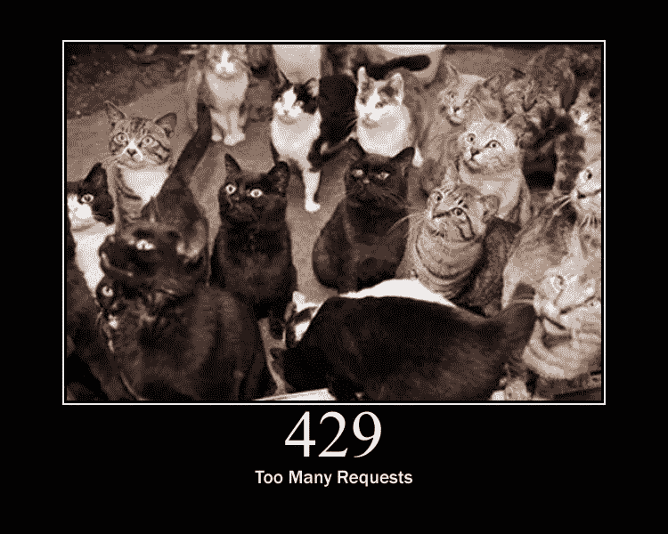
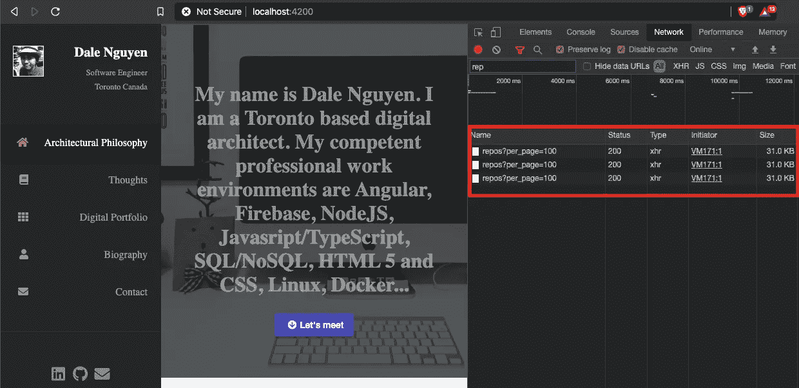
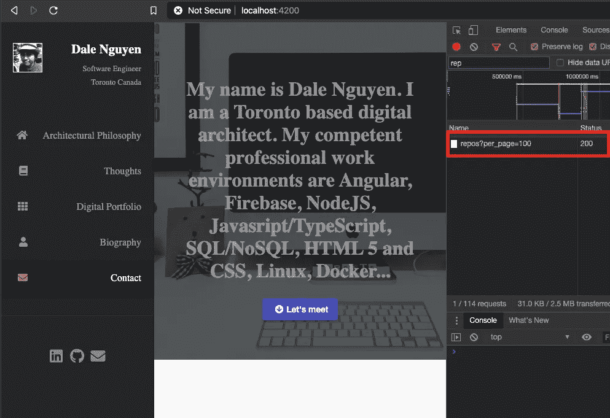

# 如何用 Rxjs 缓存 Angular 中的 Http 请求

> 原文：<https://itnext.io/how-to-cache-http-requests-in-angular-with-rxjs-9aa9d59ed044?source=collection_archive---------1----------------------->



当我在个人网站上建立 portfolio 部分时，我想这是一件好事，我应该从 Github 获得数据，以显示我“自豪”的存储库，我不必担心在前端更新任何信息，因为 Github 会自动为我做这件事。

一切都进行得非常顺利，直到有一天，我发现了一些有趣的事情，这导致了这篇关于如何用 Rxjs 缓存 HTTP 请求的文章。

**问题**

每次我浏览页面，它都会发送另一个请求。有时，会出现错误，因为它触及了 GitHub API 的极限。



最初的方法是使用 HttpClient 服务来发送请求并从 Github 获取项目。是因为我每次回到主页，Http 请求都会重新触发一次。

```
// BeforegetGitProjects() {
    const filteredProjects = [];    
    try {    
      const projects = await this.http.get(this.gitBaseUrl).toPromise() as GitProject[];    
      for (const project of projects) {    
        if (this.gitProjects.includes(project.name)) {    
          const mappedProject: GitProject = {    
            name: project.name,    
            description: project.description,    
            html_url: project.html_url,    
            language: project.language,    
            stargazers_count: project.stargazers_count,    
            forks: project.forks    
          };    
          filteredProjects.push(mappedProject)    
        }    
      }    
    } catch (error) {    
      captureException(error)    
      console.error(error)    
    }return filteredProjects
}
```

对于我的读者来说，这是不可接受的，他们会从一个 API 中多次获取数据。应该有一种方法来缓存结果并使用它。而 RXJS 恰恰具备了这一点——**分享回放**。

```
// AftergetGitProjects(): void {
    this.projects$ = this.http.get<GitProject[]>(this.gitBaseUrl).pipe(
      map(projects =>
        projects.filter(project => this.gitProjects.includes(project.name))
      ),
      // publishReplay(1),
      // refCount(),
      **shareReplay({ bufferSize: 1, refCount: true }),**
      catchError(error => captureException(error))
    ) as Observable<GitProject[]>
}
```

**说明**:配合[分享回放](https://www.learnrxjs.io/learn-rxjs/operators/multicasting/sharereplay)使用。当我来回导航到主页时，它总是返回数据流中最后发出的值。关于 Rxjs 的魔力，还有另外一个有趣的读物，你应该读一读。

优化后，每当我导航到其他页面。它不会发送任何其他请求。

结果令人满意。



链接到 [portfolio.service.ts](https://github.com/dalenguyen/dalenguyen.github.io/blob/dev/apps/portfolio/src/app/shared/services/portfolio.service.ts)

希望这有所帮助；)

[**在 Twitter 上关注我**](https://twitter.com/dale_nguyen) 了解 Angular、JavaScript & WebDevelopment 的最新内容👐