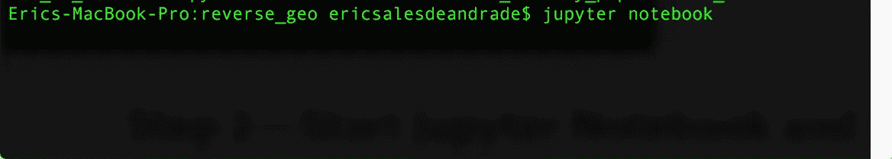
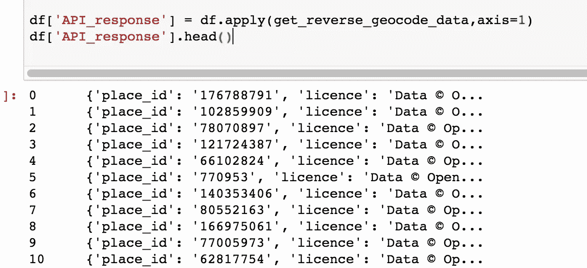
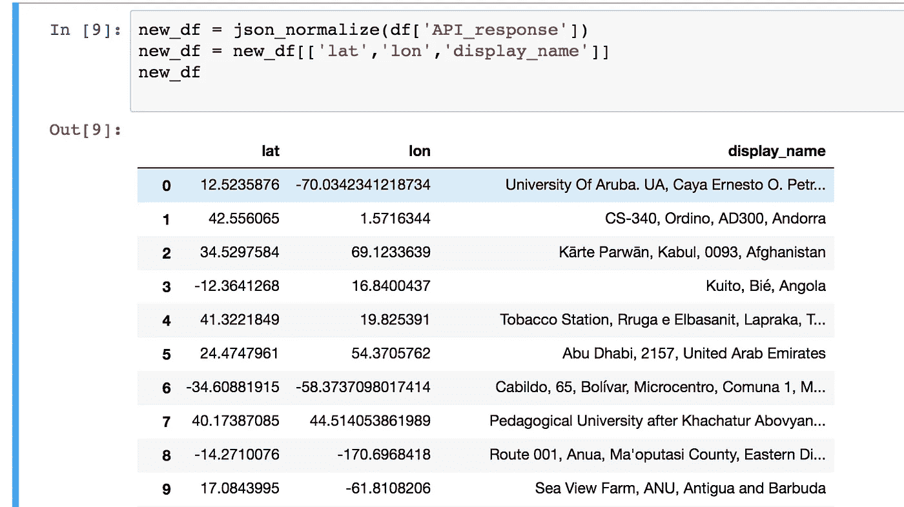
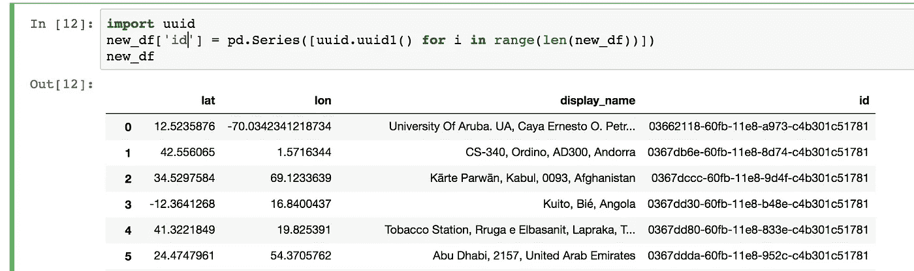
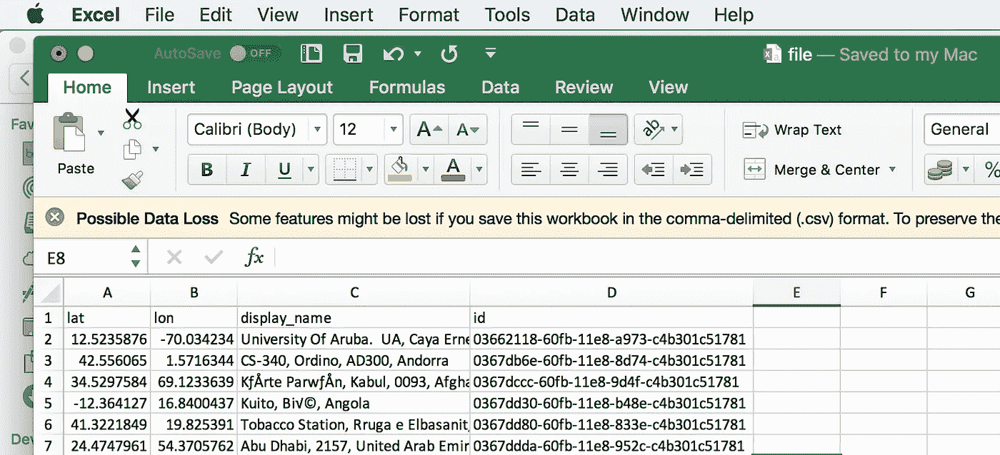

# 如何对 Pandas 使用 API 并将结果存储在 Redshift 中

> 原文：<https://itnext.io/how-to-call-rest-apis-with-pandas-and-store-the-results-in-redshift-2b35f40aa98f?source=collection_archive---------0----------------------->

这里有一个简单的教程来帮助理解如何使用 Pandas 从 RESTFUL API 获取数据，并存储到 AWS Redshift 的数据库中。

对 Python(包括 Requests、Pandas 和 JSON 库)、REST APIs、Jupyter Notebook、AWS S3 和 Redshift 有一些基本的了解会很有用。

本教程的目标是使用 CSV 文件中提供的地理坐标(经度和纬度)来调用外部 API，并对坐标进行反向地理编码(即获取位置详细信息)，最后将响应数据存储在红移表中。**请注意，您可能需要 API 数据供应商的缓存批准。**

我们将使用 Pandas 加载 CSV，使用请求库调用 API，将响应存储到 Pandas 系列，然后存储到 CSV，上传到 S3 存储桶，并将最终数据复制到红移表中。上面提到的步骤绝不是实现这一点的唯一方法，可以通过许多不同的方式来执行该任务。

我们将使用的数据集包含世界银行 2013 年测量的国家人口，可在以下网站上找到。

我们开始吧。

# 步骤 1-下载数据集

## 指向列说明和数据集的链接

[https://developer . here . com/documentation/geo visualization/topics/sample-datasets . html](https://developer.here.com/documentation/geovisualization/topics/sample-datasets.html)

[http://js . cit . data lens . API . here . com/datasets/starter _ pack/Global _ country _ populations _ 2013 . CSV](http://js.cit.datalens.api.here.com/datasets/starter_pack/Global_country_populations_2013.csv)

第一件事就是从上面的网站下载 CSV 文件。

# 步骤 2 —启动 Jupyter Notebook，并使用 Python 将数据集加载到内存中

安装 Jupyter Notebook(带有 Anaconda 或其他版本),并在您希望保存笔记本的目录中，通过在终端中键入以下命令来启动它。



推出 Jupyter 笔记本

假设您已经安装了所需的库，让我们将 CSV 文件加载到内存中。

```
import pandas as pd
import requests
import json
import time
from pandas.io.json import json_normalize

df = pd.read_csv('Global_country_populations_2013.csv') 
df = df[['CountryName','lat','lon']]
df.head()
```


将数据加载到 Pandas 数据框架中

我们还导入了其他库，因为我们以后会需要它们。“read_csv()”方法会将您的 csv 文件读入 Pandas 数据帧。请注意，如果文件不在同一个目录中，您需要在这里指定文件的路径。然后我们截断数据帧，只保留我们主要需要的列["CountryName "，" lat "，" lon"]。

# 步骤 3 —定义调用 API 的函数

我们将用于反向地理编码的 API 是 LocationIQ(来自 Unwired Labs ),它提供免费的非商业使用，速率为每分钟 60 次调用和每天 10，000 次调用。

 [## 来自无线实验室的 LocationIQ 免费快速地理编码和反向地理编码服务

### 从纽约到东京，通过 OpenStreetMap、Open Addresses 和其他来源的数据获得全球覆盖。

locationiq.org](https://locationiq.org/) 

```
def get_reverse_geocode_data(row):
    try:
        YOUR_API_KEY = 'xxxxxxxxxxx'
        url = '[https://eu1.locationiq.org/v1/reverse.php?key='](https://eu1.locationiq.org/v1/reverse.php?key=') + YOUR_API_KEY + '&lat=' + str(row['lat']) + '&lon=' + str(row['lon']) + '&format=json'

        response = (requests.get(url).text)
        response_json = json.loads(response)
        time.sleep(0.5)
        return response_json

    except Exception as e:
        raise e
```

在上面的代码中，我们定义了一个函数— get_reverse_geocode_data(row)。注册后，您将获得一个 API 密钥，您需要将它与端点或 URL 以及可以从文档中获得的必需参数一起包含在这里。参数“row”指的是 Pandas 数据帧的列“lat”和“lon”的每一行，它们将作为输入传递给 API。请求库用于向 url 发出 HTTPS GET 请求，并使用。“文本”方法。

您可以使用' json.loads()'将响应从 json 字符串转换为易于使用的 JSON 对象。由于自由层计划设置的限制(每分钟 60 次调用)，使用“time.sleep(0.5)”参数来控制对 API 的调用。对于商业大批量计划，这是没有必要的。

# 步骤 4 —使用数据帧列作为参数调用函数

```
df['API_response'] = df.apply(get_reverse_geocode_data,axis=1)
df['API_response'].head()
```



以 DataFrame 列作为输入调用函数

您可以使用“df.apply()”方法将函数应用于整个数据帧。“轴=1”参数用于跨列应用函数。我们之前使用的“row”参数使我们能够引用我们希望用作输入的数据帧的任何列，并将该行的列值作为该特定执行的输入。

# 步骤 5——规格化或扁平化 JSON 响应

现在，您已经成功地从 API 接收到 JSON 响应，是时候将它展平成列并挑选出您希望保留的字段了。

```
new_df = json_normalize(df['API_response'])
new_df = new_df[['lat','lon','display_name']]
new_df
```

“json_normalize()”函数非常适合这种情况。您可以将希望规范化的 Pandas 系列作为参数传入，它将返回一个新的 Pandas DataFrame，其中的列是扁平的。然后，您可以使用外键将这个新的数据帧连接到旧的数据帧，或者在这种情况下，我们将只使用新的数据帧。让我们只保留“显示名称”字段(来自 API_response)以及“纬度”和“经度”。下面是新的数据框架



规范化 JSON 以获得新的数据帧

让我们也为每一行添加一个唯一的标识符

```
import uuid
new_df['id'] = pd.Series([uuid.uuid1() for i in range(len(new_df))])
new_df
```



添加唯一标识符

# 第 6 步—生成 CSV 文件并上传至 S3 存储桶

下面的代码从 Pandas DataFrame 到指定的目录中创建一个 CSV 文件。

```
new_df.to_csv(path_or_buf=file_name,index=False)
```



Pandas 的“to_csv”方法会自动创建一个索引列，因此我们可以通过设置“index=False”来避免这种情况。CSV 现在已创建，我们可以将其上传到 S3。

在本教程中，我们将使用 tinys 3<[https://github.com/smore-inc/tinys3](https://github.com/smore-inc/tinys3)>这是一个非常容易使用的库与 S3。如果您愿意，也可以使用 Boto3。

```
import tinys3
import os
access_key = 'xxxxxxxxx'
secret_key = 'xxxxxxxxx'
endpoint = 'xxxxxxxx'
Bucket_name = 'xxxxxxxx'conn = tinys3.Connection(access_key, secret_key, tls=False, endpoint)f = open(file_name,'rb')conn.upload(file_name, f, Bucket_name)f.close()
os.remove(file_name)
```

文档非常简单明了，基本上是说添加您的 AWS 访问密钥、秘密访问密钥和存储桶名称。然后，您可以创建一个到 S3 的连接，并上传相关文件。然后，我们使用“os.remove(file_name)”从驱动器中删除该文件。

# 步骤 7-创建红移表并将数据复制到其中

在将数据复制到红移表之前，您需要创建一个红移表。这可以通过使用 Psycopg2 执行 PostgreSQL 数据库的标准 SQL 命令来完成，psycopg 2 是 Python 的 PostgreSQL 库。

## 创建表格

```
import psycopg2 my_db = 'xxxxxxx'
my_host = 'xxxxxxx'
my_port = 'xxxx'
my_user = 'xxxxxxxx'
my_password = 'xxxxxxx'con = psycopg2.connect(dbname=my_db,host=my_host,port=my_port,user=my_user,password=my_password) cur = con.cursor() sql_query = "CREATE TABLE reverse_geocode_location (lat varchar(255),lon varchar(255),display_name varchar(255),id varchar(255),PRIMARY KEY (id));"cur.execute(sql_query)
con.commit()cur.close()
con.close()
```

使用 Psycopg2，可以很容易地通过 Python 在 Redshift 或任何其他 PostgreSQL 引擎数据库中执行 SQL 命令。我们首先需要创建一个连接，然后创建一个游标，最后执行我们的 SQL 查询。不要忘记在 SQL 查询成功执行后关闭到数据库的连接。

## 将数据从 S3 复制到红移

我们现在准备好了教程的最后一步——将 CSV 文件从 S3 复制到红移。我们之所以使用 COPY 而不是 SQL Alchemy 或其他 SQL 客户端，是因为 Redshift 针对列存储进行了优化，并且这种方法可以非常快速地将数据加载到其中，而不是逐行加载数据。为此，我们可以再次使用 Psycopg2。

**请注意，CSV 文件和红移表之间的列数据类型必须相同，并且顺序相同，否则复制命令将会失败。您可以通过读取 STL_LOAD_ERRORS 表来检查任何加载错误。**

```
import psycopg2my_db = 'xxxxxxx'
my_host = 'xxxxxxx'
my_port = 'xxxx'
my_user = 'xxxxxxxx'
my_password = 'xxxxxxx'con = psycopg2.connect(dbname=my_db,host=my_host,port=my_port,user=my_user,password=my_password)cur = con.cursor()sql_query = ""copy reverse_geocode_location from 's3://YOUR_BUCKET_NAME/YOUR_FILE_NAME' credentials 'aws_access_key_id=YOUR_ACCESS_KEY;aws_secret_access_key=YOUR_SECRET_ACCESS_KEY' csv IGNOREHEADER 1 NULL 'NaN' ACCEPTINVCHARS;""cur.execute(sql_query)
con.commit()cur.close()
con.close()
```

在上面的 COPY 命令中，我们需要指定 bucket 名称、文件名、安全密钥和一些标志。可以在此处找到对所用标志的解释:

[](https://docs.aws.amazon.com/redshift/latest/dg/r_COPY.html) [## 复制-亚马逊红移

### 将数据从数据文件或 Amazon DynamoDB 表加载到表中。这些文件可以在亚马逊简单的…

docs.aws.amazon.com](https://docs.aws.amazon.com/redshift/latest/dg/r_COPY.html) 

**请注意:您需要授予正确的 IAM 角色权限，以便将数据从 S3 复制到 Redshift。**

# 步骤 8-从表中读取数据进行验证

一旦你成功地完成了上述步骤，你现在应该已经把数据复制到你的红移表中了。您可以通过在 Python 或任何其他 SQL 客户机中使用 Psycopg2 读取数据来验证它。

```
select * from reverse_geocode_location
```

# 结论和下一步措施

本教程涵盖了关于使用 Pandas 系列作为输入来调用 REST API 并将结果存储在 AWS 红移中的一些基础知识。但是，如果数据规模相当大，重要的是:

1.  订阅高性能、高容量处理 API。
2.  通过重复写入磁盘来减少内存处理，或者使用 Dask 等库来执行并行处理。
3.  使用 Apache Spark 或其他类似的技术来处理非常大的数据处理。
4.  根据性能要求正确选择数据库技术。

我希望这篇教程对你有所帮助，如果你有任何问题，请通过评论联系我们。