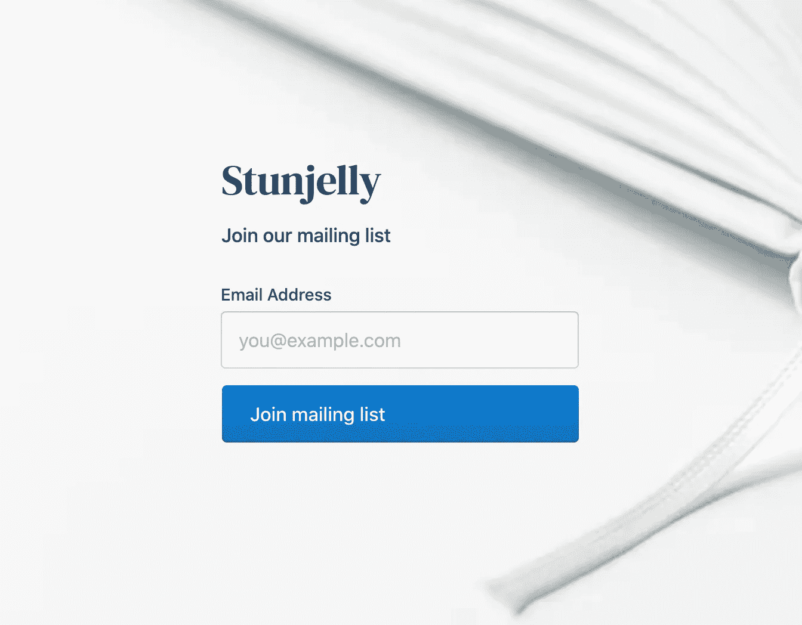
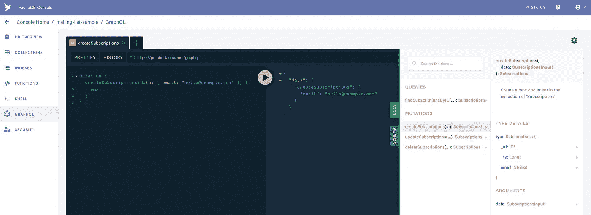

# 如何用 FaunaDB 免费捕捉电子邮件

> 原文：<https://itnext.io/how-to-capture-emails-for-free-with-faunadb-954ee10efce5?source=collection_archive---------6----------------------->

## 使用无服务器数据库，零运营成本启动您的应用

作为一家新成立的公司，你可能会考虑在早期用电子邮件捕获表单来捕获人们对你产品的兴趣。你的选择可能包括 MailChimp、HubSpot、OptinMonster、SumoMe、Sleeknote 等等。然而，不变的是，它们都是要花钱的，而且所有这些服务都有附加功能，比如电子邮件活动和跟踪，你对此还不感兴趣。

我们只需要一个表格，捕捉一个电子邮件地址，并将其存储在某个地方。



在本文中，我将向您展示如何用 FaunaDB 非常简单地构建它。它应该可以帮助您开始无服务器数据库之旅。最后，你应该对 GraphQL、自定义函数、自定义角色和 Fauna 中的特权有所了解。

这是我们将要构建的……

[https://eknowles.github.io/fauna-email-capture/](https://eknowles.github.io/fauna-email-capture/)

# GraphQL 模式

你可以通过描述一个 GraphQL 模式来创建一个 API。在我们的例子中，我们只需要捕获一个电子邮件地址，并且它必须是唯一的。

```
**type** Subscriptions {
  email: String! **@**unique
}
```

这就是我们目前所需要的！将此保存为一个`schema.gql`文件，然后[将其上传到 FaunaDB 仪表板](https://docs.fauna.com/fauna/current/start/graphql#import)。Fauna 将在我们的数据库中创建一个`Subscriptions`集合，并创建 CRUD GraphQL 查询和变异。魔法。

我们不希望用户订阅两次，所以我添加了一个`@unique`指令。这将在创建或更新时强制唯一性。如果您愿意，您可以[自定义索引的名称](https://docs.fauna.com/fauna/current/api/graphql/directives/d_unique)。

让我们看看这个怎么样。



生成的 GraphQL CRUD

上面的截图显示了你如何创建一个新的订阅，在右边你可以看到所有由动物创造的突变。

*   findSubscriptionByID
*   创建订阅
*   更新订阅
*   删除订阅

对于大多数用例来说，这是一个很好的 kickstarter，但是我们不想考虑生成的 ID，我们只关心电子邮件地址。此外，在安全方面，我们需要确保用户无法访问每个人的电子邮件，这些默认的变化并不理想，以抵御这一点。

相反，我们可以做一些很酷的事情。

## 用户定义的函数(UDF)

让我们在模式上定义我们自己的变化。我们可以使用在数据库内部创建和执行的用户定义函数(UDF)来处理 GraphQL 解析器。我们只需要描述突变的输入和输出。如果您将它添加到模式中并上传，FaunaDB 将创建占位符函数供您编辑。

```
**type** Mutation {
  unsubscribe(email: String!): Boolean! **@**resolver(name: **"unsub"**)
  subscribe(email: String!): Boolean! **@**resolver(name: **"sub"**)
}
```

> 我们可以使用在数据库内部创建和执行的用户定义函数(UDF)来处理 GraphQL 解析器。

# 订阅

为了订阅用户，我们在`Subscriptions`集合中创建新文档。在我们的模式中，我们说过这个函数将返回一个`Boolean`，因此我用一个`IsDoc`包装了`Create`方法，所以它总是返回 true。

```
Query(
  Lambda(
    ['**email**'],
    IsDoc(
      Create(
        Collection(**'Subscriptions'**), 
        { data: { email: Var(**'email'**) } }
      )
    )
  )
)
```

如果电子邮件已经存在，那么它将返回一个错误。

# 取消订阅

我们的退订功能也很类似。我们使用了`Delete`函数，该函数期望引用集合中的一个文档。还记得我们模式中的独特装饰吗？这将为我们创建一个默认如下的索引:`unique_Subscriptions_email`。

为了解释 FQL 是如何工作的，我发现最好通过“从里到外”来讲述。

为了搜索索引，我们需要使用`[Match](https://docs.fauna.com/fauna/current/API/FQL/functions/Match.html)`，这给了我们一个[集合](https://docs.fauna.com/fauna/current/api/fql/sets)。然后，我们可以通过使用`[Get](https://docs.fauna.com/fauna/current/api/fql/functions/get)`从数据库中检索匹配的文档(这将导致一个读取操作，该操作将计入您的配额，因此请注意这一点)。现在我们有一个文档，我们可以删除它。然而`[Delete](https://docs.fauna.com/fauna/current/api/fql/functions/delete)`函数需要一个 [Ref](https://docs.fauna.com/fauna/current/api/fql/functions/ref) ，所以我们使用`[Select](https://docs.fauna.com/fauna/current/api/fql/functions/select)`函数从返回的文档中挑选出 Ref 值。

如果这令人困惑，想象一下在 JavaScript 中你通常如何使用点来访问嵌套属性(例如 data.document.thing.ref)。我们需要使用`[Select](https://docs.fauna.com/fauna/current/api/fql/functions/select)`来获得一个属性。一旦你理解了 FQL 只是一堆组合函数的概念，就很容易理解了。

```
Query(
  Lambda(
    ['**email**'],
    IsDoc(
      Delete(
        Select(
          [**'ref'**],
          Get(
            Match(Index(**'unique_Subscriptions_email'**), Var(**'email'**))
          )
        )
      )
    )
  )
)
```

唷！如果你明白这一切，那么你现在是动物群查询语言(FQL)的一个向导！去拍拍自己的背吧。


# 安全性

要进入动物群，你需要一把[钥匙](https://docs.fauna.com/fauna/current/security/keys.html)。密钥由[角色](https://docs.fauna.com/fauna/current/security/roles)生成，角色拥有[权限](https://docs.fauna.com/fauna/current/security/roles#pco)。

为了保护我们的邮件列表，我们需要创建一个自定义角色。这些自定义角色是动物群中的特殊文档，描述了角色所拥有的访问权限。然后，我们可以为这个角色创建一个键，并将其用作 GraphQL API 的`Authorisation`头。想不到！

> 邮件列表应该是最高机密，我们给我们的前端令牌应该不能查询其他电子邮件地址。

默认情况下，所有角色都没有访问权限。我们可以通过在角色上使用[特权](https://docs.fauna.com/fauna/current/security/roles#pco)来授予集合和索引等权限。

我们希望从前端调用 GraphQL 端点，从而消除对后端的需求。通过使用“最小特权原则”,前端用户只能调用`subscribe`和`unsubscribe`函数。

跳进仪表盘，进入`Security > Manage Roles > New Role`。滚动到功能，选择两者，并给它打电话访问。如果您手动执行此操作，代码将如下所示:

```
{
  name: **'frontend'**,
  membership: [],
  privileges: [
    {
      resource: Function(**'subscribe'**),
      actions: {
        call: **true** }
    },
    {
      resource: Function(**'unsubscribe'**),
      actions: {
        call: **true** }
    }
  ],
}
```

角色描述了它可以做的许多事情。对于一个函数，它只能被*调用*，但是对于集合和索引，你可以读、写、创建、更新、删除等等。

为这个角色生成一个密钥非常简单，在仪表板上只需点击`Security > New Key`。

最后，我们的函数本身需要对订阅集合进行“创建和读取”访问。因为这些功能不会泄露任何电子邮件地址或其他数据，所以给它们管理员角色是完全没问题的。

在这篇文章中，我们已经讨论了动物安全的基本原则。使用基于属性的访问控制(ABAC)可以做更多的事情，它包括像谓词函数而不是布尔函数这样的东西，允许您根据用户正在做的事情和用户是谁来授予权限。

原来如此！现在，您在一个全球多云复制数据库上有了一个安全的 API，专门用于您的邮件列表。

GitHub 上有一个工作示例库，您可以在那里下载源代码，并在 2 分钟内建立和运行您自己的数据库和 API。

[](https://github.com/eknowles/fauna-email-capture) [## eknowles/动物群-电子邮件-捕获

### 对于新的创业公司，你可能会考虑用电子邮件捕获表单来捕获早期的兴趣。您对…的选择

github.com](https://github.com/eknowles/fauna-email-capture) 

你甚至可以在此基础上添加 [TTL](https://docs.fauna.com/fauna/current/api/fql/collections) ，这样电子邮件地址就会在 6 个月后被清除。

我很期待看到*你*能对此做出什么贡献，请在评论中告诉我你的想法！

请继续关注本系列的下一篇文章，在那里，我将使用 [FaunaDB 数据管理器(FDM)](https://docs.fauna.com/fauna/current/integrations/fdm/) ，向您展示如何提取您准备处理的电子邮件。