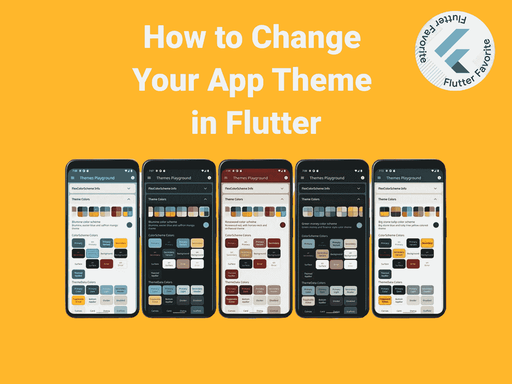
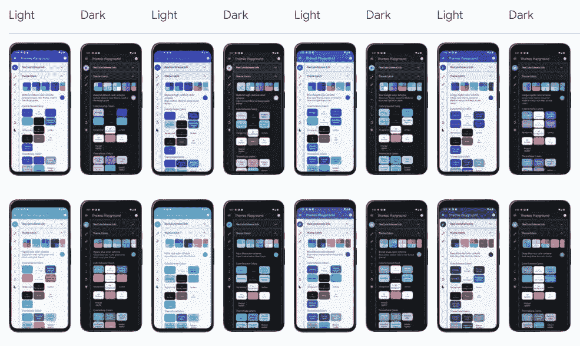

# 如何在 Flutter 中改变你的应用主题

> 原文：<https://itnext.io/how-to-change-your-app-theme-in-flutter-f30f7a1cff43?source=collection_archive---------2----------------------->



不同的用户喜欢不同的主题。有些人喜欢浅色主题，而有些人喜欢深色主题。现在，在应用程序中提供这两种主题就成了开发者的责任！

您可以使用不同的包以编程方式更改应用程序的主题。今天我来说说`flex_color_scheme`。 [Flex 配色方案](https://pub.dev/packages/flex_color_scheme)是一个软件包，可以制作基于漂亮配色方案的飘动主题，带有可选的原色表面混合。这些主题与 Flutter 的配色方案基于相同的概念，但有许多附加功能。

这里是一些包装的视觉例子。



**一些灵活配色方案的例子**

## 入门指南

[](https://pub.dev/packages/flex_color_scheme) [## flex_color_scheme | Flutter 包

### 使用 FlexColorScheme 制作漂亮的基于颜色方案的颤动主题，可选的原色表面混合…

公共开发](https://pub.dev/packages/flex_color_scheme) 

*   让我们将包添加到我们的`pubspec.yaml`中。

```
dependencies:
  flex_color_scheme: ^4.2.0
```

*   然后在我们的`main.dart`文件中，我们这样编辑 MaterialApp。

*   就这样，我们差不多完成了。我们所要做的就是根据用户的喜好改变我们的主题颜色。为此，我将使用 riverpod 动态更改我们的主题。如果你想了解更多关于 riverpod 的信息，可以看看这篇文章。

[](/a-minimalist-guide-to-riverpod-4eb24b3386a1) [## Riverpod 简约指南

### 颤振中最好的状态管理和依赖注入解决方案之一

itnext.io](/a-minimalist-guide-to-riverpod-4eb24b3386a1) 

*   动态改变我们的主题非常简单，我们所要做的就是检查我们当前的主题，并相应地改变它。下面是怎么做的。

*   我们所要做的就是在任何我们想要的地方调用`switchTheme`函数，动态改变我们的主题。

我们结束了。我们可以像这样简单地改变我们的主题偏好。如果你想看一个工作的例子，你可以看看这个。👇 👇

[](https://github.com/SncOne/apptheme_example) [## GitHub - SncOne/apptheme_example

### 此时您不能执行该操作。您已使用另一个标签页或窗口登录。您已在另一个选项卡中注销，或者…

github.com](https://github.com/SncOne/apptheme_example) 

本文到此为止。🎉🎉

**感谢您的阅读！**👏👏

如果你喜欢这篇文章，请点击👏按钮(你知道你可以升到 50 吗？)

另外，别忘了关注我，在你的社交网站上分享这篇文章！也让你的朋友知道吧！！