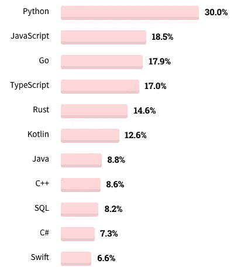
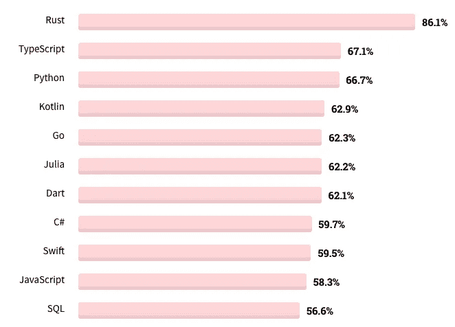

# 如何选择学习一门编程语言

> 原文：<https://itnext.io/how-to-choose-a-programming-language-to-learn-4b5bc66114cc?source=collection_archive---------1----------------------->

## 无代码区

## 我们被数百种编程语言所包围，但你不可能学会所有的语言。在这篇文章中，我将解释在选择下一门编程语言时要考虑的几个简单要点。

(来源:[**unsplash.com**](https://unsplash.com/photos/w79mIrYKcK4))

如果你想知道我懂什么编程语言，我不会确切地说我擅长它们，但我可以用 [**JavaScript**](https://medium.com/jspoint/javascript/home) ， [**TypeScript**](https://medium.com/jspoint/typescript/home) ， [**Python**](https://github.com/course-zero/getting-started-with-python) ， [**Go**](https://medium.com/rungo) ， [**Dart**](https://medium.com/run-dart) ， [**Bash**](https://medium.com/sysf/bash-scripting-everything-you-need-to-know-about-bash-shell-programming-cd08595f2fba) **我知道 TypeScript 不完全是一种语言，但是在 [**Deno**](https://deno.land/) 之后，你可以这么说。我不会吹嘘这一点，但我在早期曾经从事过 **PHP** 工作。**

那么，背负这么多种语言的包袱值得吗？嗯，这取决于你问的是谁，但我的回答总是，“是的”。实际上，我正打算接下来学习 [**锈**](https://www.rust-lang.org/) ，所以对我来说，适可而止。然而，我不鼓励在某些情况下这样做。我来详细说明一下。

我们先来了解一下什么是编程语言。编程语言是一种编写指令来处理输入数据并产生一些输出数据或对计算机产生影响的方法。例如，你可以写一个程序来计算两个数的和。同样，你可以写一个程序在你的屏幕上显示一幅图片或者播放一种声音。

但是没有通用的编程语言，就像没有通用的口语一样。你可以用包括 **Bash** 在内的任何编程语言编写一个程序来计算两个数的和。但是决定因素不是编程语言本身，而是它如何工作起着更重要的作用。

比如 Bash 就是 [**终端**](https://en.wikipedia.org/wiki/Command-line_interface) 使用的编程语言，也叫**shell**或者**命令提示**。所以如果你用 Bash 写一个程序，除非你有一个终端供你使用，否则你不能执行它。如果您想将程序分发给全球用户，Bash 可能不是一个理想的选择。

当你写一个软件的时候，你最关心的应该是**速度**、**可靠性**、**可移植性、**和**交叉兼容性**。**可移植性**意味着将你的程序(*包括它的依赖关系*)交付给你的用户有多容易，而**交叉兼容性**意味着该程序能在各种机器(*如 Windows、macOS、Linux、32 位、64 位等)上运行得有多好。*)。

我们以 [**节点**](https://nodejs.org/en/) 上的 **JavaScript** 为例。由于 ECMAScript，JavaScript 作为一种语言，每年都要经历许多次迭代，但这对于运行时提供者( *JavaScript 引擎*)来说是一个巨大的挑战，例如 Node、Deno 和一般的 web 浏览器。他们需要不断更新 JavaScript 引擎，以融入新的特性。

如果你选择在你的程序中使用一个新的 JavaScript 特性，比如 [ES6 Arrow Functions](https://developer.mozilla.org/en-US/docs/Web/JavaScript/Reference/Functions/Arrow_functions) ，但是收到这个程序的用户运行的是一个旧版本的 Node，那么这个程序可能无法在他/她的机器上运行。这就是**交叉兼容性**的问题，因为这个程序可能在一些机器上工作，而在另一些机器上不工作。为此，我们使用兼容性表，如 [**node.green**](https://node.green/#ES2015-functions-arrow-functions) 来检查在产品中使用某个功能是否安全。

如果最终用户没有首先安装节点，或者他/她不知道程序的依赖关系(*哪个节点是一个*)，那么运行程序是没有问题的。这是一个**可移植性**的问题，因为最终用户需要安装各种各样的东西来运行程序，这使得你的产品(*程序*)不太可移植。

这就是为什么拥有优秀的编程知识或特定的编程语言并不总是一件坏事。你需要一起了解你的顾客和你的产品。那么，如何选择一种非常适合你的产品的编程语言呢？

因此，编程语言主要分为两大类，即。**编译****解读**。有一些像 **Java** 站在中间，但我们会详细研究它。

用任何语言编写的程序，不管是编译的还是解释的，都是由一个**虚拟机**或者简称为 **VM** 运行的。很难找到虚拟机的定义，因为它意味着很多事情，但这里的**是一个普遍理解的定义。**

*****虚拟机是一种能够执行特定指令集的假想设备。这样的指令集通常被称为字节码。编程语言的一种常见实现策略是将代码编译成专用虚拟机的指令。*****

**简而言之，虚拟机是一种软件，它将程序作为输入并运行它。但是进入虚拟机的程序不一定是真实的形式。我们可以将我们的程序转换成一种非常适合虚拟机的语言。这就像把一本书从英语翻译成德语，以便说德语的人能够理解。由于这个原因，我们编译和解释语言。**

**当你写一个 **C** 、 **C++** 、 **Rust** 或者 **Go** 程序的时候，你首先需要用编译器编译它。比如 [**GCC**](https://gcc.gnu.org/) 就是一个 C 编译器。编译器将原始源代码转换成用[汇编](https://en.wikipedia.org/wiki/Assembly_language)语言编写的程序。你的计算机处理器可以执行用这种语言编写的程序。由于在实际运行用这些语言编写的程序之前有一个编译步骤，所以这些被称为**编译语言**。在这个例子中，**处理器**是一个虚拟机，汇编是这个虚拟机理解的实际编程语言。**

> ***💡*汇编语言的源代码不能在处理器上运行。当我说汇编语言时，我指的是汇编语言的真正的二进制指令，也称为机器指令或机器语言。 [**这里的**](https://www.cs.virginia.edu/~evans/cs216/guides/x86.html) 是 x86 (32 位)处理器的汇编指令。**

**另一方面，JavaScript 或 Python 不是编译语言，因为你不用编译用这些语言编写的程序来最终运行它。当你编写一个 JavaScript 程序时，你可以使用一个简单的命令比如`node program.js`直接让 Node 执行它。类似地，您可以使用`<script>`标签在浏览器中包含一个 JavaScript 程序来运行它。**

**一个程序最终将由处理器来执行。在 JavaScript 的例子中，一个程序被动态地编译并传送给处理器。这项工作由驻留在节点内部的 **JavaScript 引擎**完成，例如 [**V8**](https://v8.dev/) 。**

> ***💡*如果你想了解更多关于 JavaScript 在节点和浏览器内部的实际工作方式，那么你应该关注我写的这篇文章**。****

****由于程序员不必执行编译步骤，并且 JavaScript 引擎"**动态地将** " **JavaScript 翻译成汇编语言** ( *就像英语翻译成德语*)，因此 JavaScript 被称为**解释型语言，**并且执行此操作的 JavaScript 引擎被称为**解释器**。这里的解释器是被解释语言的虚拟机。同样的逻辑也适用于 Python 或任何解释型编程语言。****

******运行时**或**运行时环境**是各种实用程序的集合，这些实用程序与实际的解释器相结合，共同运行用解释语言编写的程序。因此**节点**在技术上是一个运行时(*这就是为什么它是一个服务器端 JavaScript 运行时*)，它包含了 **V8** JavaScript 解释器。****

> *****💡*解释语言也可以被称为**脚本语言**但是并不是所有的解释语言都是脚本语言。更多信息 [**此处**](https://en.wikipedia.org/wiki/Scripting_language) 。****

****由于编译是动态发生的，这种类型的编译被称为**即时** ( *JIT* )编译，而在编译语言的情况下，它被称为**提前** ( *AOT* )编译，因为我们是在程序实际运行之前提前编译程序。****

****你会看到有人拿**高级**语言和**低级**语言做文章。低级语言是一种可以在硬件本身上运行的语言，比如在计算机处理器上运行的汇编语言。****

****高级语言就像 JavaScript 一样，需要解释器的帮助才能运行。从技术上讲，C、C++或任何编译的编程语言也是一种高级语言，因为它需要编译器的帮助。当一种语言到达处理器需要更少的步骤时，它就被称为低级语言(*即使它不像 C* )。因此，与解释语言相比，编译语言被认为是低级的或“接近处理器”。****

****Java 适合一个非常奇怪的地方。Java 虚拟机或简称 **JVM** 是在 **Java 运行时**环境( *JRE* )内部“解释”Java 程序的虚拟机。JVM 的输入实际上不是用 Java 编写的程序，而是 Java 字节码。所以程序员需要使用 Java 编译器( ***javac*** )将一个 Java 程序(`*program.java*`)编译成 Java 字节码(`*program.class*`)程序来实际运行。所以从技术上来说，Java 是一种解释型语言，但比 JavaScript 更高效。****

****我喜欢 [**Dart**](https://medium.com/run-dart/dart-dartlang-introduction-advanced-dart-features-524de79456b9#0e36) 的原因是它可以根据你的用例充当编译语言或者解释语言。Dart 提供了一个 VM，它以源代码形式(*而没有编译步骤*)解释 Dart 程序，或者您可以编译它为汇编语言(*机器语言*)并本地运行。****

****既然我们了解了各种语言之间的区别，让我们来谈谈它们之间的比较。****

## ****轻便****

****编译语言比解释语言更容易移植(T4)。在编译语言的情况下，你可以将一个程序编译成一个 [**二进制可执行**](https://en.wikipedia.org/wiki/Executable) 文件(`*.exe*`)，其中包含机器指令(*以及程序*的依赖项)并将其发送给用户。用户只要执行这个文件就可以运行这个程序(*简单到双击它*)。****

****与编译语言不同，解释语言不能直接在处理器上运行，这就是为什么它们需要一个**解释器**。所以如果你用 JavaScript 写一个程序，你不能简单地要求用户运行它。您还需要指导他们安装 Node ( *或浏览器，具体取决于您的程序*)。如果你的程序需要其他资源，如 [**NPM**](https://en.wikipedia.org/wiki/Npm_(software)) 包，那么你也需要在运行程序之前指导他们安装这些资源。****

> *****💡*实际上，通过将运行时本身打包在可执行文件中，你可以将 JavaScript 或任何解释语言程序制作成可执行文件。见`[***pkg***](https://github.com/vercel/pkg)`和`[***nexe***](https://github.com/nexe/nexe)`工具，使节点发生这种情况。这增加了可执行文件的大小，在某些情况下，甚至无法将可执行文件发送给客户。****

****如果你的产品的主要目标是易于发布，你应该考虑用编译语言来编写你的程序。这样，您可以在一个二进制可执行文件中发布一个包含数千个程序文件的项目，用户甚至不必关心它的依赖关系(*除非需要一些系统级的依赖关系*)。****

****如果您的客户在他们的系统上安装了 JRE，那么 Java 也是一个不错的选择，因为您可以从多个 Java 程序中创建一个单独的`.jar`文件。JAR ( *Java 归档文件*)文件是多个`.class`文件和其他依赖项的打包归档文件。您可以 [**使其可执行**](https://stackoverflow.com/questions/5258159/how-to-make-an-executable-jar-file) ，这样用户只需双击它就可以运行它。****

## ****交叉兼容性和分布****

****编译语言比解释语言更容易出现交叉兼容性问题。比如，当你把一个 C++程序编译成一个可执行的`.exe`文件时，你需要选择处理器架构和操作系统来制作一个平台特定的可执行文件。****

****由于一个`.exe`基本上是一个带有机器指令和操作系统依赖的包文件，它不能在所有平台上运行(*机器*)。这就是为什么你不能把同一个`.exe`文件分发给所有用户，因为为`Windows x64`编译的`.exe`文件不能在`Windows x86`平台或`macOS ARM`平台上运行。您需要为所有支持的架构和操作系统组合创建`.exe`文件，以便用户可以下载或接收为他/她的机器定制的文件。****

****这个问题在解释型语言中不会出现。由于所有的对话(*到处理器*)都是由安装在用户系统(如 JRE 或 Node)上的解释器完成的，所以您可以将原始源代码发送出去，程序到机器语言的转换也是在运行中完成的。但是这需要在用户的系统上有一个运行时环境。****

****此外，如前所述，不同版本的解释器之间可能存在一些不兼容问题，这就是为什么用新版本语言编写的程序并不总是能保证成功运行，这在编译语言的情况下很少发生。****

## ****速度和效率****

****速度是每个人都想要的。每个人都希望用这么少的资源做更多的事情。这同样适用于编程语言。您会希望您的程序越来越快地产生输出。 [**这里的**](https://github.com/drujensen/fib) 是使用计算第 n 个 [**斐波那契**](https://en.wikipedia.org/wiki/Fibonacci_number) 数的程序对多种编程语言的基准测试结果(测试中*第 46 个*)。****

****如果你看到[结果](https://github.com/drujensen/fib#natively-compiled-statically-typed)， **C/C++** 执行程序花费 **4.7** 秒，而 **Go** 花费 **9.7** 秒，尽管是编译语言。一个基准测试不应该是决定性因素，但 C/C++与其他编程语言相比非常快。当编译后的机器码针对处理器进行了优化时，就会出现这种情况。 **Rust** 在时钟上以 **5.4** 秒接近 C/C++执行。****

****一般来说，解释型语言速度较慢，因为它们是在解释器中动态编译的，这需要花费大量的时间。你花在编译程序上的时间越多，优化就越好，程序运行就越快。****

****由于解释器必须快速编译程序(*以最小化启动时间*，输出汇编指令通常不是很优化，这就是解释语言在运行时较慢的原因。编译语言就不是这样了，因为你可以预先花更多的时间来编译。****

****如果你检查解释语言的[结果](https://github.com/drujensen/fib#interpreted-dynamically-typed)，Python 需要大约 **797 秒**来返回结果，这对于一个要求速度和效率的产品来说是一个噩梦。这是我对在机器学习中使用 Python 感到困惑的原因之一。只是还不够快。****

## ****可靠性****

****如果你想写一个程序来驾驶价值 10 亿美元的火箭，你可能不会使用 JavaScript 或 Python。你会使用一种已经成熟多年的编程语言，这种语言已经在任务关键的情况下证明了自己，并且得到了数百万程序员的信任。****

****对于任务关键的程序来说，编译语言更受程序员的信任，因为它们有单点故障，而对于解释语言来说，解释器中的一个错误就可能导致程序崩溃，在这种情况下，你绝对没有错。****

****C 和 C++仍然流行的原因是它们高度可靠。你可以用 C 写一个程序，并期望它能可靠地工作几百年，只要运行它的机器(*)本身有那么长的寿命。因此这样的语言被用于 [**系统编程**](https://en.wikipedia.org/wiki/Systems_programming) 。流行的 [**Linux**](https://github.com/torvalds/linux) 内核是用 C 写的 [**Linus**](https://en.wikipedia.org/wiki/Linus_Torvalds) 目前似乎对其他任何语言都不感兴趣。*****

## *****安全性*****

*****当您处理敏感信息时，安全性总是一个大问题。如果一种编程语言在未经用户事先授权的情况下就能轻易地访问用户的系统资源和数据，那么这种编程语言就被认为是不安全的。JavaScript 本身非常安全，因为它没有任何 API 来与系统硬件对话，但 Node 支持这一点。*****

*****Node 中没有内置的安全措施，这就是为什么您可以编写一个程序来访问文件系统、网络和其他系统资源，甚至不需要请求许可。 [**Deno**](https://deno.land/) 是另一个 JavaScript(*actually TypeScript*)运行时，默认提供安全性，用户需要在运行程序前授予系统权限。*****

*****甚至广泛流行的编程语言也有安全缺陷。一些安全缺陷直到被实际利用后才被发现。这样的安全漏洞被称为 [**零日漏洞**](https://www.zdnet.com/article/which-are-the-most-insecure-programming-languages/) 。你应该阅读这篇文章来了解不安全的编程语言。剧透一下，C 被认为是最不安全的语言。*****

## *****知识产权*****

*****如果你不希望与最终用户(*或公众*)分享产品源代码，那么选择一种解释语言是一个糟糕的主意。由于您需要以源代码形式或中间形式(T4，比如可以反转的 Java 字节码)发布程序代码，所以它很容易被利用。*****

*****因此，大多数专有软件是用编译语言编写的。当你以编译的形式发布一个产品时，原始的源代码对公众不再可见，这正是我们想要的。*****

## *****开发者体验*****

*****开发人员体验是一个与开发过程相关的奇特术语。正如**用户体验**意味着用户发现应用程序使用起来有多容易一样，开发者体验意味着程序员(*开发者*)发现编程语言使用起来有多容易。*****

*****以我的经验来看，并不总是一种编程语言，而是围绕这种语言的工具增加了开发人员的体验。例如，如果你打算使用一个纯文本编辑器，比如记事本或 Vim 来编写程序，你的生活将会是地狱。但是，如果您选择 VSCode 或其他 ide，您将获得智能感知、自动完成功能、提示和第三方实用程序，从而提高您的工作效率。*****

*****但是如果没有语言的帮助，IDE 就做不到这一点。比如 JavaScript 是一种**动态类型化的**语言(*也是，Python* 也是)。这意味着当你定义一个变量时，它可以存储一个`number`，或者一个`string`，或者任何数据类型的值。在这种情况下，IDE 不知道应该在该变量中存储什么数据类型是安全的。这就是 [**打字稿**](https://medium.com/jspoint/typescript-a-beginners-guide-6956fe8bcf9e) 存在的原因。*****

*****因此[静态类型语言](https://en.wikipedia.org/wiki/Type_system#Static_type_checking)有很好的开发者体验。几乎所有的编译语言都是静态类型语言，如 C、C++、Rust、Go 等。编译器不仅负责将程序编译成机器码，还负责分析程序中与类型相关的错误。使用这种类型信息，编译器能够产生运行速度超快的优化机器指令。*****

*****在处理大型项目时，通常您会希望将应用程序分解成不同的部分，以便每个部分都可以独立管理和处理。模块就是这样一个片段，它可以插入到项目中，并在多个项目之间共享。*****

*****对于大型项目来说，本地支持模块和模块管理器(*包管理器*)的编程语言是首选。项目中的模块化极大地改善了开发人员的体验。例如，如果您需要一个为算术计算提供函数的库，只需对 Node 运行`npm install math`命令就可以安装它。*****

*****从 ES6 开始，JavaScript 本身就支持模块，但是它不提供模块管理工具。相反， [NPM](https://www.npmjs.com/) 是大多数节点开发者用来管理第三方模块的工具。Go，Rust，Java 等。提供模块管理工具，要么以语言*烘焙，如*`*go get*`*`*go mod*`，要么作为外部特性，如[**cargo**](https://github.com/rust-lang/cargo)for**Rust**和**Pip**for**Python**。******

******大多数编程语言都包含某种模块系统，并为包管理工具提供官方或非官方支持。但是一种语言，如果有一个围绕它构建的大型开源社区，那么它通常更适合于开源开发，比如 Node、Python、Go、Rust 等等。******

******如果你是一个产品开发人员或者一家公司，你需要考虑一门编程语言的方方面面(上面讨论的*)很好地适合你的产品。在产品开发过程中改变编程语言太难了，因此前期的研究是至关重要的。*******

******理想的编程语言很难找到，但我们必须考虑语言的所有方面、所有优点和所有缺点，并做出评估。我们还需要考虑围绕语言的生态系统，如程序员、贡献者和第三方模块。******

******但是如果你是一名开发人员，那么事情可能会根据行业的状况而改变。从 2020 年 StackOverflow 调查 [**中抓取的下表**](https://insights.stackoverflow.com/survey/2020#technology-most-loved-dreaded-and-wanted-languages-wanted) 代表了业内最受欢迎的**语言。********

****************

********(最想要的**语言**2020)********

********如你所见， **Python** 和 **JavaScript** 高居榜首。由于 JavaScript 是网络应用的主要语言，它一定会在**前 10 名**中赢得一席之地。然而，对于 Node，它用于服务器端应用程序开发以及基于 **HTML 的**应用程序开发。例如，VSCode 是使用 [**electron.js**](https://www.electronjs.org/apps) 制作的基于 HTML 的应用程序。********

******JavaScript 是一种动态类型语言。这使得应用程序开发非常困难并且容易出错，因为错误只会在运行时出现，并且不会被编译器分析。TypeScript 是一种编程语言，技术上是 JavaScript，但有类型。******

******静态类型分析极大地改善了**开发人员的体验**并使应用程序在运行时可靠。这就是 JavaScript 开发人员更喜欢使用 TypeScript 的原因。从上面的图表可以看出，TypeScript 是当今最流行的语言之一。******

********Python** 是一种通用编程语言，由于其简单性，即使是非程序员也能使用。目前，Python 在机器学习库中被大量使用，但我个人不喜欢 Python，因为它比其他编程语言慢得多。******

******下面的图表代表了程序员们最喜欢的编程语言。Rust 和 TypeScript 在这种情况下位居榜首，然而，JavaScript 在这一类别中远远落后。******

************

******(最受欢迎的语言 2020)******

********Rust** 是一种低级(*像 C* 一样)静态类型编译的开源语言，为**系统编程**而设计，但也可以编译成 [WebAssembly](https://webassembly.org/) 。它被认为是安全、高效和可靠的。它原生编译成 WebAssembly [的原因足以让我学会它。想了解什么是 WebAssembly，可以访问 WebAssembly 上的](https://rustwasm.github.io/docs/book/) [**我的文章**](https://medium.com/jspoint/the-anatomy-of-webassembly-writing-your-first-webassembly-module-using-c-c-d9ee18f7ac9b) 。******

******Go(Golang)目前也很受欢迎，不仅因为它是一种来自**谷歌**的静态类型编译编程语言，而且我个人觉得使用它非常容易和有趣。这就是为什么我通过我的 [**RunGo**](https://medium.com/rungo) 刊物写了多篇关于它的文章。与 C 或 Rust 不同，它有一个内置的 [**垃圾收集器**](https://en.wikipedia.org/wiki/Garbage_collection_(computer_science)) ，这意味着你不需要手动管理应用程序内存(像 JavaScript 和 Python*)。它还可以编译成 WebAssembly [本机](https://github.com/golang/go/wiki/WebAssembly)，这是一个优点。*******

******综上所述，没有比“**最好的编程语言**”更好的了。每种语言都有特定的用途。Python 和 JavaScript 用于**快速原型制作**，因为你不需要担心内存管理、类型安全、编译和分发。由于这个原因，大多数人更喜欢使用解释型语言进行开源开发。******

******如果是初学者，应该考虑 Python 或 JavaScript 等解释型语言先动手。解释语言一般容易学习，学习曲线较浅。******

******如果你是一个熟练的程序员，你想在你的投资组合中增加一门新的语言，找到这个行业的发展方向。StackOverflow 开发者调查非常准确，显示了行业的现状。如果你今天要问我你应该学习哪种编程语言，我会说 **Python** 、 **TypeScript** 、 **Go** 和 **Rust** 应该是最理想的选择。******

****** [## 堆栈溢出开发者调查 2020

### 每个月，大约有 5000 万人访问 Stack Overflow 来学习、分享和建立他们的职业生涯。行业估计…

insights.stackoverflow.com](https://insights.stackoverflow.com/survey/2020#technology-most-loved-dreaded-and-wanted-languages-wanted)****** ************

******([**thatisuday.com**](http://thatisuday.com)/[/**GitHub**](https://github.com/thatisuday)/[**Twitter**](https://twitter.com/thatisuday)/**stack overflow****/[**insta gram**](https://www.instagram.com/thatisuday/))********

****************