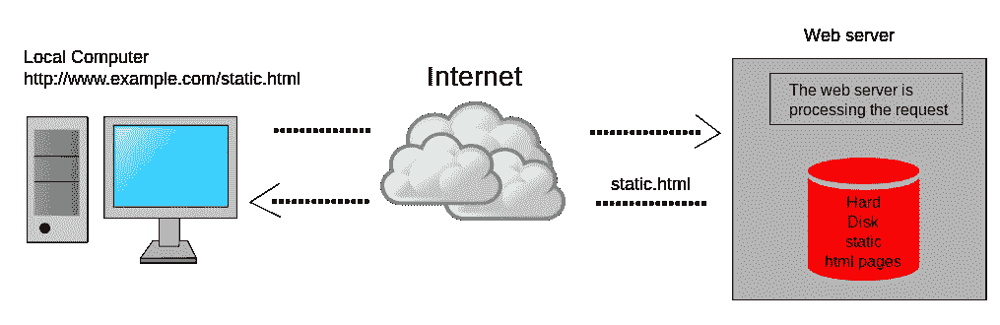
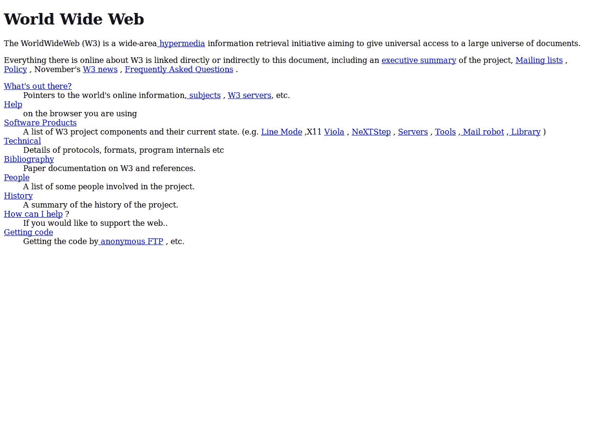
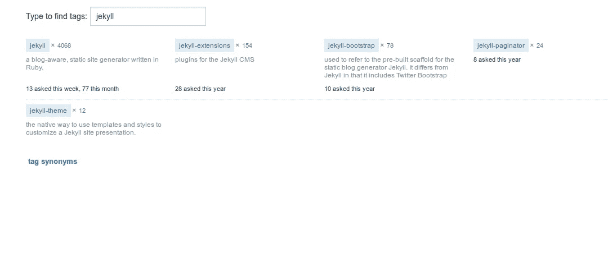
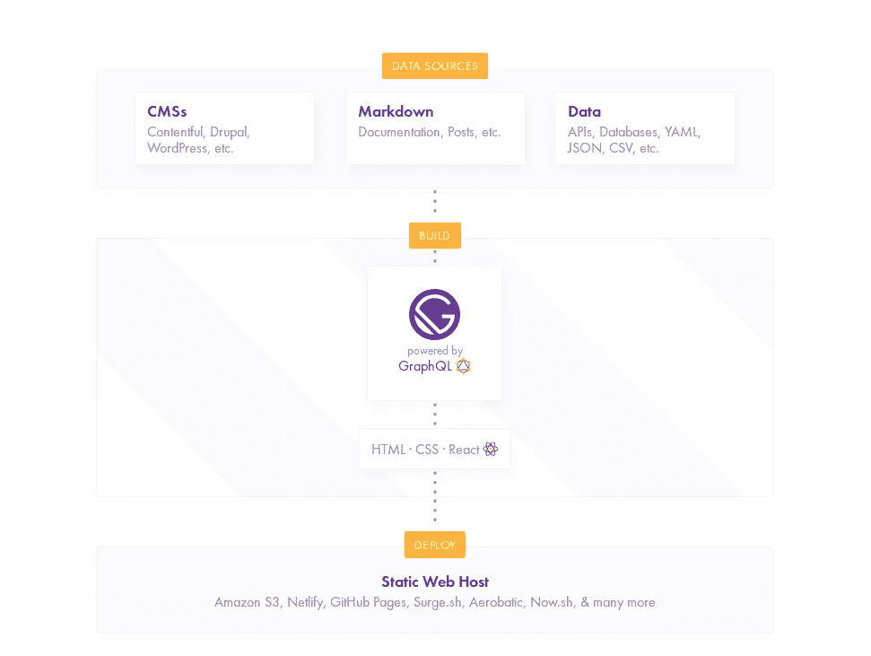

# 如何选择合适的静电发生器:Jekyll vs. Hugo vs. Hexo

> 原文：<https://itnext.io/how-to-choose-the-right-static-generator-jekyll-vs-hugo-vs-hexo-3e2bf4ad4f88?source=collection_archive---------6----------------------->

在本文中，我们将深入了解三个最流行的静态站点生成器:[Jekyll](https://jekyllrb.com/)(Github 为 Github 页面提供支持的 Ruby 生成器) [Hugo](https://gohugo.io/) (基于 go 编程语言构建的速度极快的静态生成器)和 [Hexo](https://hexo.io/) (基于 Node.js 的快速网站生成器)。我们还将研究更专业的选项，如 [Gatsby](https://www.gatsbyjs.org/) (一个围绕 React 和 GraphQL 等现代 web 技术构建的速度极快的静态站点/PWA 生成器)和 [Gitbook](https://www.gitbook.com/) (一个 CLI 和 Node.js 库，用于使用 Git 和 Markdown 构建和托管图书)。

# 什么是静态网站生成？

静态网站生成是指静态生成网站的过程，例如，在本地机器中生成 HTML 文件，然后将网站文件上传到服务器，在用户请求时向用户提供这些文件。服务器不做任何服务器端处理或数据库通信，它只在请求时发送普通的 HTML 文件。



[维基百科:一个静态网页完全按照存储的内容交付给用户。](https://en.wikipedia.org/wiki/Static_web_page)

事实上，万维网上的第一个网站是静态的(第一个网页由蒂姆·伯纳斯·李于 1991 年 8 月 6 日上线)，因为当时的服务器非常原始，没有 PHP 之类的脚本语言或 MySQL 之类的数据库。



# 选择静态方法的原因？

现在有太多的服务器端语言、数据库管理系统和内容管理系统，那么为什么许多网站所有者会保持静态呢？

原因有很多，比如:

*   内容存储为平面文件，因此不需要数据库
*   静态网站不需要动态服务器端处理
*   静态网站比动态网站更快，因为它们不需要服务器端处理或数据库访问
*   静态网站比任何动态网站更安全，因为可利用的安全漏洞更少
*   与 CDN 配合使用时具有超强的扩展性
*   缓存静态文件比缓存动态页面更有效

# 哲基尔 vs 雨果 vs 赫克索

在这一节中，我们将介绍三种流行的静态站点生成器:Jekyll、Hugo 和 Hexo，看看它们的优缺点，我们还将根据不同的标准对它们进行比较，例如:

*   速度，
*   社区和人气，
*   模板系统和主题，
*   工作流程和易用性，
*   降价和多种格式支持，
*   高级内容管理，
*   资产处理，
*   插件支持和可扩展性

# 哲基尔简介

Jekyll 是一个博客感知静态网站生成器，设计用于建立个人、投资组合和组织网站，但也包括成熟的博客。

Jekyll 是 Github 用 Ruby 语言构建的，你可以免费使用 Github 页面来托管你的静态网站，并使用一个 *CNAME* 文件轻松地将它与你的自定义顶级域名链接起来。

# 哲基尔的利弊

就像任何工具一样，Jekyll 也有自己的优缺点。让我们来看看最重要的几个:

对于专业人士:

*   它是免费和开源的
*   您可以将主题构建为宝石，并通过 RubyGems 分发它们
*   简单易用
*   多亏了 [Jekyll importers](https://import.jekyllrb.com/docs/home/) ，你可以轻松地从流行平台(如 WordPress)上迁移你的内容
*   强大的 Github 页面支持
*   带有默认和体面的最小化的开箱即用的主题

杰基尔也有一些缺点，例如:

*   随着网站内容的增长，构建过程会变得非常慢(这是 Jekyll 的主要弱点)
*   增量构建仍然是实验性的
*   从 Jekyll 3 开始没有内置的 post 分页
*   它不支持在标题或 YAML 中使用变量
*   许多插件变得过时
*   gem 依赖可能会引入不兼容性
*   Github Pages 支持 Jekyll 开箱即用，但只能使用一组 Github 安全插件
*   没有对 livereload 的内置支持

# 社区和受欢迎程度

Jekyll 是迄今为止最流行的静态生成器，因为它是由 GitHub 构建和支持的，并用于流行的服务 GitHub 页面，这些页面免费用于托管个人或项目网站的静态页面。

Jekyll 拥有其他静态生成器中最大的社区，提供了大量优秀的教程、开源主题和插件。

它被视为静态世界中 WordPress 的竞争者，许多博客已经将他们的博客从 WordPress 迁移到 Jekyll。

在《StackOverflow》中，哲基尔的相关问题比雨果和赫克索都多



# 工作流程和易用性

使用 Jekyll，只需几个命令，您就可以在几秒钟内启动并运行。一旦有了安装了 Ruby 和 gem 的开发机器，就可以运行下面的命令:

```
gem install jekyll bundler
```

这将安装带有 gem 的 jekyll 和 bundler 包。

接下来，您可以用一个简单的命令生成一个新项目

生成的网站使用了一个叫做 [Minima](https://github.com/jekyll/minima) 的极简主题，这对于作者来说是一个非常好的主题。

然后，您可以在网站文件夹中导航

```
cd new-site bundle exec jekyll serve
```

接下来，您只需使用浏览器导航到`http://localhost:4000`即可看到您的静态网站启动并运行。

一旦你修改了内容，Jekyll 将重建你的网站，但是没有 livereload 开箱即用，你需要使用一个[插件来支持它](https://github.com/anomaly/jekyll-reload)

Jekyll 易于安装和使用，此时您将面临的主要问题是在您的系统中安装和配置 Ruby 和 gem，但是如果您对使用 Ruby 生态系统感到舒适，其他步骤应该很容易遵循。

# 模板系统和主题

Jekyll 使用[液体](https://jekyllrb.com/docs/templates/)模板引擎。Shopify 开发并使用液体。

你也可以使用通过官方插件支持的*纺织*。

## 基于 Gem 的主题

Jekyll 允许你使用主题作为宝石，可以从 RubyGems 安装，这有很多好处

> *基于 gem 的主题使得主题开发者可以很容易地向拥有主题 Gem 的任何人提供更新。当有更新时，主题开发者将更新推送到 RubyGems。* [*来源*](https://jekyllrb.com/docs/themes/#understanding-gem-based-themes)

# 降价和多种格式支持

Jekyll 使用流行的 [Markdown](https://daringfireball.net/projects/markdown/) 格式，其中 [YAML](https://jekyllrb.com/docs/frontmatter/) 用于前端内容，CSS 和 HTML 用于格式化静态内容。

默认情况下，Jekyll 支持 Markdown 和 HTML，但是您也可以通过安装所需的转换器来支持其他格式。

# 速度

静态站点生成器的一个共同特点是加载速度快，因为没有任何服务器端技术能比预先构建的静态文件更快，尤其是在由 CDN 提供的情况下。静态生成器将处理/构建页面的责任从服务器端/请求时间转移到开发人员本地机器的构建时间。因此，当谈到速度时，静态生成器通常在构建时比较它们有多快。

Jekyll 的速度很快，只要你有一个小网站，即少量的内容，但当你的内容增长，你会经历缓慢的建设时间，所以如果你做小的更新和迭代，随着时间的推移，这个过程会变得痛苦。

## 增量构建

许多静态站点生成器提供了增量构建，通过增量地重新生成已更改的帖子和页面，显著提高了大型站点的性能，并减少了构建整个站点的时间。

Jekyll 支持增量构建特性，但这只是实验性的(在某些情况下可能会破坏站点生成),默认情况下不会启用。

您可以通过向 build 命令添加— incremental 开关来启用实验性的增量构建功能。

# 资产处理

Jekyll 有一个资产流水线，支持开箱即用的 *Sass* 和 *SCSS* 。它还允许您通过一些配置选项以多种方式定制 Sass 预处理，例如指定原始 Sass/SCSS 文件夹(默认为`sass_dir`)和设置 Sass 支持的输出样式。

你也可以通过添加官方插件 [jekyll-coffeescript](https://github.com/jekyll/jekyll-coffeescript) 来增加对 *Coffeescript* 的支持。

# 内容管理模型

您可以将 Jekyll 用作内容管理系统(CMS ),但没有安装和配置数据库及相关工具的麻烦。

因为它是博客感知的，所以它支持博客级别的结构，如[永久链接](https://jekyllrb.com/docs/permalinks/)、类别、标签、收藏、页面和帖子，你也可以为你的网站创建自定义布局。

一旦你创建了一个网站，你就可以开始在`_posts`文件夹中添加文章。你也可以在`_posts`中创建子文件夹。

你可以通过在根文件夹或子文件夹中放置一个 HTML/Markdown 文件来添加一个页面，这是任何网站的基本构建。

[系列](https://jekyllrb.com/docs/collections/)是 Jekyll 最近新增的。你可以从 [Jekyll 文档](https://jekyllrb.com/docs/collections/)中找到更多关于集合的信息

> 集合允许你定义一种新的文档类型，它的行为就像页面或文章一样，但也有自己独特的属性和名称空间

你可以通过在`_drafts`文件夹中放置没有日期的文章来使用[草稿](https://jekyllrb.com/docs/drafts/)，然后你可以使用带有`jekyll serve`或`jekyll build`的- drafts 开关来预览你的草稿。

您也可以使用 Jekyll 处理数据文件。从[文档](https://jekyllrb.com/docs/datafiles/)中查找更多信息

> *Jekyll 支持从位于 _data 目录的 YAML、JSON 和 CSV 文件中加载数据。请注意，CSV 文件必须包含标题行。*

# 插件和扩展性

Jekyll 有一个强大的[插件系统](https://jekyllrb.com/docs/plugins/)，它带有钩子，允许你为你的站点创建定制的内容。这允许您在站点生成过程的不同点运行代码。

你可以找到用于各种任务的[开源插件](https://planetjekyll.github.io/plugins/)，官方的或社区创建的，这样你就不必重新发明轮子，如果你熟悉红宝石语言，你也可以创建自己的插件。

总的来说，Jekyll 在最大的社区中非常受欢迎，所以你可以找到许多很棒的教程、主题和插件。它易于使用，可扩展，并有良好的资产管道，但一个主要缺点是一旦您的内容大小开始增长就很慢(这可能会在增量构建变得稳定时得到解决)。

# 雨果简介

Hugo 是 go 内置的静态站点生成器。它被宣传为“世界上最快的网站建设框架”。与哲基尔相比，这只是最近的事，但它的受欢迎程度正在迅速增长。

与 Jekyll 不同，Hugo 是用 go 这种静态编译语言编写的。这在很多方面影响了 Hugo 的功能，尤其是插件。

你可以在几秒钟内安装 Hugo，在不到一秒钟的时间内建立一个普通的静态网站。

雨果使用降价格式与 YAML 前线事宜。

# 雨果的利与弊

雨果有很多优点:

*   开源和免费项目
*   极快的速度，专为速度而设计和优化
*   电池包括:内置分页，内置别名重定向等。
*   对动态 API 驱动内容的内置支持
*   内置对无限内容类型的支持
*   多亏了 shortcodes，Hugo 为降价提供了一个灵活的替代方案
*   预制模板和图案
*   支持多路和自定义输出
*   对 i18n 的完整内置支持
*   强大的主题化系统
*   免费开源[主题](http://themes.gohugo.io/)
*   易于安装
*   无依赖性
*   强大的内容模型

雨果也有不少缺点:

*   主题使用 Go 模板，因此您需要熟悉 Go 来创建您的主题
*   Hugo 没有默认的主题
*   扩展性和插件的运气(主要缺点)

# 社区和受欢迎程度

Hugo 不像 Jekyll 那么受欢迎，但是它现在是网络上最受欢迎的三个静态生成器之一。它被视为杰基尔的快速替代品。

# 工作流程和易用性

你可以为 Hugo 下载一个预编译的二进制文件，不用安装 go 和其他依赖项就可以开始使用。

> *现在有很多关于“雨果被写成 go”的说法，但你不需要安装 Go 就能欣赏雨果。随便抓一个预编译的二进制！* [*来源*](https://gohugo.io/getting-started/installing/)

如果您喜欢软件包管理器，您也可以使用一个命令为主要操作系统安装 Hugo:

```
// Linux snap install hugo // MAC brew install hugo // Windows choco install hugo -confirm // Debian based systems sudo apt-get install hugo
```

Hugo 是其他静态生成器中最容易下载和安装的，比如 Jekyll 和 Hexo。

然后，您可以通过运行以下命令来生成一个新站点:

接下来你需要添加一个[主题](https://themes.gohugo.io/)，把它放在`themes`文件夹中，然后在`config.toml`中引用它

接下来添加一些内容并运行一个本地服务器，然后导航到`[http://localhost:1313/](http://localhost:1313/.)` [。](http://localhost:1313/.)

你可以在这里找到更多信息。

# 速度

如果你关心性能和速度，雨果是你需要的静电发生器。它有许多内置功能，但最重要的是它的速度非常快，这要归功于 Go。

雨果速度超快。你可以用毫秒(而不是 Jekyll 的几秒甚至几分钟)来建立你的网站

Youtube 上的基准测试显示 Hugo 在大约 6 秒内构建了 5000 个页面

# 模板引擎和主题

Hugo 默认使用 go 模板包，也支持两个基于 Go 的模板引擎 *Amber* 和 *Ace* 。包模板不支持布局，仅支持部分布局。

Hugo 提供了一套帮助方法，使得定制过滤、排序和条件化变得容易。

你可以在 https://themes.gohugo.io/找到免费和开源的主题

# 资产处理

Hugo 没有资产管道，所以你必须使用一个外部工具来处理需要预处理的资产，比如 *ES6* 、Sass 或更少等等。

如果你不想使用外部资产管道，你必须坚持使用普通的 JavaScript 和 CSS，因为在构建过程中，Hugo 只将文件从静态文件夹复制到构建文件夹。

# 降价和多种格式支持

Hugo 支持 Markdown 和开箱即用的 Emacs 组织模式。使用外部助手可以支持诸如 Asciidoc 之类的其他格式。你可以在这里找到更多信息。

# 内容管理模型

Hugo 拥有其他静态生成器中最强大的内容管理系统。

您可以创建节和条目，这些节和条目是带有前置内容的降价文件(使用 YAML、JSON 或 TOML)

您可以轻松地查询不同部分的内容，并在模板中显示它们

Hugo 也使得标签和分类变得非常容易。您可以用简单逻辑查询属于某个标签或类别的所有帖子。

Hugo 还支持数据文件和从远程 URL 动态加载数据。

# 插件和扩展性

插件是 Hugo 的主要弱点之一。这是因为 Go 是一种编译语言，所以你没有简单直接的方法在 Hugo 上使用插件。

只要你只需要 Hugo 的内置功能(很多),你就没问题，但是如果你的网站需要内置功能无法提供的自定义行为，你就会面临一个问题。

Hugo 提供了接近扩展的外部助手，但不幸的是，它们无法访问模板引擎或内容管理内部。

总的来说，Hugo 非常快，即使对没有强大技术背景的人来说也很容易安装，有很多适合大多数用例的内置功能，但没有资产流水线，也不支持真正的扩展。

# Hexo 简介

Hexo 是基于节点的开源静态生成器，在 MIT 许可下可用。多亏了 Node.js 平台，Hexo 可以让你在几秒钟内生成数百个静态文件。

# Hexo 的利与弊

Hexo 有许多优点:

*   惊人的速度
*   使用一个部署命令部署到 Github 页面或任何其他主机
*   强大的降价支持
*   高度可扩展
*   免费开放源码[主题](https://hexo.io/themes/)
*   可用的免费[插件](https://hexo.io/plugins/)

对反对者来说:

*   Hexo 有一个相对较大的社区，但大多数是非英语人士(来自中国)

# 社区和受欢迎程度

随着 Hexo 越来越受欢迎，Hexo 社区也越来越大。它现在是网络上最流行的静态生成器之一。Hexo 社区的主要缺点是大部分来自中国。

与 Jekyll 相比，Hexo 的教程较少，但是[文档](https://hexo.io/docs/)清晰易懂。

在我写这篇文章的时候，Hexo 已经有 *20.336* 颗星星在 Github 上。

# 工作流程和易用性

如果你习惯于安装 Node.js 和管理 npm 包，那么安装 Hexo 就没有问题了，只需要一个命令。大多数时候，最令人头疼的是在本地机器上安装 Node.js 平台和 npm。

一旦您有了一台安装了 Node 和 npm 的开发机器，您就可以通过运行一个简单的命令从 npm 安装 Hexo:

然后，您可以使用以下工具生成并提供您的静态网站:

```
hexo init mywebsite cd mywebsite npm install hexo server
```

# 速度

Hexo 基于 Node.js，这是一个以效率和性能著称的平台，因此它非常快(数百个文件只需几秒钟就能构建完成)，但并不比 Hugo 快。

# 资产处理

就像 Hugo 一样，Hexo 没有现成的资产管道来预处理资产(ES6、Sass 等)。)但是由于它是一个节点实用程序，您可以很容易地将其与 Gulp 或 Grunt 集成，作为使用外部工具预编译资产的构建工作流的一部分。您还可以使用许多可用的插件，无缝地将资产预处理添加到 Hexo 中。检查例如 [hexo-renderer-sass](https://github.com/knksmith57/hexo-renderer-sass) 或 [hexo-renderer-scss](https://github.com/mamboer/hexo-renderer-scss) 或 [hexo-asset-pipeline](https://github.com/hexojs/hexo-asset-pipeline) 。

Hexo 允许你在每篇文章中拥有与文章文件同名的资产文件夹。资产文件夹的内容将被复制到 post HTML 文件所在的同一文件夹中。

您可以通过添加一个简单的配置设置`post_asset_folder: true`来为每个帖子创建资产文件夹

Hexo 还允许您在`source`文件夹中拥有全局资产文件夹。

您可以使用不同的标签来轻松引用不同资产文件夹中的资产，例如 asset *path、asset* img 和 asset_link。

# 模板引擎和主题

Hexo 使用*嵌入式 JavaScript 模板* (EJS)一种简单的[模板语言](http://ejs.co/)，让你用普通的 JavaScript 生成 HTML 标记。它支持布局，局部和局部变量。

Hexo 引入了*片段缓存*，这个特性的灵感来自于 [Ruby on Rails](http://guides.rubyonrails.org/caching_with_rails.html#fragment-caching) 。它允许将内容保存和缓存为片段，从而加快文件生成过程。

你可以很容易地构建一个 Hexo 主题，你只需要用[指定的结构](https://hexo.io/docs/themes.html)创建一个新文件夹。要开始使用你的主题，在你的站点的`_config.yml`中修改主题设置。或者你也可以使用开源和社区创建的免费[主题](https://hexo.io/themes/)。

# 降价和多种格式支持

Hexo 支持 GitHub 风味减价的所有功能。您还可以添加对其他格式(Textile、reStructedText 等)的支持。)通过使用插件，如 [hexo-renderer-pandoc](https://github.com/wzpan/hexo-renderer-pandoc) 或 [hexo-renderer-marked](https://github.com/hexojs/hexo-renderer-marked)

# 内容管理模型

Hexo 有一个专注于博客的内容管理系统，支持国际化。您可以[创建帖子](https://hexo.io/docs/writing.html)和草稿，作为带有元数据前置内容的降价文件。

Hexo 支持[数据文件](https://hexo.io/docs/data-files.html)，它从你的文章中的`source/_data`加载 YAML 或 JSON 文件。

# 插件和扩展性

Hexo 是高度可扩展的，有太多的可用插件[和支持所有 Octopress 插件和许多 Jekyll 插件。](https://hexo.io/plugins/)

总而言之，Hexo 易于安装和使用，速度非常快，高度可扩展。它没有内置的预处理 Sass，ES6 等。但它可以很容易地集成为 Gulp 或 Grunt 的一部分，以使用外部资产预处理工具。Hexo 是维护博客的一个很好的选择。

# 其他专业化的选择:盖茨比和 Gitbook

# 盖茨比（姓）

[Gatsby](https://www.gatsbyjs.org/) 是一个基于 React 和 GraphQL 的现代高速静态站点生成器(用于从不同来源提取数据，如 headless CMS 系统、SaaS 服务、API、数据库或文件系统等)。)

Gatsby 也是一个渐进式 Web 应用程序生成器，因此您的静态网站是一个开箱即用的 PWA。你会有许多现代 web 开发的最佳实践，使你的应用程序成为可能，比如代码分割、关键的 CSS 和 JavaScript 以及资源预取等。



要开始使用 Gatsby，您需要有一台安装了 Node 和 npm 的开发机器，然后运行以下命令:

```
npm install --global gatsby-cli
```

然后，您可以使用以下内容创建新站点:

接下来，在您的站点根文件夹中导航，然后使用以下命令启动您的开发服务器:

```
cd gatsby-site gatsby develop
```

您将拥有一个可在 localhost:8000 访问的热重装服务器

然后您可以在`src/pages`开始编辑您的页面。

最后，您可以通过运行以下命令来构建一个优化的生产就绪站点:

盖茨比有许多优点，如:

*   尖端技术
*   基于目录结构的自动路由。
*   得益于 React，组件可重复使用
*   基于 Webpack 的系统
*   可通过插件扩展
*   无与伦比的高速
*   从 CMS 系统、API、数据库、文件系统和 markdown 等来源轻松获取数据。

要使用 Gatsby，您需要熟悉 React，因为您使用 React 组件来创建页面

# Gitbook

Gitbook 是一个静态生成器工具，用于创建书籍和文档。它既是书籍的[主机，也是用 Git 轻松构建书籍的一组节点工具。](https://www.gitbook.com/)

您需要一个节点环境，然后可以使用 npm 安装 Gitbook CLI:

```
npm install -g gitbook-cli
```

然后，您可以使用以下内容创建样板书:

接下来，在本地提供您的图书

Gitbook 有许多优点，例如:

# 结论

选择正确的静态网站生成器是一个重要的步骤，如果你想有一个好的和愉快的经验来管理你的网站，特别是如果你定期添加或更新内容，如博客平台的情况。

我们在这篇文章中提到的每一个静态生成器都有它们的优点和缺点，所以根据你的需要，你可以选择一个合适的来生成你的网站。

如果你刚开始使用静态站点生成器，Jekyll 可能是你最好的选择，因为它有一个很大的社区，因此有更多的教程。

管理网站的良好和愉快的体验，特别是如果你定期添加或更新内容，比如博客平台。

我们在这篇文章中提到的每一个静态生成器都有它们的优点和缺点，所以根据你的需要，你可以选择一个合适的来生成你的网站。

如果你刚开始使用静态站点生成器，Jekyll 可能是你最好的选择，因为它有一个很大的社区，因此有更多的教程。

*最初发表于*[T5【www.techiediaries.com】](https://www.techiediaries.com/jekyll-hugo-hexo/)*。*