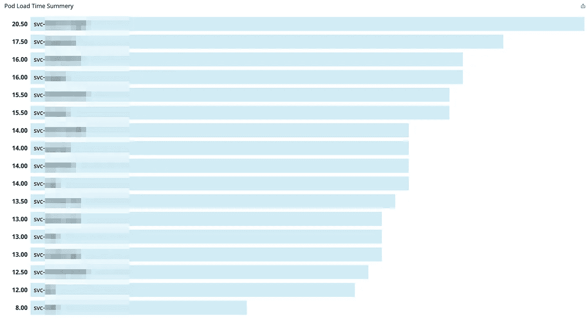
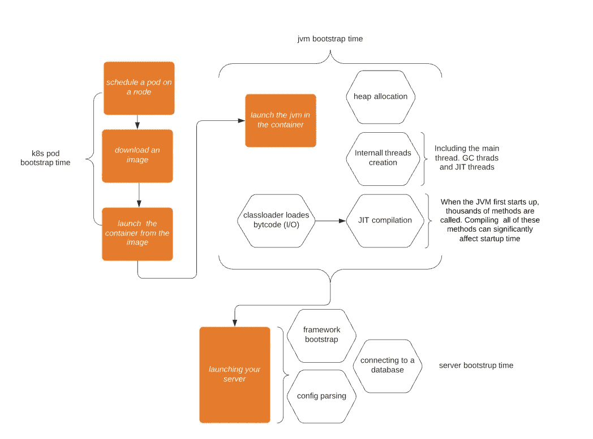
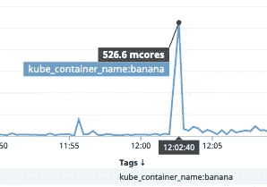
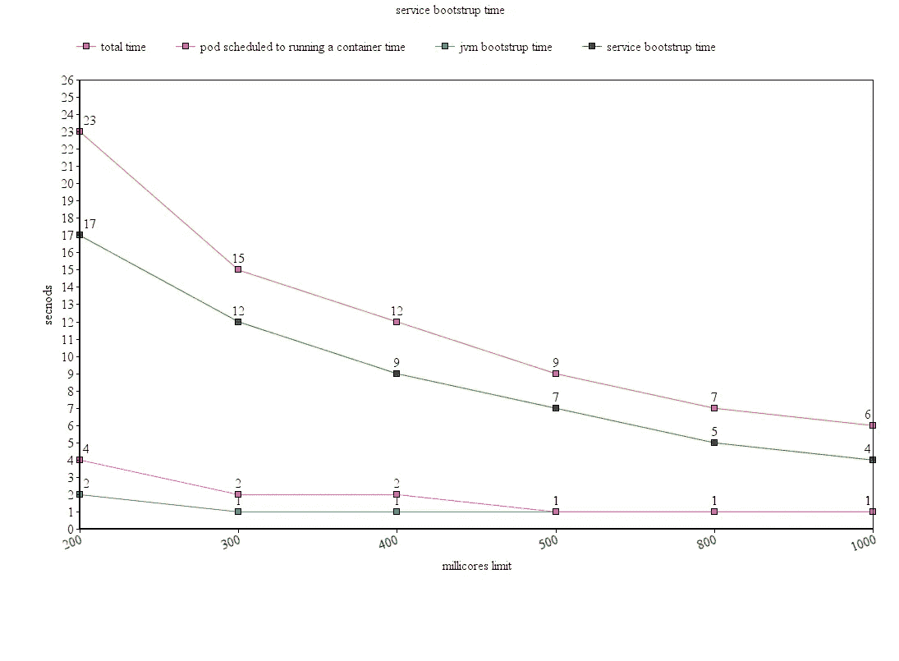
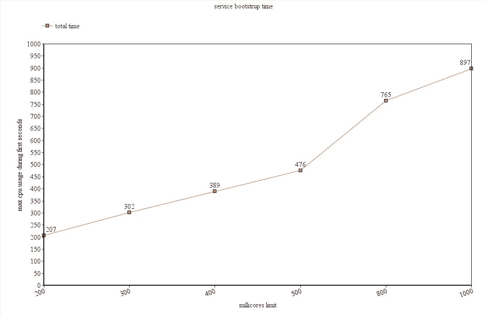
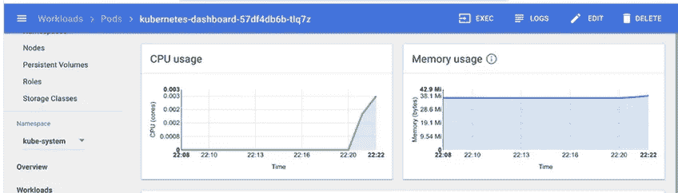
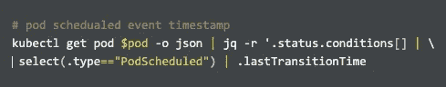
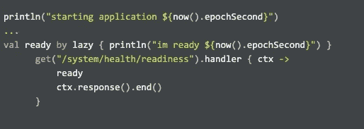

# 如何在 k8s (EKS)上冷启动快速 java 服务

> 原文：<https://itnext.io/how-to-cold-start-fast-a-java-service-on-k8s-eks-3a7b4450845d?source=collection_archive---------0----------------------->

在 k8s 和微服务时代，快速启动非常重要，尤其是如果您的集群运行在 spot 实例上，而且如果您希望轻松地向外扩展，在数据库故障转移甚至您自己的服务内存泄漏后重新启动。

CPU 分数/毫核/纳米核是 java 的东西，它的 echo 系统不是为其设计和优化的。例如像 [Netty](https://github.com/netty/netty) 这样的库，它使用可用处理器的数量来决定多事件循环的大小，或者 [HikaeriCP](https://github.com/brettwooldridge/HikariCP) 这样一个流行的 jdbc 连接池，它使用处理器的数量来决定连接池的大小。所有这些工具和 JVM 本身都进行了优化，以调整线程与处理器的最佳比例，从而充分利用 CPU 并减少线程上下文切换。JVM 使用可用内核的数量来决定 GC 线程和编译器线程(jit 线程)的数量，所有这些线程都在争夺 CPU。但是他们共用 200 个 k8s 毫核会怎么样呢？实质上，docker CPU 分配机制会限制请求的 CPU 资源多于分配的资源的容器，这将导致线程阻塞和执行缓慢，pods crashLoopBackOff，甚至会导致 k8s HPA(水平 pod 自动缩放器)唤醒并调度更多的 pods(因为它们使用了太多的 CPU ),这可能会导致更多的 CPU 限制…

我们遇到的问题如下:

在我工作的[邦德](https://www.ourbond.com/)公司，我们用科特林语写作，我们在服务部署方面遇到了一些问题。

有时我们的服务几乎需要一分钟才能启动，起初我们并不担心，但后来我们注意到服务在启动时有一个 CPU 峰值，这有时会导致 k8s HPA 启动额外的不必要的 pod，有时会导致启动额外的节点。CPU 峰值还会导致部署时间的显著延迟，通常需要 100 毫秒的请求可能需要几秒钟。

为了更好地理解和衡量 java 服务在 EC2 实例上 k8s 节点的 pod 中的容器中引导时会发生什么，只有上帝和 amazon 知道物理位置，我们需要回答以下问题:

*   如何测量启动一个 java*容器所需的时间？(* open JDK:8-阿尔卑斯山图片)
*   如何衡量 JVM 启动所需的时间/资源？
*   如何测量启动 java HTTP 服务器所需的时间

对于这个例子，我将使用一个简单的 vert.x/netty webserver，它用 kotlin 编写，并编译成 java8 字节码:

# 测量 pod 准备就绪所需的时间:

计算 pod 预定时间和就绪时间之间的时间。

对一个 pod 的所有实例进行平均将产生一个引导时间的仪表板。(强烈推荐有一个)

pod 平均启动时间(秒)—越快越好

这个时间是以下内容的总和:

*   k8s pod 引导时间
*   jvm 引导
*   服务器引导

关于 jit，ClassLoader 加载在 main 方法中导入或使用的字节码，然后对其进行编译。main 方法调用的代码越多，发生的类加载和编译就越多。这在引导阶段使用了大量的 CPU，因为要编译成千上万的方法，所以在某种程度上预计会出现 CPU 高峰。

# 启动示例服务

网络服务器

上面的例子给出了下面的资源和部署。

deployment.yml 的片段

它花费了 7 秒钟，在引导的第一秒钟，CPU 使用率为 100%。

道钉

这让我相信 JVM 需要更多的 CPU，它正在被节流。所以我尝试了不同的 CPU 限制。

# 不同的 CPU 限制产生了以下结果

服务引导时间/ pod CPU 限制

引导前几秒钟的 CPU 使用情况

由于 koltin 被编译成 java8 字节码，我首先怀疑 JVM 不知道它在容器中运行。

由于 [vert.x](https://github.com/eclipse-vertx/vert.x/tree/master/src/main/java/io/vertx/core) 和 [netty](https://github.com/netty/netty) 都使用`Runtime.getRuntime().availableProcessors()`来确定默认的事件循环大小和其他资源，如果 JVM 看到主机 CPU 并认为它运行在`m5.xlarge aws ec2 instance (4 cores)`上，这可能解释了 CPU 峰值。

但这不是原因。我使用下面的 JVM 标志`- XX:+UnlockExperimentalVMOptions -XX:+UseCGroupMemoryLimitForHeap`,当在云中打印可用处理器和 ram 的数量时，它显示 1 个 CPU 和 0.25G ram。

# 在第一秒收集 pod 指标

如果您试图运行`kubectl top pod ${PODID}`，您将得到以下“错误:指标尚不可用”

另一种方法是通过运行以下命令直接从 k8s 指标服务获取指标:

直接调用 k8 指标服务(在 pod 引导的前几秒内不可用)

或者简单地使用 k8s dashboard，请注意，它也不显示前几秒钟的 CPU 使用情况

k8s 仪表板(请注意，cpu 使用率仅在 20 秒后出现)

这并不完美，但足以在引导期间获得 pod 的 CPU 使用估计。

# 启动时间分解

*   pod 计划运行容器

为了测量这一点，您需要从 **PodScheduled** 事件的纪元秒中减去启动 JVM 的 bash 脚本第一行的纪元秒。

通过将`echo "starting jvm $(date +%s)"`添加到`**dockerfile**`入口点的第一行，您将获得第一个，下面的将提供最后一个。

pod 预定时间戳

*   启动 jvm

主方法的第一行— `println("starting application ${now().epochSecond}")`减去上述`echo "starting jvm $(date +%s)"` 由 docker 入口点记录的时间

*   启动 web 服务器

main 方法的第一行减去第一次准备就绪+活性检查的时间戳。

记录第一次就绪检查的时间戳

通过运行 **kubectl logs $PODNAME** ，您可以获得启动服务的日志，并获得计算所需的时间戳。

# 生产设置

上面的示例 vanilla 应用程序比生产服务要简单得多，因为生产服务有更多的依赖项(要加载更多的 jar)，更大的映像大小和更多要在 bootstrap 上做的事情。所以在现实生活中，容器和 JVM 的启动时间可能会更长。

# HPA 微调

随着我增加 CPU 限制，pod 启动时间得到了改善，但有时 HPA 创建的 pod 比预期的要多。[来自 k8s 文档](https://kubernetes.io/docs/tasks/run-application/horizontal-pod-autoscale/#algorithm-details)

> 由于技术上的限制，HorizontalPodAutoscaler 控制器在确定是否搁置某些 CPU 指标时，无法准确地确定 pod 准备就绪的第一时间。相反，如果一个 Pod 未准备好，并且在启动后的一段可配置的短时间内转换为未准备好，它会将其视为“尚未准备好”。该值配置有—水平-吊舱-自动缩放-初始-就绪-延迟标志，其默认值为 30 秒

将初始延迟设置为一个较大的时间段应该会为您的服务在初始 CPU 消耗阶段提供更多的宽限期。对于 JAVA 服务，我将这个值设置为 1 分钟。

遗憾的是，在撰写本文时，EKS 还不支持该标志。

# CPU 过度使用

增加 CPU 限制会造成 CPU 过度使用，从而导致问题。为了避免达到将 pod 从集群中逐出以实现高 CPU 使用率的程度，请降低您的 HPA targetAverageUtilization。例如，如果一个服务的预期 CPU 使用率低于 250 毫核，而您给它一个 1000 毫核的 CPU 限制，那么将 targetAverageUtilization 设置为 50 甚至更低是合理的。

# 摘要

增加 java 服务的 CPU 限制会使它启动得更快，但是会造成 CPU 过载，需要小心管理。

# 改善启动时间的其他方法

*   然而，使用 [GraalVM](https://www.graalvm.org/) ，在与运行时 DI 工具和 netty(使用 JNI)的冲突中存在反射和 JNI 限制。
*   除 HPA 之外的垂直 pod 自动缩放，以避免增加 CPU 限制。然而，在撰写本文时，这仍然是实验性的，还没有准备好投入生产。
*   升级到 java 11 及更高版本，不过提升应该有限。因为 JVM 启动时间对服务的引导时间影响最小。

# 资源

*   [调用 k8s 度量服务](https://www.datadoghq.com/blog/how-to-collect-and-graph-kubernetes-metrics/)
*   [k8s hpa](https://kubernetes.io/docs/tasks/run-application/horizontal-pod-autoscale/#algorithm-details)
*   [内蒂](https://github.com/netty/netty)
*   [垂直 x](https://github.com/eclipse-vertx/vert.x)
*   [java GC 调优](https://docs.oracle.com/javase/8/docs/technotes/guides/vm/gctuning/g1_gc_tuning.html)
*   [JIT 微调](https://aboullaite.me/understanding-jit-compiler-just-in-time-compiler/)
*   [HicariCP](https://github.com/brettwooldridge/HikariCP)
*   [GraalVM](https://www.graalvm.org/)
*   [GraalVM java 限制](https://github.com/oracle/graal/blob/master/substratevm/LIMITATIONS.md)