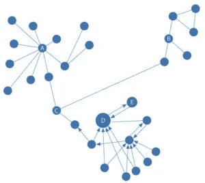
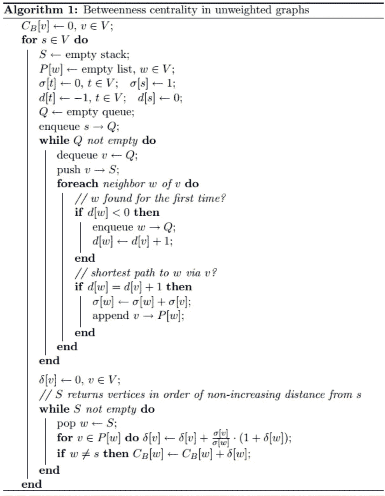
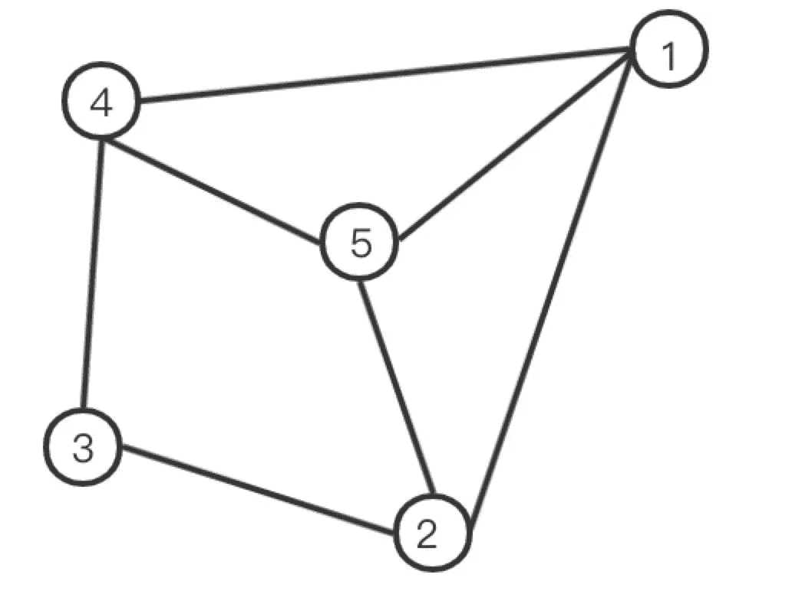

# 如何计算开源图数据库 NebulaGraph 的中间中心度

> 原文：<https://itnext.io/how-to-compute-the-betweenness-centrality-against-open-source-graph-database-nebulagraph-f922d196dce?source=collection_archive---------2----------------------->


中间中心性(简称 BC)反映了顶点在整个网络中的重要性。本文将介绍如何通过[星云图](https://nebula-graph.io)计算图形数据库的中间中心度。

# 相关概念

**中心性**表示一个顶点在整个网络图中的中心程度，包括度中心性、接近中心性、中间中心性等。度中心性通过计算顶点的传入和传出边的数量来反映顶点的受欢迎程度，而接近中心性计算图中顶点和所有其他顶点之间的最短路径的长度之和。因此，一个顶点越中心，它离所有其他顶点就越近。

**中间中心性**统计一个顶点在任意两个其他顶点之间的最短路径上出现的次数，以此来表示这个顶点对于网络连通性的**重要性。**

**顶点的介数中心性**是所有最短路径中通过该顶点的路径数占最短路径总数的比例。

**计算图中顶点的介数中心性可以在带权图或不带权图中进行。**对于未加权图，广度优先搜索(简称 BFS)用于寻找最短路径，而 Dijkstra 算法用于加权图。

下面的算法都是针对无向图的。

# 适用场景

中间中心性通过测量顶点如何桥接图或网络中的所有其他顶点来反映顶点在整个网络中的重要性。我们可以看到，下图中的顶点 C 充当了一个重要的桥接顶点。



**中间中心性**可以用来识别

a.**反欺诈场景中的中介实体**金融风险控制领域。

b.**特定疾病控制基因**在医学领域提高药物靶点。

# 中间中心性算法

顶点的介数中心性可以计算如下:

CB=∑s≠v≠t∈Vσst(v)σst

(公式 1)

在这个公式中，

σst(v)是从`Vertex s`到`Vertex t`的最短路径数。

σst 是通过`Vertex v`的最短路径数。

`Vertex s`和`Vertex t`是属于顶点集的一对顶点。

为方便起见，每对顶点的介数可以计算如下:

δst(v)=σst(v)σst

(公式 2)

因此，公式 1 可以用公式 2 代替，从而得到公式 3，如下所示:

CB(v)=∑s≠v≠t∈Vδst(v)

(公式 3)

# 求解过程

为了得到`Vertex v`的中间中心性，即得到$$\frac{，我们需要知道`Vertex v`是否位于从`Vertex s`到`Vertex t`的路径上。

(1)为了知道`Vertex v`是否在从`Vertex s`到`Vertex t`的最短路径上，使用下面的公式 dG 表示从`Vertex s`到`Vertex t`的最短路径:

如果`Vertex v`位于从`Vertex s`到`Vertex t`的最短路径上，则满足 G(s，t)=dG(s，v)+dG(v，t)。

(公式 4)

dG(s，v)和 dG(v，t)是相互独立的。根据组合规则，从`Vertex s`到`Vertex t`的最短路径总数是从`Vertex s`到`Vertex t`的最短路径数和从`Vertex s`到`Vertex t`的最短路径数的乘积。

基于以上两种情况，可以推导出公式 5:

σst(v)={σsv×σvtif d(s，v)+d(v，t)=d(s，t) 0if other

(公式 5)

(2)根据上面的公式，我们可以得出结论:从`Vertex s`到`Vertex t`经过`Vertex w`的最短路径数是σst(w)=σsw×σwt 的结果。

在图中，`Vertex v`是`Vertex w`的前一个顶点。因此，计算从`Vertex s`到`Vertex t`经过`Vertex v`到`Vertex w`的最短路径数的公式为:

σst(v，v，w)=σsv×σwt

(公式 6)

这里有两种情况，t=wandt≠w。

a.如果 t=w，那么σwt 将不存在，我们可以得到

δ(v，v，w)=σsvσsw

(公式 7)

b.如果≠w，那么我们可以得到

δ(v，v，w)=σsw(v)σsw×σst(w)σst

(公式 8)

(3)所以，考虑到以上两种情况，我们可以得到

δs(v)=∑w:v∈Ps(w)(σSW(v)σSW+∑t≠w∈vσSW(v)σSW×σST(w)σST)=∑w:v∈Ps(w)σSW(v)σSW(1+∑t≠w∈vσST(w)σST)=∑w:v∈Ps(w)σ

(公式 9)

Inw:v∈Ps(w)，`Vertex v`是`Vertex s`到`Vertex w`路径中`Vertex w`的前身。

(4)根据上面得到δsv 的公式，未加权图的介数中心性的算法流程可以给出如下:



对于未加权的图形，遵循上述过程。

计算加权图中的介数中心性需要 Dijkstra 算法，即在第一个 while 循环中改变代码。

针对星云图的介数中心性实现了加权图和非加权图的算法。代码见[https://github . com/vesoft-Inc/nebula-algorithm/blob/master/nebula-algorithm/src/main/Scala/com/vesoft/nebula/algorithm/lib/betwenescentralyalgo . Scala](https://github.com/vesoft-inc/nebula-algorithm/blob/master/nebula-algorithm/src/main/scala/com/vesoft/nebula/algorithm/lib/BetweennessCentralityAlgo.scala)。

# 计算示例

首先读取星云图中的图形数据，指定数据读取的边缘数据。

其次，根据星云图的边数据制作拓扑图，并进行中心性计算。

在星云图中读取的图形数据可以在下面的未加权图形中进行说明:



**计算顶点 1 的 BC:**

路径最短的顶点对经过顶点 1。

顶点对之间最短路径的总数。

通过顶点 12–43(2–3–4，2–5–4，2–1–4)1 的最短路径数

顶点 1 的 BC:1/3

**计算顶点 2 的 BC:**

通过顶点 2 的最短路径的顶点对

顶点对之间最短路径的总数

通过顶点 21–32(1–2–3，1–4–3)13–52(3–2–5，3–4–5)1 的最短路径数

**计算顶点 3 的 BC:**:

通过顶点 3 的最短路径的顶点对

顶点对之间最短路径的总数

通过顶点 32–43(2–3–4，2–5–4，2–1–4)1 的最短路径数

顶点 3 的 BC:1/3

**计算顶点 4 的 BC:**:

通过顶点 4 的最短路径的顶点对

顶点对之间最短路径的总数

通过顶点 41–32(1–4–3，1–2–3)13–52(3–4–5，3–2–5)1 的最短路径数

**计算顶点 5 的 BC:**:

通过顶点 5 的最短路径的顶点对

顶点对之间最短路径的总数

通过顶点 52–43(2–3–4，2–5–4，2–1–4)1 的最短路径数

顶点 5 的 BC:1/3

所以每个顶点的 BC 是:顶点 1: 1/3 顶点 2: 1 顶点 3: 1/3 顶点 4: 1 顶点 5: 1/3

# 结果示例

数据:读取星云图测试中的边数据，取 srcId、dstId、rank 作为拓扑图中边的三元组(源顶点、目的顶点、Rank)。

```
(root@nebula) [test]> match (v:node) -[e:relation] -> ()  return e
+------------------------------------+
| e                                  |
+------------------------------------+
| [:relation "3"->"4" @1 {col: "f"}] |
+------------------------------------+
| [:relation "2"->"3" @2 {col: "d"}] |
+------------------------------------+
| [:relation "2"->"5" @4 {col: "e"}] |
+------------------------------------+
| [:relation "4"->"5" @2 {col: "g"}] |
+------------------------------------+
| [:relation "1"->"5" @1 {col: "a"}] |
+------------------------------------+
| [:relation "1"->"2" @3 {col: "b"}] |
+------------------------------------+
| [:relation "1"->"4" @5 {col: "c"}] |
+------------------------------------+
```

读取星云图中的边数据，将该图设置为未加权，计算每个顶点的介数中心性。结果如下:

```
vid: 4 BC: 1.0
vid: 1 BC: 0.3333333333333333
vid: 3 BC: 0.3333333333333333
vid: 5 BC: 0.3333333333333333
vid: 2 BC: 1.0
```

读取 [NebulaGraph](https://nebula-graph.io) 的边数据，将图设为加权，计算每个顶点的介数中心性。结果如下:

```
vid: 4 BC: 2.0
vid: 1 BC: 0.5
vid: 3 BC: 1.0
vid: 5 BC: 2.0
vid: 2 BC: 0.0
```

# 参考

*   论文:一种快速的中间中心性算法
*   Python 的 NetworkX 实现中间中心性的源代码:[https://github . com/NetworkX/NetworkX/blob/master/NetworkX/algorithms/Centrality](https://github.com/networkx/networkx/blob/master/networkx/algorithms/centrality)