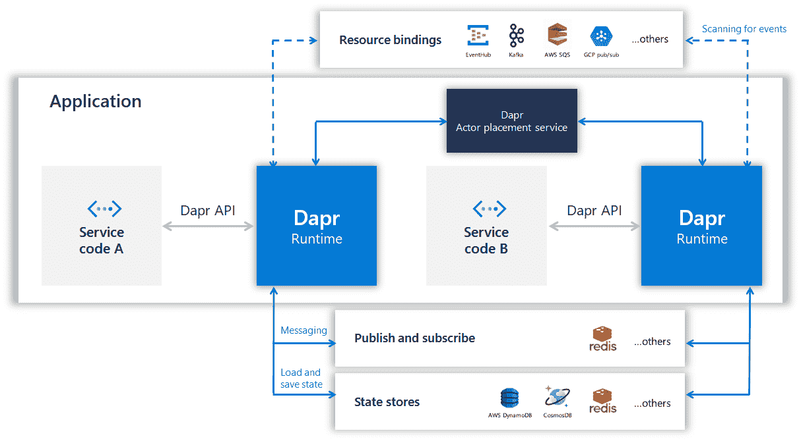

# 如何用 Dapr 框架连接 Azure 事件中心和 Blob 存储

> 原文：<https://itnext.io/how-to-connect-azure-event-hubs-and-blob-storage-with-the-dapr-framework-3c3ce9374100?source=collection_archive---------0----------------------->

[之前的博客](/tutorial-using-azure-event-hubs-with-the-dapr-framework-81c749b66dcf)展示了一个如何使用 [**Azure Event Hubs**](https://azure.microsoft.com/services/event-hubs/?WT.mc_id=medium-blog-abhishgu) 与 [**Dapr**](https://dapr.io/) 集成的例子。Azure Event Hubs 被用作`Dapr`运行时内的“绑定”,以允许应用程序与 Azure Event Hubs 通信，而无需实际了解它或直接与之耦合(通过 SDK、库等)。)，使用由`Dapr`运行时定义的简单模型。

这篇博文将展示如何将多个`Dapr`绑定缝合在一起。尽管这适用于任何受支持的绑定，但该示例将组合 [Azure 事件中心](https://azure.microsoft.com/services/event-hubs/?WT.mc_id=medium-blog-abhishgu)和 [Azure Blob 存储](https://azure.microsoft.com/services/storage/blobs/?WT.mc_id=medium-blog-abhishgu)，它们将分别用作输入和输出绑定。由于基于绑定的集成，所有这些都以简化的方式完成，无需在应用程序代码中直接引用事件中心或 Blob 存储。

我们将涵盖:

*   `Dapr`和相关 Azure 服务的设置
*   运行我们的应用程序并观察它的运行，将数据从 Azure 事件中心发送到 Azure 博客存储
*   它如何在幕后工作的演练

> ***Azure Event Hubs****是一个完全托管的平台即服务(PaaS)，用于流式传输和事件摄取，而* ***Azure Blob 存储*** *是一个面向云的对象存储解决方案，针对存储大量非结构化数据进行了优化。*

# 你好 Dapr！

**Dapr** 代表*分布式应用运行时*。它是一个开源、可移植的运行时，通过将构建这类应用程序的最佳实践编入独立的组件，来帮助开发人员构建有弹性的、微服务无状态和有状态的应用程序。

如果你是 Dapr 的新手，我建议你从[概述](https://github.com/dapr/docs/blob/master/overview.md)和[概念](https://github.com/dapr/docs/tree/master/concepts)开始。尝试使用[入门指南](https://github.com/dapr/docs/tree/master/getting-started)，然后继续使用[样品](https://github.com/dapr/samples/blob/master/README.md)和[操作指南](https://github.com/dapr/docs/tree/master/howto)。随着进一步深入，您可以深入了解 [Dapr 运行时 API 参考](https://github.com/dapr/docs/tree/master/reference/api)和[单个组件](https://github.com/dapr/components-contrib)

# Dapr 绑定



在撰写本文时，`Dapr`处于 alpha 状态，支持以下分布式系统构建模块，您可以将这些模块插入到您的应用程序中——服务调用、状态管理、发布/订阅消息、资源绑定、分布式跟踪和 Actor 模式。绑定提供了一种通用的方法，通过来自外部系统的事件来触发应用程序，或者通过可选的数据负载来调用外部系统。这些“外部系统”可以是任何东西:队列、消息传递管道、云服务、文件系统等等。

> [*目前支持的绑定*](https://github.com/dapr/components-contrib/blob/master/bindings/Readme.md) *包括 Kafka、Rabbit MQ、Azure Event Hubs 等。*

简而言之，`Dapr`绑定允许您专注于业务逻辑，而不是与诸如数据库、发布/订阅系统、blob 存储等个别服务集成。

让我们开始吧…

# 设置:Dapr、Azure 事件中心和 Blob 存储

本节将指导您完成 Dapr、Azure Event Hubs 和 Blob 存储的设置过程。

首先，你需要一个微软 Azure 账户。如果你还没有，请去注册一个免费的！

# 设置 Dapr

对于`Dapr`，您需要:

*   [码头工人](https://docs.docker.com/install/)
*   [Go 1.12 以上](https://golang.org/)

为了简单起见，我们将把`Dapr`作为一个独立的组件在本地运行。

> *如果你渴望在 Kubernetes 上运行* `*Dapr*` *，请查看* [*本入门指南*](https://github.com/dapr/docs/blob/master/getting-started/environment-setup.md#installing-dapr-on-a-kubernetes-cluster) *！*

首先安装 [Dapr CLI](https://github.com/dapr/cli) ，它允许您在本地开发机器或 Kubernetes 集群上设置 Dapr，提供调试支持，启动和管理 Dapr 实例。

例如，在你的 Mac 上，你可以简单地用它来安装`Dapr`到`/usr/local/bin`

```
curl -fsSL https://raw.githubusercontent.com/dapr/cli/master/install/install.sh | /bin/bash
```

> *详见* [*文档*](https://github.com/dapr/docs/blob/master/getting-started/environment-setup.md#installing-dapr-cli)

您可以使用 CLI 在独立模式下安装 Dapr。你所需要的只是一个简单的命令

```
dapr init
```

..就是这样！

# 设置 Azure 事件中心

您可以使用以下快速入门工具之一快速设置 Azure 事件中心:

*   使用 Azure portal — [这里是一个分步指南](https://docs.microsoft.com/azure/event-hubs/event-hubs-create?WT.mc_id=medium-blog-abhishgu)
*   使用 Azure CLI 或 Azure Cloud shell(在您的浏览器中！)— [这里有一个逐步的指南](https://docs.microsoft.com/azure/event-hubs/event-hubs-quickstart-cli?WT.mc_id=medium-blog-abhishgu)

现在，您应该有一个带有名称空间[和相关事件中枢(主题)的事件中枢实例。最后一步，您需要获取连接字符串，以便](https://docs.microsoft.com/azure/event-hubs/event-hubs-features?WT.mc_id=medium-blog-abhishgu#namespace)[向事件中心](https://docs.microsoft.com/azure/event-hubs/authenticate-shared-access-signature?WT.mc_id=medium-blog-abhishgu) — [验证。使用本指南](https://docs.microsoft.com/azure/event-hubs/event-hubs-get-connection-string?WT.mc_id=medium-blog-abhishgu)完成此步骤。

# 设置 Azure Blob 存储

如果你想使用 Azure 门户网站:

*   [创建存储帐户](https://docs.microsoft.com/azure/storage/common/storage-quickstart-create-account?tabs=azure-portal&WT.mc_id=medium-blog-abhishgu)，以及
*   [创建一个容器](https://docs.microsoft.com/azure/storage/blobs/storage-quickstart-blobs-portal?WT.mc_id=medium-blog-abhishgu#create-a-container)

如果你想使用 Azure CLI 或 Azure Cloud shell，[使用这个分步指南](https://docs.microsoft.com/azure/storage/blobs/storage-quickstart-blobs-cli?WT.mc_id=medium-blog-abhishgu)

现在您已经设置好了所有的东西，让我们继续尝试这个应用程序

# 使用 Dapr 运行应用程序

从克隆 repo 开始，并切换到正确的目录

```
git clone [https://github.com/abhirockzz/dapr-eventhubs-blobstore](https://github.com/abhirockzz/dapr-eventhubs-blobstore)
```

更新`components/eventhubs_binding.yaml`以在`spec.metadata.value`部分包含 Azure Event Hubs 连接字符串。

> *请注意，您必须在连接字符串末尾添加事件中心的名称，即* `*;EntityPath=<EVENT_HUBS_NAME>*` *。*

`connectionString`属性的值应该是这样的:

```
Endpoint=sb://<EVENT_HUBS_NAMESPACE>.servicebus.windows.net/;SharedAccessKeyName=RootManageSharedAccessKey;SharedAccessKey=<EVENT_HUBS_KEY>;EntityPath=<EVENT_HUBS_NAME>
```

更新`components/blobstorage.yaml`以包括 Azure Blob 存储细节- `storageAccount`、`storageAccessKey`和`container`

启动 Go 应用程序

```
export APP_PORT=8080
dapr run --app-port $APP_PORT go run app.go
```

您应该会看到日志:

```
== DAPR == time="2019-11-14T15:33:14+05:30" level=info msg="STARTING Dapr Runtime -- version edge -- commit ff7815d-dirty"
	== DAPR == time="2019-11-14T15:33:14+05:30" level=info msg="log level set to: info"
	== DAPR == time="2019-11-14T15:33:14+05:30" level=info msg="standalone mode configured"
	== DAPR == time="2019-11-14T15:33:14+05:30" level=info msg="dapr id: Seekergrass-Shaker"
	== DAPR == time="2019-11-14T15:33:14+05:30" level=info msg="loaded component messagebus (pubsub.redis)"
	== DAPR == time="2019-11-14T15:33:14+05:30" level=info msg="loaded component statestore (state.redis)"
	== DAPR == time="2019-11-14T15:33:14+05:30" level=info msg="loaded component eventhubs-input (bindings.azure.eventhubs)"
	== DAPR == time="2019-11-14T15:33:14+05:30" level=info msg="loaded component storage (bindings.azure.blobstorage)"
	......
```

# 运行 Azure 事件中心生成器应用程序

这个应用使用 Azure Event Hubs native Go client 来发送消息。

设置所需的环境变量:

```
export EVENT_HUBS_NAMESPACE="<EVENT_HUBS_NAMESPACE>"
export EVENT_HUBS_KEY="<EVENT_HUBS_KEY>"
export EVENT_HUB_NAME="<EVENT_HUB_NAME>"
```

> *请确保事件中心的名称与您在输入绑定配置中为连接字符串配置的名称相同*

运行生成器应用程序

```
export GO111MODULE=on
go run eventhubs-producer/producer.go
```

它将向事件中心发送五条消息并退出。您应该会看到如下日志:

```
Sent message {"time":"Thu Nov 14 15:35:13 2019"}
Sent message {"time":"Thu Nov 14 15:35:18 2019"}
Sent message {"time":"Thu Nov 14 15:35:20 2019"}
Sent message {"time":"Thu Nov 14 15:35:23 2019"}
Sent message {"time":"Thu Nov 14 15:35:25 2019"}
```

# 确认

检查 Dapr 应用程序日志，您应该看到从事件中心收到的消息。

```
== APP == time from Event Hubs 'Thu Nov 14 15:35:13 2019'
== APP == time from Event Hubs 'Thu Nov 14 15:35:18 2019'
== APP == time from Event Hubs 'Thu Nov 14 15:35:20 2019'
== APP == time from Event Hubs 'Thu Nov 14 15:35:23 2019'
== APP == time from Event Hubs 'Thu Nov 14 15:35:25 2019'
```

检查 Azure Blob 存储。首先，Azure CLI 需要您的存储帐户凭据。使用`az storage account keys list`命令获取您的存储帐户密钥

```
export AZURE_SUBSCRIPTION_ID=<to be filled>
export AZURE_STORAGE_ACCOUNT=<to be filled>
export AZURE_STORAGE_ACCOUNT_RESOURCE_GROUP=<to be filled>az storage account keys list --account-name $AZURE_STORAGE_ACCOUNT --resource-group $AZURE_STORAGE_ACCOUNT_RESOURCE_GROUP --subscription $AZURE_SUBSCRIPTION_ID --output table
```

使用这两个键中的任何一个，并以环境变量的形式导出它

```
export AZURE_STORAGE_KEY=<to be filled>
```

列出容器中的 Blob(使用您在上一节设置 Azure Blob 存储时创建的容器的名称)

```
export CONTAINER_NAME=<to be filled>
az storage blob list --container-name $CONTAINER_NAME --subscription $AZURE_SUBSCRIPTION_ID --output table
```

你应该在容器里放五滴。这是因为五条消息被推送到事件中心，然后由 Dapr 保存到 Azure Blob 存储。您也可以通过下载 blob 来确认它们的内容

```
export BLOB_NAME=<to be filled>az storage blob download --container-name $CONTAINER_NAME --subscription $AZURE_SUBSCRIPTION_ID --name $BLOB_NAME --file $BLOB_NAME
```

这会将内容下载到当前目录下的一个文件(与 blob 同名)中。要窥视里面，很简单

```
cat $BLOB_NAME
```

您应该会看到消息被发送到 Azure 事件中心

```
{"time":"Thu Nov 14 15:35:20 2019"}
```

> *对其他斑点重复同样的操作*

# 在幕后

下面是其工作原理的总结:

## 输入绑定

配置文件`eventhub_binding.yaml`捕获 Azure 事件中心的连接字符串。

```
apiVersion: dapr.io/v1alpha1
kind: Component
metadata:
  name: eventhubs-input
spec:
  type: bindings.azure.eventhubs
  metadata:
  - name: connectionString
    value: Endpoint=sb://<EVENT_HUBS_NAMESPACE>.servicebus.windows.net/;SharedAccessKeyName=RootManageSharedAccessKey;SharedAccessKey=<KEY>;EntityPath=<EVENT_HUBS_NAME>
```

关键属性包括:

*   `metadata.name` -输入绑定组件的名称
*   `spec.metadata.name` -事件集线器连接字符串

> *请注意，连接字符串包含代理 URL (* `*<EVENT_HUBS_NAMESPACE>.servicebus.windows.net*` *)、主键(用于身份验证)的信息，还包含主题或事件中心的名称，您的应用程序将绑定到该主题或事件中心并从其接收事件。*

## 输出绑定

`blobstorage.yaml`配置文件捕获 Azure Blob 存储的连接字符串

```
apiVersion: dapr.io/v1alpha1
kind: Component
metadata:
  name: storage
spec:
  type: bindings.azure.blobstorage
  metadata:
  - name: storageAccount
    value: [BLOB_STORAGE_ACCOUNT]
  - name: storageAccessKey
    value: [BLOB_STORAGE_ACCESS_KEY]
  - name: container
    value: [BLOB_STORAGE_CONTAINER_NAME]
```

## 使用应用程序中的绑定

[Go 应用](https://github.com/abhirockzz/dapr-eventhubs-blobstore/blob/master/app.go)在`/eventhubs-input`公开了一个 REST 端点——这与输入绑定组件的名称相同(不是巧合！)

Dapr 运行时负责从事件中心进行消费，并确保它在带有事件有效负载的`/eventhubs-input`端点使用`POST`请求调用 Go 应用程序。

应用程序通过返回一个 JSON 输出进行响应，该输出包含从 Event Hub 接收到的有效负载和输出绑定的名称(在本例中为`storage`)。它由下面的`struct`表示

```
type Response struct {
	To   []string    `json:"to"`
	Data interface{} `json:"data"`
}
```

这就是奇迹发生的地方！Dapr 收集这个响应，并将有效负载发送到输出绑定，在本例中是 Azure Blob 存储。

# 摘要

在这篇博文中，您看到了如何将不同的服务作为 Dapr 绑定来缝合(或组合)在一起。您的应用程序所做的就是使用 Dapr HTTP API 与 Dapr 运行时(只是一个 sidecar)进行交互！

> *也可以使用 gRPC 或特定语言的 SDK*

在撰写本文时，`Dapr`处于 alpha 状态(`v0.1.0`)，并乐于接受社区贡献😃游览 https://github.com/dapr/dapr尽情潜水吧！

如果你觉得这篇文章有帮助，请喜欢并关注🙌很高兴通过 [Twitter](https://twitter.com/abhi_tweeter) 获得反馈，或者发表评论。