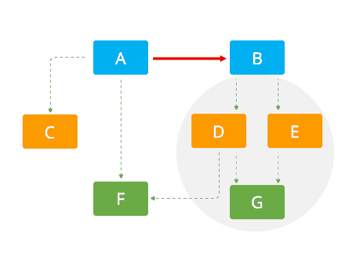
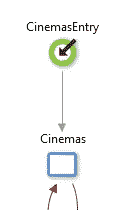
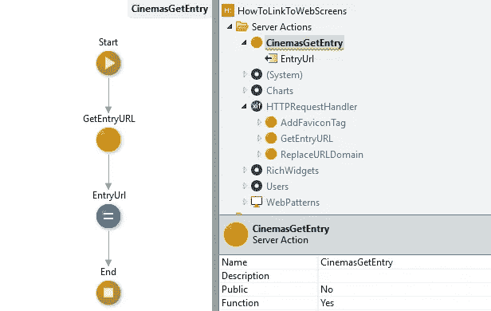
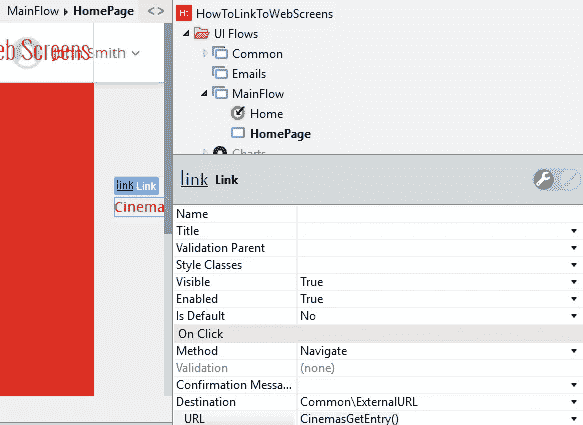
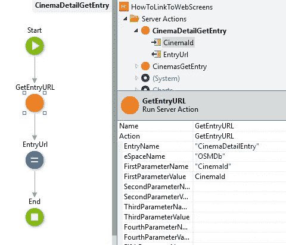
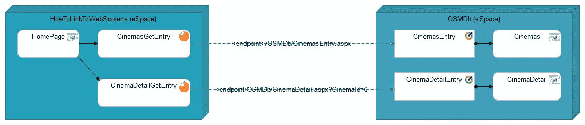

# 如何在不违反 4 层画布参考规则的情况下跨空间连接外部系统网页屏幕

> 原文：<https://itnext.io/how-to-connect-outsystems-web-screens-across-espaces-without-violating-the-no-side-reference-rule-b03f8aae16ac?source=collection_archive---------3----------------------->

根据 4 层画布参考网页屏幕的快速指南。

# 介绍

如果您想从另一个 eSpace 连接到一个屏幕，您可能不会公开该屏幕并创建对它的引用。这样做将违反**最终用户**或**编排**模块之间的无侧面引用规则，如下所述:[验证您的应用程序架构](https://success.outsystems.com/Support/Enterprise_Customers/Maintenance_and_Operations/Designing_the_architecture_of_your_OutSystems_applications/03_Validating_your_application_architecture)。这篇文章给你一步一步的指导如何根据架构规则进行引用。

下图说明了当 A 引用 B 时，A 不需要继承集群 D，E，G

侧面引用冲突

为了说明这些步骤，我们将从**HowToLinkToWebScreens**eSpace 创建一个到 **OSMDb Cinemas** 屏幕的链接。

## 步骤 1 为您想要引用的屏幕创建一个条目

打开 OSMDb 空间并打开 Mainflow。将一个入口节点拖到主流程中，将其命名为 **CinemasEntry** ，并将其连接到 Cinemas Web 屏幕。1-单击发布(F5)空间

## 步骤 2 创建一个 ServerAction 来检索条目 url

打开 HowToLinkToWebScreens 空间，然后打开“管理依赖项”窗口(Ctrl + Q)。添加 http request handler**getentryrl**依赖项。

创建一个新的服务器动作(Ctrl +N)并将其命名为 **CinemasGetEntryUrl** 。添加一个 text 类型的输出参数，并将其命名为 EntryUrl。将功能设置为是。

## 步骤 3:创建网页链接

从您想要创建链接的位置打开 web 屏幕。向屏幕添加一个**链接**小部件，并将目的地设置为 **ExternalUrl** 。将 Url 参数设置为 **CinemasGetEntryUrl()** 。

这种方法也可以应用于带参数的屏幕。假设我们的空间中有包含 CinemaId 的数据。

然后，我们可以很容易地链接到 CinemaDetailScreen，它甚至可以应用到一个弹出链接，是一个伟大的方法来创建一个菜单应用程序，而不需要参考网页屏幕模块。在这种情况下，我们必须向 action 和 GetEntryUrl 添加一个输入参数。

## 解决方案架构

通过应用上面的步骤，我们创建了一个架构，其中 web 屏幕被其他空间引用，而没有 UI 层中的侧引用:

# 结论

使用**getentryrl**可以帮助您避免创建对**最终用户**或**编排模块的引用。** **最终用户**或**编排**模块不应提供可重用的服务。这确保了它们被正确地隔离，允许它们具有不同的生命周期——由于不同的发起人或项目团队，不同的版本控制速度。

这种隔离至关重要，因为**最终用户**和**编排**位于层次结构的顶端。对这种模块的引用往往会带来来自较低层的大量间接依赖。

## 注意事项

更改**空间、****网页屏幕**的名称或其参数将导致 Url 损坏。这与您从外部网站链接到一个页面，而该页面被更改或删除的情况相同。

*   可以将 <screenentry>GetEntry()函数移动到核心服务层，以减少变更的影响。您必须小心，不要将所有的 GetEntry 函数放在一个 eSpace 中，从而创建一个**依赖蜘蛛**。最好在库模块中按功能区域对它们进行分组</screenentry>
*   您也可以将 URL 放在核心服务模块的静态实体中。这也将导致依赖蜘蛛，并且很可能由于提取每个条目的实体记录而导致性能降低。在大菜单中使用时尤其如此。