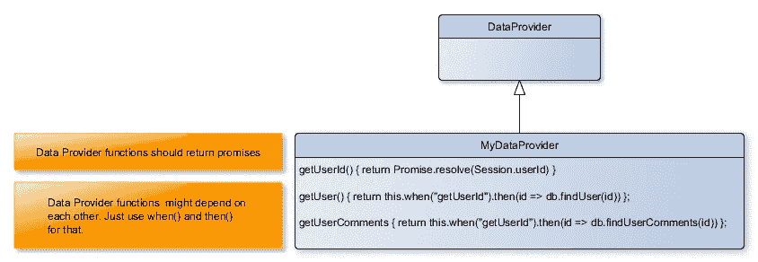

# 如何将 React 组件连接到任何后端？

> 原文：<https://itnext.io/how-to-connect-react-components-to-any-backend-1c1a1d530882?source=collection_archive---------1----------------------->



[*点击这里在 LinkedIn* 上分享这篇文章](https://www.linkedin.com/cws/share?url=https%3A%2F%2Fitnext.io%2Fhow-to-connect-react-components-to-any-backend-1c1a1d530882)

[React](https://reactjs.org/) 缺乏一个核心特性来轻松地将 UI 组件连接到一些后端，如数据库(在服务器端)或 REST 服务(在客户端或在服务器端)。当我们在 Hextrakt 开始开发 UI 组件时，我们考虑了不同的解决方案来解决这个问题。有一个不必要的 [Redux](https://redux.js.org/) ，旨在管理 UI 状态和响应用户动作。Redux 在客户端非常有用，但是对于服务器端的渲染帮助不大，因为服务器端的初始状态是不可变的。

在服务器端，我们希望能够:

1-呈现一个完整的 DOM 树，带有从数据库后端获取的标签和初始值(属性和内容);

2-向 DOM 中注入一个 javascript 变量，以便在客户端呈现时向 React 组件或 Redux store 提供初始状态。

所以我们决定构建一个简单(但完整)的框架，名为 [react-backend](https://github.com/Hextrakt/react-backend) ，这使得:

1-声明哪个应用程序路径需要哪些数据。例如，为了告知导航到/user 时需要“getUserInfo ”,我们使用了 React Route 和一个 NeedsData 组件:

```
<Route path='/user' render={() => (
  <NeedsData needs="getUserInfo"/>
  )}/>
</Route>
```

2-向表示组件提供所有已解决的数据(或错误)。WithData 组件对此负责。

```
<WithData dataProvider={dataProvider}>
  <UserForm/>
</WithData>
```

用户表单 UI 组件可以这样编写

```
class _UserForm extends React.Component {
  render() {
    const {dataProvider} = this.props
    if (!dataProvider.hasErrors()) {
      const userInfo = dataProvider.getData("getUserInfo")
      // add here your rendering logic
    }
    else if (dataProvider.getError("getUserInfo")) {
      // show specific error
    }
  }
}
const UserForm = withDataProvider(_UserForm)
```

经过几个月的工作，看到它运行良好，我们决定分享它，并将其公之于众，以便社区可以提供反馈并帮助改进它。

https://github.com/Hextrakt/react-backend[的更多信息](https://github.com/Hextrakt/react-backend)