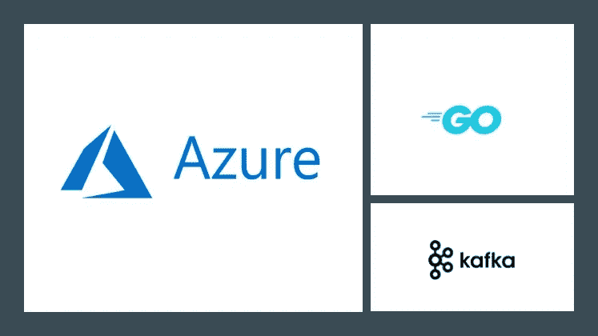

# 如何使用 Go 连接到 Kafka 的 Azure 事件中心

> 原文：<https://itnext.io/how-to-connect-to-azure-event-hubs-for-kafka-using-go-3957f8d98d6e?source=collection_archive---------3----------------------->

这个博客将展示如何使用 [Sarama Kafka 客户端](https://github.com/Shopify/sarama)库与[事件中心 Kafka](https://docs.microsoft.com/azure/event-hubs/event-hubs-for-kafka-ecosystem-overview?WT.mc_id=medium-blog-abhishgu) 集群进行交互。`[sarama](https://godoc.org/github.com/Shopify/sarama)` [包](https://godoc.org/github.com/Shopify/sarama)提供支持 Kafka v 0.8 及以上版本的纯 Go 客户端。



[Azure Event Hubs](https://docs.microsoft.com/azure/event-hubs/?WT.mc_id=medium-blog-abhishgu) 是一个流媒体平台和事件摄取服务，每秒能够接收和处理数百万个事件。它还提供了一个 Kafka 端点，您现有的基于 Kafka 的应用程序可以使用它作为运行您自己的 Kafka 集群的替代方法。由于 Azure Event Hubs 公开了一个与 Kafka 1.0 版二进制兼容的协议，所以您可以从现有的应用程序中开始使用 Kafka 端点，而无需更改代码，只需进行最小的配置更改。这也支持像 [Kafka Connect](https://kafka.apache.org/documentation/#connect) (目前在预览版中)、 [MirrorMaker](https://kafka.apache.org/documentation/#basic_ops_mirror_maker) 等框架。

您将了解到:

*   代码:如何配置和使用 Sarama Go 客户端与事件中心 Kafka endpoint 对话，并构建生产者、消费者应用程序
*   设置:使用 Azure CLI 快速引导 Kafka 实例的事件中心
*   测试:运行生产者和消费者应用程序，尝试端到端场景

> *一如既往，代码在* [*GitHub*](https://github.com/abhirockzz/eventhubs-kafka-go-sarama) 上可用

# 先决条件

如果你没有 Azure 订阅，只需创建一个[免费帐户](https://azure.microsoft.com/free/?WT.mc_id=medium-blog-abhishgu)就可以开始了！你还需要 T21 的 Azure 命令行界面。当然，你还需要安装 [Go 和](https://golang.org/doc/install)。

# 代码走查

该应用程序非常简单，由使用 Sarama Go 客户端构建的生产者和消费者组成。让我们快速浏览一下代码


## 用于连接到 Kafka 事件中心的配置

为了创建生产者或消费者实例，您需要传递一个`sarama.Config`对象。

```
func getConfig() *sarama.Config {
    config := sarama.NewConfig()
    config.Net.DialTimeout = 10 * time.Second
    config.Net.SASL.Enable = true
    config.Net.SASL.User = "$ConnectionString"
    config.Net.SASL.Password = getEnv(eventHubsConnStringEnvVar)
    config.Net.SASL.Mechanism = "PLAIN" config.Net.TLS.Enable = true
    config.Net.TLS.Config = &tls.Config{
        InsecureSkipVerify: true,
        ClientAuth:         0,
    }
    config.Version = sarama.V1_0_0_0 return config
}
```

身份验证是这里的关键——Azure Event Hubs(包括 Kafka 特性)要求所有通信都使用 SSL 或 TLS，并使用共享访问签名(SAS)进行身份验证。

> *关于安全模型*的详细信息，请参见 [*文档*](https://docs.microsoft.com/en-us/azure/event-hubs/event-hubs-authentication-and-security-model-overview?WT.mc_id=medium-blog-abhishgu)

*   *SASL 通过`config.Net.SASL.Enable = true`启用，并使用`PLAIN`机制(配置。Net.SASL.Mechanism)*
*   *使用`config.Net.SASL.User`定义 SASL 用户，并设置为`$ConnectionString`(是的，这是静态的)*
*   *SASL 密码(`config.Net.SASL.Password`)被设置为事件集线器连接字符串(详情见下一节)*
*   *最后，TLS 被启用(`config.Net.TLS.Enable`)并且`config.Net.TLS.Config`被设置为 [TLS 配置](https://godoc.org/crypto/tls#Config)的实例*

> **除了* `*config.Producer.Return.Successes = true*` *是生产者*的同步版本所必需的之外，生产者和消费者(对于本例)的配置是相同的*

*需要注意的事项:*

*   *如果没有正确配置 TLS，您可能会看到这个错误— `Failed to start Sarama producer: kafka: client has run out of available brokers to talk to (Is your cluster reachable?)`*
*   *在撰写本文时， [Event Hubs 不支持消息压缩](https://docs.microsoft.com/azure/event-hubs/event-hubs-for-kafka-ecosystem-overview?WT.mc_id=medium-blog-abhishgu#features-that-are-not-yet-supported)，因此请确保使用默认值`config.Producer.Compression`(即`none`)或使用`config.Producer.Compression = sarama.CompressionNone`显式设置它。否则，您可能会看到此错误`Failed to send msg: kafka server: The requested operation is not supported by the message format version.`*
*   *确保将 Kafka broker 版本设置为`config.Version = sarama.V1_0_0_0`或更高版本*

## *活动中心卡夫卡制作人*

*创建一个生产者实例，传入事件中心代理和所需的配置(`sarama.Config`)*

```
*producer, err := sarama.NewSyncProducer(brokerList, getConfig())
if err != nil {
	fmt.Println("Failed to start Sarama producer:", err)
	os.Exit(1)
}*
```

*启动用于生成消息的 goroutine。这发生在一个无限 for 循环中，可以使用`ctrl+c`停止*

```
*go func() {
	for {
		if producerOpen {
			ts := time.Now().String()
			msg := &sarama.ProducerMessage{Topic: eventHubsTopic, Key: sarama.StringEncoder("key-" + ts), Value: sarama.StringEncoder("value-" + ts)}
			p, o, err := producer.SendMessage(msg)
			if err != nil {
				fmt.Println("Failed to send msg:", err)
				continue
			}
		}
		...
	}
}()*
```

*为了干净地退出，监听中断信号(`ctrl+c`)并关闭发生器*

```
*close := make(chan os.Signal)
signal.Notify(close, syscall.SIGTERM, syscall.SIGINT)
<-close
err = producer.Close()*
```

## *活动中心 Kafka 消费者*

*创建一个传入事件中心代理的消费者组实例*

```
*consumer, err := sarama.NewConsumerGroup(brokerList, consumerGroupID, getConfig())*
```

*开始在单独的 goroutine 消费*

```
*go func() {
	for {
		err = consumer.Consume(ctx, []string{getEnv(eventHubsTopicEnvVar)}, messageHandler{})
		....
		if ctx.Err() != nil {
			return
		}
	}
}()*
```

*`messageHandler`实现`[sarama.ConsumerGroupHandler](https://godoc.org/github.com/Shopify/sarama#ConsumerGroupHandler)`(功能- `Setup`、`Cleanup`、`ConsumeClaim`)。`ConsumeClaim`功能是重要的一项。您可以在这里指定如何处理每条消息——在本例中，它被记录到标准输出，并被标记为已使用*

```
*func (h messageHandler) ConsumeClaim(s sarama.ConsumerGroupSession, c sarama.ConsumerGroupClaim) error {
    for msg := range c.Messages() {
        fmt.Printf("Message topic:%q partition:%d offset:%d\n", msg.Topic, msg.Partition, msg.Offset)
        fmt.Println("Message content", string(msg.Value))
        s.MarkMessage(msg, "")
    }
    return nil
}*
```

*可通过退出程序(按下`ctrl+c`)停止用户。对于干净退出，使用者实例被关闭*

```
*close := make(chan os.Signal)
signal.Notify(close, syscall.SIGTERM, syscall.SIGINT)
<-close
cancel()
if err := consumer.Close(); err != nil {
    ......
}*
```

*好了，让我们创建一个事件中心集群，并尝试端到端场景。*

# *创建您的 Kafka 活动中心集群*

*如果您已经有一个集群，请跳过这一步，转到*“事件中心连接详细信息”*小节*

*设置环境变量:*

```
*export AZURE_SUBSCRIPTION=[to be filled]
export AZURE_RESOURCE_GROUP=[to be filled]
export AZURE_LOCATION=[to be filled]
export EVENT_HUBS_NAMESPACE=[name of the event hub namespace - to be filled]
export EVENT_HUB_NAME=[name of the event hub (topic) - to be filled]*
```

*如果还没有资源组，请创建一个*

```
*az account set --subscription $AZURE_SUBSCRIPTION
az group create --name $AZURE_RESOURCE_GROUP --location $AZURE_LOCATION*
```

*创建一个事件中心名称空间(类似于 Kafka 集群)*

> **关于事件中枢命名空间的详细信息，请参见* [*事件中枢文档*](https://docs.microsoft.com/azure/event-hubs/event-hubs-features?WT.mc_id=medium-blog-abhishgu)*

```
*az eventhubs namespace create --name $EVENT_HUBS_NAMESPACE --resource-group $AZURE_RESOURCE_GROUP --location $AZURE_LOCATION --enable-kafka true --enable-auto-inflate false*
```

> **文档为* `[*az eventhubs namespace create*](https://docs.microsoft.com/cli/azure/eventhubs/namespace?view=azure-cli-latest&WT.mc_id=medium-blog-abhishgu#az-eventhubs-namespace-create)`*

*然后创建一个事件中心(与 Kafka 主题相同)*

```
*az eventhubs eventhub create --name $EVENT_HUB_NAME --resource-group $AZURE_RESOURCE_GROUP --namespace-name $EVENT_HUBS_NAMESPACE --partition-count 10*
```

> **文档*文档`[*az eventhub create*](https://docs.microsoft.com/cli/azure/eventhubs/eventhub?view=azure-cli-latest&WT.mc_id=medium-blog-abhishgu#az-eventhubs-eventhub-create)`*

## *活动中心连接详情*

*获取集群的连接字符串和凭据*

> **有关详细信息，请阅读* [*事件中心如何使用共享访问签名进行授权*](https://docs.microsoft.com/azure/event-hubs/authorize-access-shared-access-signature?WT.mc_id=medium-blog-abhishgu)*

*首先获取事件中心规则/策略名称*

```
*az eventhubs namespace authorization-rule list --resource-group $AZURE_RESOURCE_GROUP --namespace-name $EVENT_HUBS_NAMESPACE*
```

> **文档为* `[*az eventhubs namespace authorization-rule list*](https://docs.microsoft.com/cli/azure/eventhubs/namespace/authorization-rule?view=azure-cli-latest&WT.mc_id=medium-blog-abhishgu#az-eventhubs-namespace-authorization-rule-list)`*

*您将得到类似下面的 JSON 输出:*

```
*[
    {
        "id": "/subscriptions/qwerty42-ae29-4924-b6a7-dda0ea91d347/resourceGroups/foobar-resource/providers/Microsoft.EventHub/namespaces/foobar-event-hub-ns/AuthorizationRules/RootManageSharedAccessKey",
        "location": "Southeast Asia",
 **"name": "RootManageSharedAccessKey",**        "resourceGroup": "foobar-resource",
        "rights": [
        "Listen",
        "Manage",
        "Send"
        ],
        "type": "Microsoft.EventHub/Namespaces/AuthorizationRules"
    }
]*
```

*授权规则名称是`name`属性的值(没有引号)，在本例中是`RootManageSharedAccessKey`*

```
*export EVENT_HUB_AUTH_RULE_NAME=RootManageSharedAccessKey*
```

*然后，利用规则名提取连接字符串*

```
*az eventhubs namespace authorization-rule keys list --resource-group $AZURE_RESOURCE_GROUP --namespace-name $EVENT_HUBS_NAMESPACE --name $EVENT_HUB_AUTH_RULE_NAME*
```

> **文档**

*您将得到如下 JSON 响应:*

```
*{
    "aliasPrimaryConnectionString": null,
    "aliasSecondaryConnectionString": null,
    "keyName": "RootManageSharedAccessKey",
 **"primaryConnectionString": "Endpoint=sb://foobar-eventhub-namespace.servicebus.windows.net/;SharedAccessKeyName=RootManageSharedAccessKey;SharedAccessKey=Nbaz0D42MT7qwerty6D/W51ao42r6EJuxR/zEqwerty=",**    "primaryKey": "qwertyEiQHIirSNDPzqcqvZEUs6VAW+JIK3L46tqwerty",
    "secondaryConnectionString": "Endpoint=sb://abhishgu-temp-event-hub-ns.servicebus.windows.net/;SharedAccessKeyName=RootManageSharedAccessKey;SharedAccessKey=qwertyPF2/YRGzxKmb06Z8NBFLCjnX38O7ch6aiYkN0=",
    "secondaryKey": "qwertyPF2/YRGzxKmb06Z8NBqwertyX38O7ch6aiYk42="
}*
```

*主连接字符串是`primaryConnectionString`属性的值(没有引号)，在本例中是`"Endpoint=sb://foobar-eventhub-namespace.servicebus.windows.net/;SharedAccessKeyName=RootManageSharedAccessKey;SharedAccessKey=Nbaz0D42MT7qwerty6D/W51ao42r6EJuxR/zEqwerty="`。记下连接字符串，因为您将在下一步中使用它。*

> *[*此信息较为敏感，请谨慎*](https://docs.microsoft.com/azure/event-hubs/authorize-access-shared-access-signature?&WT.mc_id=medium-blog-abhishgu#best-practices-when-using-sas)*

# *测试生产者和消费者*

*克隆 GitHub 存储库并导航到正确的目录:*

```
*git clone https://github.com/abhirockzz/eventhubs-kafka-go-sarama
cd eventhubs-kafka-go-sarama*
```

*获取 Sarama Kafka 客户端库*

```
*go get github.com/Shopify/sarama*
```

## *生产者*

*设置环境变量*

```
*export EVENTHUBS_CONNECTION_STRING=[value of primary connection string obtained in the previous step]
export EVENT_HUBS_NAMESPACE=[event hub namespace]
export EVENTHUBS_BROKER=$EVENT_HUBS_NAMESPACE.servicebus.windows.net:9093
export EVENTHUBS_TOPIC=[name of the event hub (topic)]*
```

> **对于* `*EVENTHUBS_CONNECTION_STRING*` *变量，请确保*在使用 Azure CLI 接收的值中包含*双引号，例如* `*export EVENTHUBS_CONNECTION_STRING="Endpoint=sb://foobar-eventhub-namespace.servicebus.windows.net/;SharedAccessKeyName=RootManageSharedAccessKey;SharedAccessKey=Nbaz0D42MT7qwerty6D/W51ao42r6EJuxR/zEqwerty="*`*

*启动生成器*

```
*go run producer/sarama-producer.go*
```

*一旦启动，您应该会看到日志*

```
*Event Hubs broker [foo-bar.servicebus.windows.net:9093]
Event Hubs topic testhub
Waiting for program to exit...
sent message to partition 0 offset 1
sent message to partition 7 offset 1
sent message to partition 6 offset 1
sent message to partition 8 offset 1
sent message to partition 2 offset 1*
```

> **要停止，只需按下终端*上的 `*ctrl+c*`*

## **消费者**

**在不同的终端中启动消费者进程。设置环境变量**

```
**export EVENTHUBS_CONNECTION_STRING=[value of primary connection string obtained in the previous step]
export EVENT_HUBS_NAMESPACE=[event hub namespace]
export EVENTHUBS_BROKER=$EVENT_HUBS_NAMESPACE.servicebus.windows.net:9093
export EVENTHUBS_TOPIC=[name of the event hub (topic) - to be filled]
export EVENTHUBS_CONSUMER_GROUPID=[name of consumer group e.g. testgroup]**
```

> ***对于* `*EVENTHUBS_CONNECTION_STRING*` *变量，请确保*在使用 Azure CLI 接收的值中包含*双引号，例如* `*export EVENTHUBS_CONNECTION_STRING="Endpoint=sb://foobar-eventhub-namespace.servicebus.windows.net/;SharedAccessKeyName=RootManageSharedAccessKey;SharedAccessKey=Nbaz0D42MT7qwerty6D/W51ao42r6EJuxR/zEqwerty="*`**

**启动消费者**

```
**go run consumer/sarama-consumer.go**
```

**在日志中，您将看到消费者组被创建，并且所有的分区(在这个例子中是 10 个)都被分配给它**

```
**Event Hubs broker [foo-bar.servicebus.windows.net:9093]
Sarama client consumer group ID testgroup
new consumer group created
Event Hubs topic testhub
Waiting for program to exit
Partition allocation - map[testhub:[0 1 2 3 4 5 6 7 8 9]]
Message topic:"testhub" partition:9 offset:45
Message content value-2019-10-08 16:12:23.704802 +0530 IST m=+1.003667284
Message topic:"testhub" partition:3 offset:32
Message content value-2019-10-08 17:05:42.388301 +0530 IST m=+0.912420074**
```

## **向外扩展…**

**在不同的终端中，启动消费者的另一个实例。这将触发分区的重新平衡，您将看到很少(本例中为 5 个)分区被分配给这个(新的)消费者实例**

```
**Event Hubs broker [foo-bar.servicebus.windows.net:9093]
Sarama client consumer group ID testgroup
new consumer group created
Event Hubs topic testhub
Waiting for program to exit
Partition allocation - map[testhub:[0 1 2 3 4]]**
```

**如果您返回到第一个消费者实例的终端，您会看到由于重新平衡，几乎没有分区被取走**

```
**Consumer group clean up initiated
Partition allocation - map[testhub:[5 6 7 8 9]]**
```

> ***要停止，只需按下终端*上的 `*ctrl+c*`**

***现在，两个消费者都将分担工作负载，并使用来自事件中心的消息。您通过启动更多的消费者实例来保持向外扩展，但是这只有在消费者实例的数量等于分区的数量时才有用。本质上，Events Hub 的分区数量是并行性和规模的单位。***

***这个博客到此为止。我希望得到您的反馈和建议！不要害羞，只需[发推文](https://twitter.com/abhi_tweeter)或发表评论。如果你觉得这篇文章有用，请点赞并关注😃😃***