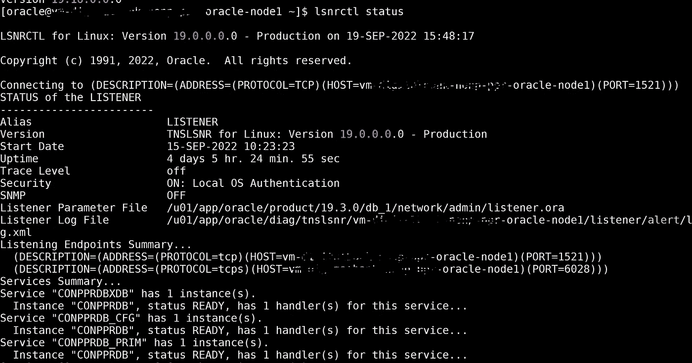
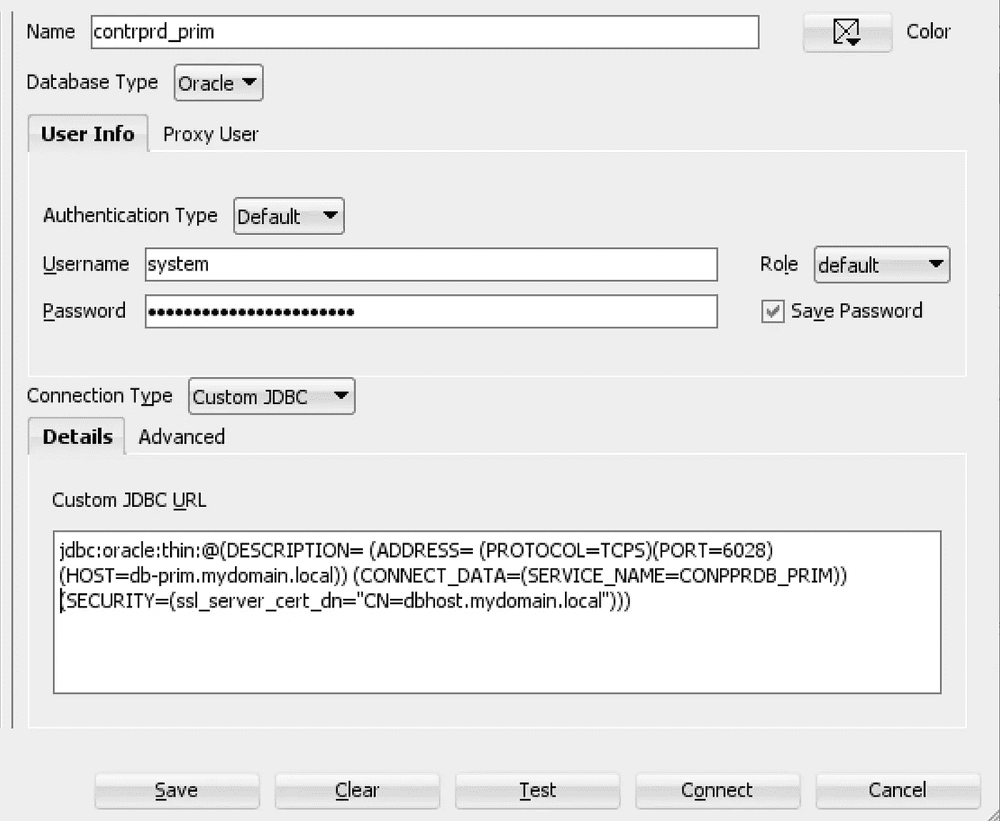
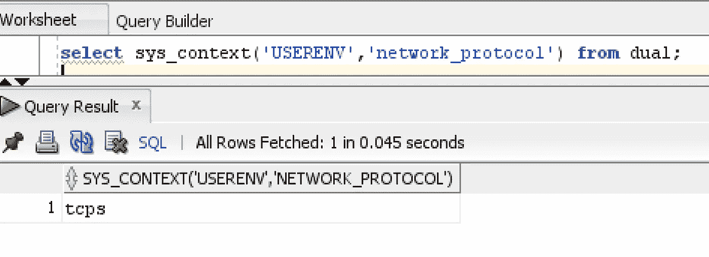

# 如何使用 SQL Developer 连接到支持 TLS 的 Oracle DB

> 原文：<https://itnext.io/how-to-connect-to-tls-enabled-oracle-db-using-sql-developer-500d3e748e86?source=collection_archive---------2----------------------->

# 目的

记录 Java 应用程序(如 SQL Developer)成功连接到 Oracle 数据库所需的步骤，Oracle 数据库只允许 TLS 连接来保护传输中的数据。

根据 [NIST 特别出版物(SP)800–52 修订版 2，传输层安全(TLS)实施的选择、配置和使用指南](https://csrc.nist.gov/publications/detail/sp/800-52/rev-2/final)，您需要在数据库端进行 TLS 加密(用于传输中的数据)。

# 所需的服务器端设置

*   Oracle 数据库启用了 TLS，查看[这篇博客](https://oracle-base.com/articles/misc/configure-tcpip-with-ssl-and-tls-for-database-connections)了解如何实现。
*   只有服务器向客户端验证自己的身份(这种设置)。
*   监听器监听两个端口 1521 (tcp)和端口 6028(TCP)。



*   [sqlnet.ora](https://docs.oracle.com/cd/E11882_01/network.112/e10835/sqlnet.htm#i479724) 具有允许 TLS 连接的适当配置。

sqlnet.ora

*   除 TLS 之外，您还可以使用[本地网络加密](https://docs.oracle.com/en/database/oracle/oracle-database/19/dbseg/configuring-network-data-encryption-and-integrity.html)。 *SQLNET。IGNORE _ ANO _ ENCRYPTION _ FOR _ TCPS = TRUE*就是为了这个目的。
*   在本例中，我使用了一个 DN 为 CN=dbhost.mydomain.local 的服务器证书，该证书被导入到 TNS wallet (ewallet.p12)中，并且该 wallet 启用了自动登录。
*   服务器证书是在 AWS 证书管理器(ACM)中创建的。ACM 有一个特性，允许任何组织快速[创建一个可用于生成证书的托管私有 CA](https://docs.aws.amazon.com/acm-pca/latest/userguide/create-CA.html) 。
*   您将获得 root.pem (CA 证书)、server.pem(服务器证书)和 server.key(加密的私钥)。
*   您可以使用 *openssl pkcs12* 创建一个[pkcs12 wallet(Oracle wallet)](https://docs.oracle.com/cd/E92519_02/pt856pbr3/eng/pt/tsvt/task_SettingUpOracleWalletUsingOpenSSL.html?pli=ul_d96e224_tsvt)用于服务器端。
*   你可以使用 *openssl* 或 *keytool* 来创建 [JKS](https://docs.oracle.com/cd/E19509-01/820-3503/ggfen/index.html) 信任库，它可以在任何基于 Java 的客户端应用上使用。

# SQL 开发人员方面的步骤

*   **由于 SQL Developer 是一个 Java 应用程序，您可以使用** [**JKS 进行 TLS 连接到数据库**](https://blogs.oracle.com/developers/post/ssl-connection-to-oracle-db-using-jdbc-tlsv12-jks-or-oracle-wallets-122-and-lower#JKS) **并且这些步骤可以被任何 Java 应用程序用于 TLS 连接到 Oracle 数据库。**
*   找到 sqldeveloper.conf 文件，并将下面几行添加到该文件中。

```
AddVMOption -Djavax.net.ssl.trustStore=<Path to your truststore.jks with CA certificate>
AddVMOption -Djavax.net.ssl.trustStoreType=JKS
AddVMOption -Djavax.net.ssl.trustStorePassword=<your keystore password>
```

*   重新启动 SQL Developer。
*   添加一个新的连接，并选择如下选项



*   自定义 JDBC URL

```
jdbc:oracle:thin:@(DESCRIPTION= (ADDRESS=
 (PROTOCOL=TCPS)(PORT=6028)(HOST=db-prim.mydomain.local))
 (CONNECT_DATA=(SERVICE_NAME=CONPPRDB_PRIM))
 (SECURITY=(ssl_server_cert_dn=”CN=dbhost.mydomain.local”)))
```

*   注意*主机*和 *ssl_server_cert_dn* 不需要匹配，但是 *ssl_server_cert_dn* 应该与服务器证书中的相同，因为您在 sqlnet.ora 中使用了*SSL _ SERVER _ DN _ MATCH = TRUE*

# 测试数据库连接

*   使用来自 SQL Developer 的连接连接到数据库
*   运行以下查询进行验证



**如果您有几个数据库拥有由不同根 ca 颁发的各自的服务器证书，您可以将其他根 ca 添加到同一个 JKS 信任库。**

# 参考

[](https://blogs.oracle.com/developers/post/ssl-connection-to-oracle-db-using-jdbc-tlsv12-jks-or-oracle-wallets-122-and-lower) [## 使用 JDBC、TLSv1.2、JKS 或 Oracle wallet(12.2 及更低版本)与 Oracle 数据库的 SSL 连接

### SSL 简介 Oracle 数据库产品在其标准版(从 12c 开始)中支持 SSL/TLS 连接…

blogs.oracle.com](https://blogs.oracle.com/developers/post/ssl-connection-to-oracle-db-using-jdbc-tlsv12-jks-or-oracle-wallets-122-and-lower) 

请查看我上一篇关于 [**使用 Azure Function App**](/automating-db-client-failover-using-azure-function-app-6ed375ab5666) **自动化 DB 客户端故障转移的博客。**

请阅读我的其他文章，并分享您的反馈。如果你喜欢分享的内容，请点赞、评论并订阅新文章。