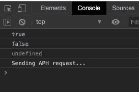

# 如何控制对 JavaScript 对象的访问

> 原文：<https://itnext.io/how-to-control-access-to-your-javascript-objects-1a75435c04e3?source=collection_archive---------6----------------------->

## 和其他让你的朋友惊讶的聚会技巧

本·怀特在 [Unsplash](https://unsplash.com?utm_source=medium&utm_medium=referral) 上的照片

## 介绍

JavaScript 对象只是属性的动态集合*。我们可以根据需要添加和删除属性。俗话说，权力越大，责任越大。这句话在这里并不适用，但我认为它让这段介绍更具戏剧性。😃*

随着随意添加和删除属性的能力，我们失去的东西之一是对授予每个属性的访问级别的控制。如果您来自另一种语言，这种语言允许您使用关键字 ***private*** 来限制对变量的访问，这可能看起来很奇怪，并且很容易引入意想不到的错误。

在这篇文章中，我们将看看如何让 JavaScript 表现得更像那些提供全面隐私的语言。

## 你为什么要在乎？

很棒的问题！坦率地说，也许你不知道，但是我猜如果你在 Medium 上阅读这篇关于 JavaScript 对象访问控制的文章，你会关心的。欺负你！

然而，如果你只是在喝了几杯啤酒后在网上闲逛，碰巧在搜索特朗普头发的最新照片时来到这里，这里有几个你可能会关心的原因:

1.  你是一个有责任心的程序员，你想确保当一个变量被设置为一个新值时，它是你所期望的值。你不希望 Elvis 对象被传递到你期望的布尔值。(尽管猫王的物品更酷)
2.  您希望记录与某个变量相关的所有交互，或者跟踪它被访问或更新的次数。

既然我们已经建立了一些想要做这类事情的真正原因，让我们来看看一些代码。

首先，让我们看看问题在行动。

这没什么隐私可言！

在这个代码片段中，我们使用 object literal 语法创建一个简单的对象，并保存到一个名为 trump 的变量中。

在对象内部，我们有一个名为 _taxReturns 的" *private"* 变量和两个方法，一个用于获取值，一个用于设置值。很简单。

接下来，我们把这个小东西拿出来旋转一下，我们马上就可以在控制台上看到问题。

特朗普的大问题！

在第 11 行，console.log(_taxReturns)向我们显示了我们希望成为私有变量的值。那真是太糟糕了！

那么，我们如何着手纠正这种情况呢？让我们来看几个选项。

## 使用构造函数

如果你读过我的另一篇名为[用 JavaScript](/4-ways-to-call-a-function-in-javascript-19b174678f5a) 调用函数的 4 种方法的文章，你就会知道我们有一个选择就是使用构造函数。

 [## 用 JavaScript 调用函数的 4 种方法

### JavaScript 中的函数可以用不同的方式调用。乍一看，这似乎是一个疯狂的声明。怎么能…

itnext.io](/4-ways-to-call-a-function-in-javascript-19b174678f5a) 

用 ***new*** 关键字调用构造函数会给我们一个新的实例，通过闭包的魔力，我们会有自己的私有变量。让我们看看那是什么样子。

一个潜在的解决方案

在控制台中查看输出显示，我们已经成功地限制了对 _taxReturns 变量的直接访问，因为它现在显示为未定义。

大获成功！

同样，这是通过使用闭合来实现的。如果你不确定这是什么意思，看看这篇文章。

 [## 在 JavaScript 中使用闭包来创建私有变量

### 如何利用 JavaScript 的一个核心特性

levelup.gitconnected.com](https://levelup.gitconnected.com/using-closures-in-javascript-to-create-private-variables-c0b358757fe0) 

现在，我们只允许通过我们漂亮的 get 和 set 函数访问 _taxReturns 变量，我们可以限制传递什么值，并在调用这些方法时记录我们想要的任何内容，如下所示:

检查数值并记录日志，天啊！

这段代码在控制台中生成以下内容。

看起来一切都在按计划进行！

看起来我们已经完成了来这里要做的事情。对我们的 _taxReturns 变量的访问是受限制的，我们像 mofo 一样验证数据和记录日志。

米勒时间到了！

当你伸手去办公室冰箱里拿冷饮时，你的经理/同事/妻子气喘吁吁地闯进了你的办公室。过了一会儿，他们说他们听说 JavaScript 有一个内置的方法来创建 getters 和 setters。更重要的是，您应该删除您的自定义 setReturns()和 getReturns()方法，并像真正的(男人/女人/在此输入性别)一样使用本机语言功能。

你表现得很冷静，回到你的键盘上，你的思维在飞速运转。会不会是？内置功能？这太疯狂了。

几分钟的谷歌搜索，你就有答案了。

## 对象.定义属性

我们要看的最后一个选项是 [Object.defineProperty](https://developer.mozilla.org/en-US/docs/Web/JavaScript/Reference/Global_Objects/Object/defineProperty) 。在前面的代码示例中，我们定义了自己获取和设置值的方法。虽然这种方法没有错，但重要的是要知道这种语言确实提供了这种特性，它让我们能够对对象的属性进行粒度控制。

首先，让我们使用 Object.defineProperty 重新定义我们的对象，并尝试一下。

你可以在上面看到，在我们的构造函数中，我们定义了私有变量，并在第 4 行使用 Object.defineProperty 创建了一个名为 taxReturns 的属性。记住，在构造函数的上下文中， ***这个*** 指向新创建的对象，我们在第 4 行把它传递到这里来定义属性。我们还传递另外两个参数。让我们也来看看这些。

Object.defineProperty 有 3 个参数。

1.  在其上定义属性的对象
2.  要定义或修改的属性的名称
3.  一个名为*属性描述符对象*的对象文字，为这个属性设置规则

使用 Object.defineProperty 输出

在属性描述符对象中，我们可以设置如下内容:

1.  价值
2.  属性是否可写
3.  在中使用 Object.keys 或 for…时，属性是否可枚举
4.  属性是否可配置

Object.defineProperties 不要求您传递其中的任何一个，如果您不传递，它将使用默认值。查看文档，了解选项的完整概要。

 [## Object.defineProperty()

### 静态方法 Object.defineProperty()直接在对象上定义新的属性，或者修改现有的…

developer.mozilla.org](https://developer.mozilla.org/en-US/docs/Web/JavaScript/Reference/Global_Objects/Object/defineProperty) 

## 结论

这就结束了我们控制 JavaScript 对象访问的旋风之旅。在考虑 JavaScript 中的属性访问时，请记住以下几点:

1.  JavaScript 对象只是一个可以随时修改的动态属性集合。
2.  闭包是你的朋友，它将帮助你使用 JavaScript 实现很多事情——其中之一就是对象的私有属性。花时间好好学习和理解闭包。
3.  您可以创建自己的方法，作为对象的 getters 和 setters。
4.  您可以利用内置语言特性 Object.defineProperty 向对象添加属性。它还使您能够微调对象的每个属性。

一如既往的感谢阅读！请查看我的其他帖子，并在 [T *witter 上查看我！*](https://twitter.com/aritzcovan)

 [## 亚历克斯·里茨科万-中等

### 阅读 Alex Ritzcovan 在媒体上的文章。前 CTO、IT 总监、软件开发人员、健身爱好者和…

medium.com](https://medium.com/@aritzcovan)