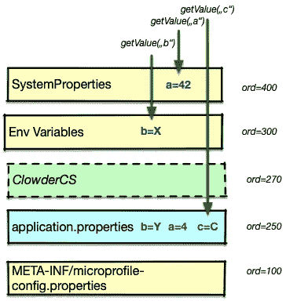
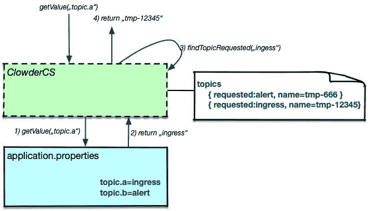

# 如何为 Quarkus 创建了解现有属性的 ConfigSource

> 原文：<https://itnext.io/how-to-create-a-configsource-for-quarkus-that-knows-about-existing-properties-1d6e95e7385e?source=collection_archive---------2----------------------->

我们正在为短暂的环境(“Clowder”)构建一个机器，其中一个细节是该环境将提供不同的资源名称，而不是我们在 application.properties 中预期的名称


不是我们要求的名称(图片来自 [Pixabay](https://pixabay.com/de/photos/scrabble-wort-schreiben-buchstaben-15546/)

例如，我们在 application.properties 中可能有以下条目

```
**mp.messaging.outgoing.egress.topic**=ingress
```

因此，我们请求一个主题名称*入口*，但是环境可能为我们提供一个动态名称，例如*入口-123* 。这意味着我们需要动态地覆盖 applications.properties 中的设置

## 关于微配置文件配置

[Quarkus](https://quarkus.io/) 在内部使用[Eclipse micro profile Config(MP-Config)](https://github.com/eclipse/microprofile-config)的 [SmallRye](https://smallrye.io) 实现。MP-Config 允许添加所谓的 [*配置源*](https://github.com/eclipse/microprofile-config/blob/master/spec/src/main/asciidoc/configsources.asciidoc) ，这允许以可编程的方式从例如一个奇怪格式的文件或者甚至可能从一个中央存储库中提供配置对象。在一个以上的源具有某个键的情况下，配置引擎通过源的序数值确保确定的排序。



左边的例子显示了来自 MicroProfile Config(黄色方框)和 Quarkus(蓝色)的配置源。序数较高的源优先于序数较低的源。
对键“A”的请求直接从系统属性配置源得到响应，从而覆盖 application.properties 中设置的值

合乎逻辑的结论是添加一个序号大于 250 的配置源，它提供来自短暂环境的值，该环境以绿色显示，序号为 270。对“c”的请求将由此源满足，而不是来自 application.properties。

## 棘手的部分

在我们的例子中，仅仅添加一个新的源来读取和解析特殊文件的内容是不够的。这个特殊的文件没有我们需要的配置键，只有成对的请求值和替换值:

```
"kafka": {
  "topics": [
    {
      "name": "platform-tmp-12345",
      "requestedName": "platform.notifications.ingress"
    },
    {
      "name": "platform-tmp-666",
      "requestedName": "platform.notifications.alerts"
    }
  ]
},
```

我们要做的是在 application.properties 中找到给定键的配置值，然后在特殊文件中查找这个请求的名称，并返回新名称



不幸的是，微配置文件配置中的配置源彼此并不了解。这意味着 ClowderCS 不能简单地调用 *getValue()* 并从 application.properties 中获取值。

## 拯救 SmallRye 配置

正如我在上面所写的，Quarkus 正在使用 [SmallRye 实现](https://smallrye.io/docs/smallrye-config/index.html)。这个实现允许通过一个[工厂](https://smallrye.io/docs/smallrye-config/config-sources/config-sources.html#_config_source_factory)构建新的配置源，这个工厂知道所有先前定义的配置源。这允许我在工厂中读取这些值，并将它们传递给我的新配置源:

```
@Override
public Iterable<ConfigSource> 
      getConfigSources(ConfigSourceContext **ctx**) {

    Map<String, ConfigValue> **exProp** = new HashMap<>();
    Iterator<String> stringIterator = **ctx**.iterateNames();
    while (stringIterator.hasNext()) {
        String key = stringIterator.next();
        ConfigValue value = **ctx**.getValue(key);
        **exProp**.put(key,value);
    }

    return Collections.*singletonList*(
          new ClowderConfigSource(..., **exProp**));
```

上下文 *ctx* 允许迭代所有现有的键，并检索值，然后将这些值放入映射并传递。SmallRye Config 确保非工厂定义的源在初始化发生前可用([完整文档](https://smallrye.io/docs/smallrye-config/index.html))。

在 ConfigSource 本身中，上面提到的转换就会发生。我不打算在这里讨论这个。完整的源代码可在[https://github . com/red hat insights/clowder-quar kus-config-source](https://github.com/RedHatInsights/clowder-quarkus-config-source)获得

不过有一点要提的是，源代码中所有配置属性的可用性允许我们通过 application.properties 中的一个条目定义要读取的文件，然后可以通过 environment 或 system 属性再次覆盖它

```
**%dev.clowder.file**=/tmp/my-config.json
**clowder.file**=/prod/config.json
**%test.clowder.file**=src/test/resources/config.json
```

(以%开头的条目是给定 Quarkus 运行轮廓的[的覆盖)。](https://quarkus.io/guides/config#configuration-profiles)

## 对应用程序透明

现在最后一部分是如何注册 ConfigSource 和 ConfigSourceFactory。幸运的是，这是通过 Java ServiceLoader 接口实现的。名为*io . small rye . config . config source factory*的文件被放入 *META-INF/services/* 中，该文件提供了源代码的完全限定名称。

我们将在多个应用程序中使用该源代码，并将其打包到自己的 maven repo 和 jar 文件中。Quarkus 应用程序的开发人员必须做的唯一改变就是将这个 jar 包含到他们的应用程序中，这可以通过简单地添加一个依赖项来完成。

```
<dependency>
  <groupId>com.redhat.cloud.common</groupId>
  <artifactId>clowder-quarkus-config-source</artifactId>
  <version>0.1.1</version>
</dependency>
```

否则，它对他们是完全透明的。不需要修改任何一行代码。

## 大声喊出来

非常感谢 Roberto Cortez，他在开发过程中给了我很多帮助，并回答了我所有奇怪的问题。