# 如何用 JavaScript 创建自定义右键菜单

> 原文：<https://itnext.io/how-to-create-a-custom-right-click-menu-with-javascript-9c368bb58724?source=collection_archive---------0----------------------->

伊利亚·巴甫洛夫在 [Unsplash](https://unsplash.com/s/photos/menu-computer?utm_source=unsplash&utm_medium=referral&utm_content=creditCopyText) 上的照片

随着 web 应用程序的复杂性和用户可以在特定方向执行的操作数量的增加，最大化 UX 效率并保持界面整洁变得越来越困难。

对于这种情况，一个好的方法是在自定义的上下文菜单中显示用户可以采取的操作，而不是到处创建 UI 按钮。

我将以 Gmail 为例来说明我的意思。

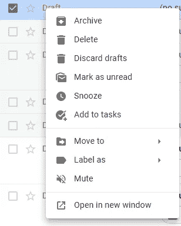

Gmail 的上下文菜单

**上下文菜单**是在用户交互时出现的 GUI，例如右击。

这些菜单的用法很清楚。想象一下，设计师如何在不使用户界面看起来糟糕的情况下，将所有这些选项放在每封邮件附近。

事不宜迟，下面告诉你如何创建一个自定义的上下文菜单。

## 第一步—模板

第一步是使用 HTML 和 CSS，为上下文菜单创建模板。

> 为了使这篇文章简单，我们将为一个带有 5 个随机选项的自定义上下文菜单定义一些基本的 HTML 和 CSS。

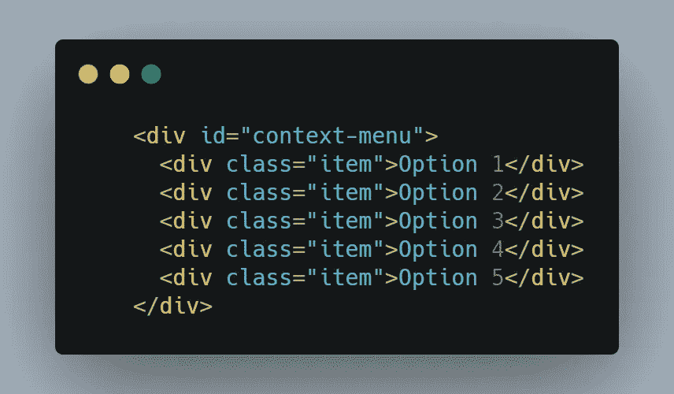

[生](https://carbon.now.sh/?bg=rgba%28171%2C+184%2C+195%2C+1%29&t=seti&wt=none&l=auto&ds=true&dsyoff=20px&dsblur=68px&wc=true&wa=true&pv=25px&ph=35px&ln=false&fl=1&fm=Hack&fs=14px&lh=133%25&si=false&es=2x&wm=false&code=%2520%2520%2520%2520%253Cdiv%2520id%253D%2522context-menu%2522%253E%250A%2520%2520%2520%2520%2520%2520%253Cdiv%2520class%253D%2522item%2522%253EOption%25201%253C%252Fdiv%253E%250A%2520%2520%2520%2520%2520%2520%253Cdiv%2520class%253D%2522item%2522%253EOption%25202%253C%252Fdiv%253E%250A%2520%2520%2520%2520%2520%2520%253Cdiv%2520class%253D%2522item%2522%253EOption%25203%253C%252Fdiv%253E%250A%2520%2520%2520%2520%2520%2520%253Cdiv%2520class%253D%2522item%2522%253EOption%25204%253C%252Fdiv%253E%250A%2520%2520%2520%2520%2520%2520%253Cdiv%2520class%253D%2522item%2522%253EOption%25205%253C%252Fdiv%253E%250A%2520%2520%2520%2520%253C%252Fdiv%253E)

为了使它更加风格化，我们可以使用下面的 CSS 代码:

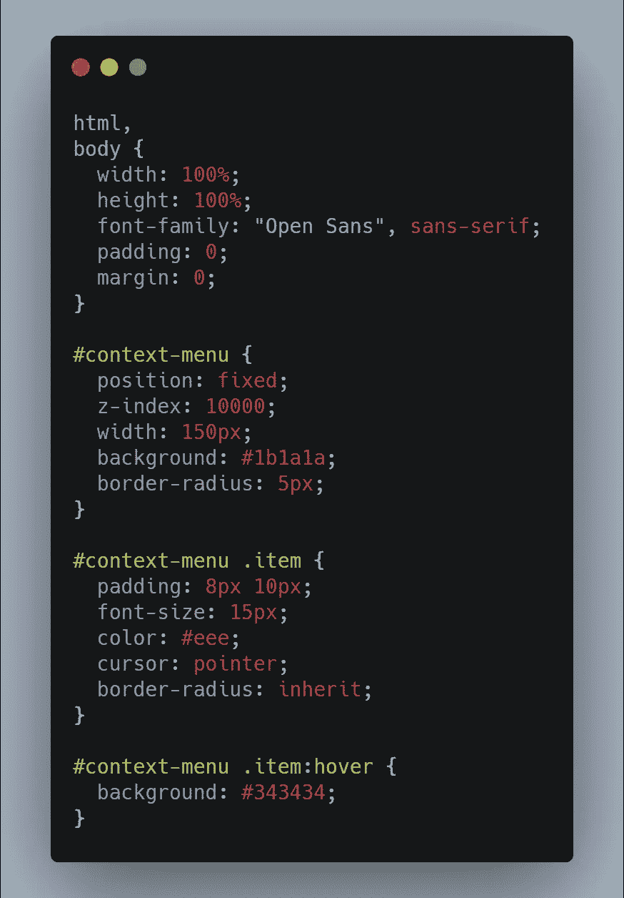

[生](https://carbon.now.sh/?bg=rgba%28171%2C+184%2C+195%2C+1%29&t=seti&wt=none&l=css&ds=true&dsyoff=20px&dsblur=68px&wc=true&wa=true&pv=25px&ph=35px&ln=false&fl=1&fm=Hack&fs=14px&lh=133%25&si=false&es=2x&wm=false&code=html%252C%250Abody%2520%257B%250A%2520%2520width%253A%2520100%2525%253B%250A%2520%2520height%253A%2520100%2525%253B%250A%2520%2520font-family%253A%2520%2522Open%2520Sans%2522%252C%2520sans-serif%253B%250A%2520%2520padding%253A%25200%253B%250A%2520%2520margin%253A%25200%253B%250A%257D%250A%250A%2523context-menu%2520%257B%250A%2520%2520position%253A%2520fixed%253B%250A%2520%2520z-index%253A%252010000%253B%250A%2520%2520width%253A%2520150px%253B%250A%2520%2520background%253A%2520%25231b1a1a%253B%250A%2520%2520border-radius%253A%25205px%253B%250A%257D%250A%250A%2523context-menu%2520.item%2520%257B%250A%2520%2520padding%253A%25208px%252010px%253B%250A%2520%2520font-size%253A%252015px%253B%250A%2520%2520color%253A%2520%2523eee%253B%250A%2520%2520cursor%253A%2520pointer%253B%250A%2520%2520border-radius%253A%2520inherit%253B%250A%257D%250A%250A%2523context-menu%2520.item%253Ahover%2520%257B%250A%2520%2520background%253A%2520%2523343434%253B%250A%257D)

有了上面的代码，我们应该可以从下一个截图开始得到类似的东西。

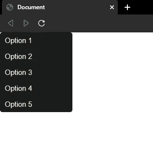

此阶段的用户界面

首先，菜单将被隐藏，只有当用户执行右键单击操作时才会出现。因此，我们需要更新现有的 CSS 来隐藏这个 HTML 元素。

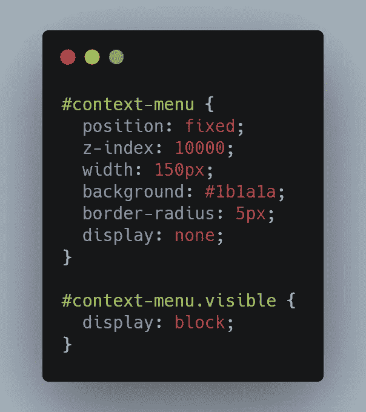

[RAW](https://carbon.now.sh/?bg=rgba%28171%2C+184%2C+195%2C+1%29&t=seti&wt=none&l=css&ds=true&dsyoff=20px&dsblur=68px&wc=true&wa=true&pv=25px&ph=35px&ln=false&fl=1&fm=Hack&fs=14px&lh=133%25&si=false&es=2x&wm=false&code=%2523context-menu%2520%257B%250A%2520%2520position%253A%2520fixed%253B%250A%2520%2520z-index%253A%252010000%253B%250A%2520%2520width%253A%2520150px%253B%250A%2520%2520background%253A%2520%25231b1a1a%253B%250A%2520%2520border-radius%253A%25205px%253B%250A%2520%2520display%253A%2520none%253B%250A%257D%250A%250A%2523context-menu.visible%2520%257B%250A%2520%2520display%253A%2520block%253B%250A%257D)

默认情况下，它将具有`display:none`属性，当我们想要显示它时，我们只需添加`visible`类。

## 第二步—仅在右键单击时显示菜单

为了让这个 HTML 菜单在浏览器中右击时可见，我们需要监听`contextmenu`事件。

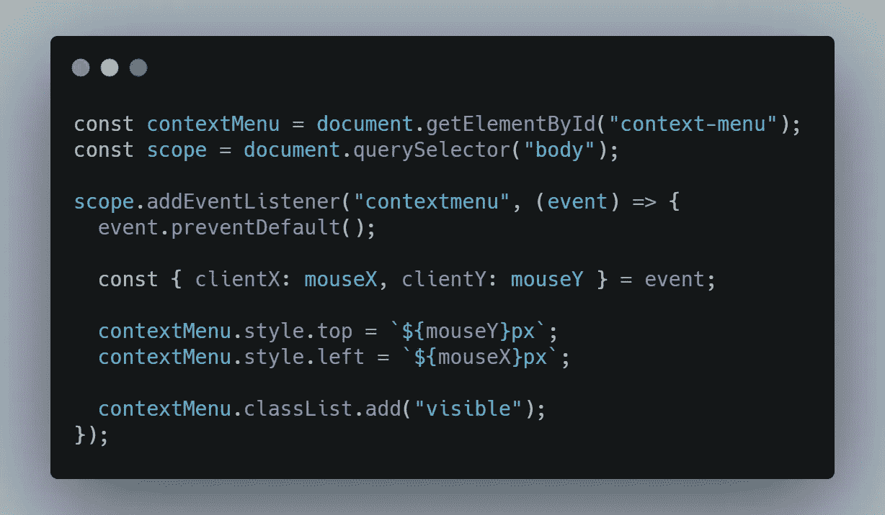

[生](https://carbon.now.sh/?bg=rgba%28171%2C+184%2C+195%2C+1%29&t=seti&wt=none&l=javascript&ds=true&dsyoff=20px&dsblur=68px&wc=true&wa=true&pv=25px&ph=35px&ln=false&fl=1&fm=Hack&fs=14px&lh=133%25&si=false&es=2x&wm=false&code=const%2520contextMenu%2520%253D%2520document.getElementById%28%2522context-menu%2522%29%253B%250Aconst%2520scope%2520%253D%2520document.querySelector%28%2522body%2522%29%253B%250A%250Ascope.addEventListener%28%2522contextmenu%2522%252C%2520%28event%29%2520%253D%253E%2520%257B%250A%2520%2520event.preventDefault%28%29%253B%250A%250A%2520%2520const%2520%257B%2520clientX%253A%2520mouseX%252C%2520clientY%253A%2520mouseY%2520%257D%2520%253D%2520event%253B%250A%250A%2520%2520contextMenu.style.top%2520%253D%2520%2560%2524%257BmouseY%257Dpx%2560%253B%250A%2520%2520contextMenu.style.left%2520%253D%2520%2560%2524%257BmouseX%257Dpx%2560%253B%250A%250A%2520%2520contextMenu.classList.add%28%2522visible%2522%29%253B%250A%257D%29%253B)

我们可以将事件监听器直接绑定在`document`上，或者我们可以限制用户右击查看自定义上下文菜单的区域。

在我们的例子中，右键单击的区域是整个`body`元素。

为了显示定制的上下文菜单，我们需要阻止默认行为，然后设置、触发和定位我们自己的菜单，就像我们在上面的代码中所做的那样。

此时，当我们右键单击时，应该会看到类似这样的内容。

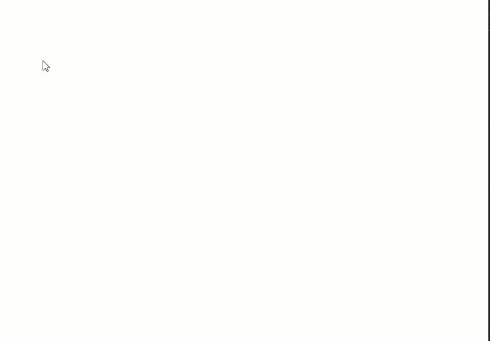

## 第三步—当用户点击外部时关闭菜单

当我们右击时，这个菜单出现在界面上，但是因为它没有关闭按钮，所以它将永远可见，没有被删除的选项。

让我们在用户点击它的外部时关闭它。

要做到这一点，我们要做的就是在同一个 HTML 元素上添加一个 click 事件监听器，只要被点击的元素不是上下文菜单，我们就可以把它去掉。

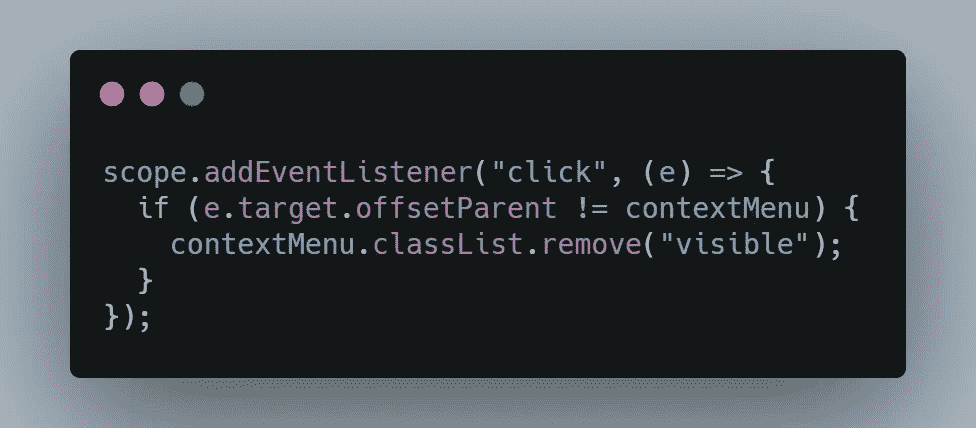

[生](https://carbon.now.sh/?bg=rgba%28171%2C+184%2C+195%2C+1%29&t=seti&wt=none&l=javascript&ds=true&dsyoff=20px&dsblur=68px&wc=true&wa=true&pv=25px&ph=35px&ln=false&fl=1&fm=Hack&fs=14px&lh=133%25&si=false&es=2x&wm=false&code=scope.addEventListener%28%2522click%2522%252C%2520%28e%29%2520%253D%253E%2520%257B%250A%2520%2520if%2520%28e.target.offsetParent%2520%21%253D%2520contextMenu%29%2520%257B%250A%2520%2520%2520%2520contextMenu.classList.remove%28%2522visible%2522%29%253B%250A%2520%2520%257D%250A%257D%29%253B)

## 第四步—动画

让我们也给这个自定义菜单添加一些动画，使它看起来像这样:

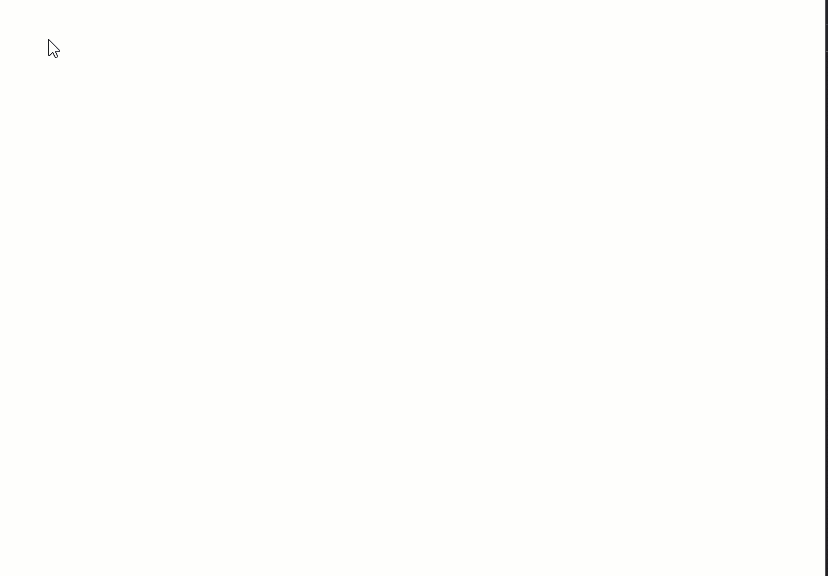

动画上下文菜单

为此，我们需要在 CSS 中进行以下更新，并用`transform`替换`display`属性。

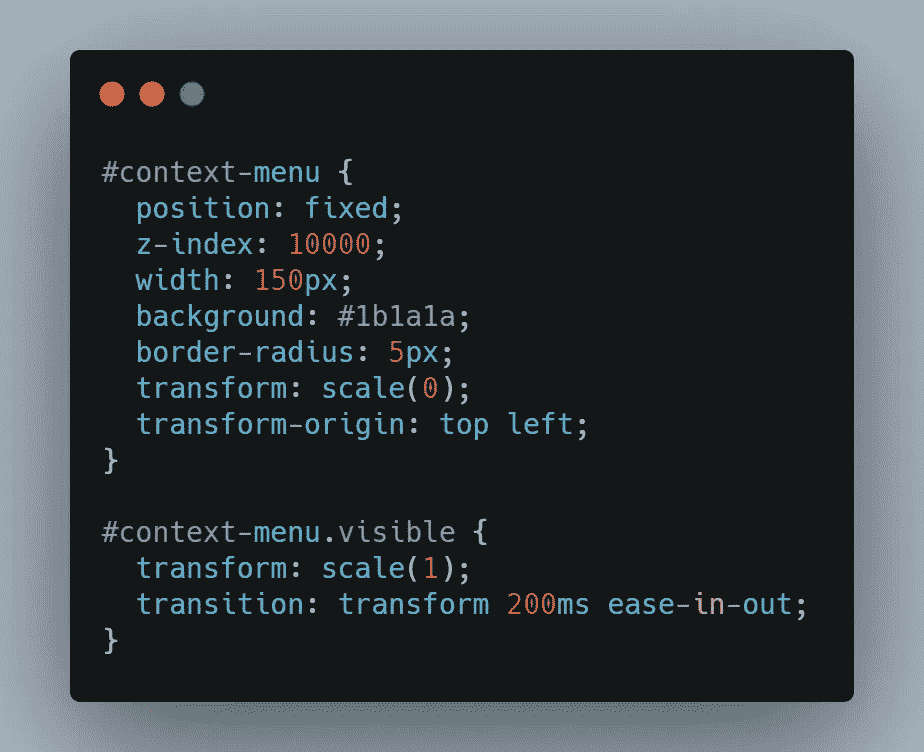

[生](https://carbon.now.sh/?bg=rgba%28171%2C+184%2C+195%2C+1%29&t=seti&wt=none&l=javascript&ds=true&dsyoff=20px&dsblur=68px&wc=true&wa=true&pv=25px&ph=35px&ln=false&fl=1&fm=Hack&fs=14px&lh=133%25&si=false&es=2x&wm=false&code=%2523context-menu%2520%257B%250A%2520%2520position%253A%2520fixed%253B%250A%2520%2520z-index%253A%252010000%253B%250A%2520%2520width%253A%2520150px%253B%250A%2520%2520background%253A%2520%25231b1a1a%253B%250A%2520%2520border-radius%253A%25205px%253B%250A%2520%2520transform%253A%2520scale%280%29%253B%250A%2520%2520transform-origin%253A%2520top%2520left%253B%250A%257D%250A%250A%2523context-menu.visible%2520%257B%250A%2520%2520transform%253A%2520scale%281%29%253B%250A%2520%2520transition%253A%2520transform%2520200ms%2520ease-in-out%253B%250A%257D)

*   `transform:scale(0)` —将使元素在初始状态下不可见，因为它的长度和宽度将为 0；
*   `transform-origin: top left` —从左上角开始缩放元素；

在 JavaScript 代码中…

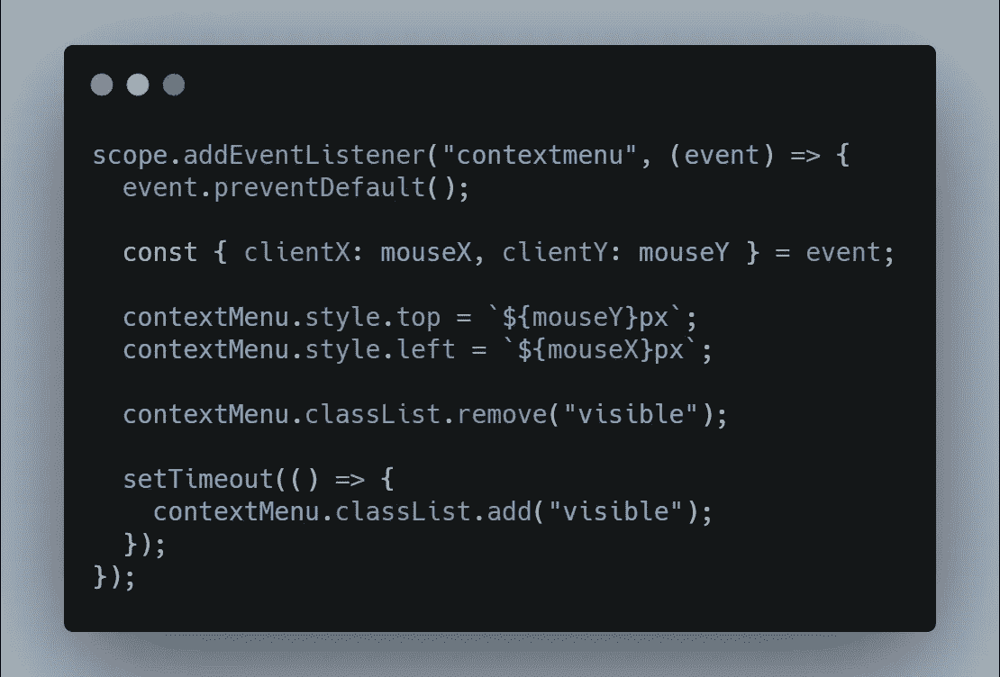

[生](https://carbon.now.sh/?bg=rgba%28171%2C+184%2C+195%2C+1%29&t=seti&wt=none&l=javascript&ds=true&dsyoff=20px&dsblur=68px&wc=true&wa=true&pv=25px&ph=35px&ln=false&fl=1&fm=Hack&fs=14px&lh=133%25&si=false&es=2x&wm=false&code=scope.addEventListener%28%2522contextmenu%2522%252C%2520%28event%29%2520%253D%253E%2520%257B%250A%2520%2520event.preventDefault%28%29%253B%250A%250A%2520%2520const%2520%257B%2520clientX%253A%2520mouseX%252C%2520clientY%253A%2520mouseY%2520%257D%2520%253D%2520event%253B%250A%250A%2520%2520contextMenu.style.top%2520%253D%2520%2560%2524%257BmouseY%257Dpx%2560%253B%250A%2520%2520contextMenu.style.left%2520%253D%2520%2560%2524%257BmouseX%257Dpx%2560%253B%250A%250A%2520%2520contextMenu.classList.remove%28%2522visible%2522%29%253B%250A%250A%2520%2520setTimeout%28%28%29%2520%253D%253E%2520%257B%250A%2520%2520%2520%2520contextMenu.classList.add%28%2522visible%2522%29%253B%250A%2520%2520%257D%29%253B%250A%257D%29%253B)

我们的菜单不仅在我们左键点击它的时候会消失，而且在我们再次右键点击的时候也会消失。上下文菜单将从初始位置删除，并在新位置重新创建。为此，我们还需要删除这个函数中的类`visible`。
同样，为了菜单不会突然出现在新的位置，我们使用了`setTimeout`。没有它，动画将没有效果，因为删除操作和添加操作都是在同一个事件循环中完成的。

> 如果你想了解更多关于事件循环的信息，那么看看这个 [YouTube 视频](https://www.youtube.com/watch?v=cCOL7MC4Pl0)。

## 第五步——防止菜单越界

最后，为了完成这个上下文菜单，我们应该防止它越界。此时，如果您尽可能靠近页面边缘并右键单击，菜单应该如下所示:

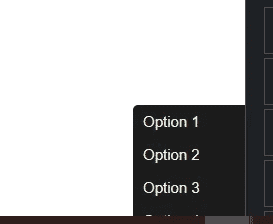

菜单越界了

这一想法旨在实现以下目标:

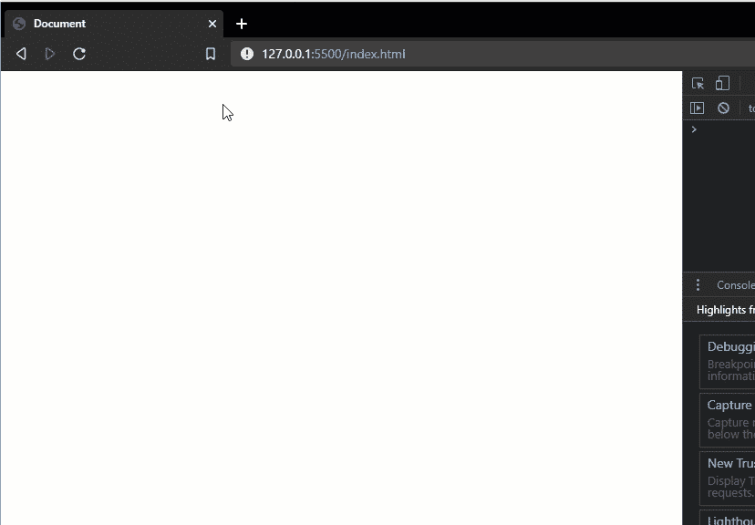

如果我们在页面边缘右键单击，菜单应该仍然可见，并且它的位置会移动以适合页面。

为此，我们可以编写一个函数来规范化上下文菜单的位置。

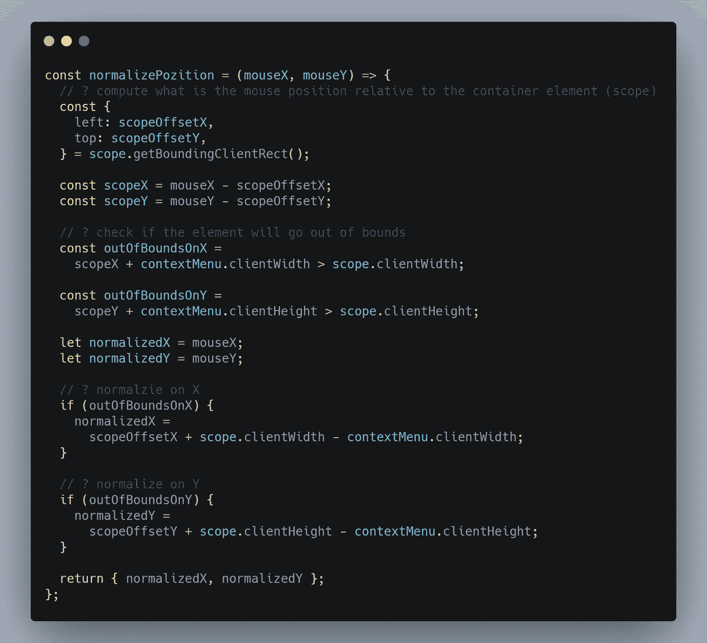

[RAW](https://carbon.now.sh/?bg=rgba%28171%2C+184%2C+195%2C+1%29&t=seti&wt=none&l=javascript&ds=true&dsyoff=20px&dsblur=68px&wc=true&wa=true&pv=25px&ph=35px&ln=false&fl=1&fm=Hack&fs=14px&lh=133%25&si=false&es=2x&wm=false&code=const%2520normalizePozition%2520%253D%2520%28mouseX%252C%2520mouseY%29%2520%253D%253E%2520%257B%250A%2520%2520%252F%252F%2520%253F%2520compute%2520what%2520is%2520the%2520mouse%2520position%2520relative%2520to%2520the%2520container%2520element%2520%28scope%29%250A%2520%2520const%2520%257B%250A%2520%2520%2520%2520left%253A%2520scopeOffsetX%252C%250A%2520%2520%2520%2520top%253A%2520scopeOffsetY%252C%250A%2520%2520%257D%2520%253D%2520scope.getBoundingClientRect%28%29%253B%250A%250A%2520%2520const%2520scopeX%2520%253D%2520mouseX%2520-%2520scopeOffsetX%253B%250A%2520%2520const%2520scopeY%2520%253D%2520mouseY%2520-%2520scopeOffsetY%253B%250A%250A%2520%2520%252F%252F%2520%253F%2520check%2520if%2520the%2520element%2520will%2520go%2520out%2520of%2520bounds%250A%2520%2520const%2520outOfBoundsOnX%2520%253D%250A%2520%2520%2520%2520scopeX%2520%252B%2520contextMenu.clientWidth%2520%253E%2520scope.clientWidth%253B%250A%250A%2520%2520const%2520outOfBoundsOnY%2520%253D%250A%2520%2520%2520%2520scopeY%2520%252B%2520contextMenu.clientHeight%2520%253E%2520scope.clientHeight%253B%250A%250A%2520%2520let%2520normalizedX%2520%253D%2520mouseX%253B%250A%2520%2520let%2520normalizedY%2520%253D%2520mouseY%253B%250A%250A%2520%2520%252F%252F%2520%253F%2520normalzie%2520on%2520X%250A%2520%2520if%2520%28outOfBoundsOnX%29%2520%257B%250A%2520%2520%2520%2520normalizedX%2520%253D%250A%2520%2520%2520%2520%2520%2520scopeOffsetX%2520%252B%2520scope.clientWidth%2520-%2520contextMenu.clientWidth%253B%250A%2520%2520%257D%250A%250A%2520%2520%252F%252F%2520%253F%2520normalize%2520on%2520Y%250A%2520%2520if%2520%28outOfBoundsOnY%29%2520%257B%250A%2520%2520%2520%2520normalizedY%2520%253D%250A%2520%2520%2520%2520%2520%2520scopeOffsetY%2520%252B%2520scope.clientHeight%2520-%2520contextMenu.clientHeight%253B%250A%2520%2520%257D%250A%250A%2520%2520return%2520%257B%2520normalizedX%252C%2520normalizedY%2520%257D%253B%250A%257D%253B)

该函数首先将鼠标在页面上的绝对位置转换为相对于容器元素的位置，然后检查鼠标位置加上元素的宽度或高度是否超过容器限制。如果是这样的话，它将在角落里准确地显示该项目，但不会超出界限。

接下来，我们需要在定位上下文菜单时使用该函数返回的值。

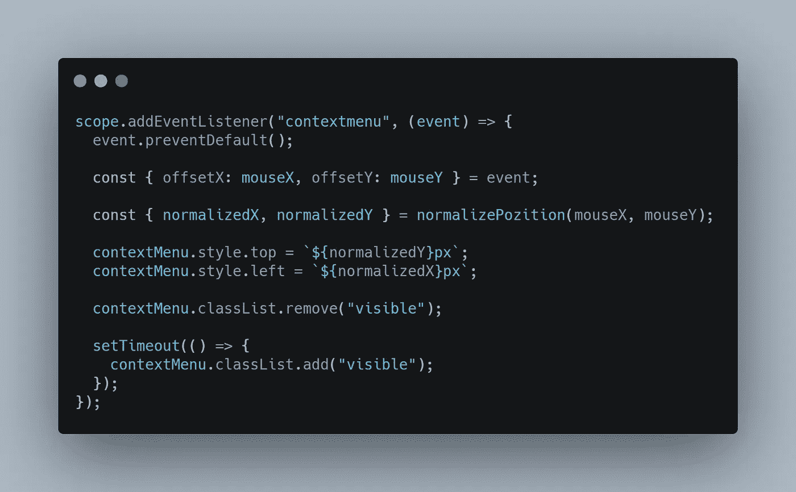

[生](https://carbon.now.sh/?bg=rgba%28171%2C+184%2C+195%2C+1%29&t=seti&wt=none&l=javascript&ds=true&dsyoff=20px&dsblur=68px&wc=true&wa=true&pv=56px&ph=56px&ln=false&fl=1&fm=Hack&fs=14px&lh=133%25&si=false&es=2x&wm=false&code=scope.addEventListener%28%2522contextmenu%2522%252C%2520%28event%29%2520%253D%253E%2520%257B%250A%2520%2520event.preventDefault%28%29%253B%250A%250A%2520%2520const%2520%257B%2520offsetX%253A%2520mouseX%252C%2520offsetY%253A%2520mouseY%2520%257D%2520%253D%2520event%253B%250A%250A%2520%2520const%2520%257B%2520normalizedX%252C%2520normalizedY%2520%257D%2520%253D%2520normalizePozition%28mouseX%252C%2520mouseY%29%253B%250A%250A%2520%2520contextMenu.style.top%2520%253D%2520%2560%2524%257BnormalizedY%257Dpx%2560%253B%250A%2520%2520contextMenu.style.left%2520%253D%2520%2560%2524%257BnormalizedX%257Dpx%2560%253B%250A%250A%2520%2520contextMenu.classList.remove%28%2522visible%2522%29%253B%250A%250A%2520%2520setTimeout%28%28%29%2520%253D%253E%2520%257B%250A%2520%2520%2520%2520contextMenu.classList.add%28%2522visible%2522%29%253B%250A%2520%2520%257D%29%253B%250A%257D%29%253B)

# 包裹

创建上下文菜单是一件非常普通的事情，需要完成一些简单的步骤:

*   在所需元素上绑定`contextmenu`监听器
*   防止默认行为
*   计算此菜单将显示的位置
*   显示菜单

如果你想在你的项目中使用这些代码，那么你可以从这个 [Github 库](https://github.com/GeorgianStan/context-menu-poc)获取代码，或者你可以使用这个 [NPM 包](https://www.npmjs.com/package/vanilla-context-menu)。