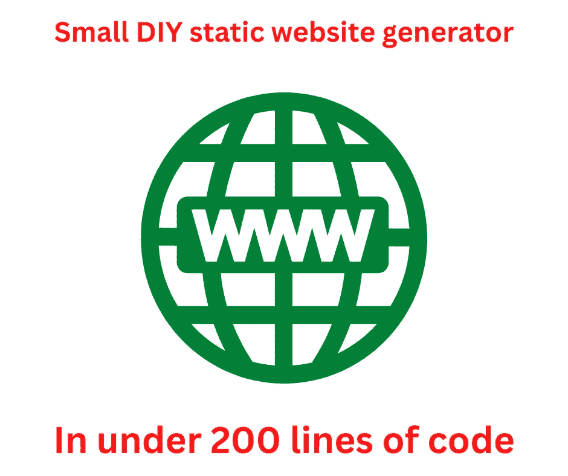

# 如何用 170 行代码创建一个定制的静态网站生成器

> 原文：<https://itnext.io/how-to-create-a-custom-static-website-generator-in-170-lines-of-code-461082d6d349?source=collection_archive---------4----------------------->

## 静态网站生成

## **Live rebuild，rendering Markdown 和 AsciiDoctor，多个模板引擎，几行代码。**



作者图片

本教程展示了如何用少量代码创建一个简单的静态网站生成器，运行在 Node.js 上。在我的理解中，*静态网站生成器*是为网站生成 HTML、CSS、JavaScript 等文件的应用。结果是一个目录层次结构，可以上传到一个简单的 web 服务器，比如 Apache，而不需要在服务器端执行任何动态操作。我这样说是因为其他人可能有不同的定义。

我们讨论的是一个名为 GuideCMS 的演示应用程序，用于`@akashacms/renderers`包。它包含在渲染器包存储库中，并支持以下功能:

*   当文件发生更改时，实时重建内容
*   呈现 Markdown 或 AsciiDoctor 内容文件
*   向 CSS 呈现较少的文件
*   多种格式的渲染模板，如 EJS 和努乔克

显然，要在 170 行代码中完成所有这些工作，需要依赖一些外部包。关键是 AkashaCMS 的两个子模块。一，

`[@akashacms/stacked-dirs](https://npmjs.com/package/@akashacms/stacked-dirs)`，处理目录层次结构的实时重新扫描。另一个，`[@akashacms/renderers](https://npmjs.com/package/@akashacms/renderers)`，使用几个模板引擎渲染文件。

GuideCMS 源代码位于 GitHub 的

`[@akashacms/renderers](https://github.com/akashacms/rendering-engines/tree/main/guidecms)` [储存库](https://github.com/akashacms/rendering-engines/tree/main/guidecms)，寻找`guidecms.mjs`。它有几个用途:

*   演示如何创建一个定制的静态网站生成器，直接满足您的需求。
*   展示如何使用`@akashacms/renderers`和`@akashacms/stacked-dirs`
*   充当这些包的真实测试
*   处理格式化`[@akashacms/renderers](https://akashacms.github.io/rendering-engines/index.html)` [在线文档](https://akashacms.github.io/rendering-engines/index.html)

刚刚命名的包，以及它们使用的包，为静态网站生成器提供了良好的基础。事实上，它们是 [AkashaCMS](https://akashacms.com/) 的核心。虽然这些包是为 AkashaCMS 设计的，但它们被设计成可以在其他项目中重用，GuideCMS 也证明了这一点。

# `@akashacms/stacked-dirs`和`@akashacms/renderers`概述

在我们开始之前，让我们简单讨论一下这两个包是做什么的。

堆叠目录(`@akashacms/stacked-dirs`)在 AkashaCMS 中用于处理输入目录的潜在复杂配置，同时也处理已更改输入文件的实时重建。为了支持实时重建，该包使用 Chokidar 来监控输入文件，并在文件被更改或删除时发送事件。

管理网站内容时，您可能会合并来自多个来源的内容。在 AkashaCMS 中，决定支持将多个输入目录映射到一个虚拟文件系统中，并允许每个目录潜在地位于该文件系统中的不同点。例如，您可能有映射到`/marketing`、`/support`、`/api`和`/blog`的目录，每个目录由不同的人管理。堆叠目录包就是为处理这种情况而设计的。

Renderers ( `@akashacms/renderers`)是一个封装了几个渲染引擎的包。这些大多是流行的模板引擎。其概念是拥有一种格式的对象，该对象被呈现为另一种格式，以便在网站上使用。例如，对于呈现为 CSS 的更易于实现的样式表，LESS 受支持；对于 HTML 呈现，Markdown 和 AsciiDoctor 都受支持作为文档格式；对于页面布局，几个模板引擎都受支持。

因此，堆叠目录包扫描输入文件，发送关于新的、改变的或删除的文件的通知，而渲染器包处理渲染输入文件以便在网站上使用。

# CMS 项目的配置

GuideCMS 示例工具使用 YAML 格式的配置文件。我们用它来声明输入目录和在渲染模板中使用的元数据值。元数据的一个用途是携带 CSS 和 JavaScript 文件的路径名，然后由页面布局模板代码呈现。

配置文件示例:

```
*batchmode:* false

*dirs:*
    *documents:*
        - *mounted:* documents
          *mountPoint:* /
        - *mounted:* node_modules/bootstrap/dist
          *mountPoint:* /vendor/bootstrap
    *output:* ./out
    *layout:* ./layouts
    *partial:* ./partials

*metadata:*
    *stylesheets:*
        - style.css
        - vendor/bootstrap/css/bootstrap.css
        - https://unpkg.com/@highlightjs/cdn-assets@11.6.0/styles/default.min.css
    *jsbottom:*
        # The .bundle.js version includes Popper
        - vendor/bootstrap/js/bootstrap.bundle.js
        - https://unpkg.com/@highlightjs/cdn-assets@11.6.0/highlight.min.js
```

*文档*下有两个目录，第一个目录包含网站内容。第二个包含 Bootstrap v5 发行版，它被简单地复制到渲染输出目录中。在*元数据*下，我们看到两个值，每个值都是一个数组，包含要在网站 HTML 中呈现的 URL，以引用 CSS 或 JavaScript 文件。

在 GuideCMS 源代码中，`js-yaml`包用于解析配置文件。然后使用以下代码将这些值存储在全局变量中:

```
const batchmode = cfg.batchmode;
const docsDirectories = cfg.dirs.documents;
const renderedOutput = cfg.dirs.output;
const layoutsDir = cfg.dirs.layout;
const partialsDir = cfg.dirs.partial;
const metadata = cfg.metadata;
```

这些值将在 GuideCMS 的其余部分中使用。

# 初始化堆叠目录

请记住，使用`@akashacms/stacked-dirs`的应用程序接收它要监视的目录中文件更改的事件。

```
const docsWatcher = new DirsWatcher('documents');

docsWatcher.on('ready', async (name) => {
    console.log(`documents ready ${name}`);
    if (batchmode) await close();
})
.on('change', async (name, info) => {
    console.log(`documents change ${name} ${info.vpath}` /*, info */);
    try {
        await render(info);
    } catch (err) {
        console.error(`documents change ERROR `, err.stack);
    }
})
.on('add', async (name, info) => {
    console.log(`documents add ${name} ${info.vpath}` /*, info */);
    try {
        await render(info);
    } catch (err) {
        console.error(`documents add ERROR `, err.stack);
    }
})
.on('unlink', async (name, info) => {
    console.log(`documents unlink ${name} ${info.vpath}`, info);
    // TODO Convert the path into a path within renderedOutput
    try {
        await fsp.unlink(path.join(renderedOutput, renderedPath(info.vpath)));
    } catch (err) {
        console.error(`documents unlink ERROR `, err.stack);
    }
});

docsWatcher.watch(docsDirectories);

async function close() {
    await docsWatcher.close();
}
```

我们已经创建了一个`DirsWatcher`实例来监视`documents`数组中列出的目录。该代码监视四个事件，并对每个事件采取适当的措施。当需要关闭脚本时，调用`close`函数，这将导致 DirsWatcher 停止监听事件，从而导致 Node.js 事件循环退出，从而导致脚本退出。

对于`change`和`add`事件，调用`render`函数。该函数通过呈现内容文件，然后将该内容呈现到页面布局模板中来处理页面布局。但是，在此之前，我们必须讨论如何初始化渲染器包。

# 初始化渲染器包

为使 GuideCMS 成为 CMS，它必须呈现网站中使用的文件。使用堆叠的 Dirs 包，GuideCMS 接收输入文件列表。对于每个输入文件，都会调用`render`函数，该函数使用 Renderers 包来转换这些文件，以便在网站上使用。

这要求我们初始化渲染器包。

```
const renderers = new Renderers.Configuration({
    *partialDirs*: partialsDir ? [ partialsDir ] : undefined,
    *layoutDirs*: layoutsDir ? [ layoutsDir ] : undefined
});
```

`renderers`对象将包含 GuideCMS 中使用的渲染器配置。

配置类可以从传递给构造函数的对象初始化，如下所示。在本例中，我们传入一个 partials 目录和一个 layouts 目录。API 支持每种目录类型的数组，但是在这里我们只需要一个。可以通过几种设置其他配置值的方法来配置或重新配置软件包。

Renderers 包支持渲染 Markdown 和 AsciiDoctor 文档。对于 Markdown，有一个很好的默认配置，但是我们也可以进行定制。

```
import { createRequire } from 'node:module';
const require = createRequire(import.meta.url);

const rendererMarkdown = renderers.findRendererName('.html.md');

rendererMarkdown.configuration({
    *html*:         true,     // Enable html tags in source
    *xhtmlOut*:     false,    // Use '/' to close single tags (<br />)
    *breaks*:       false,    // Convert '\n' in paragraphs into <br>
    *linkify*:      true,     // Autoconvert url-like texts to links
    *typographer*:  false,    // Enable smartypants and other sweet transforms
})
.use(require('markdown-it-highlightjs'), { *auto*: true, *code*: true, *inline*: true })
.use(require('markdown-it-expand-tabs'), { *tabWidth*: 4 });
```

这是降价呈现器的可选配置。因为渲染器包指南使用了许多代码片段，所以突出显示语法对它们很有用。此配置使用突出显示添加了语法突出显示。JS 包。

另一个细节是`createRequire`函数。因为 GuideCMS 是 ES6 模块，所以 CommonJS `require`功能不可用。已经确定 Markdown-IT 插件必须使用`require`加载。`createRequire`函数生成一个`require`函数，让我们在需要时使用`require`。

`findRendererName`检索 MarkdownRenderer 实例。虽然大多数渲染器不需要额外的配置，但是这个渲染器支持两个配置选项。首先，`configuration`方法传入一个 Markdown-IT 配置对象。其次，`use`方法允许使用 Markdown-IT 插件。

前面显示的 GuideCMS 配置文件加载 CSS 和 JS 以使用 Highlight.JS。添加`markdown-it-highlightjs`插件会导致 Markdown 渲染器发出标记以进行高亮显示。

# 处理页面布局的渲染函数

我们现在可以看看`render`函数。对于这个函数，我们支持两个阶段的过程，其中应用程序呈现内容文件，然后它可以将内容呈现到页面布局模板中。

```
async function render(info) {

    // Read file content
    // Find the renderer
    // Ask the renderer to parse metadata
    // render content
    // If the metadata includes a layout
    //     read the layout file
    //     duplicate the previous metadata
    //     add rendered content to new metadata
    //     render
    // Write rendered content to a file 
    // whose name is computed from input file

    const renderer = renderers.findRendererPath(info.vpath);
    if (!renderer) {
        const copyTo = path.join(renderedOutput, info.vpath);
        console.log(`COPY ${info.vpath} to ${copyTo}`);
        await fsp.mkdir(path.dirname(copyTo), { *recursive*: true });
        await fsp.copyFile(info.fspath, copyTo);
        return;
    }
    // Create RenderingContext object
    let context = {
        *fspath*: info.fspath,
        *content*: await fsp.readFile(info.fspath, 'utf-8')
    };
    context = renderer.parseMetadata(context);
    if (context.metadata) {
        context.metadata = copyMetadataProperties(context.metadata, metadata);
        context.metadata.partial = async (fname, metadata) => {
            return renderers.partial(fname, metadata);
        };
        context.metadata.partialSync = (fname, metadata) => {
            // console.log(`partialSync ${renderers.partialSync} ${fname}`);
            return renderers.partialSync(fname, metadata);
        };
    }
    // console.log(`vpath ${info.vpath}`, context);
    let rendered;
    try {
        rendered = await renderer.render(context);
    } catch (err) {
        throw new Error(`Failed to render ${info.vpath} because ${err}`);
    }

    // console.log(`rendered`, rendered);

    let layoutRendered;
    if (!context.metadata || !context.metadata.layout) {
        layoutRendered = rendered;
    } else {
        const layoutFN = await renderers.findLayout(context.metadata.layout);
        let layoutContext = {
            *fspath*: layoutFN,
            *content*: await fsp.readFile(layoutFN, 'utf-8'),
            *metadata*: copyMetadataProperties({}, context.metadata)
        };
        layoutContext.metadata = copyMetadataProperties(
            layoutContext.metadata, metadata
        );
        delete layoutContext.metadata.layout;
        layoutContext.metadata.content = rendered;
        const layoutRenderer = renderers.findRendererPath(layoutFN);
        // console.log(`layout context `, layoutContext);
        try {
            layoutRendered = await layoutRenderer.render(layoutContext);
        } catch (err) {
            throw new Error(`Failed to render ${layoutFN} with ${info.vpath} because ${err}`);
        }
    }

    const renderTo = path.join(renderedOutput, renderer.filePath(info.vpath));
    await fsp.mkdir(path.dirname(renderTo), { *recursive*: true });
    console.log(`RENDER ${info.vpath} ==> ${renderTo}`);
    await fsp.writeFile(renderTo, layoutRendered, 'utf-8');
}
```

`info`对象来自 Stacked Dirs 包，它支持将几个目录组合成一个虚拟文件系统。更多详细信息，请参见[堆叠目录-静态网站生成器的目录/文件监视器](https://akashacms.com/news/2021/06/stacked-dirs.html)。这个对象包含几个描述文件的字段，但是这段代码只使用了两个。`info.vpath`字段是`documents`目录层次中的虚拟路径名。`info.fspath`字段是文件系统中的绝对路径名。

`findRendererPath`方法基于路径名定位正确的渲染器。每个渲染器实例使用一个或多个正则表达式来匹配路径名。例如，以`.html.ejs`结尾的路径名表示该文件将作为 EJS 模板处理，它生成 HTML 输出，并且输出文件名的扩展名为`.html`。同样，`.html.njk`说这个文件是一个 Nunjucks 模板，产生 HTML 输出，文件名的扩展名是`.html`。

如果找不到渲染器，那么应该将文件复制到输出目录中。输出目录的根目录在`renderedOutput`中，因此使用`info.vpath`用`path.join`计算完整路径名。

接下来，代码创建一个 RenderingContext 对象。Renderer 类中的几个方法使用该对象来保存与一个呈现事务相关的数据。

`RenderingContext`类型是这样定义的:

```
export type RenderingContext = {
    fspath?: string;  // Pathname that can be given to template engines for error messages
    *content*: string;  // Content to render
    body?: string;    // Content body after parsing frontmatter
    *metadata*: any;    // Data to be used for satisfying variables in templates
};
```

正如你所看到的，这是一个简单的对象，具有可感知的字段。这个函数以输入文件的绝对路径名开始对象，以及它的内容。

如果渲染器支持文件中的元数据，那么`parseMetadata`将解析出输入文件中的任何数据。大多数渲染器都支持 YAML frontmatter，它的结构是这样的:

```
---
title: Page title goes here
layout: layout-template-file-name.html.ejs
---Input content body
```

第一部分位于`---`行之间，是头版头条，采用 YAML 格式。如果需要，您可以使用 YAML 的全部功能。文件的剩余部分被分配给`body`，而 frontmatter 块的解析形式被分配给`metadata`。

此时`context`应该在所有四个字段中都有数据。

`copyMetadataProperties`用于将附加值复制到元数据对象中。它被定义为:

```
function copyMetadataProperties(data, metadata) {
    try {
        for (const prop in metadata) {
            if (!(prop in data)) data[prop] = metadata[prop];
        }
        return data;
    } catch (err) {
        throw new Error(`Failed to copy metadata because ${err}`);
    }
}
```

因为元数据可以在配置文件中声明，所以代码需要将文件中的元数据与全局元数据合并。

我们还为`context.metadata`增加了两个功能，`partial`和`partialSync`。这些函数支持呈现部分模板，这允许我们创建可以在页面布局之间轻松重用的 web 内容片段。

`render`方法将`context`中的数据渲染成渲染器支持的输出数据。还有一个`renderSync`方法，在执行被同步约束时使用。

这就完成了第一个渲染阶段。一个典型的例子是，Markdown 内容已经呈现为 HTML，但是 HTML 需要嵌入到网站使用的页面布局中。在这种情况下，使用第二渲染阶段。在其他情况下，例如将较小的文件呈现为 CSS，则没有元数据，也没有第二个呈现阶段。

仅当元数据中指定了布局模板时，才执行第二阶段。

`findLayout`方法在布局目录中搜索匹配的模板。然后为第二阶段构造 RenderingContext 对象。

在这种情况下，元数据是通过将输入文件中的元数据副本与全局元数据合并而创建的。在该元数据中，`layout`字段被删除，因为不再需要它，第一阶段呈现的内容被指定为`content`字段。

布局模板必须将`content`变量插入指定位置。

调用`findRendererPath`方法来检索用于布局模板的渲染器。然后代码将模板呈现到`layoutRendered`变量中。

最后，我们到达函数的底部，在这里，呈现的内容被写入输出文件。这次输出文件名的计算略有不同。Renderer 方法`filePath`告诉我们用于输入文件名的路径名。

# 简单页面布局模板

在上一节中，我们讨论了在呈现的第二阶段使用页面布局模板。每个网站都会在每个页面上使用相同或相似的页面结构。第二个渲染阶段让我们为此定义一个或多个布局模板。

这是一个使用 Nunjucks 模板语法的简单示例:

```
<html>
    <head>
        <title>{{ title | escape }}</title>
        
        <link *rel*="stylesheet" *type*="text/css" *href*="{{ style | escape }}"/>
        
    </head>
    <body>
        <h1>{{ title | escape }}</h1>
        <article>
            {{ content }}
        </article> 
        <script *src*="{{ js | escape }}"></script>
         <script>
            try {
                hljs.initHighlightingOnLoad();
            } catch (err) { }
        </script>
    </body>
</html>
```

记住，在第一呈现阶段中呈现的内容被分配给在第二呈现阶段中提供的元数据的`content`变量。在这个模板中，您可以看到`content`变量被呈现在`<article>`标记的主体中。

对于`stylesheets`和`jsbottom`中的数组，标签引用 CSS 或 JavaScript 文件进行渲染。还有一个硬编码的 JavaScript 片段对 HighlightJS 很有用。

另一个版本是:

```
<html>
    <head>
        <meta *charset*="utf-8">
        <meta *name*="viewport" *content*="width=device-width, initial-scale=1">
        <title>{{ title | escape }}</title>
        {{ partialSync('stylesheets.html.njk', {
            stylesheets: stylesheets
        }) }}
        {{ partialSync('jshead.html.njk', {
            jshead: jshead
        }) }}
    </head>
    <body>
        <head *class*="container-fluid">
        <h1>{{ title | escape }}</h1>
        </head>
        <div *class*="container-md">
            <div *class*="row">
                <article *class*="col">
                    {{ content }}
                </article>
                <section *class*="col-2">
                    {{ partialSync('sidebar.html') }}
                    {#  #}
                </section>
            </div>
        </div> 

        
        
    </body>
</html>
```

这个版本将一些 HTML 片段推送到部分模板。因此，在一个有多个页面布局的复杂网站上，我们可以很容易地在页面之间重用这些片段。`partialSync`函数由 Renderers 包提供，而`include`标记由 Nunjucks 提供。

因为这是一个 Nunjucks 模板，我们确保使用`escape`过滤器对内容进行安全编码。

记住 GuideCMS 是为 Renderers 包的文档网站创建的。该页面布局模板使用 Bootstrap v5 类来格式化一个移动响应多列布局，带有一个好看的导航侧边栏。实现需要安装引导代码，将 URL 添加到`stylesheets`和`jsbottom`数组，以及对布局模板做更多的工作。

# 写作内容

我们已经看到了 GuideCMS 是如何工作的，现在让我们开始使用它。

请记住，在`[@akashacms/renderers](https://github.com/akashacms/rendering-engines)`[存储库](https://github.com/akashacms/rendering-engines)中，`guide`目录是一个使用 GuideCMS 构建的网站的工作示例。就此而言，它可能是唯一一个使用 GuideCMS 构建的网站。

GuideCMS 的*架构*(如果允许我们使用这样一个庄严的词的话)是有三套目录:*文档*、*布局*和*局部*。第一个目录包含文档，即呈现在网站页面上的信息。第二个包含页面布局模板，最后一个包含部分模板。该体系结构允许每种类型的目录有多个实例。

编写内容的第一步是创建一个或多个页面布局模板。您可能会发现创建一些部分模板对于简洁的布局模板以及在布局模板之间共享代码非常有用。创建好模板后，是时候写一些文档了。

*文档*目录对应于要在渲染输出目录中创建的文件。记住,`renderTo`路径是用这行代码创建的:

```
const renderTo = path.join(renderedOutput, renderer.filePath(info.vpath));
```

因此，文件`documents/history/romania/vlad-tsepes.html.md`将呈现给`out/history/romania/vlad-tsepes.html`。

这里有一个小问题，即*文档*目录可以安装在虚拟目录层次结构中的位置。示例配置文件显示了这样一个例子，因为我们需要在网站上包含引导程序发行版和我们的渲染文档。

```
*documents:*
    - *mounted:* documents
      *mountPoint:* /
    - *mounted:* node_modules/bootstrap/dist
      *mountPoint:* /vendor/bootstrap
```

`documents`目录的渲染内容出现在渲染输出目录的根目录下。对于引导包来说，`dist`目录包含了部署在网站上的 CSS 和 JavaScript 文件，这些文件出现在`/vendor/bootstrap`目录中。

`render`功能只是复制不需要渲染的文件。引导程序分发目录仅包含`.css`和`.js`文件，这些文件不可渲染，因此被复制到所需位置。

`documents`目录倾向于包含`.html.md` (Markdown)、`.html.adoc`(asciidor)或`.css.less` (LESS)文件，每个文件都必须被渲染。

降价内容文件的格式是:

```
---
title: Metadata test for Markdown
layout: foo.html.ejs
hello: world
---# This is an H1 headerHello, World!
```

第一部分在`---`行之间，是前面的内容，包含前面描述的元数据。在这种情况下，有一个`title`、`layout`和一个名为`hello`的额外值。您的应用程序可以在 frontmatter 中使用它想要的任何数据。

参考我们之前讨论的代码，呈现的结果将如下所示:

```
<h1>THis is an H1 header</h1>
<p>Hello, World!</p>
```

并且，会有元数据对象。然后这两个将被转换成`layoutContext`，并使用`foo.html.ejs`模板呈现内容。

# 以动态观察模式和批处理模式运行 GuideCMS

GuideCMS 支持两种操作模式:*批量*和*动态*。在后者中，它将响应任何文件更改，并重新呈现已更改的文件。在批处理模式下，它将渲染所有文件并立即退出。

模式由以下配置文件值决定:

```
*batchmode:* false
```

将其更改为`true`以获得批处理模式。

在指南目录中，有一个`package.json`包含这个:

```
*"scripts"*: {
    *"watch"*: "npm-run-all --parallel watcher preview",
    *"preview"*: "live-server out",
    *"watcher"*: "node ../guidecms/guidecms.mjs cfg.yml",
    *"build"*: "node ../guidecms/guidecms.mjs cfg-batch.yml",
    *"publish"*: "npx gh-pages -d out"
},
```

`watch`脚本启动两个并行运行的程序。`preview`脚本监视呈现的输出目录，注意变化，并动态地重新加载任何打开页面的浏览器窗口。`watcher`脚本以动态模式启动 GuideCMS，自动重建任何更改的页面。当页面发生变化时，`live-server`会注意到变化并自动重新加载网页。

`build`脚本以批处理方式构建站点，并在所有文件构建完成后退出。

`publish`脚本处理将构建的站点发布到 GitHub 页面。

另一种发布方法是像这样使用`rsync`:

```
*"deploy"*: "cd out && rsync --archive --delete --verbose ./ user@example.com:path-name/",
```

因为它生成静态的 HTML/CSS/JS 网站，GuideCMS(和 AkashaCMS)支持部署到简单的 web 服务器。

这些脚本使得使用 GuideCMS 编写内容变得非常容易。这个`watch`脚本在连接到实时预览服务器的站点上打开一个浏览器标签。在类似 Visual Studio 代码的编辑器中，您可以编写 Markdown 内容。每次保存更改时，浏览器选项卡会快速重新加载。它几乎与 WYSIWYG 编辑器一样好，但是您正在编写 Markdown，结果可以很容易地存储在 Git 存储库中。

# 摘要

GuideCMS 旨在演示如何使用这些软件包。这是一个概念证明，人们可以很容易地实现一个相对强大的静态网站生成器。

当然，GuideCMS 缺少了很多东西，因为只有这么多东西可以塞进几百行代码中。例如，AkashaCMS 构建在相同的两个组件之上，并具有许多其他功能。

`@akashacms/stacked-dirs`包提供了文件系统中文件变化的动态事件，同时允许将相当复杂的重叠目录层次结构装入虚拟文件系统。`@akashacms/renderers`包封装了几个有用的模板引擎和其他 web 开发工具。很容易创建渲染器实现来支持其他引擎或工具。很容易将这些包集成到一个应用程序中，并添加其他逻辑来适应您设想的任何应用程序。

原载于[*akashacms.com*](https://akashacms.com/news/2022/09/renderers-package.html)

## 关于作者


[**大卫·赫伦**](https://davidherron.com/) :大卫·赫伦是一名作家和软件工程师，专注于技术的明智使用。他对太阳能、风能和电动汽车等清洁能源技术特别感兴趣。David 在硅谷从事了近 30 年的软件工作，从电子邮件系统到视频流，再到 Java 编程语言，他已经出版了几本关于 Node.js 编程和电动汽车的书籍。