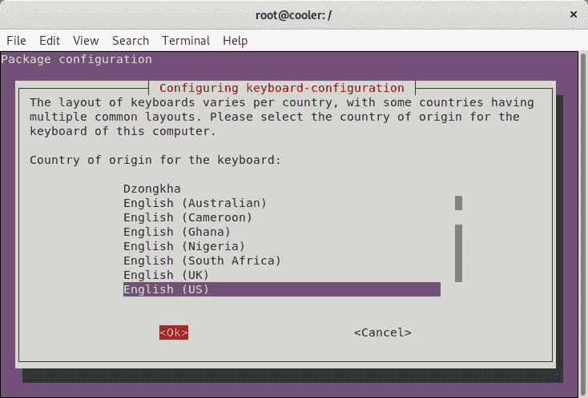
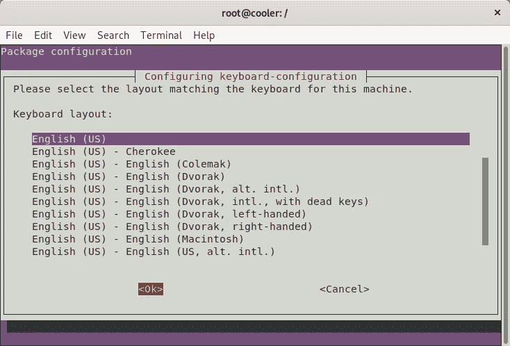
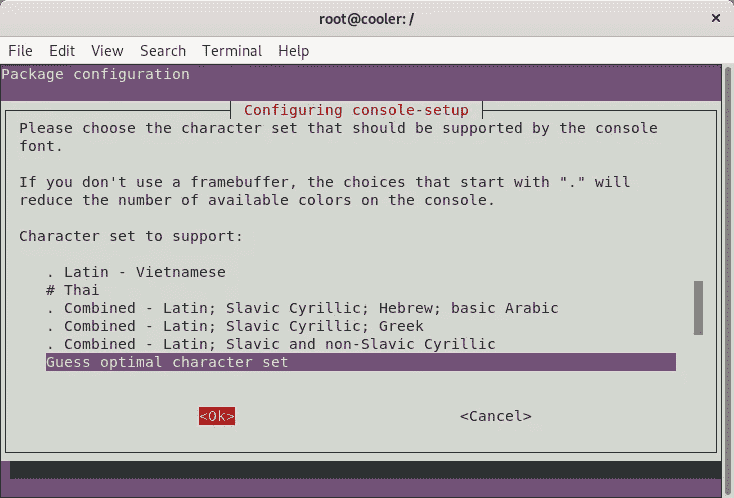
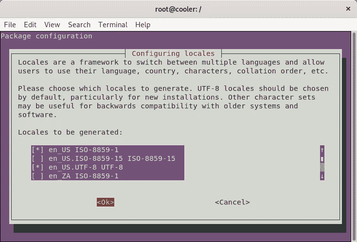
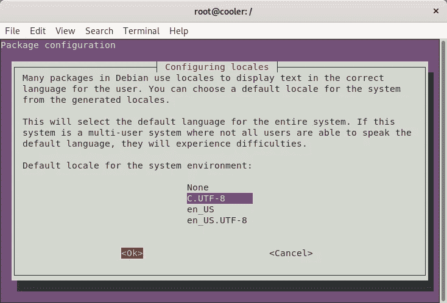
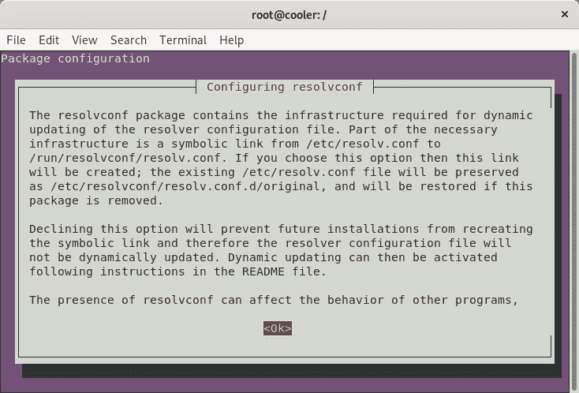
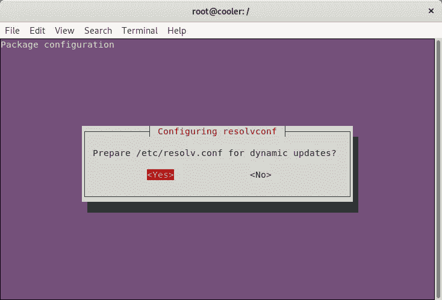
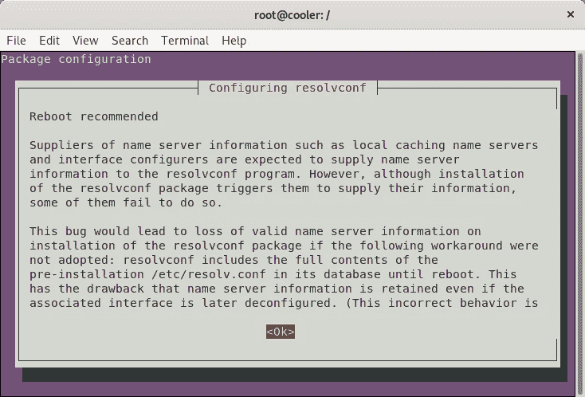

# 如何从头开始创建自定义 Ubuntu live

> 原文：<https://itnext.io/how-to-create-a-custom-ubuntu-live-from-scratch-dd3b3f213f81?source=collection_archive---------0----------------------->


Ethan Robertson 在 [Unsplash](https://unsplash.com/search/photos/circle?utm_source=unsplash&utm_medium=referral&utm_content=creditCopyText) 上拍摄的照片

这个过程展示了如何从头开始创建一个**可引导的**和**可安装的** Ubuntu Live(以及自动硬件检测和配置)。

[](https://github.com/mvallim/live-custom-ubuntu-from-scratch) [## mvallim/live-custom-Ubuntu-从头开始

### 这个程序可以创建一个可引导和不可安装的 Ubuntu Live(以及自动硬件检测…

github.com](https://github.com/mvallim/live-custom-ubuntu-from-scratch) 

# 先决条件(GNU/Linux Debian/Ubuntu)

安装构建环境所需的应用程序。

```
sudo apt-get install \
    binutils \
    debootstrap \
    squashfs-tools \
    xorriso \
    grub-pc-bin \
    grub-efi-amd64-bin \
    mtools

mkdir $HOME/live-ubuntu-from-scratch
```

# 引导程序

## 结账引导程序

```
sudo debootstrap \
   --arch=amd64 \
   --variant=minbase \
   focal \
   $HOME/live-ubuntu-from-scratch/chroot \
   [http://us.archive.ubuntu.com/ubuntu/](http://us.archive.ubuntu.com/ubuntu/)
```

> **debootstrap** 用于从零开始创建 Debian 基础系统，不需要 **dpkg** 或 **apt** 的可用性。它通过下载来做到这一点。deb 文件，小心地将它们解压到一个目录中，这个目录最终可以被 **chrooted** 到。

## 配置外部挂载点

```
sudo mount --bind /dev $HOME/live-ubuntu-from-scratch/chroot/devsudo mount --bind /run $HOME/live-ubuntu-from-scratch/chroot/run
```

由于我们将更新和安装软件包(其中有 **grub** ，这些挂载点在 **chroot** 环境中是必需的，因此我们能够无错误地完成安装。

# 定义 chroot 环境

> 在 [Unix](https://en.wikipedia.org/wiki/Unix) [操作系统](https://en.wikipedia.org/wiki/Operating_system)上的 **chroot** 是为当前运行的进程及其[子进程](https://en.wikipedia.org/wiki/Child_process)改变表观[根目录](https://en.wikipedia.org/wiki/Root_directory)的操作。在这种修改的环境中运行的程序不能命名(因此通常不能访问)指定目录树之外的文件。术语“chroot”可以指 chroot [系统调用](https://en.wikipedia.org/wiki/System_call)或 chroot 包装程序。修改后的环境被称为 **chroot jail** 。

> 参考:[https://en.wikipedia.org/wiki/Chroot](https://en.wikipedia.org/wiki/Chroot)

## 访问 chroot 环境

```
sudo chroot $HOME/live-ubuntu-from-scratch/chroot
```

## 配置挂载点、home 和 locale

```
mount none -t proc /procmount none -t sysfs /sysmount none -t devpts /dev/ptsexport HOME=/rootexport LC_ALL=C
```

这些挂载点在 **chroot** 环境中是必需的，因此我们能够无错误地完成安装。

## 设置自定义主机名

```
echo "ubuntu-fs-live" > /etc/hostname
```

## 配置 apt 源。列表

## 更新索引包

```
apt-get update
```

## 安装系统 d

```
apt-get install -y libterm-readline-gnu-perl systemd-sysv
```

> systemd 是 Linux 的系统和服务管理器。它提供了强大的并行化功能，使用套接字和 D-Bus 激活来启动服务，提供守护程序的按需启动，使用 Linux 控制组跟踪进程，维护装载和自动装载点，并实施复杂的基于事务依赖性的服务控制逻辑。

## 配置机器 id 和转移

```
dbus-uuidgen > /etc/machine-idln -fs /etc/machine-id /var/lib/dbus/machine-id
```

> `/etc/machine-id`文件包含安装或引导期间设置的本地系统的唯一机器 ID。机器 ID 是一个以换行符结尾的十六进制 32 字符小写 ID。从十六进制解码时，这相当于 16 字节/128 位值。此 ID 可能不全是零。

```
dpkg-divert --local --rename --add /sbin/initctlln -s /bin/true /sbin/initctl
```

> **dpkg-divert** 是用于设置和更新分流列表的实用程序。

## 安装实时系统所需的软件包

```
apt-get install -y \
    sudo \
    ubuntu-standard \
    casper \
    lupin-casper \
    discover \
    laptop-detect \
    os-prober \
    network-manager \
    resolvconf \
    net-tools \
    wireless-tools \
    wpagui \
    locales \
    grub-common \
    grub-gfxpayload-lists \
    grub-pc \
    grub-pc-bin \
    grub2-commonapt-get install -y --no-install-recommends linux-generic
```

图形安装程序

```
apt-get install -y \
    ubiquity \
    ubiquity-casper \
    ubiquity-frontend-gtk \
    ubiquity-slideshow-ubuntu \
    ubiquity-ubuntu-artwork
```

下一个配置对话框将作为上一步将要安装的软件包的结果显示，这将在无需通知或执行任何事情的情况下发生。

*   配置键盘



*   控制台设置



## 安装窗口管理器

```
apt-get install -y \
    plymouth-theme-ubuntu-logo \
    ubuntu-gnome-desktop \
    ubuntu-gnome-wallpapers
```

## 安装有用的应用程序

```
apt-get install -y \
    clamav-daemon \
    terminator \
    apt-transport-https \
    curl \
    vim \
    nano \
    less
```

## **安装 Visual Studio 代码(可选)**

*   下载并安装密钥

```
curl [https://packages.microsoft.com/keys/microsoft.asc](https://packages.microsoft.com/keys/microsoft.asc) | gpg --dearmor > microsoft.gpginstall -o root -g root -m 644 microsoft.gpg /etc/apt/trusted.gpg.d/echo "deb [arch=amd64] [https://packages.microsoft.com/repos/vscode](https://packages.microsoft.com/repos/vscode) stable main" > /etc/apt/sources.list.d/vscode.listrm microsoft.gpg
```

*   然后更新包缓存并安装包

```
apt-get updateapt-get install -y code
```

## **安装谷歌浏览器(可选)**

*   下载并安装密钥

```
wget -q -O - [https://dl-ssl.google.com/linux/linux_signing_key.pub](https://dl-ssl.google.com/linux/linux_signing_key.pub) | sudo apt-key add -echo "deb [http://dl.google.com/linux/chrome/deb/](http://dl.google.com/linux/chrome/deb/) stable main" > /etc/apt/sources.list.d/google-chrome.list
```

*   然后更新包缓存并安装包

```
apt-get updateapt-get install google-chrome-stable
```

## **安装 Java JDK 8(可选)**

```
apt-get updateapt-get install -y \
     openjdk-8-jdk \
     openjdk-8-jre
```

## 移除未使用的应用程序(可选)

```
apt-get purge -y \
     transmission-gtk \
     transmission-common \
     gnome-mahjongg \
     gnome-mines \
     gnome-sudoku \
     aisleriot \
     hitori
```

## 移除未使用的包

```
apt-get autoremove -y
```

# 重新配置包

## 生成语言环境

```
dpkg-reconfigure locales
```

*   选择区域设置



*   选择默认区域设置



## 重新配置 resolvconf

```
dpkg-reconfigure resolvconf
```

*   确认更改



## 配置网络管理器

## 重新配置网络管理器

```
dpkg-reconfigure network-manager
```

# 清理 chroot 环境

## 如果您安装了软件，请确保运行

```
truncate -s 0 /etc/machine-id
```

## 移除分流

```
rm /sbin/initctldpkg-divert --rename --remove /sbin/initctl
```

## 清理

```
apt-get cleanrm -rf /tmp/* ~/.bash_historyumount /procumount /sysumount /dev/ptsexport HISTSIZE=0exit
```

## 解除挂载点绑定

```
sudo umount $HOME/live-ubuntu-from-scratch/chroot/devsudo umount $HOME/live-ubuntu-from-scratch/chroot/run
```

# **创建光盘镜像目录并填充它**

## 访问构建目录

```
cd $HOME/live-ubuntu-from-scratch
```

## 创建目录

```
mkdir -p image/{casper,isolinux,install}
```

## 复制内核映像

```
sudo cp chroot/boot/vmlinuz-**-**-generic image/casper/vmlinuzsudo cp chroot/boot/initrd.img-**-**-generic image/casper/initrd
```

## 复制 memtest86+二进制(BIOS)

```
sudo cp chroot/boot/memtest86+.bin image/install/memtest86+
```

## 下载并解压缩 memtest86 二进制文件(UEFI)

```
wget --progress=dot [https://www.memtest86.com/downloads/memtest86-usb.zip](https://www.memtest86.com/downloads/memtest86-usb.zip) -O image/install/memtest86-usb.zipunzip -p image/install/memtest86-usb.zip memtest86-usb.img > image/install/memtest86rm image/install/memtest86-usb.zip
```

# Grub 配置

## 访问构建目录

```
cd $HOME/live-ubuntu-from-scratch
```

## 为 grub 创建基点访问文件

```
touch image/ubuntu
```

## 创建 image/isolinux/grub.cfg

# 创建清单

在接下来的步骤中，清单的创建很重要，因为它告诉我们每个包的哪个版本被安装在活动版本中，哪些包将在将要安装的版本中被删除或保留(保存在硬盘中)。

## 访问构建目录

```
cd $HOME/live-ubuntu-from-scratch
```

## 生成清单

# 压缩 chroot

在 **chrooted** 环境中安装并预配置好所有东西之后，我们需要按照下面的步骤生成所有东西的映像。

## 访问构建目录

```
cd $HOME/live-ubuntu-from-scratch
```

## 创建方形

```
sudo mksquashfs chroot image/casper/filesystem.squashfs
```

> Squashfs 是一个用于 Linux 的高度压缩的只读文件系统。它使用 zlib 压缩来压缩文件、inodes 和目录。系统中的索引节点非常小，所有块都被打包以最大限度地减少数据开销。最大支持 64K 的大于 4K 的块大小。
> **Squashfs** 主要用于一般只读文件系统、存档(即在可能使用. tar.gz 文件的情况下)，以及需要低开销的受限块设备/内存系统(如**嵌入式系统**)。

## 写入 filesystem.size

```
printf $(sudo du -sx --block-size=1 chroot | cut -f1) > image/casper/filesystem.size
```

# 创建磁盘定义

**README** 文件通常可以在 Linux LiveCD 安装光盘上找到，比如 Ubuntu Linux 安装光盘；通常命名为" **README.diskdefines** "并可能在安装过程中被引用。

## 访问构建目录

```
cd $HOME/live-ubuntu-from-scratch
```

## 创建文件 image/README.diskdefines

```
cat <<EOF > image/README.diskdefines
#define DISKNAME  Ubuntu from scratch
#define TYPE  binary
#define TYPEbinary  1
#define ARCH  amd64
#define ARCHamd64  1
#define DISKNUM  1
#define DISKNUM1  1
#define TOTALNUM  0
#define TOTALNUM0  1
EOF
```

# 为 LiveCD 创建 ISO 映像(BIOS + UEFI)

## 访问图像目录

```
cd $HOME/live-ubuntu-from-scratch/image
```

## 创建 grub UEFI 映像

```
grub-mkstandalone \
   --format=x86_64-efi \
   --output=isolinux/bootx64.efi \
   --locales="" \
   --fonts="" \
   "boot/grub/grub.cfg=isolinux/grub.cfg"
```

## 创建包含 EFI 引导加载程序的 FAT16 UEFI 引导磁盘映像

```
(
   cd isolinux && \
   dd if=/dev/zero of=efiboot.img bs=1M count=10 && \
   sudo mkfs.vfat efiboot.img && \
   LC_CTYPE=C mmd -i efiboot.img efi efi/boot && \
   LC_CTYPE=C mcopy -i efiboot.img ./bootx64.efi ::efi/boot/
)
```

## 创建 grub BIOS 映像

```
grub-mkstandalone \
   --format=i386-pc \
   --output=isolinux/core.img \
   --install-modules="linux16 linux normal iso9660 biosdisk memdisk search tar ls" \
   --modules="linux16 linux normal iso9660 biosdisk search" \
   --locales="" \
   --fonts="" \
   "boot/grub/grub.cfg=isolinux/grub.cfg"
```

## 组合可引导的 grub cdboot.img

```
cat /usr/lib/grub/i386-pc/cdboot.img isolinux/core.img > isolinux/bios.img
```

## 生成 md5sum.txt

```
sudo /bin/bash -c "(find . -type f -print0 | xargs -0 md5sum | grep -v "\./md5sum.txt" > md5sum.txt)"
```

## 使用命令行从映像目录创建 iso

```
sudo xorriso \
   -as mkisofs \
   -iso-level 3 \
   -full-iso9660-filenames \
   -volid "Ubuntu from scratch" \
   -output "../ubuntu-from-scratch.iso" \
   -eltorito-boot boot/grub/bios.img \
      -no-emul-boot \
      -boot-load-size 4 \
      -boot-info-table \
      --eltorito-catalog boot/grub/boot.cat \
      --grub2-boot-info \
      --grub2-mbr /usr/lib/grub/i386-pc/boot_hybrid.img \
   -eltorito-alt-boot \
      -e EFI/efiboot.img \
      -no-emul-boot \
   -append_partition 2 0xef isolinux/efiboot.img \
   -m "isolinux/efiboot.img" \
   -m "isolinux/bios.img" \
   -graft-points \
      "/EFI/efiboot.img=isolinux/efiboot.img" \
      "/boot/grub/bios.img=isolinux/bios.img" \
      "."
```

# 另一种方法是，如果前一个失败，创建一个混合 ISO

## 创建一个 ISOLINUX (syslinux)引导菜单

```
cat <<EOF> isolinux/isolinux.cfg
UI vesamenu.c32MENU TITLE Boot Menu
DEFAULT linux
TIMEOUT 600
MENU RESOLUTION 640 480
MENU COLOR border       30;44   #40ffffff #a0000000 std
MENU COLOR title        1;36;44 #9033ccff #a0000000 std
MENU COLOR sel          7;37;40 #e0ffffff #20ffffff all
MENU COLOR unsel        37;44   #50ffffff #a0000000 std
MENU COLOR help         37;40   #c0ffffff #a0000000 std
MENU COLOR timeout_msg  37;40   #80ffffff #00000000 std
MENU COLOR timeout      1;37;40 #c0ffffff #00000000 std
MENU COLOR msg07        37;40   #90ffffff #a0000000 std
MENU COLOR tabmsg       31;40   #30ffffff #00000000 stdLABEL linux
 MENU LABEL Try Ubuntu FS
 MENU DEFAULT
 KERNEL /casper/vmlinuz
 APPEND initrd=/casper/initrd boot=casperLABEL linux
 MENU LABEL Try Ubuntu FS (nomodeset)
 MENU DEFAULT
 KERNEL /casper/vmlinuz
 APPEND initrd=/casper/initrd boot=casper nomodeset
EOF
```

## 包括 syslinux bios 模块

```
apt install -y syslinux-common && \
cp /usr/lib/ISOLINUX/isolinux.bin isolinux/ && \
cp /usr/lib/syslinux/modules/bios/* isolinux/
```

## 从图像目录创建 iso

```
sudo xorriso \
   -as mkisofs \
   -iso-level 3 \
   -full-iso9660-filenames \
   -volid "Ubuntu from scratch" \
   -output "../ubuntu-from-scratch.iso" \
 -isohybrid-mbr /usr/lib/ISOLINUX/isohdpfx.bin \
 -eltorito-boot \
     isolinux/isolinux.bin \
     -no-emul-boot \
     -boot-load-size 4 \
     -boot-info-table \
     --eltorito-catalog isolinux/isolinux.cat \
 -eltorito-alt-boot \
     -e /EFI/boot/efiboot.img \
     -no-emul-boot \
     -isohybrid-gpt-basdat \
 -append_partition 2 0xef EFI/boot/efiboot.img \
   "$HOME/live-ubuntu-from-scratch/image"
```

# 制作一个可引导的 USB 映像

简单易行，用“dd”

```
sudo dd if=ubuntu-from-scratch.iso of=<device> status=progress oflag=sync
```

# 摘要

这就完成了从头开始创建一个活动的 Ubuntu 安装程序的过程。生成的 ISO 可以在虚拟机(如`VirtualBox`)中进行测试，或者写入介质并从标准 PC 启动。

我希望你喜欢这篇文章，并学习如何从头开始创建你自己的定制 Ubuntu 映像。请随意查看我写的其他文章。

不要忘记在下面的评论中留下你的反馈。不断完善这篇文章中的内容非常重要。

回头见！！

再见