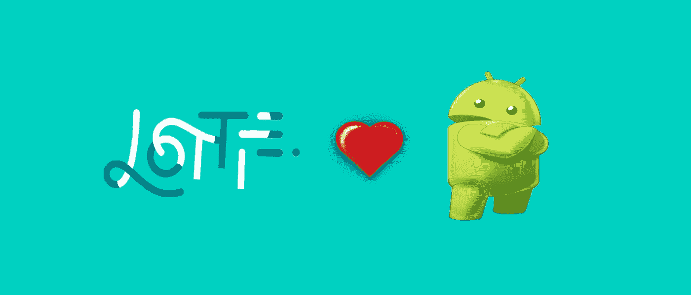
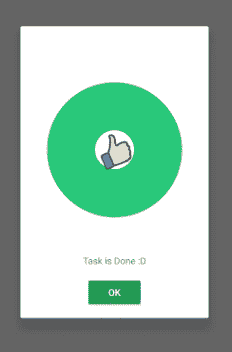
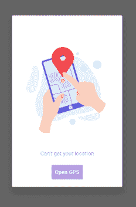
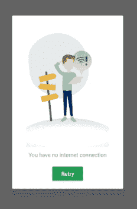
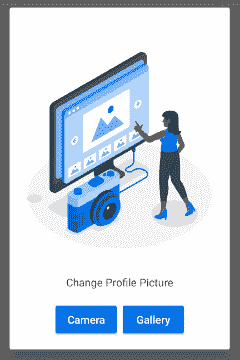

# 如何在 Android 中用 Lottie 动画创建对话框

> 原文：<https://itnext.io/how-to-create-a-dialog-with-lottie-animation-in-android-8f6f97ca2d6e?source=collection_archive---------2----------------------->



大家好，我是 Amr Hesham 软件工程师，我对 Android 开发和编译器设计感兴趣，在这篇文章中，我将谈论如何使用 Lottie 对话框库轻松地在您的应用程序中使用 Lottie 动画文件创建对话框。

但是首先，洛蒂动画文件是什么？
这是一个包含洛蒂库渲染它所需的所有信息的文件，你可以从官方网站[**【LottieFiles.com】**](http://lottiefiles.com/)下载它们，或者从 Airbnb 使用 Adobe After Effect 和插件创建它们，从[**lottiefiles.com/plugins/after-effects**](http://lottiefiles.com/plugins/after-effects)查看文档

你在哪里使用洛蒂对话？

*   显示带有两个选项相机和画廊的拍照对话框。
*   显示欢迎消息对话框。
*   显示分级对话框。
*   显示加载对话框。
*   显示任何信息消息对话框，如显示当前版本的功能。
*   显示任何错误消息对话框，如无效登录、无效插入或更新数据。
*   显示任何警告消息对话框，如断言用户希望通过两个选项删除、取消来删除此项。
*   这个列表只是几个例子，不要限制你的思维，当你认为它对你的设计决策有帮助的时候就使用它。



现在，让我们开始实现一个拍照对话框的例子，我们需要找到我们想要使用的文件，我们有许多选项，我们可以将文件作为 JSON 文件下载到本地，并将其放在 raw 目录中，或者从 assets 目录中，或者我们可以只从 URL 加载动画

请注意，如果您想要从 URL 加载动画，您必须在您的清单文件上设置 internet 权限。

```
<uses-permission android:name=”android.permission.INTERNET” />
```

有了我们的动画文件后，我们需要将洛蒂对话库添加到我们的 Android 应用程序中。

*   将下面一行添加到您的顶层`build.gradle`

```
allprojects {     
    repositories {         
        maven { url "<https://jitpack.io>" }     
    }
}
```

然后将下面的代码行添加到您的应用程序级版本中。gradle，请从 Lottie Dialog 存储库中检查最新版本号

```
implementation 'com.github.amrdeveloper:lottiedialog:1.0.0'
```

现在让我们开始构建我们的对话框，假设我们想要创建一个有两个选项的拍照对话框，从相机中拍照或从图库中加载图片，所以我们需要 2 个动作按钮。

让我们首先为我们的对话框创建动作按钮，我们的第一个按钮将是一个摄像头按钮，带有一个点击监听器来完成他的工作，你可以根据需要自定义它。

```
Button takePictureAction = new Button(this); takePictureAction.setText("Camera"); takePictureAction.setOnClickListener(v -> {});
```

我们的第二个将是画廊。

```
Button loadPictureAction = new Button(this); loadPictureAction.setText("Gallery"); loadPictureAction.setOnClickListener(v -> {});
```

现在我们需要用这两个动作按钮和 Lottie 动画文件创建一个 Lottie 对话框。

```
LottieDialog dialog = new LottieDialog(this)
    .setAnimation(R.raw.animation)
    .setAnimationRepeatCount(LottieDrawable.INFINITE)
    .setAutoPlayAnimation(true)
    .setMessage("Take a Profile Picture")
    .addActionButton(takePictureAction)
    .addActionButton(loadPictureAction);
```

然后我们可以使用 show 方法轻松地显示它

```
dialog.show();
```

最终的结果会是这样的。



这只是 Lottie Dialog 可以做什么的一个简单例子，但是有很多定制选项，你可以从库仓库[**AMR developer/lottidialog**](https://github.com/AmrDeveloper/lottiedialog)中看到完整的文档和例子。

你可以在: [**GitHub**](https://github.com/amrdeveloper) ， [**LinkedIn**](https://www.linkedin.com/in/amrdeveloper/) ， [**Twitter**](https://twitter.com/amrdeveloper) 上找到我。

享受编程😋。