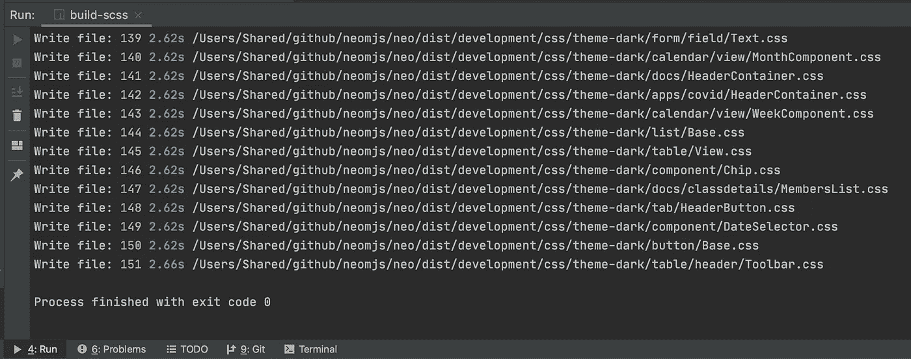

# 如何使用 postcss 和可选的 CSS 变量创建一个包含依赖项的文件自定义 SCSS 版本

> 原文：<https://itnext.io/how-to-create-a-file-by-file-custom-scss-build-including-dependencies-using-postcss-and-optional-c83f8e5677d8?source=collection_archive---------2----------------------->

虽然这听起来像是一个常见的问题，但我无法在网上找到一个好的解决方案。所以我认为写一篇关于它的文章来节省别人的时间是一个好主意。

虽然有许多使用案例可以让你依靠 webpack 来创建合适的 CSS 分割块，但是也有一些场景需要你从头开始创建一个基于 1 输入→ 1 输出的解决方案。

我强烈建议先阅读文章，但对于那些想马上深入代码的好奇者:
[build scripts/build themes . js](https://github.com/neomjs/neo/blob/dev/buildScripts/buildThemes.js#L91)(可以跳过前 90 行)

# 内容

1.  动机:JS 相关跨 app 拆分组块
2.  为什么我们不能使用 webpack 进行主题构建？
3.  SCSS 结构
4.  使用 css 变量的期望输出
5.  没有 css 变量的期望输出
6.  如何建造 SCSS？
7.  核心算法
8.  构建需要多长时间？
9.  我们能在 neo.mjs 中增加对 JS 中 CSS 的支持吗？
10.  接下来是什么？
11.  最后的想法

# 1.动机:JS 相关跨 app 拆分组块

我绝对是[网络包](https://github.com/webpack/webpack)的粉丝。cross 应用程序在 worker 范围内分割块工作得非常好。浏览器本身也是如此:动态导入文件永远不会多次加载同一个 JS 模块。

您可以在 app worker 控制台日志中看到它(如果您仔细观察:当将现有组件树移动到新窗口中时，您可以看到空视口& app.mjs 的模块并行加载到下一个主窗口选项卡主体中):

跨应用程序分割意味着，我们也可以将多个应用程序放在一个页面上。在这种情况下，webpack 使我们能够为共享的 JS 模块创建块，所以我们不会根据需要加载更多的代码。

不久前，我写了一篇关于这个问题的深度文章:

[](https://medium.com/swlh/cross-app-bundling-a-different-approach-for-micro-frontends-e4f212b6a9a) [## 跨应用捆绑——微前端的一种不同方法

### 捆绑分布式版本的应用程序代码一直是一个挑战，尤其是在您想要共享代码的情况下…

medium.com](https://medium.com/swlh/cross-app-bundling-a-different-approach-for-micro-frontends-e4f212b6a9a) 

neo.mjs 仍然使用单片 CSS 输出，这并没有做到项目公正。足够的动力去创造一个和 JS 一个水平的新版本！

# 2.为什么我们不能使用 webpack 进行主题构建？

原因有二。

虽然我们可以生成与 JS 相匹配的 CSS 分割块，但这对于使用 [SharedWorkers](https://developer.mozilla.org/en-US/docs/Web/API/SharedWorker) 的多窗口上下文来说是不够的。如果您仔细观看了上一个视频，您会看到我们可以将整个组件树移动到不同的窗口中。

组件树可以包含任何可能的组件组合，这使得基于组件文件的输出是强制性的。如果我们移动一棵树，我们希望在目标窗口中加载所需的 CSS 文件，而不是其他文件。

原因 2 是我们正在将组件加载到应用程序工作器中。我们需要定制 webpack 来匹配将 JS 块加载到 worker 中，并将相关的 CSS 分割块添加到匹配的主线程中。我们还需要调整大块构建本身，以便了解应用程序工作线程——主线程连接。

但是，原因 1 不适用于非共享工人范围。用 neo.mjs 编写的单页应用程序可以利用这种方法。不幸的是，我的路线图已经太紧张，无法尝试。不过，欢迎你开罚单！

出于一致性原因，我的目标是创建一个新的解决方案来适应这两个范围。

# 3.SCSS 结构

为了了解我们在处理什么:
[资源/scss](https://github.com/neomjs/neo/tree/dev/resources/scss)

```
find mixins      -type f | wc -l //   1 file
find src         -type f | wc -l // 125 files
find theme-dark  -type f | wc -l //  72 files
find theme-light -type f | wc -l //  72 files
```

旧版本有能力选择使用 css 变量，这肯定是我们想要保留的。为了实现这一点，我们需要几个函数。

mixins/_all.scss:

让我们来看一个相当简单的组件:按钮

[Side node]增强内容在我的待办事项列表中，例如仅使用。基于 em 的尺寸使组件可扩展。请保持开放的心态。

scss/theme-深色/button/_Base.scss:

我们在一个映射中定义 scss 变量，然后检查我们是否想使用 css 变量。如果是这样，neo()调用将为我们提供匹配的 scss 变量的值。

scss/src/button/_Base.scss:

v()函数将返回 css 变量的名称或匹配的 scss 变量的值。

# 4.使用 css 变量的期望输出

dist/development/CSS/theme-dark/button/base . CSS:

dist/development/CSS/src/button。Base.css:

这里好的一面是主题的文件非常小。如果你想在你的应用程序中动态地切换主题，或者为你的视图结构的不同部分使用不同的主题，这种方法非常适合。

您可以在虚拟 DOM 的任何级别上应用主题。

您可以在运行时更改 css 变量，这也很好。

显然，这需要维持一个适合所有主题的 src 结构。如果你想创建一个自己的主题，并需要更多的变量，随时打开门票或发送 PRs。

当然，您也可以创建扩展框架基类的定制组件，并按照您喜欢的任何方式设计它们。

分布/生产输出不使用源贴图，并且被缩小。

# 5.没有 css 变量的期望输出

dist/development/CSS-no-vars/theme-dark/button/base . CSS:

在这个场景中，我们只得到一个包含 scss 变量值的文件。

如果你不想在运行时改变 css 变量，只使用一个主题，文件大小会小一点。一旦你使用第二个或更多的主题，这个版本就不再有意义了。

# 6.如何建造 SCSS？

我们正在使用 dart-sass npm 包(已重命名为 sass)。

[](https://www.npmjs.com/package/sass) [## 厚颜无耻

### Sass 的纯 JavaScript 实现。

www.npmjs.com](https://www.npmjs.com/package/sass) 

我们还将使用 [postcss](https://www.npmjs.com/package/postcss) ，包括 [autoprefixer](https://www.npmjs.com/package/autoprefixer) 和 [cssnano](https://www.npmjs.com/package/cssnano) 插件。

在深入研究代码之前，让我们考虑一下我遇到的两个问题。

旧单体建筑有特定的入口点。举几个例子:

scss _ structure.scss

```
@use "sass:map";
$neoMap: ();

$useCssVars: true;

@import "../../../../resources/scss/mixins/all";
@import "../../../../resources/scss/src/all";
```

主题 _ 黑暗. scss

```
@use "sass:map";
$neoMap: ();

$useCssVars: true;

@import "../../../../resources/scss/mixins/all";
@import "../../../../resources/scss/theme-dark/all";
```

theme_dark.noCssVars.scss

```
@use "sass:map";
$neoMap: ();

$useCssVars: false;

@import "../../../../resources/scss/mixins/all";
@import "../../../../resources/scss/theme-dark/all";
@import "../../../../resources/scss/src/all";
```

我们绝对不希望为每个 scss 文件创建多个新的入口点，所以从一个**文件**开始使用`sass.render()`是行不通的。

查看 JS API:
【旁注】它有点过时了，因为纤程不能在 node v16+中工作

 [## JavaScript API

### Sass 模块提供了两个具有相似 API 的函数。这个函数将一个 Sass 文件同步编译成 CSS。如果…

sass-lang.com](https://sass-lang.com/documentation/js-api#render) 

我们很幸运，因为我们可以使用一个接受文件缓冲区(stdin)的`data`属性。

我们只想为每个目标导入一次 mixins 文件。

真正的问题是，`src`文件不能只依赖于导入父类。例如，SplitButton 可以使用按钮变量。

经典的例子:一个`container.Toolbar`文件也使用了按钮变量，这与按钮类的层次结构无关。

为了做到这一点，每个`var`文件需要导入所有组件的**变量文件。现在，如果我们想要构建 72 个`var`文件，每个文件导入 theme-dark/all 文件，该文件使用`@import` sass 导入来获取其他 71 个主题变量文件，我们最终得到 72 * 72 个 sass 导入。**

它实际上没有我想象的那么慢，但是我们肯定可以用**而不是**来减少几秒钟的构建时间。

相反，我们动态地创建一次所有主题变量文件的合并版本。

使用递归函数就可以做到这一点。

```
sassImportRegex = /@import[^'"]+?['"](.+?)['"];?/g
```

我们用文件的内容替换导入语句。

我们不会将结果保存到文件中。一个局部变量就足够了。

程序本身支持命令行选项。如果未设置，我们将使用查询程序

1.  要求主题(所有、暗、亮)
2.  环境(所有、开发、生产)
3.  使用 CSS 变量？(全部，是，否)`// you will most likely never use "all”`

一旦设置了选项，我们就会遇到:

这导致了 buildEnv()函数:

没有 css 变量→不需要 src 构建，我们正在使用`getAllScssFiles()`收集所有入口点。

现在，我将 resources/scss 文件夹复制到 scss_new 中。

这个想法是，非入口点文件以下划线
(像`_all.scss`)开始，入口点文件则不是(像`Button.scss`)。

这样，我们可以很容易地解析一个嵌套的文件夹结构，递归地获取所有的入口点文件。

一旦我们拿到文件，我们会打电话给`parseScssFiles()`

# 7.核心算法

我们使用前面提到的`scssCombine()`方法，对每个我们想要构建的主题使用一次。

我们可以把它放到数据构建属性中，这很好。

我们还可以在那里添加所需的变量和混合。

剩下的就很简单了:

我们只对开发环境使用了`sourceMap`选项。

一旦`sass.render()`完成，我们将使用 autoprefixer 为两种环境触发`postcss().process()`，而`cssnano`仅用于生产输出。

完成后，我们保存输出的 CSS 文件，就这样。

# 8.构建需要多长时间？

```
theme-dark dev     vars: 2.09s
theme-dark prod    vars: 2.85s
theme-dark dev  no vars: 2.76s
theme-dark prod no vars: 3.36stheme-dark all     vars: 4.47s
theme-dark all  no vars: 5.39sall        all     vars: 6.28s
```

# 9.我们能在 neo.mjs 中增加对 JS 中 CSS 的支持吗？

我一直在思考这个话题，因为像[情感](https://github.com/emotion-js/emotion)这样的项目越来越受欢迎。

[neo.mjs](https://github.com/neomjs/neo) 的设计目标是，开发模式在浏览器内部运行，无需在 js 端进行任何构建或编译。

我们肯定也想为此使用 [postcss](https://www.npmjs.com/package/postcss) 和 [autoprefixer](https://www.npmjs.com/package/autoprefixer) 插件。因此，为了让它工作，我们需要一个像 [browserify](http://browserify.org/) 这样的工具来直接在浏览器中进行编译。这将导致一些开销(更大的文件)。

在 dist/development 环境中，这肯定更容易。

我的路线图相当紧凑，所以我不确定我是否会很快找到时间投入其中。我主要关注框架基础(核心和生态系统),以使其他人更容易在其上构建东西。

如果你想看到这种情况发生，一定要开一张票:
[https://github.com/neomjs/neo/issues](https://github.com/neomjs/neo/issues)

如果你愿意的话，也非常欢迎你来做这件事。我唯一的要求是它是可选的。可行，因为我们已经有了可选的主线程插件。

# 10.接下来是什么？

我想我在过去的 3 天里花了大约 40 个小时让新版本运行起来。虽然结果代码变得很短，但问题在于细节:)

显然，下一步是将新的输出包含到框架中。我在这里为此创建了一个项目: [neomjs/neo/projects/25](https://github.com/neomjs/neo/projects/25) 。

它应该是简单明了的:我们像`Neo.cssMap[appName][className]`一样在应用程序工作器内部创建一个映射。如果每个类有一个主题 src 和/或 var 文件，那么每个类都需要标志。`component.Base`有一个 appName 配置(也匹配主线程→浏览器窗口)，所以我们可以使用`afterSetAppName()`来检查映射并触发主线程样式表插件来加载所需的新文件。构造新实例将触发 appName 更改。向容器中添加一个组件也是一样的。`container.Base`如果有变化，也会调整直接子项 appName 配置，所以这部分感觉很容易。

一旦完成，我将把它部署到网上的例子，并写一篇快速跟进文章。

我们还需要将新的构建和输出添加到由`npx neo-app`创建的工作空间中。工作区有自己的 resources 文件夹，使您能够在那里为自己的组件创建主题文件。这些文件需要包含在内(就像它在当前构建中工作一样)，并且构建输出必须保存到 workspace dist 文件夹中。

一旦完成，我们就达到了 2.1 版本。经过更多的测试后，我会将这个版本添加到 create-app repo 中，然后移除(替换)旧的整体版本。在这个转换过程中，我保留了旧的版本，以确保在您现有的工作空间中工作时不会出现问题。

# 11.最后的想法

如果你还没有研究过 neo.mjs 项目，我强烈建议你去做。这个项目非常具有破坏性，可能太超前了，但是在今天的浏览器中运行良好。

设计目标:

1.  专注或共享的员工是主要参与者
2.  您可以在 dev 模式下运行 JS 代码(使用 JS 模块不需要编译或编译)
3.  基于 JSON 的虚拟 dom 创造了极快的性能
4.  可选的多浏览器窗口模式支持独特的特性，比如跨窗口共享应用程序状态，或者跨窗口动态移动组件树，同时保持相同的 JS 实例。

[](https://github.com/neomjs/neo) [## 近地天体

### neo.mjs 使您能够使用一个以上的 CPU 创建可扩展的高性能应用程序，而无需使用…

github.com](https://github.com/neomjs/neo) 

这个项目需要更多的捐助者和赞助者。

问候&快乐编码，
托拜厄斯

预览图像:

