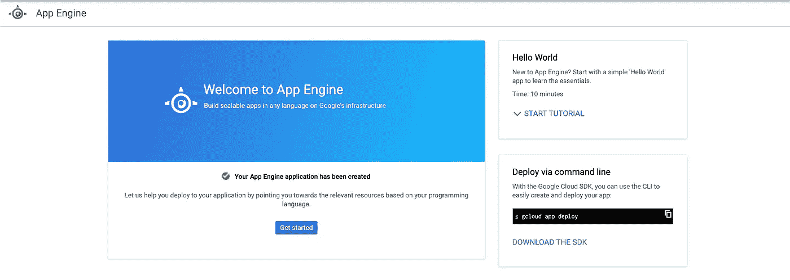
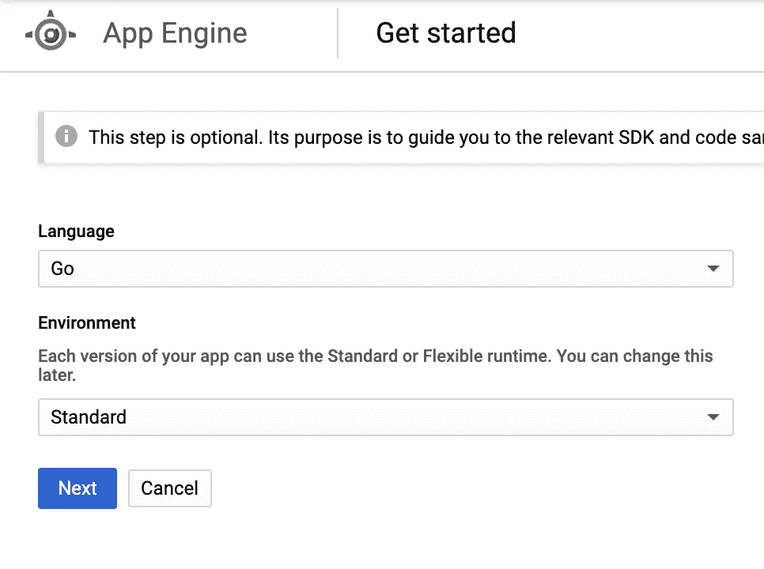
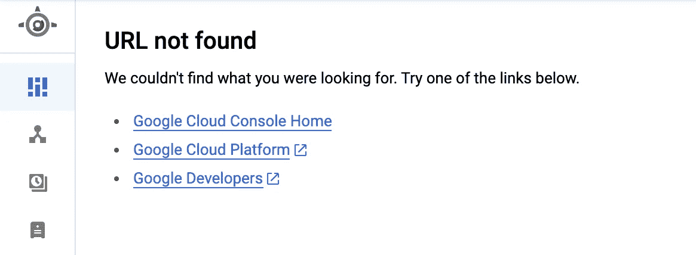
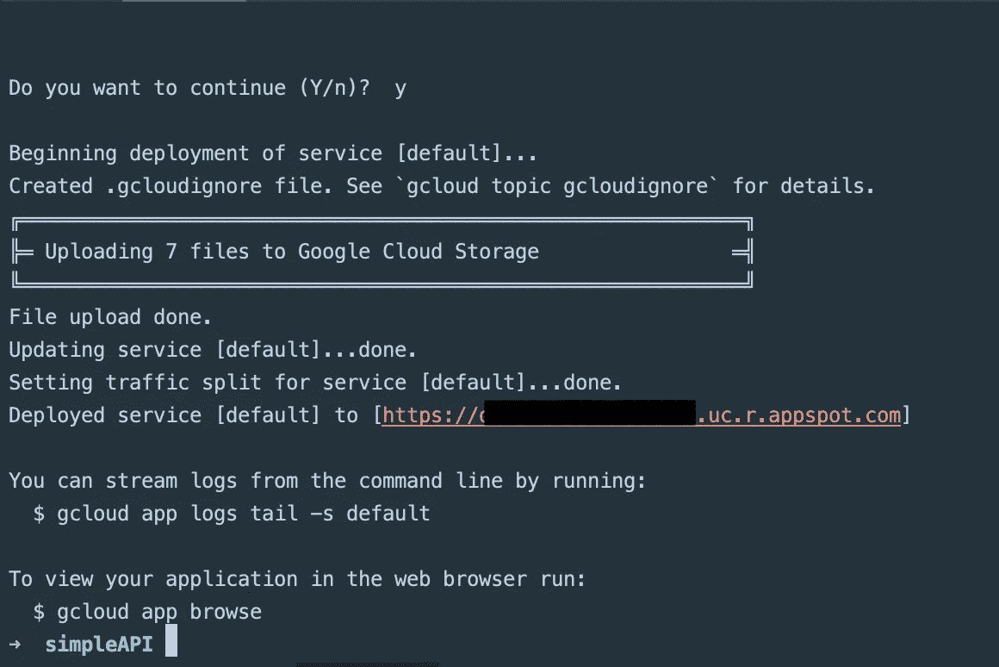
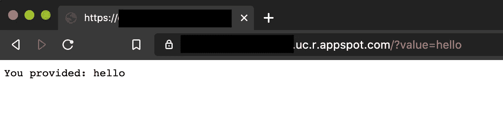

# 如何在 Google App Engine 上创建 Go (Golang) API

> 原文：<https://itnext.io/how-to-create-a-go-golang-api-on-google-app-engine-157e7cd33a93?source=collection_archive---------3----------------------->

## 戈朗

## 一个简单的演练，关于创建一个服务器 API，用 Go 编写，部署到 Google App Engine。


## 为什么选择谷歌应用引擎？

谷歌应用引擎是平台即服务(PaaS)。它旨在简化部署。它是完全受管的、随用随付的、高可用性的，确保快速上市，并支持多种编程语言。

App Engine 允许您构建具有流量分流和防火墙功能的可扩展 web 和移动后端。

## 标准环境与灵活环境

创建应用引擎环境时，您有两种选择:

*   **标准** —应用程序在沙箱中运行。如果您需要快速扩展，或者遇到突发的流量高峰，请选择此选项
*   **灵活—** 实例在计算引擎虚拟机上的 Docker 容器中运行。如果您有稳定的流量，需要扩大或缩小规模，或者需要访问计算引擎上的资源，请选择此项。

[](https://cloud.google.com/appengine/docs/the-appengine-environments) [## 选择应用引擎环境|应用引擎文档

cloud.google.com](https://cloud.google.com/appengine/docs/the-appengine-environments) 

> 需要注意的是，App Engine 应用程序 URL 将根据项目名称命名。因此，在选择您的云项目时，请考虑这一点。

**我们开始吧！**

# 1)在云控制台中设置应用引擎

首先，让我们建立应用引擎项目。

转到[https://console.cloud.google.com/appengine](https://console.cloud.google.com/appengine)。

在一些自动初始化之后，你应该会看到这个屏幕…



App Engine 欢迎屏幕

点击**开始**



应用引擎配置选项

从下拉菜单中选择'**转到**'。

在这个例子中，我们将使用**标准**环境。

接下来的步骤是下载 SDK

[](https://cloud.google.com/sdk/) [## 云 SDK 命令行工具|云 SDK:命令行界面

### 用于与谷歌云产品和服务交互的工具和库。新客户可获得 300 美元的免费积分，用于…

cloud.google.com](https://cloud.google.com/sdk/) 

这使您可以访问命令行工具(CLI)。

## 初始化项目

使用`gcloud`命令，初始化项目。

```
**$** gcloud init
```

在您将应用程序部署到应用程序引擎之前，您的仪表板将如下所示。



部署到应用程序引擎之前的临时屏幕

现在应用引擎已经设置好了，是时候实际编写我们的服务器了。

# 2)在 Go 中编写一个简单的服务器应用程序

我们将使用 Go 版本 1.14。我们还将使用 Go 模块。

有 3 个文件对我们的应用程序至关重要。这些概述如下。

## 运行时配置— app.yaml

我们需要创建的第一个文件是 app.yaml 文件。此文件在应用程序引擎项目中是必需的。

应用引擎运行时的 app.yaml 文件

## Go 模块— go.mod

我们还需要创建我们的 Go 模块。

Go 模块文件

## 主文件— main.go

首先，我们需要在主文件中创建一个获取端口号的函数。**这只是一个函数，它根据当前环境获取我们的 API 正在监听的适当端口号**。

我们使用`os`库来获取端口(如果是环境变量)，如果没有设置环境变量，默认为端口`8080`，并将端口号作为`string`返回给调用者。

获取并设置端口号

## 初始化我们的 HTTP 服务器客户端

让我们创建一个简单的 HTTP 服务器来监听请求。

**首先**我们将使用之前创建的`getPort()`函数获取端口。

然后，我们将编写匿名处理函数来处理请求和响应。

我们的 API 还没有做任何事情，所以它是非常无用的。但是我们将很快开始处理一些参数，就像在实际的 API 中一样。

然后，我们将使用`http.ListenAndServe`调用指示我们的 HTTP 客户端在指定端口上监听和服务我们的应用程序的函数，同时捕捉可能出现的任何错误。

带有服务器代码的基本 main.go 文件

正如您所看到的，回调函数接受两个参数`http.ResponseWriter`来写入响应，以及一个指向请求对象的指针`*http.Request`。

[](https://golang.org/pkg/net/http/) [## http-Go 编程语言

golang.org](https://golang.org/pkg/net/http/) 

## 处理查询参数

这个 API 目前有点太基础了。在现实世界中，您需要处理查询参数来支持我们的 API。

在 Go 中处理查询参数非常简单。你只需要记住，当用`URL.Query()['value']`，**访问一个查询参数时，它总是返回一个项目数组**。因此，请确保通过数组索引来访问该值。

包含服务器代码的完整 main.go 文件，带有处理的查询参数

我们将提供新的函数`**APIHandler**`来处理请求以及 URL 中提供的任何参数，而不是编写一个匿名函数作为对`HandleFunc`函数的回调。

我们的`APIHandler`函数必须符合回调签名，所以我们有两个参数`http.ResponseWriter`和`*http.Request`。

在这个示例函数中，我们不接受`POST`请求，如果是这种情况，我们会提前返回一个 HTTP 错误。

然后我们获取查询参数`value`，如果有的话。如果它是无效的或空的，我们返回，不做任何事情。

如果它存在并且有效，我们将在响应中返回该值(出于演示目的)。

**这是我们编写的基本 API…**

# 3)部署到应用引擎

在前面的步骤中运行`gcloud init`命令应该可以让您登录到 google cloud 帐户。但如果没有，运行`gcloud auth login`登录。

在这一步之后，您需要使用

```
**$** gcloud app deploy
```



通过 CLI 部署到应用引擎

> 这意味着您的 API 已成功部署到所提供的 URL。

# 4)测试应用程序

在谷歌云控制台中找到您保留的应用引擎 URL。

要测试它是否全部启动并运行，您需要做的就是单击链接查看您的工作应用程序引擎应用程序。

您可以通过测试 URL(在浏览器中键入)来查看您的应用程序是否成功解析了查询参数。

```
[https://<INSERT_PROJECT_ID>.uc.r.appspot.com/?value=hello](https://dev-country-173521.uc.r.appspot.com/?value=hello)
```



使用查询参数测试 API

## 就是这样！🚀

现在你有了一个部署在 App Engine 上的基本 API，用 Go 编写，你可以扩展它，让它做一些有用的事情。

> 感谢阅读！有任何问题请在评论中告诉我。