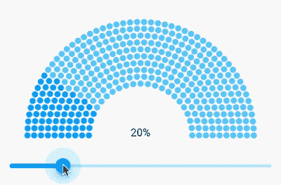

# 如何创建半圆进度条

> 原文：<https://itnext.io/how-to-create-a-half-circle-progress-bar-10d22e2d4b29?source=collection_archive---------3----------------------->

我敢打赌，你们都遇到过这样的情况，当一个设计师做了一个看起来很酷的 UI 时，你只是想“很酷，但是如何实现它”。当 a 在 Figma 看到这个进度条时，我也遇到了同样的情况。



它看起来像什么

好的一面是，在 Flutter 中创建自定义视图非常容易，它们在每个平台上都很棒，但有时你只需要记住你在几何和数学课上学到的所有这些东西。*是的，我们并不总是像某些人想的那样改变按钮的颜色:)*

# 一点点几何学

让我们想一想要实现进度条需要做些什么。首先，我们必须找到一种方法来理解半圆上应该有多少个点。其次，如何在上面放置这些点。

## 计算点数

让我们从简单的开始，如果我们有一条直线，我们需要计算它可以拟合多少个点。答案是你用线的长度除以圆点的直径，然后在它们之间添加填充。就这样了。

我们做同样的事情，但是用一个圆。如果你知道圆的半径，我们就能求出它的长度。公式是`2 * pi * r`，但是我们只需要它的一半，所以对我们来说，公式将是:

```
lineLength = pi * r
```

最后，我们知道点的大小(半径或直径)和它们之间的间距，所以我们可以简单地用线的长度除以带间距的点的大小。所以我们有这样一个公式:

```
dotsNumber = floor(lineLength / (dotDiameter + dotsSpacing))
```

我们用 floor 是因为我们不能画，比如说，点的一半。

## 在圆上放置点

如果我们有一条线，就很容易把点放在上面。我们将从 0 开始，并在画完点后添加`dotDiameter + dotsSpacing`。

不幸的是，在我们的情况下，我们不能这样做。为了在圆上放置点，我们将使用极坐标，并将指定两个坐标:
1。圆点离圆心有多远( **r)** ，
2。圆点的角度 ***(θ)*** 。

有了这些坐标，我们可以很容易地把它们转换成笛卡尔坐标，然后再画。这些公式是:

```
x = circleRadius * sin(dotAngle) + circleCenterX
y = circleRadius * cos(dotAngle) + circleCenterY
```

# 履行

我们已经具备了开始实现进度条的一切条件。我们将使用一个`CustomPainter`类在画布上绘制视图。

## 画家们

让我们添加我们需要的所有参数，并实现`CustomPainter`需要的方法，但不实现`paint`方法。

在这里，我们有自定义进度条的参数，比如点的颜色、点和层之间的间距以及第一个(内)圆的半径。还有，我们创建画师，所以我们不会在绘画方法中每次都实例化他们。

不要忘记实现`shouldRepaint`方法，这样一旦其中一个参数改变，视图就会被重新绘制。

## 画第一个圆

让我们实现用点画圆的`paint`方法。

这里我们得到了圆心，计算出了圆上有多少个点以及它们之间的角度。

这里重要的是，我们从 270°角(`_startAngle`)开始画点，因为我们希望第一个点在左下角并顺时针移动。

此外，看看我们如何计算有多少点应该有不同的(进展)颜色。

## 绘制更多图层

最后就是多加几层。

增加了一个 for-loop，对于每一个刻度，我们只是通过增加圆点的直径和层与层之间的间距来增加圆的半径。

# 包装它

你可以用`CustomPaint`小部件包装你的`CustomPainter`来使用它，但是我认为这不是用户友好的。所以让我们用我们的小部件来包装画师。

这是一个小部件，它封装了关于画师的一些东西，并为必需的参数添加了默认值。这里重要的是我们为`CustomPaint`增加了大小，这样`Painter`就知道画布的大小，并且小部件可以被正确定位，例如，在`Stack`小部件中。

另外，添加了`ClipRect`来剪切父小部件之外的所有内容。当父窗口小部件小于绘制进度条所需的尺寸时，就会发生这种情况。

—

就这些了:)有什么意见或建议可以随时补充分享，发现有帮助就鼓掌！

以下是资源库的链接—[https://github . com/valeryponoparenko/flutter-half-circle-progress-bar](https://github.com/ValeryPonomarenko/flutter-half-circle-progress-bar)