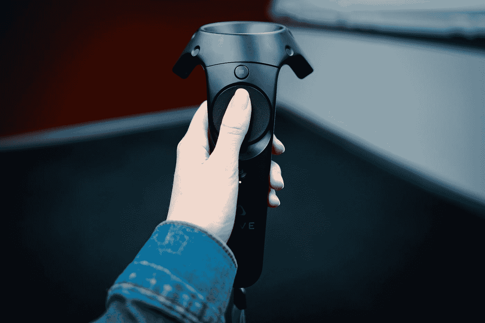

# 如何使用 client-go 创建 Kubernetes 定制控制器

> 原文：<https://itnext.io/how-to-create-a-kubernetes-custom-controller-using-client-go-f36a7a7536cc?source=collection_archive---------0----------------------->

菲德尔·费尔南多在 [Unsplash](https://unsplash.com?utm_source=medium&utm_medium=referral) 上的照片

使用 Kubernetes 定制控制器，您可以通过观察来自 Kubernetes API 对象(如名称空间、部署或 pod)或您自己的 CRD(定制资源定义)资源的事件来进一步开发您自己的定制业务逻辑。

本文的下一部分将深入探讨 client-go 模块，随后是一个定制控制器示例。

**客户端-go 模块**

Kubernetes 将 client-go 用作官方 API 客户端库，提供对 Kubernetes API 服务器提供的 Kubernetes` restful API 接口的访问。像 kubectl 或 prometheus-operator 这样的工具大量使用它。

该库包含几个重要的包和实用程序，可用于访问 API 资源或方便定制控制器。

`kubernetes`包提供了 clientset 和 Kubernetes 资源特定的 clientset 方法，用于访问标准的 Kubernetes APIs。请注意，您不应该使用它来访问 CRD 资源。这个包是自动生成的。

`discovery`包提供了发现服务器支持的 API 组、版本和资源的方法。

`dynamic`包提供了一个动态客户端，可以在任意的 Kubernetes API 资源上执行 restful 操作[1]。请注意，不建议将它用于访问 CRD 资源，因为它不是类型安全的[2]。

`transport`软件包设置安全的 TCP 授权和连接。如果没有明确禁用，默认情况下将使用 HTTP2 协议。底层的 HTTP2 设施由 k8s.io/apimachinery/util/net 提供。由于一些操作需要在客户端和容器之间传输二进制流，例如 attach、exec、portforward 和 logging，`transport`包也建立了流通道。在 HTTP2 可用之前，它使用 SPDY 和 WebSocket 协议。

`plugin` package 为 Openstack、GCP 和 Azure 等云提供商提供授权插件。

`scale`软件包提供了一个多态 scale 客户端，能够获取和更新实现“scale”子资源的任何资源的 scale，只要该子资源运行在可转换为 autoscaling.Scale 的厌恶 Scale 上。注意在 Kubernetes v1.10 之前，它不支持缩放 CRD[2]。

`util`包提供了工作队列、缓冲区等方便的实用工具。

`tool/cache`软件包有许多有用的功能，如共享转换器、反射器、存储和索引器。它提供了一个客户端查询和缓存机制，减少了向服务器请求的数量并保持对事件的跟踪。我将在这个包中详细介绍实用程序提供的工作流，因为它在编写自定义控制器时会做一些准备工作。

客户端-go/工具/缓存/和自定义控制器流

如上图所示，动作有两个主要部分。一个发生在`SharedIndexInformer`中，另一个发生在自定义控制器中。

**1。** Reflector 对 Kubernetes API 服务器执行对象(如名称空间、pod 等)列表和观察查询。三个事件类型**被添加，更新**和**被删除**与相关对象一起被记录。然后它们被传递到 DeltaFIFO。注意:默认情况下，只能检索过去五分钟内发生的事件。

> 给定的 Kubernetes 服务器将只在有限的时间内保存历史变更列表。默认情况下，使用 etcd3 的集群会保留最近 5 分钟内的更改。当所请求的监视操作由于该资源的历史版本不可用而失败时，客户端必须通过识别状态代码`**410 Gone**`，清除其本地缓存，执行列表操作，并从新列表操作返回的`**resourceVersion**`开始监视来处理这种情况。大多数客户端库为这种逻辑提供了某种形式的标准工具。(在 Go 中，这被称为`**Reflector**`，位于`**k8s.io/client-go/cache**`包中。)[3]

**2。** DeltaFIFO 接收与观察事件相对应的事件和对象，然后将其转换为 Delta 对象。这些增量对象被附加到一个队列中等待处理。对于 Deleted，它将检查它是否已经存在于线程安全存储中，这样它就可以避免在某个东西不存在时排队等待删除操作。

**3。**高速缓存控制器(不要与定制控制器混淆)调用 Pop()方法使 DeltaFIFO 队列出队。Delta 对象被传递到 SharedIndexInformer 的 HandleDelta()方法进行进一步处理。

**4。**根据 Delta 对象的动作(事件)类型，对象首先通过 HandleDeltas 方法中索引器的方法保存到线程安全存储中。然后，它通过 sharedProcessor 在 SharedIndexInformer 中的 distribute()方法将这些对象发送到事件处理程序，这些事件处理程序已由自定义控制器通过 SharedInformer 的方法(如 addeventhandlerwithresyngperiod())注册。

**5。**已注册的事件处理程序将对象转换为“名称空间/名称”格式的关键字字符串，如果没有名称空间，则通过 MetaNamespaceKeyFunc()转换为添加和更新事件，deletionhandlingmetanamespace key func()转换为删除事件。然后，这些键被添加到自定义控制器的工作队列中。工作队列的类型可以在`util/workqueue`中找到。

**6。**自定义控制器通过调用自定义处理程序从工作队列中弹出键进行处理。自定义处理程序将调用索引器的 GetByKey()从线程安全存储中检索对象。自定义处理程序是您的业务逻辑所在。

**使用工作队列的简单定制控制器示例**

下面是一个在默认名称空间中监视窗格的自定义控制器的示例。工作队列类型为 RateLimitQueue。在下面的例子中，控制器产生一个工人。调用 controller 时，您可以更改工作线程的数量。运行()。

请注意，下面的示例使用的是 IndexInformer，它只能有一组处理程序来订阅事件。建议改用 SharedIndexInformer。不同之处在于 ShareIndexInformer 提供了像 addeventhandlerwithresyncpregion()这样的方法，允许您添加多组处理程序，因此一个事件请求可以同时分发到不同的处理程序，从而减少 API 请求的数量。

如果你想连接你的 CRD，你可以按照[这个指令](/how-to-generate-client-codes-for-kubernetes-custom-resource-definitions-crd-b4b9907769ba)为你的 CRD 资源生成 clientset，informer 等。然后，您可以在自定义控制器中使用生成的 SharedInformer。

资料来源:k8s.io/client-go/examples/workqueue/main.go

**参考**

[1][client-go v 10.0(github)](https://github.com/kubernetes/client-go/tree/release-10.0)

[2] [推出 client-go 版本 6](https://kubernetes.io/blog/2018/01/introducing-client-go-version-6/)

[3] [Kubernetes API 概念](https://kubernetes.io/docs/reference/using-api/api-concepts/)

[4] [编写 Kubernetes 自定义控制器](https://medium.com/@cloudark/kubernetes-custom-controllers-b6c7d0668fdf)

[5] [深入探究 Kubernetes 控制器](https://engineering.bitnami.com/articles/a-deep-dive-into-kubernetes-controllers.html)

*免责声明:此处表达的观点仅是作者以个人身份发表的观点，绝不代表任何组织的观点。*