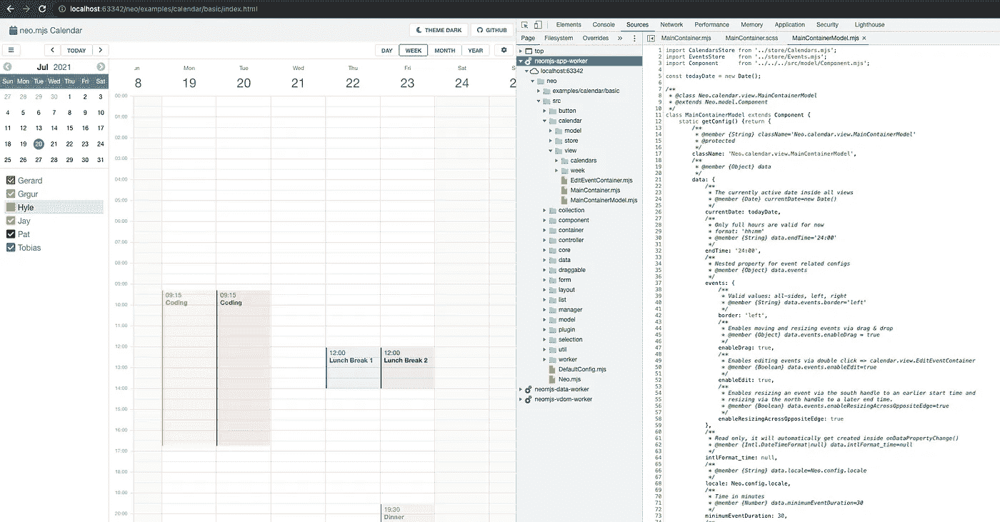

# 如何用 125 行代码创建包含复选框字段和 KeyNav 的列表

> 原文：<https://itnext.io/how-to-create-a-list-containing-checkbox-fields-and-keynav-in-125-lines-of-code-88b440de2951?source=collection_archive---------4----------------------->

我只是需要这个小部件来实现 [neo.mjs](https://github.com/neomjs/neo) 日历。

遵循“应用工作者是主要参与者”的范例，列表存在于应用程序 [web 工作者](https://developer.mozilla.org/en-US/docs/Web/API/Worker)的范围内。

# 内容

1.  介绍
2.  代码
3.  包含许多项目或经常更改的列表
4.  日历实施的状态
5.  在线演示
6.  最后的想法

# 1.介绍

虽然这个任务一开始听起来并不简单，但实际上使用 UI 框架很容易实现。

让我们先快速看一下结果:

# 2.代码

创建新组件时要做的第一件事是选择最合适的基类。我们想创建一个增强列表，所以[列表。底座](https://github.com/neomjs/neo/blob/dev/src/list/Base.mjs)是完美的选择。这个基类给了我们一个现成的选择模型和键盘导航。

日历实现使用一个顶级视图模型，因此我们可以从那里绑定商店。列表不需要自己的视图模型。

我们正在覆盖`createItemContent()`并为每个记录创建一个复选框字段。创建了 field 实例后，我们就有了 vdom 属性，只需返回这个属性，并为编辑图标添加一个 I 标签。

添加一个`destroy()`方法也很重要，因为我们确实想销毁复选框字段实例，以避免这种情况下的内存泄漏。

我们向每个复选框添加一个`change`监听器，并更新`onCheckBoxChange()`中的相关记录字段。日历周视图监听记录更改，并将自动删除非活动日历的事件。

我增强了[选择。ListModel](https://github.com/neomjs/neo/blob/dev/src/selection/ListModel.mjs) 一点，这样我们可以选择在视图类中直接使用`onKeyDownEnter()`方法。

现在，我们可以使用箭头键浏览我们的复选框列表项目，一旦我们点击“Enter”，我们只需切换复选框选中的配置。这将触发更改事件，并更新我们匹配的日历记录。

任务完成。

# 3.包含许多项目或经常更改的列表

日历列表是相当静态的，因为用户很少会创建新的日历或重新加载列表。

对于更动态的用例，您确实希望将 checkbox 实例存储在 items 数组中。

然后，当(重新)加载存储时，您将检查我们是否已经在给定的索引处有了一个 checkbox 实例，如果有，就用我们在 create 调用中使用的相同值调用`checkboxInstance.set()`(除了模块和侦听器)。

是的，尽可能重用 JS 实例是一种设计模式。

我用这种方式创建了一个标签来增强小部件。如果您希望看到这种情况发生，请添加评论:

 [## calendar.view.calendars.List:将复选框字段存储在 items 数组中，并在…

### 对于这个相当静态的用例来说并不真正需要，但是这可能是一个很好的学习体验来看看它是如何工作的…

github.com](https://github.com/neomjs/neo/issues/2502) 

【**快速更新**已经实现了这个逻辑。你可以把这篇文章里面的要旨版本与:
[src/calendar/view/calendars/list . mjs](https://github.com/neomjs/neo/blob/dev/src/calendar/view/calendars/List.mjs)进行对比

# 4.日历实施的状态

完成日历是 v2.3 版本的主要重点。

我们已经有了周、月、年视图的无限滚动。基于拖放的移动或调整操作效果非常好。

日历是高度配置驱动的，所以你可以用很多方式定制它。这也适用于运行时！

接下来的步骤是:

1.  添加编辑表单以添加、编辑或删除日历
2.  增强事件编辑表单
3.  通过拖放添加新事件
4.  添加日视图
5.  使日历完全响应(移动)

完成后，日历就可以用于您的应用程序了。

我强烈建议深入研究日历代码库:

[https://github.com/neomjs/neo/tree/dev/src/calendar](https://github.com/neomjs/neo/tree/dev/src/calendar)

即使是有经验的 Javascript 开发人员也可以在这里学到很多东西！

# 5.在线演示

这里是在线演示(目前仅**桌面**)。

**分销/生产**
基于缩小的 webpack 构建，不带源地图:
[neo.mjs/dist/production/examples/calendar/basic/index.html](https://neomjs.github.io/pages/node_modules/neo.mjs/dist/production/examples/calendar/basic/index.html)

**开发模式**(仅限 Chromium 或 Safari Tech 预览版)
直接在浏览器中运行真正的 JS 代码，不需要源代码:
[neo.mjs/examples/calendar/basic/index.html](https://neomjs.github.io/pages/node_modules/neo.mjs/examples/calendar/basic/index.html)

**提示**:检查 DOM。非活动视图将被删除，但您仍然可以在设置菜单中更改它们的状态。更改将被应用到虚拟 dom，卡激活将重新装载现有的 JS 实例。

**提示 2** :检查开发工具中的源代码(在开发模式下效果最佳)。所有组件都在 app worker 范围内。

# 6.最后的想法

如果您不熟悉 neo 项目，您可以在此处找到存储库:

 [## 近地天体

### neo.mjs 使您能够使用一个以上的 CPU 创建可扩展的高性能应用程序。不需要照顾一个…

github.com](https://github.com/neomjs/neo) 

如果你需要帮助来提高速度，加入 slack 频道是值得的:

 [## 在 Slack 上加入 neo.mjs

### Slack 是一种与团队沟通的新方式。它比电子邮件更快、更有条理、更安全。

join.slack.com](https://join.slack.com/t/neomjs/shared_invite/zt-6c50ueeu-3E1~M4T9xkNnb~M_prEEOA) 

问候&快乐编码，
托拜厄斯