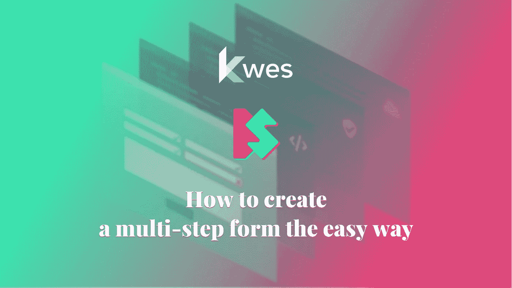
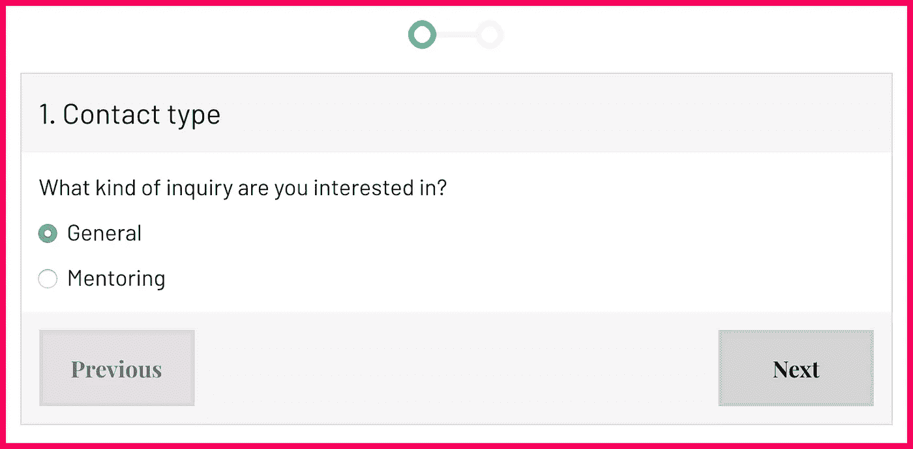

# 如何以最简单的方式创建多步表单

> 原文：<https://itnext.io/how-to-create-a-multi-step-form-the-easy-way-c41e3745ed51?source=collection_archive---------2----------------------->

## 静态表单

## 了解如何通过几个简单的步骤添加多步表单



最近我想在我的网站上添加一个多步表单。由于我的网站运行在静态页面生成器 Hexo 上，我对如何执行这项任务有些疑惑。我的网站上已经有了一个静态表单，我不想花太多时间开发像步骤、显示/隐藏逻辑或验证这样的功能。

我很高兴地得知 [Kwes 现在提供了多步表单功能](https://kwes.io/docs/multistep-forms)。在我告诉你我是怎么做的之前，让我们看看什么是多步表单，有时也称为多页表单。

# 多步表单

多步表单是被分成多个部分的长表单。这样做的原因是为了使表单更容易完成。每一步都代表相互关联的分组输入，因此用户不会被表单的长度吓到。对于用户来说，一步一步地填写信息可能会更舒服，因为他们的大脑当时应该处理更少的字段。

您可能在结账或发货表单上见过多步表单。多步骤表单也用于向导，如注册表单，并且最近多步骤登录表单的出现越来越多。这些只是使用它们的常见场景，但是每一个更长的表单都可能被分解成片段。

> 在转换到多步形式之前，你可能需要进行 A/B 测试，以确保你的转换率不会下降。

转换率是多步表单最大的好处之一。据信多步形式具有更好的转化率。其他的好处包括第一印象，它不会给用户带来太大的压力，还有进度条，它鼓励用户继续处理表单。

所有这些好处都应该有所保留。没有真实的数字，你无法确定。对于大多数用户来说，包含许多输入字段的单步表单通常被认为是一个很大的障碍。作为权衡，您应该减少可能不理想的输入数量。

# 使用 Kwes 添加多步表单

Kwes 文档使跟踪和创建多步表单变得非常简单。

在此之前，让我们刷新一下我们的记忆[如何使用 Kwes 添加静态表单](https://dev.to/starbist/how-to-add-a-contact-form-to-a-static-website-2oji):

*   从 Kwes 仪表板添加网站。
*   从 Kwes 仪表板添加表单。
*   在结束`body`标签之前添加必需的`script`标签:`<script src="https://kwes.io/js/kwes.js"></script>`。
*   添加带有所需的`kwes-form`类的包装元素。
*   使用 Kwes 仪表板中提供的`action` URL 添加`form`元素。
*   添加`input`字段和验证规则。

现在代码看起来是这样的:

```
<html>
  <body>
    <div class="kwes-form">
      <form method="POST" action="path/to/kwes">
        // form code
      </form>
    </div>
    <script src="https://kwes.io/js/kwes.js"></script>
  </body>
</html>
```

为了启用多步表单，我在`form`元素中添加了`multi-step`属性。

*我不得不将* `*true*` *值添加到* `*multi-step*` *属性中，以使我的 HTML linter 满意。*

接下来，我用`form-step`元素包装相关的输入，将表单分成几个步骤。就是这样！要使用 Kwes 制作多步骤表单，您需要做的就是在每个步骤中添加一个包装器 div。我从来不知道会这么容易。

我的表单只有两个步骤，所以我只有两个`form-step`元素。第一步，我询问有关联系人类型的问题，下一步，我收集联系人信息。

```
<div class="kwes-form">
  <form method="POST" action="path/to/kwes" multistep="true">
    <form-step>
      // form code
    </form-step>
    <form-step>
      // form code
    </form-step>
  </form>
</div>
```

当然，这还不是全部。Kwes 还有其他令人印象深刻的特性。这些是我在表格中包含的内容:

*   自定义标题，
*   自定义样式，
*   隐形，
*   逻辑可见性切换，以及
*   [动画 SVG 进度条](https://dev.to/starbist/animated-wizard-progress-23li)。

# 自定义标题



Kwes 提供了向每个步骤添加定制标题——当前步骤的标题。有两种类型的头:简单的和复杂的。

简单标题用于文本标题。我在表格中添加了简单的标题。

```
<form-step heading="1\. Contact type">
  // form code
</form-step>
<form-step heading="2\. Contact information">
  // form code
</form-step>
```

如果你想添加图标、图形或者任何不仅仅是标题文本的东西，那么你可以使用一个复杂的标题。所有的自定义标题内容都应该添加到`<div slot="heading"></div>`元素中。建议将该元素作为`form-step`元素的第一个子元素。

# 自定义样式

向 Kwes 表单添加定制样式非常简单。您可以使用带有前缀`kw-`的类来添加定制样式。

例如，您可以使用`kw-multistep-footer`类来定制步骤部分的页脚，就像我在我的站点上所做的那样。

# 大衣料

我使用了 Kwes 提供的隐藏技术来隐藏未编译的表单。这意味着表单在被 Kwes JavaScript 文件编译之前是不可见的。为此，将`v-cloak`属性添加到`kwes-form`包装元素，然后使用下面的 CSS 代码片段隐藏表单:

```
[v-cloak] {
  display: none;
}
```

# 逻辑可见性切换

Kwes form builder 的另一个重要特性是能够根据其他字段值切换输入字段的可见性。这种显示/隐藏逻辑行为是我动态创建第二步所需要的。可见性是通过向元素添加`kw-show`属性来实现的。在我的情况下，如果联系人类型为“一般”，我会隐藏与指导相关的字段。

```
<div kw-show="fields.step == 'Mentoring'">...</div>
```

# 动画 SVG 进度条

进度条通常可以帮助用户了解在提交之前还有多少步骤。因为这个元素仅仅作为一个可视的指示器，我决定把[做成一个小小的 SVG，点击一下就可以激活](https://dev.to/starbist/animated-wizard-progress-23li)。该动画是 SVG 路径笔画的 CSS 动画。


下面是完整的表单，包括 SVG 和 JavaScript 代码:

```
<div class="kwes-form form" v-cloak="true">
  <svg class="steps" viewBox="0 0 850 250" >
    <path d="m225 125c0 50-50 100-100 100s-100-50-100-100 50-100 100-100 100 50 100 100h400c0-50 50-100 100-100s100 50 100 100-50 100-100 100-100-50-100-100" fill="none" stroke="#f5f5f5" stroke-linecap="round" stroke-linejoin="round" stroke-width="50"/>
    <path class="steps__path" d="m225 125c0 50-50 100-100 100s-100-50-100-100 50-100 100-100 100 50 100 100h400c0-50 50-100 100-100s100 50 100 100-50 100-100 100-100-50-100-100" fill="none" stroke="#12e09f" stroke-linecap="round" stroke-linejoin="round" stroke-width="50"/>
  </svg>
  <form method="POST" action="path/to/kwes" multistep="true">
    <form-step heading="1\. Contact type">
      <label class="radio">What kind of inquiry are you interested in?</label>
      <div class="kw-radio-group">
        <input id="General" type="radio" name="step" value="General" label="General" checked="checked" />
        <input id="Mentoring" type="radio" name="step" value="Mentoring" label="Mentoring" />
    </div>
    </form-step>
    <form-step heading="2\. Contact information">
      <div kw-show="fields.step == 'Mentoring'">
        <label class="radio">Are you interested in career mentoring or technical mentoring?</label>
        <div class="kw-radio-group">
          <input id="Career" type="radio" name="mentoring" value="Career" label="Career" checked="checked" />
          <input id="Technical" type="radio" name="mentoring" value="Technical" label="Technical" />
        </div>
        <div class="desc">
          <p><small>Career mentoring means I help you make decisions regarding your career.</small></p>
          <p><small>Technical mentoring means I help you gain new skills or improve the current skill level.</small></p>
        </div>
      </div>
      <label for="Name">What is your name?</label>
      <input id="Name" type="text" name="name" rules="required" />
      <label for="Email">Please tell me your email address<small>(I would use it only for direct communication)</small>.</label>
      <input id="Email" type="email" name="email" rules="required|email|max:255" />
      <div kw-show="fields.step == 'Mentoring'">
        <label for="Note">Tell me why I should mentor you?</label>
      </div>
      <div kw-show="fields.step != 'Mentoring'">
        <label for="Note">What is your message?</label>
      </div>
      <textarea id="Note" name="note" rules="required" rows="6"></textarea>
      <div kw-show="fields.mentoring == 'Technical'">
        <label for="Note2">Tell me which skills do you want to aquire or approve?</label>
        <textarea id="Note2" name="note2" rules="required_if:mentoring,Technical" rows="6"></textarea>
      </div>
    </form-step>
  </form>
  <script>
  document.addEventListener('click', function (e) {
    for (var target = e.target; target && target !== this; target = target.parentNode) {
      if (target.matches('.kw-multistep-button')) {
        var $form = document.querySelector('.form');

        if (target.classList.contains('kw-multistep-button-next')) {
          $form.classList.remove('step1');
          $form.classList.add('step2');
        }

        if (target.classList.contains('kw-multistep-button-previous')) {
          $form.classList.remove('step2');
          $form.classList.add('step1');
        }

        break;
      }
    }
  }, false);
  </script>
</div>
```

# 结论

完整的功能表可以在我的[联系页面](https://www.silvestar.codes/contact/)找到。

我注意到了一个额外的好处——大大减少了垃圾邮件。使用 Kwes 添加多步表单的其他好处有:

*   我不必花太多时间在设计上，
*   我不需要在验证上花太多时间，而且
*   我不必花太多时间在开发上。

有了 Kwes，一切都变得如此简单，并按预期工作。你应该试一试。

*原载于 2020 年 2 月 5 日*[*https://dev . to*](https://dev.to/starbist/how-to-create-a-multi-step-form-the-easy-way-51cp)*。*