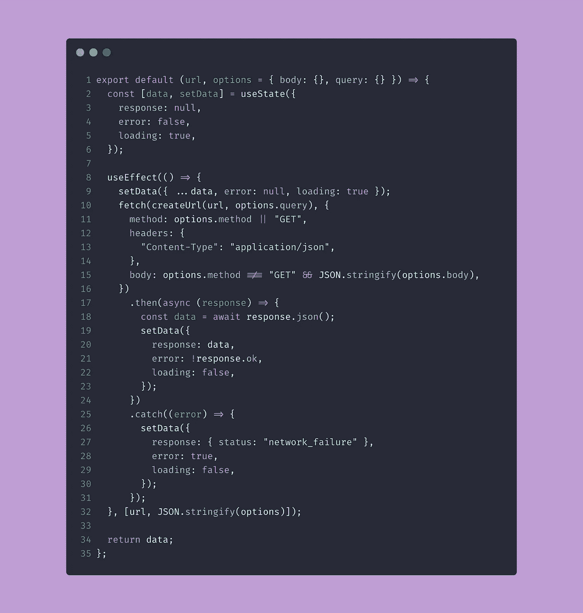
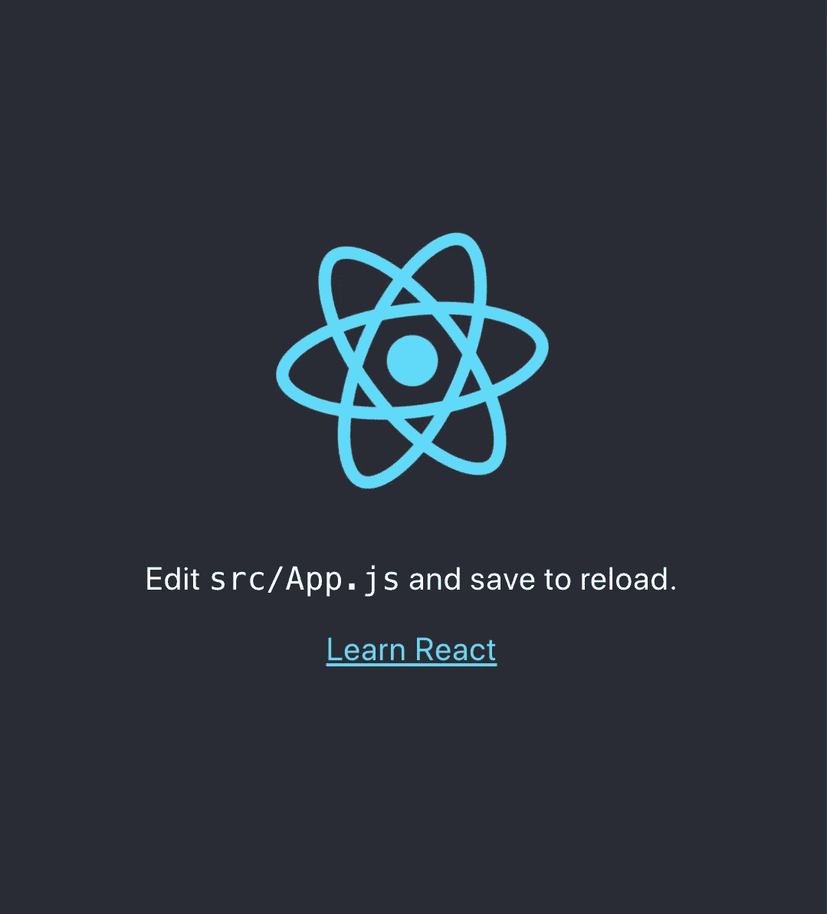
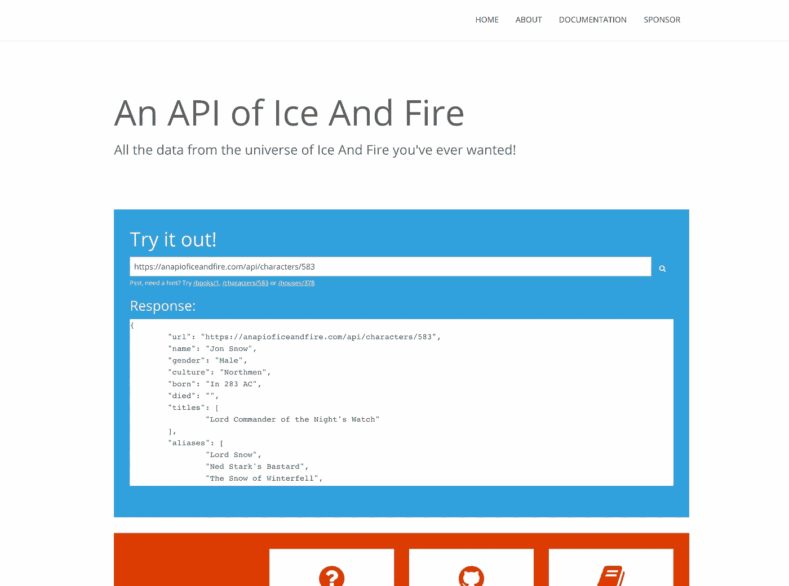
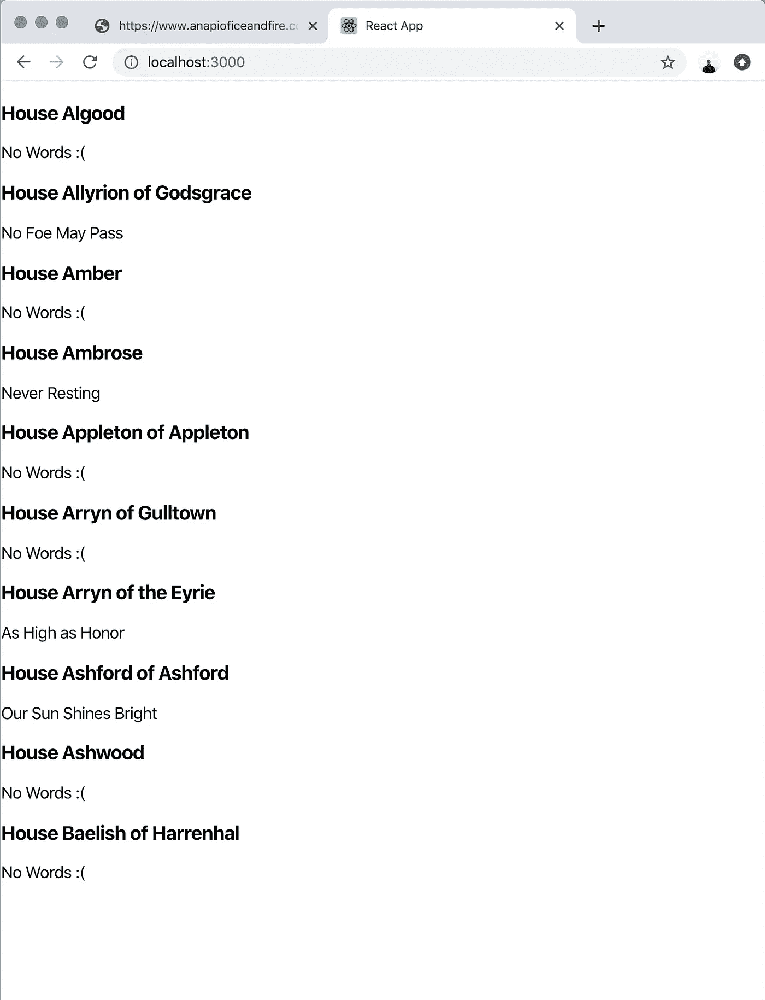
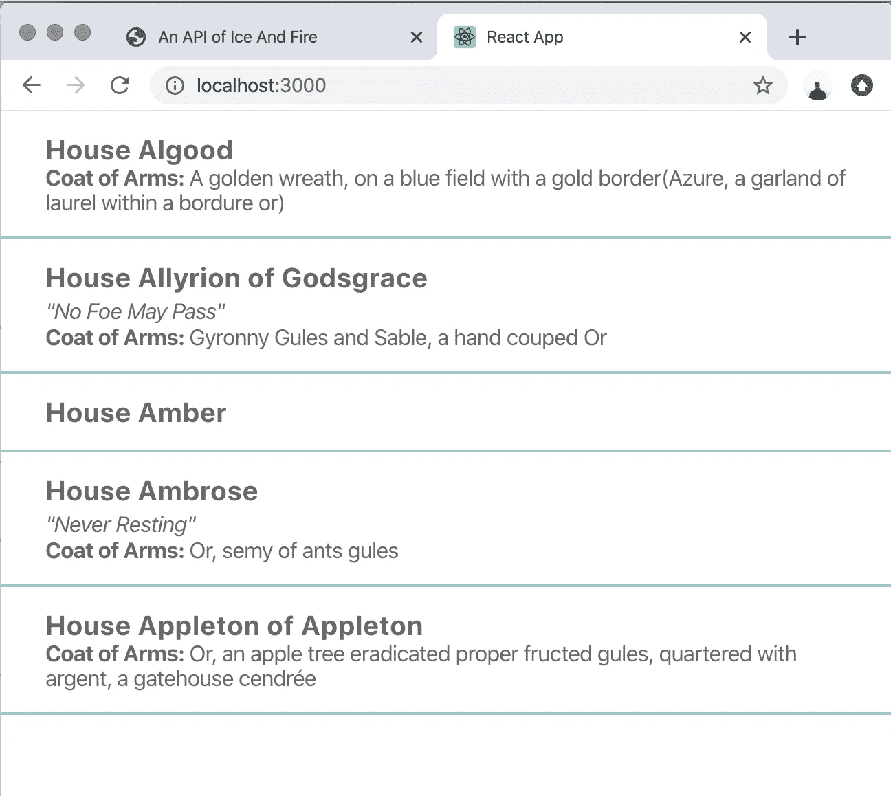
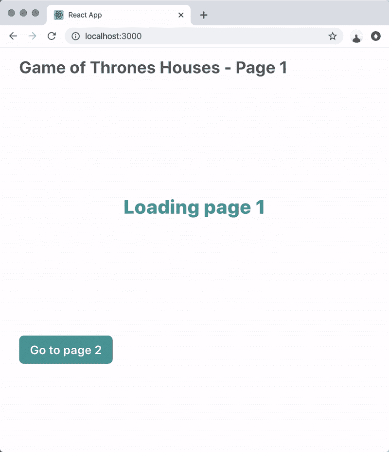

# 如何构建一个 React 钩子来调用 AJAX

> 原文：<https://itnext.io/how-to-create-a-react-hook-to-make-ajax-calls-5d5052e08269?source=collection_archive---------1----------------------->

今天，我们将创建一个简单的钩子，它可以在我的 React 项目中每天帮助我，包括 web 和 react-native:一个钩子可以进行 Ajax 调用并返回响应。

为了测试这个钩子，我们将构建一个简单的应用程序，显示由[https://www.anapioficeandfire.com](https://www.anapioficeandfire.com)提供的《权力的游戏》中的所有房子。

总而言之，这就是我们在本文中要做的事情:

*   创建新的 React 挂钩
*   这个钩子将接受一个要获取的 URL 和一系列选项(查询、方法和主体)
*   这个钩子将返回一个带有 AJAX 响应、加载和错误布尔值的对象
*   每次钩子的一个选项改变时，钩子将再次获取 URL
*   创建一个演示应用程序来测试这个 useFetch 挂钩

# 首先，让我们创建骨架应用程序☠️

我想在过去的几年里我已经做了 300 次了，但是我总是发现自己在谷歌上搜索正确的命令来使用 create-react-app。我想我对这个简单的命令有某种选择性遗忘…所以这部分更多是给未来的我而不是你:)

安装完所有正确的模块后，我们进入 [https://localhost:3000](https://localhost:3000) ，应用程序开始运行:)

# 创建钩子

让我们首先在`src`中创建一个名为`hooks`的文件夹，并在其中创建一个名为`useFetch.js`的文件。

我们将在文件中放入:

让我们一起来看看我们钩子的代码。这里我不打算解释两个效用函数，但是如果你需要任何帮助，你可以随时[联系我](https://twitter.com/urcoilbisurco)并询问:)

我们将一部分一部分地探索这个钩子:

钩子将接受两个参数:

*   一个网址
*   一个“选项”对象，里面会有
*   一个 HTTP 方法(GET，POST)
*   一个体，如果你要用 POST 方法的话
*   一个查询，您将在其中放置 AJAX 调用的所有查询参数。

**重要的**:我只指定了 GET 和 POST 方法。这是因为该挂钩仅用于**获取**数据，而不是更新/创建资源。通常你应该总是使用 GET 请求来获取数据，但是由于互联网上的一些 API 也使用 POST 请求，所以我决定也添加这个。

我们将使用钩子 **useState** 来存储一些内部变量，这些变量在钩子结束时将被返回给 React 组件。我们将用一个带有 3 个参数的对象来初始化状态:

*   响应，它将包含调用的 API 的 JSON 响应
*   错误，如果响应状态不正常
*   如果钩子仍然在获取请求，这将是真的。因为下一步我们将调用请求，所以 loading 已经被设置为 true

# 内部使用效果

让我们继续探索钩子。这里我们将使用钩子 **useEffect** 来做一些事情，只有当参数发生变化时；如果组件更改了 url 或选项(查询、主体、方法)中的任何参数，则 **useEffect** 函数将重新运行。

我们使用 JSON.stringify 返回我们的**选项**值的字符串。这样，即使对象是嵌套的，useEffect 也不会有任何问题。

我们要做的第一件事是用以下方式更改数据状态**的值:**

*   加载设置为真
*   错误设置为假
*   响应仍然是以前的响应(第一次为空)。如果您希望即使在获取新数据时也显示旧数据，这将很有帮助。

# 去营救🚀

我们将使用 **fetch** 函数来进行 AJAX 调用。我们将添加头`Content-Type`到`application/json`，因为我们将只使用请求 json 参数的 API。

请注意:如果响应不正常(像 axios 一样)，fetch 不会抛出错误，而是仍然解析成功，但是会将 response.ok 设置为 **false** 。因此，我们需要检查已解析的数据，看看 response.ok 是真还是假，并相应地设置`error`状态字段。

每当 fetch 方法解析或抛出错误时，我们将使用所有正确的字段更新数据状态，并将`loading`设置为 false。

## 就这样，✨

这是关于钩子的一切，现在我们只需要使用它🚀

# 让我们构建我们的演示应用程序吧！

我们将使用“冰与火的 API”[https://www.anapioficeandfire.com/](https://www.anapioficeandfire.com/)创建一个简单的分页应用程序，显示“冰与火之歌”系列中所有不同的房子。

注意:所有代码都可以在[我的 Github 页面](https://github.com/urcoilbisurco/useFetchDemoApp)找到。如您所见，我从样板文件 create-react-app 中删除了一些未使用的文件。还要注意，这是最终结果，在本文的最后。

我们去`src/App.js`把内容换成这样:

这就是结果。

我们还没有添加任何样式，所以它很漂亮**丑**。我们可以通过在`src/App.css`中添加一些 CSS 来解决这个问题(我们不会使用任何花哨的样式组件或 scss 模块，也不会使用酷孩子目前正在使用的任何东西，因为这只是一个演示)。

那就好多了！

# 支持分页(和使用 Fetch 的查询)

所以现在我们只展示了 10 栋房子。没关系，但我认为我们可以做得更好。我们将改变代码，以添加一些按钮，前往下一页(或上一页)，并查看新的结果✨

## 但是首先，添加一些风格

让我们添加一些我们将在接下来的步骤中需要的额外样式:打开 src/App.css 并用以下内容替换内容:

# 使用 useState 处理 currentPage 变量

我们将使用一个`currentPage`变量来了解应用程序中显示的当前页面，所以让我们在我们的`src/App.js`中设置它

我们将 currentPage 的值初始化为 1，还编辑了 useFetch 查询对象的`page`值，以使用 currentPage 代替之前的常量 1。

现在，让我们在 JSX 中添加一些额外的部分。我们将:

*   添加标题，里面有当前页码；
*   在房屋列表下添加分页部分，用 2 个按钮来改变页面；
*   移动加载 div，这样标题和分页部分将始终可见。

我们准备好了！让我们在 localhost:3000 上试试

让我们回顾一下我们今天所做的事情:

*   创造了一个新的反应钩✔️
*   这个钩子将接受一个要获取的 URL 和一系列选项(查询、方法和主体)
*   这个钩子将返回一个带有 AJAX 响应、加载和错误布尔值✔️的对象
*   每次钩子的一个选项改变时，钩子将再次获取 URL ✔️
*   创建一个演示应用程序来测试这个 useFetch 挂钩✔️

我们还可以做得更好。

在接下来的几周内，我将发布一个新的教程来增强 useFetch:

*   自动转换响应
*   有条件地调用 AJAX 调用(现在它立即调用它)
*   添加默认响应(如果您不想立即调用 API，这很有用)
*   添加对 redux 和 dispatch 的支持

一如既往，如果您有任何问题，请在 Twitter 上发送[消息或关注我](https://twitter.com/urcoilbisurco)💛