# 如何创建带有文本分类的情感分析器— Python (AI)

> 原文：<https://itnext.io/how-to-create-a-sentiment-analyzer-with-text-classification-python-ai-f3a5d10922c5?source=collection_archive---------1----------------------->


斯蒂芬·道森在 [Unsplash](https://unsplash.com/search/photos/dashboard?utm_source=unsplash&utm_medium=referral&utm_content=creditCopyText) 上拍摄的照片

评论是网络上最毒的东西之一，但也有一些正面的，对吧？—使用人工智能创建一个基于文本分类的情感分析器如何？

我们去看看。

我们试图回答的问题是:一个特定的评论表达了积极的情绪还是消极的情绪？

也许你不熟悉 AI 和机器学习概念，所以，让我用一种极其概括的方式解释一下，它是如何工作的。

当我们谈论机器学习时，它相对类似于我们自己的学习过程。

> 你如何识别一种动物是猫还是狗？

我知道这样想起来很奇怪，但会有意义的。当你第一次看到那只动物时，有人告诉你:**这是一只猫**。


这是一只猫。

然后你大脑会联想到这种动物的一些特征，即使你没有注意到。

在一些不同类型的猫的曝光之后，你将能够认出任何一只猫，包括像一只画的猫的抽象。


还是猫…

因此，可以很公平地说，我们的经历塑造了我们看待事物的方式。人工智能模型也可以有这些经验，但我们将使用数据，而不是实际的事实。

所以，我们的第一步是收集关于评论的数据，幸运的是一些公司提供了几个开放的数据集。我们将使用三个不同的数据集:IMDb，亚马逊和 Yelp。

你可以在我的 [GitHub](https://github.com/gabrielschade/IA/tree/master/ClassificacaoComentariosComNaiveBayes/Datasets) 或者我的 [Azure 笔记本项目](https://notebooks.azure.com/gabriel-schade/projects/py-sentiment-analysis/tree/Data)中访问它们，这是你将要关注的。

现在，是时候创建开发解决方案的环境了。Azure 笔记本电脑将很好地完成这项任务。

创建您的帐户后，您将能够创建一个新项目。

Azure 笔记本项目在某些方面像 GitHub 仓库一样工作，它们可以是公共的或私有的，有一个 README.md 文件，目的完全相同。

新的项目窗口非常简单明了，如下图所示:

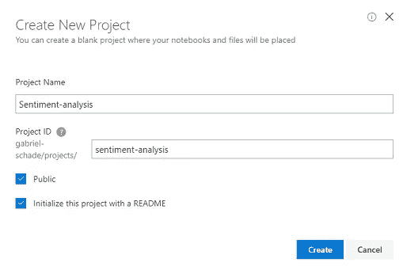

现在您处于项目环境中，您将能够创建新的文件夹、文件和笔记本。正如我之前所说，它就像一个存储库，所以，你可以看到*星*和*克隆*按钮。

让我们创建一个名为 *Data* 的文件夹，并上传我们的数据集，如下图所示:


# 规划人工智能算法解决方案

为了解决这个问题，我们将实现一个分类算法，我们将使用一个名为 Scikit-learn 的 Python 库来简化它。这个库包含了一些人工智能算法的实现，包括一些分类算法。

你可以将人工智能解决方案分成三个不同的步骤:

1.  预处理；
2.  培训；
3.  评价；

第一步是收集、清理和组织你的数据。幸运的是，所选的数据集已经相当干净了。

第二步是通过示例使用清理后的数据集来训练模型。通过这样做，您将生成一个分类器模型。

这个模型包含一个预测功能，可以接收任何新的评论，并将其分类为正面或负面的评论。

最后一步是当你验证你的模型是否足够好来解决预定的问题。没有一步一步的验证，因为这完全取决于问题的意图。

# 让我们编码我们的算法

在上述所有步骤之前，您需要创建笔记本本身，只需点击*添加*按钮并选择第一个选项:笔记本。

新的笔记本窗口也非常简单，对我们来说，只需要选择一个名称，然后选择 Python 3.6 作为笔记本语言。

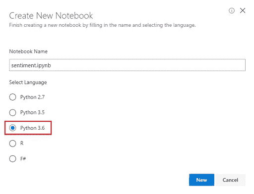

让我们从创建这个解决方案所需的库导入开始:

在 Azure Notebook 中，您可以混合 markdown 标题和代码，使其更有组织性:

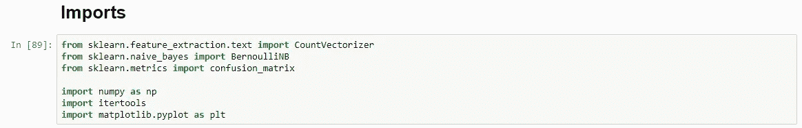

现在，我们可以编写打开所有数据集并将它们合并为一个的函数。使用 Python 非常简单:

您需要注意到,`root`变量包含数据集的文件夹名，在我的例子中是`Data`,但是您可以随意使用任何文件夹名。

这里另一个有趣的事情是，我们使用了断行符 scape( `\n`)将我们的数据分割成一个数组。

使用笔记本存储代码的另一个很酷的事情是，你可以与它交互，例如，我们已经可以调用`get_all_data`函数并查看结果:

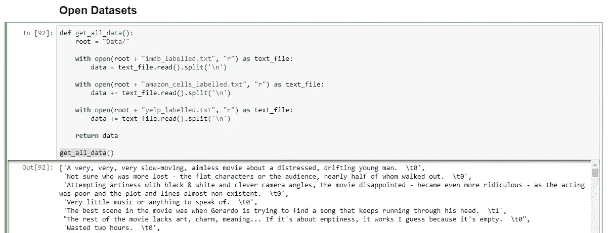

说到`get_all_data`的结果，我们来查看一下我们数据集的一些数据:

```
Wow... Loved this place.	1
Wasted two hours.  	0
```

假设第一个是对一个地方的正面评价，可能是一家餐馆，而第二个是对一部电影的负面评价，这是很公平的。

但是让我们注意一下数据结构，有一个文本评论，后面是一个制表符(`\t`)和一个代表每个评论实际分类的数字。

我们将通过制表符值(`\t`)来分割每一行，这样我们将创建一个数组，其中位置 0 包含文本，位置 1 包含分类。这会让我们以后的工作更容易。

正如我之前说过的，我们可以单独运行每个函数，所以，让我们来看看结果:

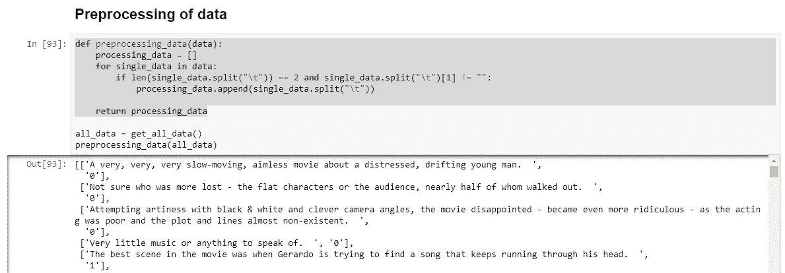

完成第一步的最后一个任务是将数据集分成两个不同的集合，每个集合用于下一个过程:训练和评估。

我们需要使用一个比率来划分数据，通常它可以在 70–80%的培训比率和 30–20%的评估比率之间变化，但在这种特殊情况下，我们将使用 75%的比率来进行培训，因此，让我们划分它:

你可以看到上面的代码基于`training_ratio`变量分割数据，所以，在我们完成实验后，你可以回到这里，改变这个值，看看它会如何执行。

现在有了两个不同的数据集，我们准备进入下一步:训练过程。

在这样做之前，让我们将整个第一步简化为一个函数:

## 稍微后退一步来理解这个理论

在我们实施培训流程之前，了解它是如何工作的很重要，对吗？—没有它，它将只是一个由外部库实现的神奇解决方案。

我们需要识别一个基于文本的情感，怎么做呢？—答案是:*词频。*

为了实现它，我们首先需要用我们的算法创建一个所有已知单词的列表。让我们使用一个较小版本的数据集。假设我们的模型知道的所有单词是:

`hello, this, is, a, good, list, for, test`

现在，我们需要用这些单词输入一些数据文本，让我们试试:

`this is a good test`

这里的过程非常简单，我们将创建一个新的列表，将所有已知单词替换为它们在输入中出现的次数，如下图所示:

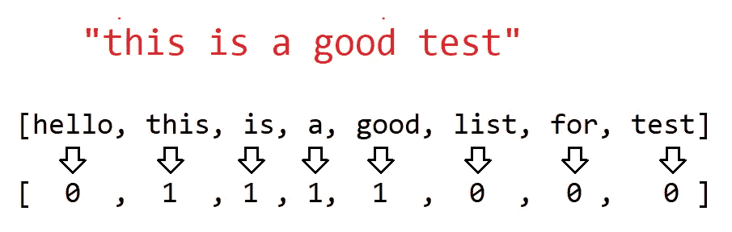

这类似于从文本到有形的数学值的转换，这要容易得多。让我们用`good`这个词做个测试。

这个词听起来很正面，对吧？但是我们的算法怎么能知道呢？

这只是一个简单的数学问题，我们的模型会计算单词`good`在一个肯定句中出现了多少次，然后用这个数字除以这个单词出现的次数。它会给这个词打正分。

这个过程叫做**矢量化**。

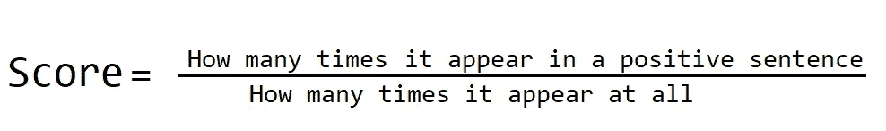

要计算负分，您可以简单地使用 1-正分。

这两个分数计算出来后，**朴素贝叶斯**算法会用它们来计算句子分数。

这种算法在没有任何上下文的情况下单独评估每个单词，这就是你的名字中包含 naive 的原因。

现在，关于理论已经足够了，让我们回到代码上来！

# 编码培训流程

我们不需要担心上面提到的所有细节，我们可以假设我们会收到一个能够将文本转换为数值的矢量器。

因此，让我们将我们的训练数据集分成两个不同的列表，一个用于句子，另一个用于结果。

然后，让我们使用`fit_transform`函数对句子进行矢量化，最后让我们返回一个`BernoulliNB().fit`函数调用的结果。

`BernoulliNB`(朴素贝叶斯的缩写)将生成我们的分类模型。现在我们可以使用该模型的`predict`函数来尝试预测任何文本的情感，让我们尝试一个例子:

让我们在笔记本上看看它是如何工作的:

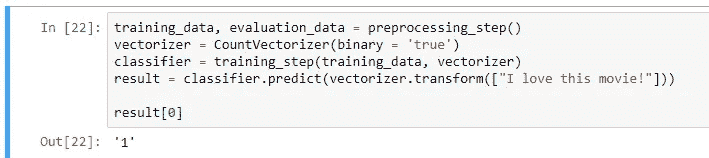

我们测试了“我爱这部电影！”一个肯定的句子和预测结果是' 1 '，我们已经看到它代表一个肯定，所以结果是正确预测的。

它现在正在工作，但是让我们用两个不同的函数来改进结果的可视化:

现在，可视化我们的测试容易多了:

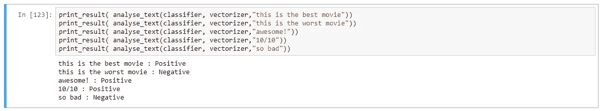

酷，工作完成了，对吧？— **错了**！

我们需要评估我们的模型表现如何。最直观的方法是计算正确答案的百分比，所以，让我们开始吧。

# 估价

是时候使用之前创建的评估数据集了。我们的第一次验证是将我们的预测答案与实际答案进行对比，计算正确的答案。

我来解释一下，我们已经知道评估数据集中每一句话的正确答案，你还记得数据结构吗？一个句子和一个`\t`拆分的分类结果。

因此，我们将通过使用我们的模型迭代所有数据来预测每个句子的情感分析，然后，我们将比较模型预测结果和数据集中的实际结果。

让我们来看看结果:

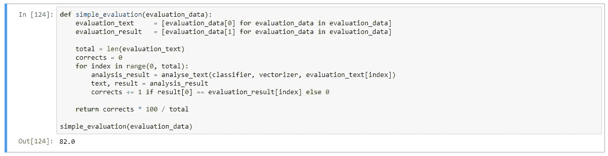

82%看起来是一个不错的结果，但是我们如何获得更多关于我们模型的信息呢？

## 混乱矩阵

幸运的是，有更多的技术可以获得关于预测模型的信息。我们将使用混淆矩阵。

我们可以自己生成这个矩阵，也可以在`sklearn.metrics`使用函数生成这个矩阵。我们将使用 lib 实现，因为没有关于如何生成混淆矩阵的秘密，实际上相当容易。

但是在我们开始之前，我们需要了解混淆矩阵是什么？

混淆矩阵的概念非常简单，我们将在一个矩阵中存储一种预期结果和预测结果的组合。

在我们的特殊情况下，这个矩阵将包含四个不同的值:

*   当实际结果是否定的时，否定的预测；
*   当实际结果是正面的时候，负面的预测；
*   当实际结果为负时，预测为正；
*   当实际结果是积极的时，积极的预测；

这些值中的两个表示正确的预测，另外两个表示错误的预测。这个矩阵非常有用，因为在一些情况下，产生假阴性和产生假阳性没有什么大问题，反之亦然。

所以，每次你可以假设一些诚实的错误，你需要检查你的模型什么时候犯错误。

让我们创建混淆矩阵:

现在，我们可以使用`pandas`数据框来提高可视化:

这段代码生成了一个非常酷矩阵，如下图所示:

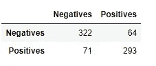

但是这还不够酷，我们可以使用著名的`matplotlib.pyplot`库来创建一个更好的可视化效果。

这段代码并不重要，因为它与我们的解决方案没有直接关系，它只是一种可视化我们数据的方式，所以不用担心。

让我们看看生成的可视化是什么样子的:

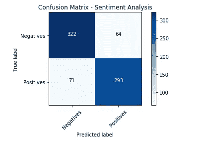

请注意，我们可以通过分别对行求和来得到阴性和阳性结果的总和。

那么，否定句共有 386 个，否定共有 364 个，共计 750 个句子，是 3000 个总句子的 25%。

在这 386 个否定句子中，322 个被正确分类，而 64 个(大约 16.5%)被分类为肯定句子，产生了一些假肯定。另一方面，有 293 个正确分类的肯定句子和 71 个(大约 24%)错误否定句子。

现在，您能够对重组和改进您模型做出正确的决定。