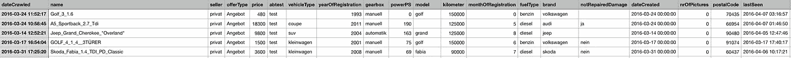
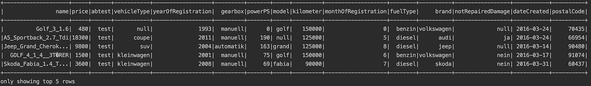
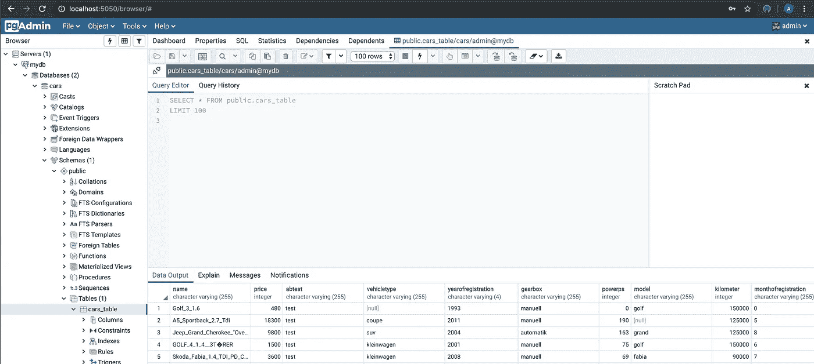

# 如何使用 PySpark、PostgreSQL 和 Docker 在本地创建一个简单的 ETL 作业

> 原文：<https://itnext.io/how-to-create-a-simple-etl-job-locally-with-pyspark-postgresql-and-docker-ea53cd43311d?source=collection_archive---------1----------------------->


**简介**

在本文中，我将展示如何利用 Apache Spark 来编写 Python 中强大的 ETL 作业。如果您已经熟悉 Python，并且每天都在处理数据，那么 PySpark 将帮助您创建更多可扩展的(大)数据处理和分析。

我将使用的数据来自 Ebay-Kleinanzeigen，这是 Ebay 的德国分公司，人们可以在这里为自己的房产做广告。在我们的例子中，我们将使用包含超过 370000 辆二手车信息的数据集；此外，需要注意的是数据的内容是德语的。

> [*链接到 Kaggle 上托管的数据*](https://www.kaggle.com/orgesleka/used-cars-database)

**什么是阿帕奇 Spark**

**Apache Spark** 是最流行的大规模数据处理引擎之一。这是一个开源系统，它的 API 支持多种编程语言。数据处理是在内存中完成的，因此它比 MapReduce 快几倍。Spark 自带支持多种任务的库，比如流、机器学习和 SQL。它可以在本地计算机上运行，也可以扩展到由数百台服务器组成的集群。

**什么是 ETL？**

ETL ( **E** xtract，**T**transform 和 **L** oad)是将数据从一个系统迁移到另一个系统的过程。数据提取是从同构或异构数据源中检索数据以进行进一步数据处理和数据存储的过程。在数据处理过程中，数据被清理，不正确或不准确的记录被修改或删除。最后，经处理的数据被加载(例如，存储)到目标数据库中，例如数据仓库或数据湖。

**提取**

每个 Spark 应用程序的起点都是创建 SparkSession。这是一个驱动程序进程，它维护关于 Spark 应用程序的所有相关信息，还负责在所有执行器之间分发和调度应用程序。我们可以通过以下方式简单地创建一个 SparkSession:

如果已经创建了一个 SparkSession，那么`getOrCreate`方法将尝试获取它，否则它将创建一个新的 spark session。使用`master`选项，可以指定正在连接的主 URL。然而，因为我们在本地运行我们的作业，我们将指定`*local[*]*`参数。这意味着 Spark 将使用与您机器上的逻辑核心一样多的工作线程。我们用`appName`选项设置应用名称，这个名称将出现在 Spark UI 和日志数据中。

我们的下一步是读取 CSV 文件。在 CSV 中阅读可以通过与我们的 SparkSession 关联的`DataFrameReader`来完成。这样，Spark 允许我们指定是否使用模式推理以及其他一些选项:

选择模式推理还是手动定义模式很大程度上取决于用例，在为生产环境编写 ETL 作业的情况下，强烈建议定义一个模式，以防止不准确的数据表示。模式推理的另一个限制是它会使 Spark 应用程序变慢，尤其是在使用 CSV 或 JSON 时。因此，我还展示了如何使用预先定义的模式读入数据:

**变换**

我们现在准备更仔细地查看我们的数据，并开始做更有趣的事情:



汽车数据集的前五行

如您所见，有多个包含`null`值的列。我们可以通过多种选择来处理缺失数据。然而，讨论这一点超出了本文的范围。因此，我们选择将缺失值保留为`null`。但是，这个数据集中有更多奇怪的值和列，因此需要一些基本的转换:

这种清理的基本原理基于以下几点:列`dateCrawled`和`lastSeen`似乎对任何未来的分析都没有用处。列`nrOfPictures`中的所有值都等于`0`，因此我们决定删除该列。

```
**seller**
gewerblich         3
privat        371525**offerType**
Angebot    371513
Gesuch         12
```

检查列`seller`和`offerType`得到以下数字。因此，我们可以删除包含“gewerblich”的三行，然后删除列`seller`。同样的逻辑也适用于列`offerType`，因此我们得到了一个更加平衡的数据集。为了举例，我们将数据集保留如下:



“清洁”汽车数据集的前五行

**装载**

我们已经将原始数据转换为可供分析的数据，因此我们准备将数据加载到本地运行的 PostgreSQL 数据库中，以便在不久的将来进行进一步分析。我们用 pgAdmin 和这个基本的 [docker-compose 文件](https://github.com/klimpie94/pyspark-etl-analytics/blob/master/docker-compose.yml)构建了一个 PostgreSQL 数据库。这个 docker-compose 配置文件定义了我们当前设置中的所有容器及其相应的设置。例如，我们用名字`cars`、用户名`admin`和密码`admin`初始化了一个 PostgreSQL 数据库。

**Psycopg2** 是 Python 最流行的 PostgreSQL 数据库驱动程序。它为与 PostgreSQL 实例进行交互提供了一种简单明了的方式。首先，我们建立到`cars`数据库的连接:

为此，我们必须为`connect`函数提供一些通用参数。也有可能指定`port`，但是，在我们的例子中，不需要指定端口，因为我们在默认端口`5432`上运行 PostgreSQL 实例。所以，我们的课程开始了，我们连接到了 Postgres。有了连接之后，就可以编写我们的命令(例如插入、更新)了，而 **Psycopg2** 允许我们用`cursors`来做这件事。游标是在连接之外创建的，它将允许您与 PostgreSQL 进行通信。

```
# cursor
cur = conn.cursor()
```

现在我们已经创建了一个游标，我们能够在我们的`cars`数据库中创建一个名为`cars_table`的表:

创建表后，现在就可以用我们的数据集填充它了。我们可以通过将数据作为元组列表(其中每条记录是一个元组)提供给我们的`INSERT`语句来逐行插入数据:

因此，现在可以使用我们之前定义的光标来执行该命令:

```
cur.execute(insert_query, cars_seq)
```

如您所见，多亏了 **Psycopg2** ，将数据从应用程序传输到后端数据库(如 PostgreSQL)变得非常容易。最后，我们将使用 **Psycopg2** 查询最近填充的表:

这在我们的终端中给出了以下输出:

```
Printing 2 rows
Brand =  volkswagen
Model =  golf
Price  =  480Brand =  audi
Model =  None
Price  =  18300
```

然而，我们仍然*缺少一段重要的*代码: **Psycopg** 符合 Python DB-API，所以自动提交特性默认为`off`。因此，我们需要调用以下代码将我们的事务提交给 PostgreSQL:

```
conn.commit()
```

为了确保这一点，我们可以在 pgAdmin 中检查 PostgreSQL 中是否正确加载了数据集:



pgAdmin 中加载的 Cars 数据集

**结束语**

**Pyspark** 对于任何试图构建可扩展数据应用程序的数据工程师或数据科学家来说，都是一个强大而有用的(大)数据工具。我绝对可以推荐大家认真看一下，试着把它融入到你未来的一个项目中。感谢 **Docker** ，我们能够在不安装任何东西的情况下启动一个本地 **PostgreSQL** 数据库！这篇文章的代码可以在 [Github](https://github.com/klimpie94/pyspark-etl-analytics) 上找到。请随时向我提供任何反馈或意见，因为这是我在平台上的第一篇文章。

另外，如果你有兴趣参加[数据工程训练营](https://www.linkit.nl/vacatures/data-engineering/0007529/data-engineering-apprenticeship-starts-feb-1st-2020)或者你只是好奇我是如何经历这两个‘紧张’月的，请随时联系我:)

**参考文献**

*   [Apache Spark 官方网站](https://spark.apache.org/)
*   《星火:权威指南》，比尔·钱伯斯和马泰·扎哈里(奥莱利)。版权所有 2018 Databricks，Inc .，978–1–491–91221–8。”
*   [什么是 ETL？](https://en.wikipedia.org/wiki/Extract,_transform,_load)
*   [Psycopg2 文档](http://initd.org/psycopg/docs/)