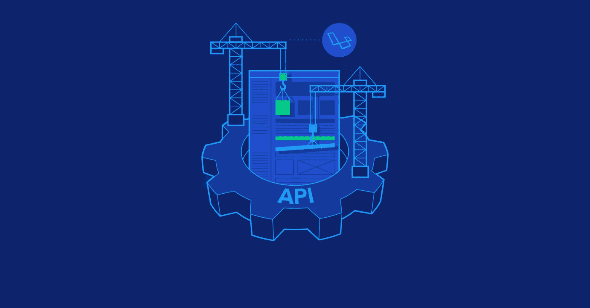
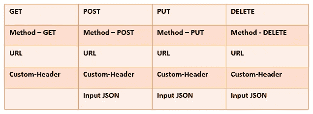

# 如何创建一个简单的 REST 客户端来测试您的 API。

> 原文：<https://itnext.io/how-to-create-a-simple-rest-client-for-testing-your-api-a0554d8380f8?source=collection_archive---------0----------------------->


在本文中，我将讨论如何快速创建一个使用 REST API 的 Java 客户端。我将向你展示两种快速有效地达到预期效果的方法。这两种方法都涉及到使用第三方库。

但是在开始创建 REST 客户机之前，您需要记住这个理论。

A PI 代表应用编程接口。它是软件到软件的界面，而不是用户界面。有了 API，应用程序无需客户端学习或干预就可以相互交流。



一个 PI 测试利用编程向 API 发送调用并获得结果。它将测试中的段视为黑盒。API 测试的主要目标是在将所有 API(如果有的话)协调到应用程序之前，确认它们的正确执行和故障处理。

**休息:具象状态转移。**

*   它是测试人员执行请求和接收响应的功能安排。在 REST 中，API 交互是通过 HTTP 协议进行的。
*   REST 还允许计算机通过网络相互通信。
*   对于发送和接收消息，它涉及使用 HTTP 方法，并且不需要严格的消息定义，这与 web 服务不同。
*   REST 消息通常接受 XML 或 JavaScript 对象符号(JSON)的形式。



1.  **Apache HTTPClient。**

Apache HttpComponents 项目负责创建和维护一个专注于 HTTP 和相关协议的低级 Java 组件工具集。

Apache HttpClient 库极大地简化了 HTTP 请求的处理。为了使用这个库，您必须访问 Apache 网站。阅读官方文档。并为 Maven 或 Gradle 添加一个依赖项:

Maven:

```
<dependency>
    <groupId>org.apache.httpcomponents</groupId>
    <artifactId>httpclient</artifactId>
    <version>4.5.11</version>
</dependency>
```

格拉德:

```
compile group: 'org.apache.httpcomponents', name: 'httpclient', version: '4.5.11'
```

下面我将给出一个 GET 请求的例子:

```
**final** HttpClient httpClient = **new** DefaultHttpClient();
**final** HttpGet httpGet = **new** HttpGet(**"http://localhost:8080"**);
HttpResponse response = **null**;
**try** {
    response = httpClient.execute(httpGet);
} **catch** (IOException ex) {
    **if** (***LOGGER***.isLoggable(Level.***INFO***)) {
        ***LOGGER***.info(**"The method is down."** + ex.getMessage());
    }
}
BufferedReader reader = **null**;
**try** {
    reader = **new** BufferedReader(**new** InputStreamReader(response.getEntity().getContent()));
} **catch** (IOException ex) {
    **if** (***LOGGER***.isLoggable(Level.***INFO***)) {
        ***LOGGER***.info(**"The method is down."** + ex.getMessage());
    }
}
String line = **""**;
**while** (**true**) {
    **try** {
        **if** (!((line = reader.readLine()) != **null**)) **break**;
    } **catch** (IOException ex) {
        **if** (***LOGGER***.isLoggable(Level.***INFO***)) {
            ***LOGGER***.info(**"The method is down."** + ex.getMessage());
        }
    }
    ***LOGGER***.info(line);
}
```

下面我将给出一个 POST 请求的例子:

```
**final** HttpClient httpClient = **new** DefaultHttpClient();
**final** HttpPost httpPost = **new** HttpPost(**"http://localhost:8080"**);
StringEntity input = **null**;
**try** {
    input = **new** StringEntity(**"id"**);
} **catch** (UnsupportedEncodingException ex) {
    **if** (***LOGGER***.isLoggable(Level.***INFO***)) {
        ***LOGGER***.info(**"The method is down."** + ex.getMessage());
    }
}
httpPost.setEntity(input);
HttpResponse response = **null**;
**try** {
    response = httpClient.execute(httpPost);
} **catch** (IOException ex) {
    **if** (***LOGGER***.isLoggable(Level.***INFO***)) {
        ***LOGGER***.info(**"The method is down."** + ex.getMessage());
    }
}
BufferedReader reader = **null**;
**try** {
    reader = **new** BufferedReader(**new** InputStreamReader(response.getEntity().getContent()));
} **catch** (IOException ex) {
    **if** (***LOGGER***.isLoggable(Level.***INFO***)) {
        ***LOGGER***.info(**"The method is down."** + ex.getMessage());
    }
}
String line = **""**;
**while** (**true**) {
    **try** {
        **if** (!((line = reader.readLine()) != **null**)) **break**;
    } **catch** (IOException ex) {
        **if** (***LOGGER***.isLoggable(Level.***INFO***)) {
            ***LOGGER***.info(**"The method is down."** + ex.getMessage());
        }
    }
    ***LOGGER***.info(line);
}
```

2.**球衣**

Jersey 是一个提供 JAX-RS (JSR-370)实现的 REST 框架。

Jersey 框架比 JAX-RS 参考实现更多。Jersey 提供了自己的 API，用额外的特性和实用程序扩展了 JAX-RS 工具包，以进一步简化 RESTful 服务和客户端开发。Jersey 还公开了许多扩展 SPI，以便开发人员可以扩展 Jersey 以最好地满足他们的需求。

Maven:

```
<dependency>
    <groupId>com.sun.jersey</groupId>
    <artifactId>jersey-client</artifactId>
    <version>1.19.4</version>
</dependency>
```

格拉德:

```
compile group: 'com.sun.jersey', name: 'jersey-client', version: '1.19.4'
```

GET 请求的示例:

```
**final** ClientConfig clientConfig = **new** DefaultClientConfig();
**final** Client client = Client.create(clientConfig);
**final** WebResource webResource = client.resource(UriBuilder.fromUri(**"http://localhost:8080"**).build());
***LOGGER***.info(webResource.path(**"restPath"**).path(**"resourcePath"**).accept(MediaType.***APPLICATION_JSON***).get(String.**class**));
***LOGGER***.info(webResource.path(**"restPath"**).path(**"resourcePath"**).accept(MediaType.***APPLICATION_XML***).get(String.**class**));
```

发布请求的示例:

```
**final** ClientConfig clientConfig = **new** DefaultClientConfig();
**final** Client client = Client.create(clientConfig);
**final** WebResource webResource = client.resource(UriBuilder.fromUri(**"http://localhost:8080"**).build());
**final** MultivaluedMap multivaluedMap = **new** MultivaluedMapImpl();
multivaluedMap.add(**"name1"**, **"val1"**);
**final** ClientResponse clientResponse = webResource.type(MediaType.APPLICATION_FORM_URLENCODED_TYPE).post(ClientResponse.**class**, multivaluedMap);
***LOGGER***.info(**"Response "** + clientResponse.getEntity(String.**class**));
```

可以使用您自己的 POST 类:

```
**final** ClientResponse clientResponse = webResource.path(**"restPath"**).path(**"resourcePath"**).
        type(MediaType.***APPLICATION_JSON***).accept(MediaType.***APPLICATION_JSON***).post(ClientResponse.**class**, myPojo);
***LOGGER***.info(**"Response "** + clientResponse.getEntity(String.**class**));
```

本文中介绍的其他库使得创建查询、从服务器获取响应、处理它们并输出结果变得非常容易。我个人更喜欢 Apache Http 客户端。因为它相当轻便，很受欢迎。