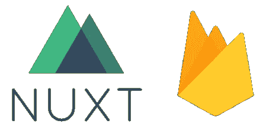

# 用 Firebase & Nuxt.js 在一个小时内创建一个 SSR +无服务器应用

> 原文：<https://itnext.io/how-to-create-a-ssr-serverless-app-with-firebase-nuxt-js-in-an-hour-6e6e03d0b3b8?source=collection_archive---------0----------------------->

这些天我听到了很多关于 Firebase 的事情。我查了一下，我的第一个想法是“哇，它看起来很适合构建一个后原型阶段的应用程序”。因为你不需要考虑后端架构，你可以简单地专注于你要做的服务。最重要的是，Firebase 可以免费启动！

Vue.js 是我最喜欢的框架。用 Vue.js 做一个 web app UI 太容易了，Nuxt.js 就是在用 Vue.js 技术让 SSR(服务器端渲染)成为可能。我相信 Firebase & Nuxt.js 的组合可以让你瞬间做出一个 web app。

找到了[这个教程视频](https://youtu.be/ZYUWsjUxxUQ)。它很棒，非常有用，制作精良，但是使用起来有点快。我也意识到我想补充一些东西。这篇文章将会覆盖它们。

在这篇文章中，我在我的 Mac 上使用终端。vim 是我的编辑。当您在本教程中看到它时，您可以简单地认为它是打开一个编辑器并编辑文件。我的节点版本是 8.11.2，喜欢用**纱**。如果使用 npm，则`yarn add`与`npm install —-save`相同。

我想离开我在本教程中创建的知识库:[https://github.com/wataruoguchi/nuxtjs-firebase-example](https://github.com/wataruoguchi/nuxtjs-firebase-example)

# 1.创建项目目录

`<proj>`可以是你的项目名称。这个目录将是项目的根目录。

# 2.Setup Nuxt.js

让我们安装 vue-cli，它允许您运行`vue`命令。安装纱线是可选的。然后，用模板初始化 src 文件夹中的项目。

# 3.编辑主页

我们将编辑索引页面，当应用程序加载时，您首先会看到它。

`pages/index.vue`会是这个样子:

那很简单！仅显示从[https://nuxt-ssr.firebaseio.com/facts.json](https://nuxt-ssr.firebaseio.com/facts.json)获取的列表

让我们编辑用于构建应用程序的配置文件。

在`build`节点中添加以下代码块。

# 4.让我们在本地主机中启动

恭喜你。你一定能在 [http://localhost:3000](http://localhost:3000) 看到！如果你看到的网页与'查看网页源代码'，你可以告诉它的 SSR！

# 5.使用 Babel 支持旧浏览器

我们不仅需要支持最新的浏览器，还需要支持 IE 等老浏览器。巴别塔就是你要用的工具。

Nuxt.js 需要知道他们的存在。让我们编辑配置文件。

另外，在同一个文件中，你想这样更新`vendor`:

尝试运行它，并在浏览器中再次看到它。它不应该有任何错误。

# 6.设置 Firebase

Firebase 有很棒的文档，我只是浏览一下。但以下是我所做的:

它告诉你在某一点打开[https://console.firebase.google.com](https://console.firebase.google.com/)。在浏览器中打开它。

然后，在控制台中添加项目。

# 7.设置云功能

让我们设置云函数。是用来做 SSR 的。服务器端的工作应该由 Firebase 支持的云功能来完成。

将此行添加到顶层。

接下来，我们去`functions`工作吧

在顶层加上`"engines": { "node": "8"}`。然后，您可以在 Firebase 中启用节点 8。[查看更多](https://firebase.googleblog.com/2018/08/cloud-functions-for-firebase-config-node-8-timeout-memory-region.html)

然后，添加`src/package.json`中的所有包

现在你必须在`functions`目录中看到`nuxt`目录。

# 8.通过云函数运行 Nuxt.js

我们希望从静态服务器提供静态资产。让我们从`functions`中复制静态资产并保存在`public/assets`中。

`functions/index.js`下面会是这个样子。应用程序给出请求，并让 Nuxt 呈现响应。

# 9.通过 Firebase 托管服务静态资产

我们不想每次都动态地服务静态资产。让我们静态地为他们服务。

现在，`public`目录已经制作完成。让我们在这里复制静态资产

# 10.开始部署吧！

更新`hosting`下的`rewrites`。看看它会是什么样子:

好吧，酷。让我们在本地主机上运行 firebase。

这需要一点时间。当你看到函数变绿时，打开 [http://localhost:5000](http://localhost:5000) 。您应该可以在浏览器中看到该页面。

但是，控制台窗口中仍有错误。让我们修理他们。

将`publicPath`从`/public/`更改为`/`

同样适用于`functions/index.js`

让我们转到`src`并重新构建应用程序。

再次打开 [http://localhost:5000](http://localhost:5000) 。希望您在浏览器的控制台窗口中不会看到错误。

最后，我们来部署一下！

等到你看到“✔部署完成！”消息。然后访问“主机网址:”。你看到你建的网页了吗？恭喜你！

想不到部署 SSR app 这么容易。我们生活在一个怎样的时代！这种速度将有助于黑客马拉松，或者构建应用程序的 alpha 版本。我想暂时享受一下 Nuxt.js 和 Firebase。

感谢阅读，编码快乐！