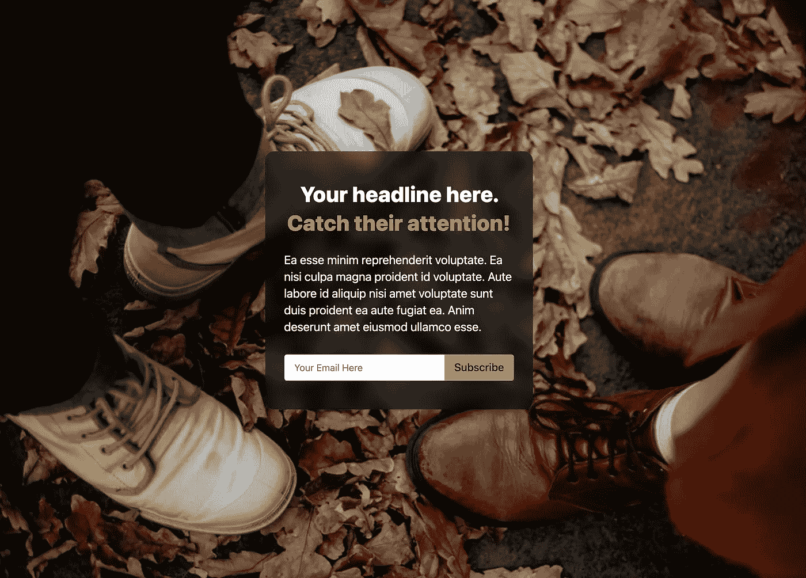
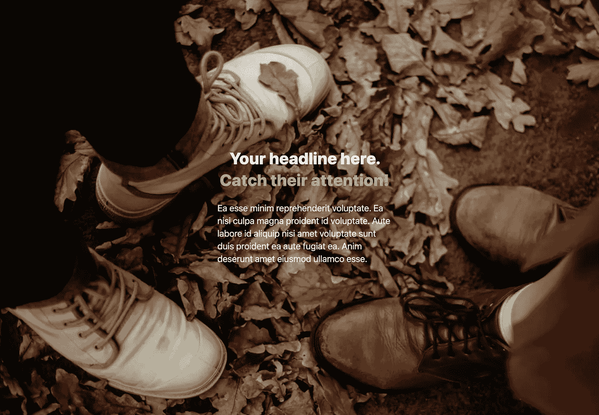
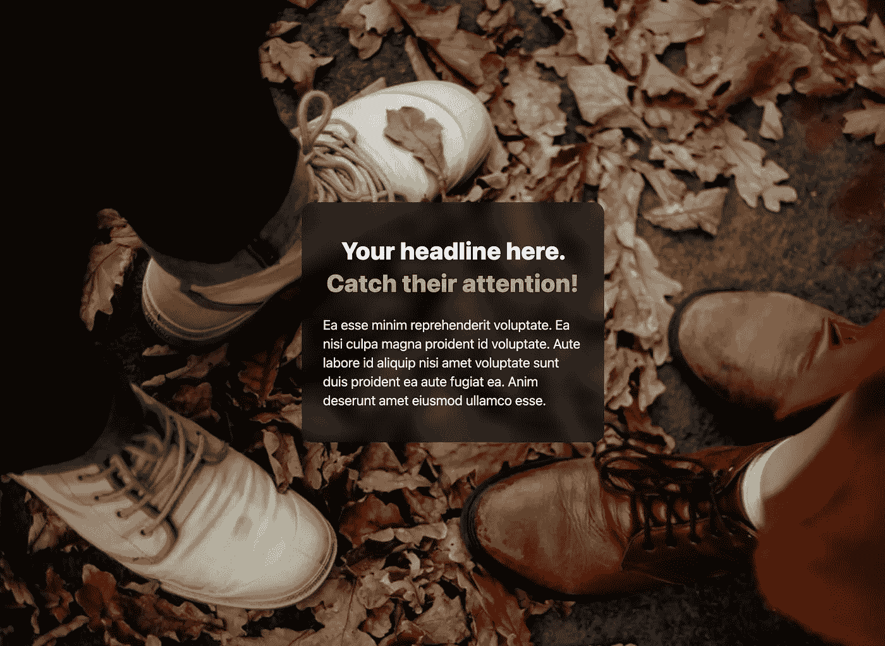
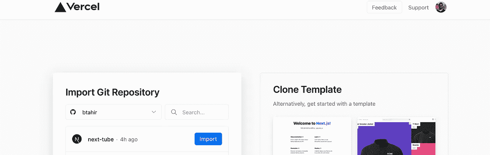

# 如何在 Tailwind CSS 中创建一个时尚的电子邮件捕获页面

> 原文：<https://itnext.io/how-to-create-a-stylish-email-capture-page-in-next-js-3ed5bd201f3f?source=collection_archive---------3----------------------->



应用预览

啊，经典的电子邮件捕获页面。就像巧克力一样，它是一种我们在某些时候都需要的味道。因此，当这种情况发生时，最好有一些准备好的选择。

在本教程中，我们将使用 Next.js 和 TailwindCSS 构建一个简单的电子邮件捕获页面。

如果你只想跳到最后一段代码，你可以在这里找到。

# 设置

我们将从克隆官方 Next.js + TailwindCSS 示例 repo 开始。这将使设置更加容易。你可以在这里找到这个回购[。](https://github.com/vercel/next.js/tree/canary/examples/with-tailwindcss)

您可以遵循自述文件中的说明，或者只在本地运行以下命令(我使用 Yarn，但是如果您愿意，也可以切换到 npm):

```
yarn create next-app --example with-tailwindcss with-tailwindcss-app
```

这将把示例下载到本地驱动器上一个名为 with-tailwindcss-app 的文件夹中。您可以随意重命名它，并将其链接到您自己的 Github repo(当您想要部署时会很方便)。

# 启动你的引擎

运行以下命令启动我们的应用程序:

```
yarn
```

# 清除

最好从空白开始。让我们进入并清除 index.js(我们的主页)的返回语句中的所有 div。如果你愿意，你可以保留标题部分(这只会影响 SEO/标签中的标题)。

# 添加背景图像

我们想要一个全屏背景图像。为此，我们将使我们的主要标签相对，然后绝对定位我们的图像，以覆盖整个空间。对于图像，我将使用令人敬畏的 [Unsplash Random API](https://source.unsplash.com/) (也使得图像在每次刷新时改变更有趣)。您可以将其更改为您想要的任何图像 url。

```
<main *className*='relative h-screen w-screen'>
 
</main>
```

好了，现在我们有一个图像覆盖我们的页面。


预览图像全尺寸

# 添加英雄内容

现在让我们添加我们的内容。保持简单，我们需要一个标题，一个支持段落和一个行动号召。我们的行动号召将是一份电子邮件订阅表格。

让我们为此创建一个名为 HeroContent 的新组件。

```
<div *className*='absolute inset-0 flex justify-center items-center'
 <div *className*='w-full max-w-md'
  <h1 *className*='text-center text-3xl sm:text-4xl font-extrabold      
    sm:leading-[3rem]'>
    Your headline here.{' '}
    <span *className*='text-yellow-400'>Catch their attention!</span
  </h1>
  <p *className*='mt-6 text-lg sm:text-xl'>
   Ea esse minim reprehenderit voluptate. Ea nisi culpa magna...
  </p>
 </div>
</div>
```

我们使用绝对位置来跨越整个 div。然后，我们使用 flex 将包含内容的 div 居中。我们用 max-w-md 类来限制它的宽度。

对于格式，我们添加了一些类来使我们的文本更大，并添加了一点颜色来使标题更吸引人。:D

所有这些给了我们这样一个中心内容:



图像+居中文本

这看起来接近我们想要的，但现在文本很难阅读。我们希望它和背景图像之间有一些对比。输入背景。我们将使用 TailwindCSS 中的背景滤镜来添加模糊和灰度滤镜。我们只需要在我们的 div 中添加几个类。

```
<div *className*='w-full max-w-md'>
```

成为...

```
<div *className*='w-full max-w-md backdrop-filter backdrop-blur-md backdrop-grayscale backdrop-brightness-50 sm:rounded-2xl text-white py-12 px-4 sm:px-8'>
```



带背景滤镜的图像+内容

不错！看起来确实很时髦。灰度+模糊滤镜使文本突出，并给整个设计带来一些精致感。我们还在较大的断点处为外部 div 添加了一些圆角(它将覆盖移动设备的整个屏幕，因此圆角看起来很奇怪)。

# 添加订阅 CTA

最后一件事是添加一个表单，用户可以添加他们的电子邮件。为此，我们还将安装一个名为 T [ailwindCSS Forms](https://github.com/tailwindlabs/tailwindcss-forms) 的新包。这是可选的，但是会使我们的输入外观更好。要启用它，我们需要将它添加到 tailwind.config 文件的插件中:

```
plugins: [
  require('@tailwindcss/forms'),
],
```

现在让我们创建一个名为 Subscribe 的新组件，并将其添加到我们的内容下面。

```
<form *className*='mt-8 w-full flex'>
 <input
  *className*='border rounded-tl rounded-bl border-gray-100 w-full px
   -4 py-2 text-gray-900'
   *placeholder*='Your Email Here'
   *type*='email'
   *required* />
 <button
  *type*='submit'
  *className*='bg-yellow-400 text-gray-900 px-4 py-2 font-medium
   sm:text-lg rounded-tr rounded-br'
 >
  Subscribe
 </button>
</form>
```

这里发生了很多事。我们来分解一下。首先，我们在按钮旁边创建了一个输入表单。我们使用 flex 让它们并排。我们在元素的左边和右边添加了一些漂亮的圆角，让它看起来更专业。

接下来，我们添加了类型= '电子邮件'和所需的道具。该类型将触发顺风窗体样式生效。我们现在也有一些很好的开箱验证。输入不能为空(因为需要)，它必须是电子邮件地址的格式。相当酷！

让我们看看我们的成品:


成品

Woa！看起来好专业好有型！人们会认为你雇了一个设计团队，花了一大笔钱才得到这个造型。；)

# 部署

在 Next.js 中部署非常容易，你可以使用他们自己的解决方案(Vercel)或者 Netlify。

如果您已经将此链接到 Github repo，事情就更简单了。您只需通过 Github 登录(到 Vercel/Netlify)并导入您想要部署的 repo。



vercel 预览

希望你喜欢这个小教程。你可以在这里找到这个项目[的完整开源代码。](https://github.com/btahir/next-capture-page)

让我知道你的想法，如果你想让我做第二部分，我们更进一步，并保存电子邮件一旦提交。也许是像概念这样的数据库？

最后，如果你对更多的生产就绪登录页面/启动程序感兴趣，请务必查看[下篇](https://nextails.com/)中的好东西。:)

干杯，
毕拉尔