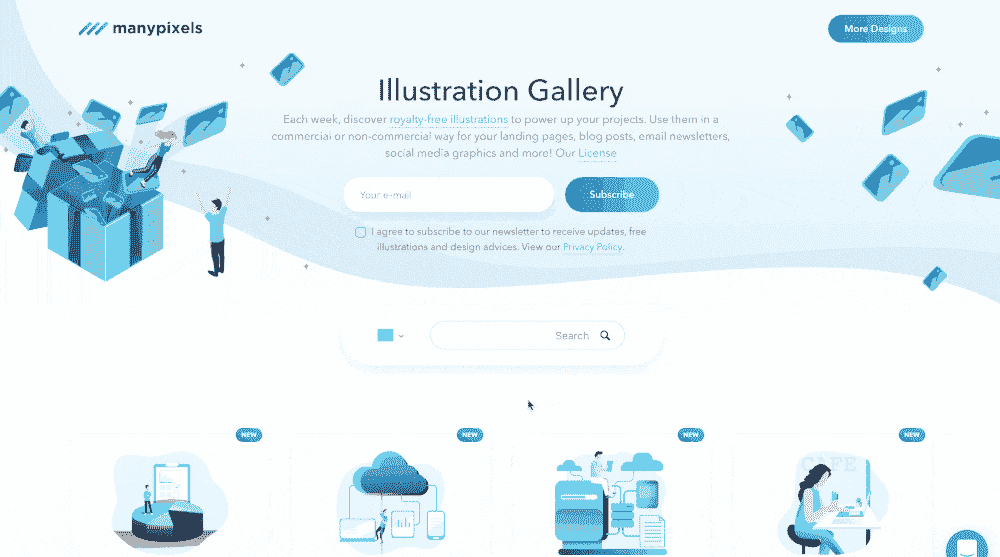
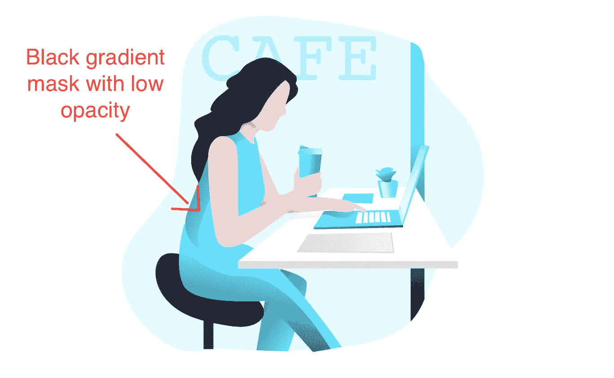
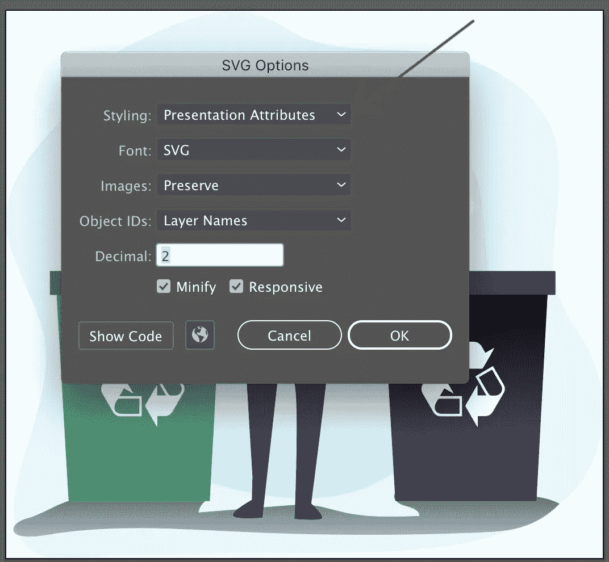

# 如何在 React 中使用颜色选择器创建 SVG 图库

> 原文：<https://itnext.io/how-to-create-a-svg-gallery-with-color-picker-in-react-aab1b70d8982?source=collection_archive---------1----------------------->



我最近制作了一个展示 SVG 插图的多像素图库，可以帮助人们完成他们的项目，有点类似于 T2 的 Undraw T3。

使用它非常简单:你浏览图库，选择与你的品牌相匹配的颜色，点击它，下载成 PNG 或 SVG 格式(更新颜色！)然后瞧！

那么我是怎么做到的呢？

这是开发者和插图画家的作品。

# 设计正确的方式

为了制作我们所有的插图，我们使用了 **Adobe Illustrator** 。

## 这都是关于一种颜色

首先你需要选择一种颜色作为你的“动态颜色”，对于我们的图库，我们使用了 hexcolor **#68E1FD** 来匹配我们的品牌。每个插图都必须使用这种颜色，否则 javascript 代码在选择颜色时将无法工作。

你当然可以用其他颜色作为“静态色”。

为了达到渐变效果，**千万不要使用**渐变。你必须创建蒙版层，渐变白色或黑色，并玩不透明。



如何渐变

## 导出您的 SVG

当导出时，您必须选择**表示属性，**我们有我们的 SVG 代码，带有类似 **fill="#68e1fd"** 的属性，这些属性将很容易用代码更改。



# 编码部分

## 颜色选择器

```
**import** React **from** 'react';
**import** { ChromePicker } **from** 'react-color';
**import** { dynamicColor } **from** '../constants/colors';

**class** Magic **extends** React.PureComponent {
  state = {
    color: dynamicColor
  };

  onChangeColor = color => **this**.setState({ color: color.hex });
  render() {
    **const** { color } = **this**.state;
    **return** (
      <div>
        <ChromePicker
          color={color}
          onChangeComplete={**this**.onChangeColor}
        />
      </div>
    );
  }
}

**export default** Magic;
```

目标是获得动态颜色的十六进制数**和**,稍后您将在插图中更改该颜色。

对于我的例子，我使用了*反应颜色*，它提供了几种易于使用的颜色选择器。

## 如何改变 SVG 的颜色

```
**import** Svg **from** 'react-inlinesvg';
**import** styled **from** 'styled-components';
**import** { dynamicColor } **from** '../constants/colors';**const** ContainerSvg = styled.div`
  *[fill='${dynamicColor}'] {
    fill: ${p => p.color};
  }
  *[stroke='${dynamicColor}'] {
    fill: ${p => p.color};
  }
`;<ContainerSvg color={color}>
  <Svg src={url}>Can't load image</Svg>
</ContainerSvg>
```

我使用样式组件来完成画廊中的所有样式。

通过给我的动态颜色作为道具，我用新的十六进制颜色替换 SVG 中的 fill=" **#68E1FD"** 。插图即时更新。

```
**import** React **from** 'react';
**import** { ChromePicker } **from** 'react-color';
**import** { dynamicColor } **from** '../constants/colors';
**import** { ContainerSvg } **from** './toto.style';
**import** Svg **from** 'react-inlinesvg';

**const** url = "https://media.graphcms.com//ztnygNBMTHuPDarh6hxH";

**class** Magic **extends** React.PureComponent {
  state = {
    color: dynamicColor
  };

  onChangeColor = color => **this**.setState({ color: color.hex });
  render() {
    **const** { color } = **this**.state;
    **return** (
      <div>
        <ChromePicker
          color={color}
          onChangeComplete={**this**.onChangeColor}
        />
        <ContainerSvg color={color}>
          <Svg src={url}>Can't load image</Svg>
        </ContainerSvg>
      </div>
    );
  }
}

**export default** Magic;
```

## 使用更新的颜色另存为 PNG 或 SVG

你必须首先从你的内嵌 SVG 中获取 **ref** 。

```
<Svg
  src={url}
  ref={ref => **this**.svg = ref}
>
  Can't load image
</Svg>
```

另存为 SVG 真的很简单，你从**内联 svg** 引用中获取 **svg 字符串**并替换所有颜色。

```
handleOnClickSaveSVG = () => {
  **const** { color } = this.state;
  **let** svgToSave = **this**.svg.state.loadedText;
  svgToSave = svgToSave.split(`fill="${dynamicColor}"`).join(`fill="${color}"`);
  svgToSave = svgToSave.split(`stroke="${dynamicColor}"`).join(`stroke="${color}"`);
  **const** blob = **new** Blob([svgToSave], { type: 'image/svg+xml' });
  **const** url = URL.createObjectURL(blob);
  downloadElement(url, 'illustration.svg');
};
```

下载那个 **blob** ！

```
downloadElement = (url, name) => {
  **const** tempLink = document.createElement('a');
  tempLink.href = url;
  tempLink.setAttribute('download', name);
  document.body.appendChild(tempLink);
  tempLink.click();
  setTimeout(() => {
    document.body.removeChild(tempLink);
    window.URL.revokeObjectURL(url);
  }, 100);
};
```

保存为 PNG 开始像 SVG 通过替换颜色。我创建一个画布并绘制一个新的**图像**，然后使用我之前的函数 **downloadElement** ()来获得它。

```
handleOnClickSavePNG = () => {
  **const** { color } = **this**.props;
  **const** DOMURL = window.URL || window.webkitURL || window;

  **if** (!DOMURL) {
    **this**.setState({ error: 'Your browser doesn\'t support download' });
  }

  **let** svgToSave = **this**.svg.state.loadedText;
  svgToSave = svgToSave.split(`fill="${dynamicColor}"`).join(`fill="${color}"`);
  svgToSave = svgToSave.split(`stroke="${dynamicColor}"`).join(`stroke="${color}"`);
  **const** blob = **new** Blob([svgToSave], { type: 'image/svg+xml' });
  **const** url = DOMURL.createObjectURL(blob);
  **let** match = svgToSave.match(/viewBox="0 0 (\d+\.?\d*) (\d+\.?\d*)"/m);
  **const** width = match && match[1] ? parseInt(match[1], 10) : 500;
  **const** height = match && match[2] ? parseInt(match[2], 10) : 500;
  **const** tempCanvas = document.createElement('canvas');
  tempCanvas.width = width;
  tempCanvas.height = height;
  **const** ctx = tempCanvas.getContext('2d');
  **const** pngImage = **new** Image();
  pngImage.onload = () => {
    ctx.drawImage(pngImage, 0, 0);
    DOMURL.revokeObjectURL(url);
    **const** imgURI = tempCanvas.toDataURL('image/png').replace('image/png', 'image/octet-stream');
    downloadElement(imgURI, 'illustration.png');
  };
  pngImage.src = url;
};
```

这样，你就拥有了创建 svg 图库所需的所有工具！那是我的第一个媒介和教程，我会非常感谢反馈来提高我自己。

我希望它是清楚的，如果你想要更多的信息，请随时询问。

