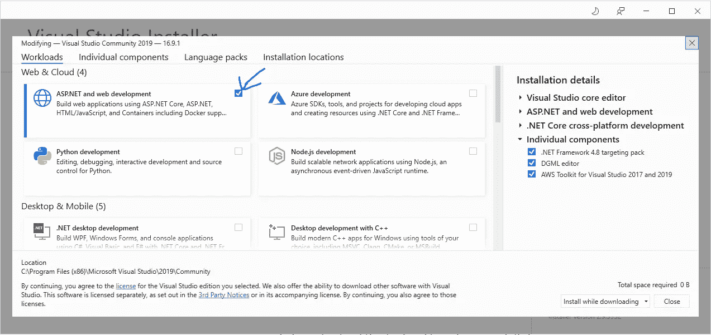
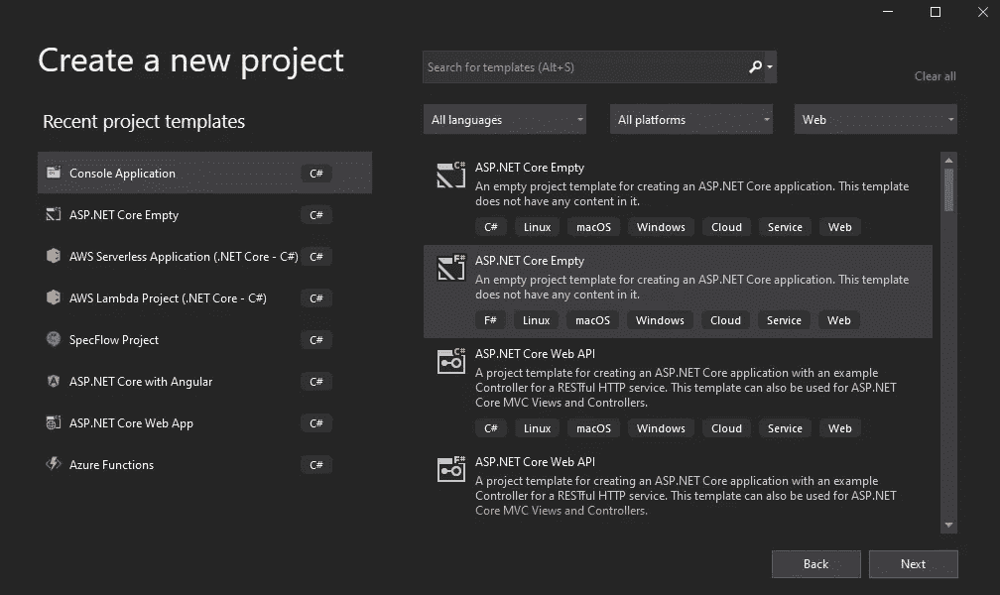
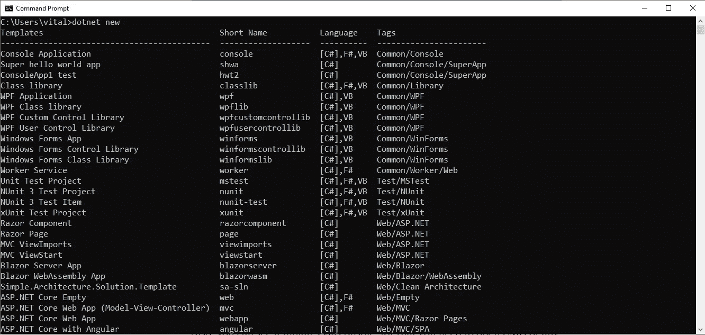
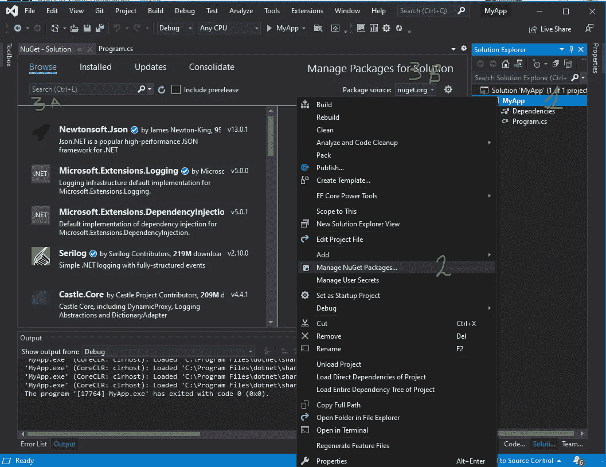
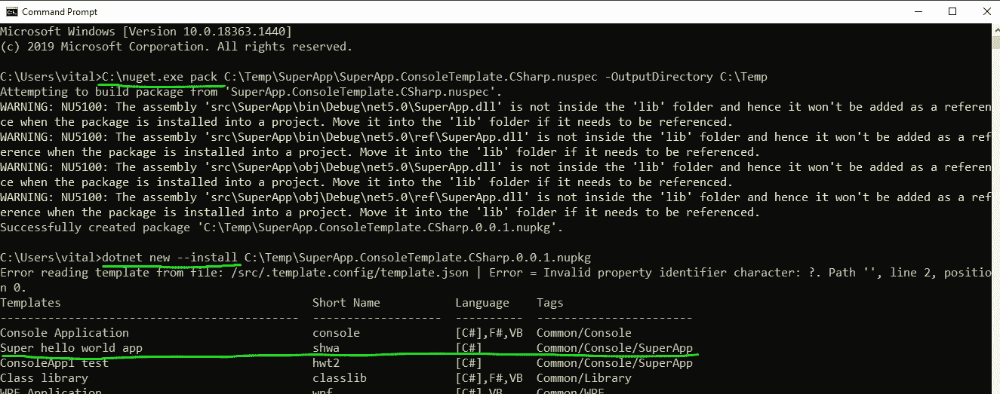
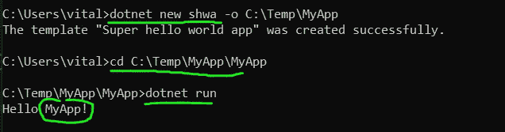
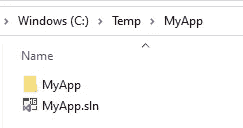
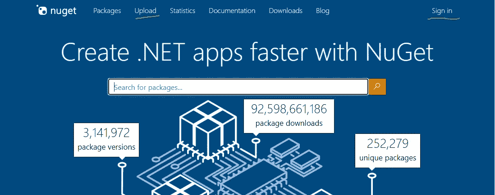

# 如何在中创建模板？NET 和 NuGet 的用途

> 原文：<https://itnext.io/how-to-create-a-template-in-net-for-a-c-application-and-what-nuget-is-for-e5d4fc03c487?source=collection_archive---------0----------------------->

# **计划**

1.什么是中的应用程序模板？网
2。NuGet 是给
3 的。创建 NuGet 应用程序模板
4。如何发布 NuGet 模板

# 你需要这个做什么

1.了解这款工具并拓宽您的技能视野
2。将有用且经常需要的功能提取到模板中
3。要了解如何从命令行使用 NuGet

# 什么是中的应用程序模板？网？

当您通过 Visual Studio 安装程序安装 Visual Studio 或修改现有安装时，您选择的是包含预定义模板的工作负荷和组件。



安装或修改 visual studio 窗口

所以，在 Visual Studio 中，当你需要创建一个应用程序时，你使用的是别人准备的模板。



visual studio 中的模板

此外，您可以通过控制台查看模板，为此您需要打开 CMD 或任何其他命令行并键入 ***dotnet new***



**dotnet new** —模板列表

这里您将看到已安装模板的列表，这些模板可能与 Visual Studio 中的列表不一致，因为它们是以不同的方式创建和存储的。

# NuGet 是干什么用的



管理 NuGet 包窗口

NuGet 是一个包管理器，默认情况下与 Visual Studio 一起安装。它用于搜索 *(3A)* 并将依赖项添加到您的项目中，例如其他人创建并上传到 NuGet 服务器的库和框架。

您可以通过右键单击项目或解决方案 *(1)* 并选择 Manage NuGet Packages*(2)*来访问这个视图。

默认情况下，NuGet 服务器是 nuget.org 的，但是由于项目需要，您的团队可能有自己的 NuGet 服务器，可以通过设置 *(3B)、*引用它，这样您和您的队友将可以访问附加的 NuGet 源服务器。

由于 VS 的不同版本，nuget.exe 文件可能存储在不同的文件夹中，所以要通过命令行与它交互，你可能应该从 nuget.org[再下载一次。](https://www.nuget.org/downloads)

# 创建 NuGet 应用程序模板

首先，您需要创建一个应用程序，您想从这个应用程序中创建一个模板。这可以是一个控制台应用程序，web 应用程序，WPF 应用程序，测试库或任何其他应用程序，你也可以在模板中有多个应用程序。

为了方便和易于复制，我将使用一个控制台应用程序作为模板的示例。你可以在这个回购[https://github.com/vit-h/simple-NuGet-template](https://github.com/vit-h/simple-NuGet-template)中找到现成的模板，请参考那里的代码示例中的中断线引号。

1.  创建应用程序。例如，使用 SuperApp 这个名称，并将其放在文件夹 C:\Temp 中
2.  相应地修改 Main 方法，以便稍后检查替换功能(控制台输出包含应用程序名称，该名称将被模板用户提供的新名称替换)

```
using System;namespace **SuperApp**
{
 class Program
 {
  static void Main(string[] args)
  {
   Console.WriteLine(“Hello **SuperApp**!”);
  }
 }
}
```

3.创建文件夹并在其中创建一个文件

```
C:\Temp\SuperApp\.template.config\template.json
```

4.将此内容添加到 template.json 文件中(由于介质上的格式问题，请参考[https://github.com/vit-h/simple-NuGet-template](https://github.com/vit-h/simple-NuGet-template)

```
{
 “$schema”: “[http://json.schemastore.org/template](http://json.schemastore.org/template)", // schema which can be placed to schema validation to get the intellicence for the file
 “author”: “Vitalii Honcharuk”, // you can replace with your name
 “classifications”: [ “Common”, “Console”, “SuperApp” ], // used to add more info to the console output when checking installed templates
 “identity”: “SuperApp.ConsoleTemplate.CSharp”, // unique name
 “name”: “Super hello world app”, // full name for the template
 “shortName”: “shwa”, // short name for the template to simplify usage
 “tags”: {
 “language”: “C#”
 },
 “sourceName”: “SuperApp”, // value which will be replaced across the whole template to the new name provided by the user
 “preferNameDirectory”: “true”
}
```

5.创建文件夹并在其中创建一个文件

```
C:\Temp\SuperApp\SuperApp.ConsoleTemplate.CSharp.nuspec
```

6.将下面的代码添加到。nuspec 文件(由于介质上的格式化问题，请参考 https://github.com/vit-h/simple-NuGet-template

```
<?xml version=”1.0" encoding=”utf-8"?>
<package xmlns=”[http://schemas.microsoft.com/packaging/2012/06/nuspec.xsd](http://schemas.microsoft.com/packaging/2012/06/nuspec.xsd)">
 <metadata>
 <id>SuperApp.ConsoleTemplate.CSharp</id>
 <version>0.0.1</version>
 <description>
 Creates the Awesome console app.
 </description>
 <authors>Vitalii Honcharuk</authors>
 <packageTypes>
 <packageType name=”Template” />
 </packageTypes>
 </metadata>
 <files>
 <file src=”.\”
 exclude=”**\bin;**\obj;**\.vs\**”
 target=”src” />
 </files>
</package> 
```

a)在这种情况下，id 应该与 SuperApp 中的文件名相同。ConsoleTemplate.CSharp
b)可以更改作者和版本
c) packageType name="Template "表示 NuGet 包是一个模板
d)文件 src，exclude 和 target 用于过滤掉冗余文件

7.打开命令行并执行以下命令:

```
C:\nuget.exe pack C:\Temp\SuperApp\SuperApp.ConsoleTemplate.CSharp.nuspec -OutputDirectory C:\Tempdotnet new --install C:\Temp\SuperApp.ConsoleTemplate.CSharp.0.0.1.nupkgdotnet new shwa -o C:\Temp\MyAppcd C:\Temp\MyAppdotnet run
```



模板创建命令行第 1 部分



模板创建命令行第 2 部分



创建的应用程序

那么，我们用这些命令做了什么呢？

1.  我们按照。nuspec 文件
2.  然后我们将模板从 NuGet 包安装到 dotnet，我们需要检查它的工作情况
3.  我们根据新安装的模板创建了一个应用程序
4.  然后我们运行它来检查它是否工作
5.  最后，我们看到控制台输出，文件夹和应用程序被重命名为我们在命令中提供的新名称

# 如何发布 NuGet 模板

一旦我们确认这个包在本地正常工作，我们就发布它。

为此，你需要访问[nuget.org](https://www.nuget.org/packages/manage/upload)，登录并进入上传页面。



nuget.org 上传

选择要上传的 NuGet 文件后，您将会看到我们在。nuspec 文件。

要使模板私有，您可以取消选中**包可见性**复选框。

然后，您可以提供有关该包的更多详细信息，并按提交。
您的包裹将在大约 2 天内被审核并发布。之后，您将能够管理和更新它。

一旦软件包发布，世界上的任何人都可以使用如下命令安装您的模板:

```
*dotnet new --install SuperApp.ConsoleTemplate.CSharp::0.0.1*
```

我希望现在你能够把有用的和经常使用的功能放到模板中！

要了解更多信息:

1.  [https://github.com/vit-h/simple-NuGet-template](https://github.com/vit-h/simple-NuGet-template)
2.  [https://docs . Microsoft . com/en-us/visual studio/ide/creating-project-and-item-templates？view=vs-2019](https://docs.microsoft.com/en-us/visualstudio/ide/creating-project-and-item-templates?view=vs-2019)
3.  https://github.com/dotnet/dotnet-template-samples
4.  【https://www.youtube.com/watch?v=GDNcxU0_OuE 

我制作的关于俄语的视频:

我制作的关于俄语的视频