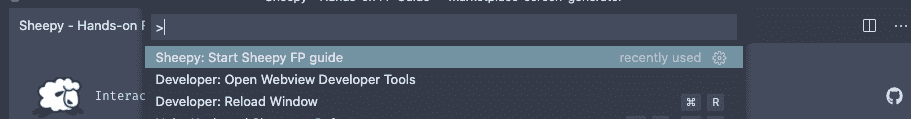
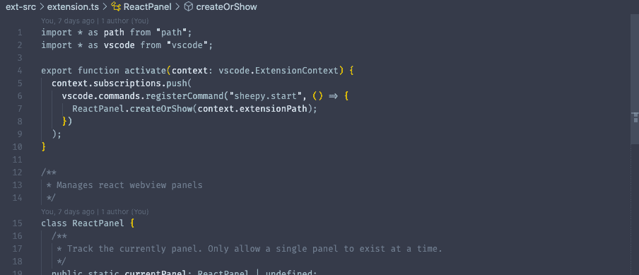
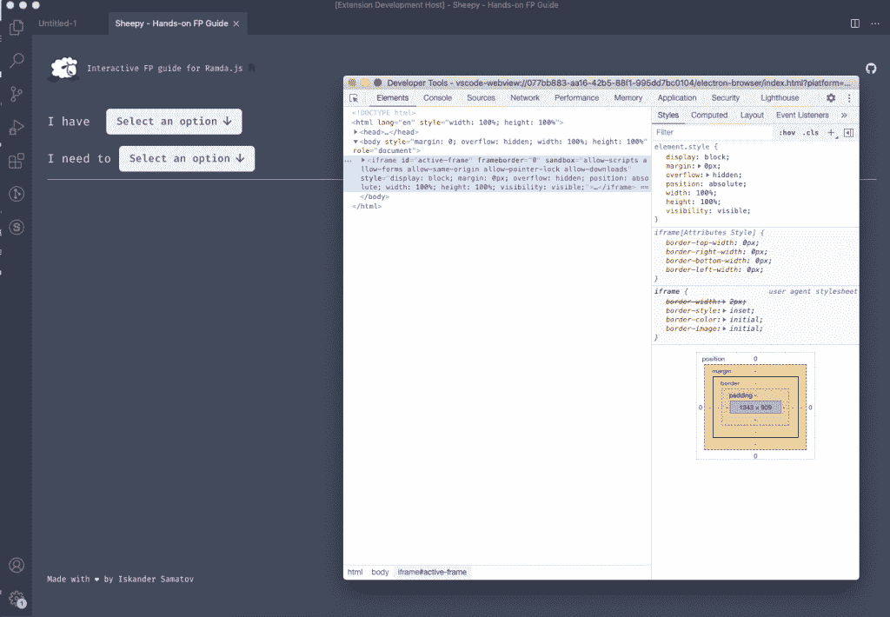

# 如何使用 React 创建 VSCode 扩展

> 原文：<https://itnext.io/how-to-create-a-vscode-extension-using-react-3325a502461e?source=collection_archive---------1----------------------->


在本文中，您将学习如何使用 React 创建定制的 VSCode 扩展。

创建 VSCode 扩展是一个有趣的练习。将它提交到市场的门槛低得惊人，提交过程也很顺利。另外，这也是回报开发者社区的一个好方法。

顺便提一下:最近我用 React 创建了一个名为 [Sheepy](https://marketplace.visualstudio.com/items?itemName=iskenxan.sheepy) 的 VSCode 扩展。这是一个使用 Ramda.JS 学习函数式编程的交互式指南。如果你像我一样，努力在代码中一致地使用函数式编程，你会发现它很有用。

VSCode 允许您构建不同类型的扩展，从主题到代码片段到代码完成。但是当使用 React 时，你的选择范围缩小到了 WebView 的扩展。

WebView API 允许构建超出本机 VSCode API 所提供的自定义用户界面。使用 WebView，您可以将定制的 HTML 和 JavaSript 直接加载到 VSCode 中。

让我们从建立我们的项目开始。

# 设置项目

幸运的是，我们有一个模板可以用来引导我们的项目。你需要做的第一件事是克隆这个回购。存储库基于 create-react-app 并使用 TypeScript，这对我们来说是一大福音。

**依赖关系**

仓库维护人员已经几年没有接触它了，所以我建议更新依赖版本。在我的例子中，我必须更新`react`、`react-dom`和`vscode`依赖项，以使这个项目与我使用的其他库一起工作。

**启动命令**

您将需要设置一个 VSCode 命令来触发您的扩展。默认情况下，项目的启动命令是`react-webview.start`。你可能想把它替换成`{YourAppName}.start.`下面是用户触发命令时的样子:



package.json 中的两个属性应该与您的命令相匹配:

*   `activationEvents` -这是 VSCode 注册将触发您的扩展的事件的地方。
*   `commands` -您的扩展提供的命令列表。

最重要的是，您需要确保与`ext-src/extension.ts`中的命令名称相匹配。那是你的扩展名的入口文件。这是它的样子:



查看一下`activate`函数，确保`registerCommand`方法中第一个参数的值与您在`package.json`中设置的命令相匹配。

**Package.json 元数据**

如果您选择发布您的扩展，VSCode 将使用来自`package.json`的元数据来填充您的列表。这就是为什么它值得一遍，并确保重要的领域，如描述和名称是抛光和匹配你的品牌。这里有一个[链接](https://code.visualstudio.com/api/references/extension-manifest)到来自 VSCode docs 的官方指南。

现在让我们回顾一下开发扩展时的一些常见需求和问题。

# 常见场景

**加载资产**

为了适应 VSCode API 加载本地资产的限制，项目要求您使用相对路径。这意味着您可以加载图像、CSS 文件和其他资源，只要您使用相对路径来访问它们。更多限制[在这里](https://code.visualstudio.com/api/extension-guides/webview#controlling-access-to-local-resources)。

**保存状态**

VSCode 中的 Webview 有它的生命周期。当用户离开你的扩展标签时，你的 Webview 的当前状态就被破坏了。这意味着任何用户输入都将被清除。

幸运的是，VSCode API 为您提供了一种将数据存储在与 web 应用程序中的本地存储相当的存储中的方法。您需要使用的与存储交互的方法是`acquireVsCodeApi`。下面是一个在存储中存储和检索数据的实用方法示例:

当用户切换选项卡时，您可以使用这些方法保存数据。但是，如果用户完全关闭您的扩展标签，这些数据将会与您的 Webview 一起被销毁。

请注意，在应用程序的生命周期中，您只能调用`acquireVsCodeApi`一次。所以我建议将它存储在一个变量中，以便以后访问。

**用开发者工具调试**

很快，您就会想要检查您的元素并调试您的代码。VSCode 提供了一个用于本地调试应用程序的内置工具—开发人员 Webview 工具。

您可以使用 VSCode 的命令输入来触发它。确保您的扩展正在本地运行，并键入`Developer: Open Developer Webview Tools`:


事实上，开发人员 Webview 工具是常规的浏览器开发工具，因为 VSCode 使用 iframe 加载 Webview 扩展。



因此，您可以使用浏览器开发工具做所有的事情，比如检查和查看控制台。

**CSP 规则**

根据[MDN Web docs](https://developer.mozilla.org/en-US/docs/Web/HTTP/CSP):**内容安全策略** ( [CSP](https://developer.mozilla.org/en-US/docs/Glossary/CSP) )是一个附加的安全层，有助于检测和缓解某些类型的攻击。”

在 VSCode 中，CSP 规则控制对本地文件和其他外部资产的访问。在我们的模板项目中，CSP 规则是使用`meta`标签在`extension.ts`文件中设置的。如果您在将外部资源加载到您的应用程序时遇到问题，CSP 规则应该是第一个需要检查的地方。如果您想了解更多关于 VSCode 中 CSP 规则的信息，请查看此[链接](https://code.visualstudio.com/api/extension-guides/webview#content-security-policy)。

# 限制

在我看来，编写 VSCode 扩展的最大问题是构建过程。每次你做一个改变，你将需要使用`yarn run build`脚本重新构建你的本地包。然后，您需要使用 F5 键重新启动扩展。

不幸的是，对于每次重启应用程序的需要，你无能为力。但是至少您可以启动一个 [nodemon](https://nodemon.io/) 进程来为您运行构建脚本。将下面一行添加到 package.json 中:

```
"watch-build": "nodemon --watch src --ext js,tsx,ts --exec \"yarn run build\""
```

现在你需要做的就是在开始的时候运行`watch-build`一次。

**结论**

构建 VSCode 扩展很有趣。可以看出，VSCode 团队投入了时间和精力来使他们的开发人员 API 易于使用。它们提供了有用的初学者指南，向您介绍您可以构建的所有不同种类的扩展。

他们的 Webview API 使得为您的扩展构建完全定制的 UI 成为可能。提醒一下，如果你想看用 React 构建的完整的 VSCode 扩展，你可以在这里查看我的 repo。

编码快乐！

*原载于 2021 年 3 月 7 日 https://isamatov.com**的* [*。*](https://isamatov.com/create-vscode-extension-with-react/)