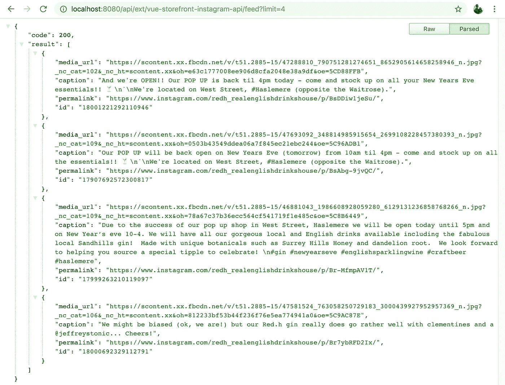

# 如何为 Vue Storefront 创建 Instagram Feed 模块

> 原文：<https://itnext.io/how-to-create-an-instagram-feed-module-for-vue-storefront-eaa03019b288?source=collection_archive---------2----------------------->


随机图库照片

过去几个月，我一直在与 [Vue 店面](https://www.vuestorefront.io/)合作，这是一次很棒的经历。它是少数几个在后端使用 Magento 2(和许多其他电子商务平台)实现 PWAs 的开源解决方案之一，因此它为基于 web 的应用程序的许多常见需求(离线支持、延迟加载、小捆绑包大小、服务器端渲染等)带来了现成的现代解决方案。

为了对 Vue Storefront 如何工作有一个基本的了解，我认为记录如何在您的商店中实现 Instragram 提要是一个好主意。这是一个相对简单的任务，但它涉及 Vue Storefront 的许多核心概念，因此它可以作为“边做边学”的有用案例。

# 开始之前

理解 Vue 店面是多个“部分”的集合，而不是一个单一的大实体，这一点很重要。最重要的是:

*   [vue-storefront](https://github.com/DivanteLtd/vue-storefront) :处理商店的前端，它由(你猜对了)VueJS 和许多其他决定数据应该如何显示的包驱动。
*   vue-storefront-api :由于 Vue Storefront 是 100%平台不可知的，所以需要这个服务作为前端和后端之间的中间层。在大多数情况下，我们将使用它来连接 Magento，但它可以与任何数量的提供商进行交互，例如:WordPress，MailChimp，或者在这种情况下的 Instagram。

如果你有兴趣了解更多关于 Vue Storefront 架构的信息，我推荐给[官方技术截屏](https://www.youtube.com/watch?v=sRSmEP4jva0&feature=youtu.be)一个手表，因为它在解释它背后的所有工具方面做得比我在本文中所能做的更好。

# 设置 API 端点

为了获取用户的 Instagram feed，我们需要使用一个访问令牌来查询脸书的 Graph API。在前端公开这种信息并不理想，因为这会导致安全漏洞，所以我们应该在服务器端公开。

幸运的是，我们可以很容易地用返回我们需要的数据的自定义端点来扩展 vue-storefront-api。🎉

我们将从在`src/api/extensions/instagram-api/`中创建以下`index.js`文件开始:

基本上，这是用一个新的`/feed`端点扩展 Vue Storefront 的 express 路由器，该端点将使用我们的页面 ID 和访问令牌向脸书的 Graph API 发出请求。如果有任何错误，它将返回一个带有错误响应的`500`状态代码，如果没有，它将以 JSON 数组的形式返回用户的 Instagram feed。

> 它还接受一个可选的“limit”参数来指定要返回的最大项数。

如你所见，我们没有硬编码页面 ID 或访问令牌，因为它们是特定于项目的，应该存储在`config/local.json`文件中。

打开`local.json`文件，在`extensions`列表中添加一个`instagram`键，包含以下信息:

```
"instagram": {
  "pageId": "FB PAGE ID",
  "accessToken": "FB PAGE ACCESS TOKEN"
}
```

按照以下说明获取您的页面 ID:[facebook.com/help/community/question/?id=378910098941520](https://www.facebook.com/help/community/question/?id=378910098941520)

要获得“永不过期”的访问令牌，请遵循以下答案:[stackoverflow.com/a/35481577/455319](https://stackoverflow.com/a/35481577/455319)

现在，为了启用我们的扩展，将“instagram-api”添加到您的`local.json`配置文件中的`registeredExtensions`列表中。

如果一切顺利，当您访问我们的定制**vue-store front-API**endpoint`/api/ext/instagram-api/feed`时，您应该会看到最新 Instagram 帖子的列表:



自定义 Instagram API 端点

# 设置前端组件

既然我们有了安全检索 Instagram 提要的方法，我们可以开始考虑如何显示它了。由于 1.6 版 Vue Storefront 鼓励使用模块来扩展其功能，因此这是一个很好的使用案例。

让我们在`src/modules/instagram-feed`文件夹中创建以下文件:

**索引. ts**

这是我们模块的入口点，它主要是样板代码，设置我们模块所需的所有数据。在我们的例子中，它只是注册了一个名为`instagram-feed`的新模块，并注册了 **Vuex 存储**。

**store/index.ts**

**存储/突变类型. ts**

这为 Vue Storefront 的 **Vuex store** 创建了动作、getters 和变异。最重要的部分是`get`动作，它向我们之前创建的 API 发出请求，以获取最新的 Instagram 帖子，因为这个端点可能是可变的，所以将它存储在`config/local.json`文件中是个好主意，所以请确保也创建一个新参数:

```
"instagram": {
  "endpoint": "[http://your-vue-storefront-api-url.com/api/ext/instagram-api/feed](http://localhost:8080/api/ext/vue-storefront-instagram-api/feed)"
}
```

**components/instagramfeed . js**

最后，我们可以用作 mixin 的自定义组件从 mount 上的 **Vuex** **store** 获取最新的 Instagram 帖子，并公开一个可以在模板中使用的`feed`属性。它还允许我们用定制的`limit`道具改变进给限制。

现在注册我们的定制模块，我们将它包含在`src/modules/index.ts`文件中:

```
// Import module at the top
import { InstagramFeed } from '../modules/instagram-feed'// Add to "registerModules" array
export const registerModules: VueStorefrontModule[] = [
  ...
  InstagramFeed
]
```

# 在前端显示提要

要完成它，我们需要做的就是创建标记，以在我们的网站上实际显示提要。

为了节省时间，让我们重用呈现默认主题中“获得灵感”部分的代码。在`src/themes/default/components/theme/blocks/InstagramFeed/InstagramFeed.vue`中创建一个`InstagramFeed.vue`文件:

这看起来与默认的`TileLinks.vue`文件非常相似，我们在这里所做的就是使用我们的`InstagramFeed` mixin 并在`feed` computed 属性上循环来呈现可用的媒体。

让我们在商店的主页上显示我们的定制组件，在`src/themes/default/pages/Home.vue`中打开`Home.vue`，并包含我们刚刚创建的元素的标记:

```
<template>
  ...
  <section class="container pb60 px15">
    <div class="row center-xs">
     <header class="col-md-12 pt40">
        <h2 class="align-center cl-accent">
          {{ $t('Instagram') }}
        </h2>
      </header>
    </div>
    <instagram-feed limit="8" />
  </section>
  ...
</template><script>
...
import InstagramFeed from 'theme/components/theme/blocks/InstagramFeed/InstagramFeed'export default {
  components: {
    ...
    InstagramFeed
  }
}
</script>
```

如果一切正常，我们将能够在主页上看到我们的 Instagram feed:


主页上的 Instagram feed

很酷的一点是，由于我们重用了`TileLink`组件标记，我们可以免费获得延迟加载和 CSS 转换。

# 包扎

我们设法使用了 Vue Storefront 的一部分技术，但仍有一些地方需要改进，例如:

*   TypeScript 实现
*   缓存源
*   在弹性搜索中存储媒体
*   还有更多…

但作为一个快速介绍，本模块应该展示一些使 Vue Storefront 成为构建电子商务商店的优秀工具的功能。👋🏽

该模块的代码可在 GitHub 中获得，请随意提交任何问题和请求:

[](https://github.com/jahvi/vue-storefront-instagram-feed) [## Jah VI/vue-店面-instagram-feed

### Vue 店面的 Instagram feed 组件。通过创建……为 Jah VI/vue-store front-insta gram-feed 开发做出贡献

github.com](https://github.com/jahvi/vue-storefront-instagram-feed) [](https://github.com/jahvi/vue-storefront-instagram-api) [## Jah VI/vue-store front-insta gram-API

### Vue Storefront 获取用户 Instagram feed 的 API 端点-Jah VI/Vue-store front-insta gram-API

github.com](https://github.com/jahvi/vue-storefront-instagram-api)