# 如何创建和配置 Azure DevOps 管道代理

> 原文：<https://itnext.io/how-to-create-and-configure-azure-devops-pipelines-agent-88848763f109?source=collection_archive---------0----------------------->

## 本文旨在帮助您为 CI 管道选择和配置代理。


萨法尔·萨法罗夫在 [Unsplash](https://unsplash.com/photos/MSN8TFhJ0is) 上拍摄的照片

# 介绍

当开始了解 Azure Devops 时，最困难的问题可能是你需要遵循哪些步骤来使你的 CI 管道正确工作。

运行 Azure CI 管道的关键点是 Azure Pipelines 代理的工作，其主要任务是与您想要运行 DevOps CI 管道的机器建立连接。

在本文中，我们将考虑以下问题，以帮助您为 CI 渠道选择代理:

*   MS 代理与自托管代理
*   关于 MS 代理的高级信息
*   何时使用 MS 代理，何时使用自托管代理
*   配置 MS-agent
*   正在配置自承载代理。

我们还将看看这两个代理之间的差异，以帮助您决定哪一个最适合您的需求。

下图显示了带有 Microsoft 托管代理和自托管代理的 Azure CI 管道工作流。

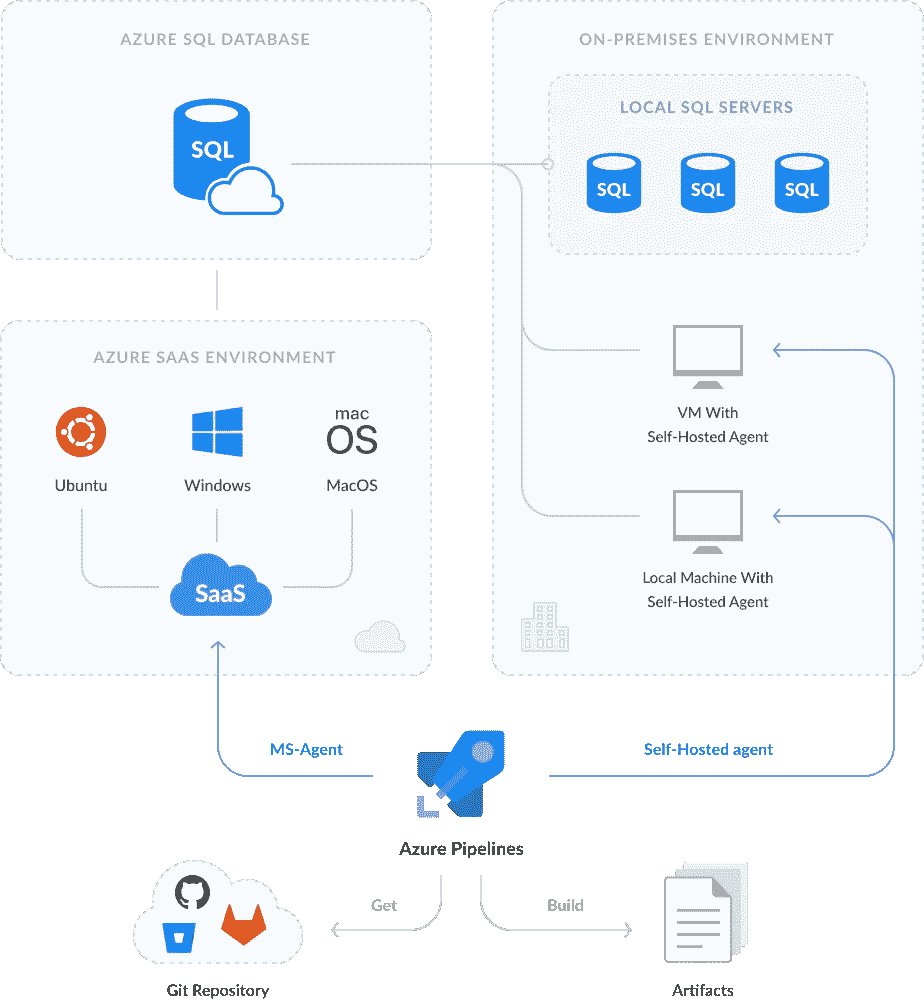

从上图可以看出，您的管道必须在某台机器上的某种操作环境中运行。微软托管代理和自托管代理被绑定来管理流水线执行。

在使用 MS-Agent 的情况下，执行发生在 Azure Windows、macOS 或 Ubuntu 中的一个现成的操作环境中，它被动态地部署到 Azure(作为 SaaS 提供)。

在使用自托管代理的情况下，执行发生在您的物理或虚拟机上(本地环境)。

# MS 代理与自托管代理

因此，MS-agent 和自托管代理之间的主要区别在于，使用 MS-agent，您可以在云中获得一个预先安装了操作系统(Windows、macOS 或 Ubuntu)的现成虚拟机。每次运行管道时，您都会获得一个新的虚拟机。

如果您使用自托管代理，管道将在您的物理机器上执行。

下表显示了两种试剂的主要比较特征。

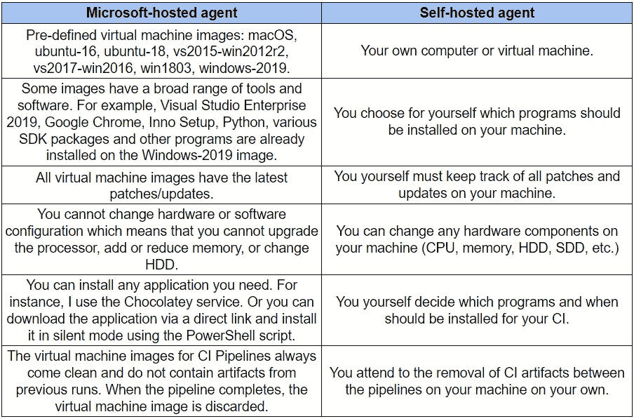

# 关于 MS 代理的高级信息

您可以使用 PowerShell 获取有关特定 MS-agent 的预安装软件或硬件的信息。例如，要接收有关 MS-Agent 和 Windows-2019 映像的软件和硬件的信息，请执行以下 PowerShell 脚本。

```
"Shows details of currently running PC"

$computerSystem = Get-CimInstance CIM_ComputerSystem
$computerBIOS = Get-CimInstance CIM_BIOSElement
$computerOS = Get-CimInstance CIM_OperatingSystem
$computerCPU = Get-CimInstance CIM_Processor
$computerHDD = Get-CimInstance Win32_LogicalDisk -Filter "DeviceID = 'C:'"

Clear-Host

Write-Host "System Information for: " $computerSystem.Name
"Manufacturer: " + $computerSystem.Manufacturer
"Model: " + $computerSystem.Model
"Serial Number: " + $computerBIOS.SerialNumber
"CPU: " + $computerCPU.Name
"HDD Capacity: "  + "{0:N2}" -f ($computerHDD.Size/1GB) + "GB"
"HDD Space: " + "{0:P2}" -f ($computerHDD.FreeSpace/$computerHDD.Size) + " Free (" + "{0:N2}" -f ($computerHDD.FreeSpace/1GB) + "GB)"
"RAM: " + "{0:N2}" -f ($computerSystem.TotalPhysicalMemory/1GB) + "GB"
"Operating System: " + $computerOS.caption + ", Service Pack: " + $computerOS.ServicePackMajorVersion
"User logged In: " + $computerSystem.UserName
```

通过执行该脚本，我们获得了有关虚拟机的以下信息:

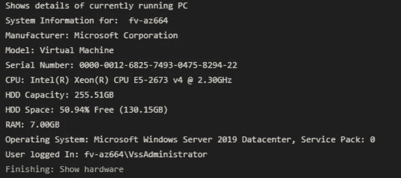

如上表所述，MS-agent 的一些虚拟机映像具有各种有用的预装程序。要了解 Windows-2019 映像预安装了哪些程序，我们可以使用以下脚本创建一个 PowerShell 任务:

```
“Get a list of installed programs:”Get-ItemProperty HKLM:\Software\Wow6432Node\Microsoft\Windows\CurrentVersion\Uninstall\* | Select-Object DisplayName, DisplayVersion, Publisher, InstallDate | Format-Table -AutoSize
```

执行这个脚本后，我们会看到预装的有用程序列表(这个列表很长，下图只显示了一部分):

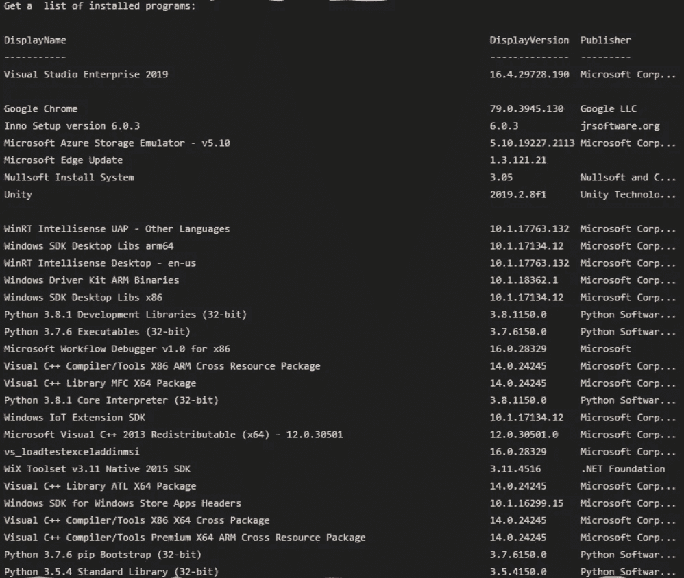

# 何时使用 MS 代理，何时使用自托管代理

如果您有一个源代码不需要花太多时间下载的小项目，它也不需要很多时间来编译项目和执行单元测试。在这种情况下，微软托管的代理将是最好的选择。如上对比表所示，虚拟机镜像和所有预装程序(Visual Studio、Python、Chrome 等。)获取 MS-Agent 的最新更新。在执行流水线之后，该虚拟机映像被丢弃，并且不影响后续流水线的执行。

但是，如果您有与性能、可访问性、安全性相关的问题，或者其他类似的问题，最好选择自托管代理。自托管代理的一个重要缺点是，您必须跟踪操作系统的更新，以及清除管道作业之间的工件磁盘。

# 配置 MS-agent

Microsoft 托管代理的设置非常简单明了:

1.  在**代理池**组合框中，选择 *Azure 管道*。

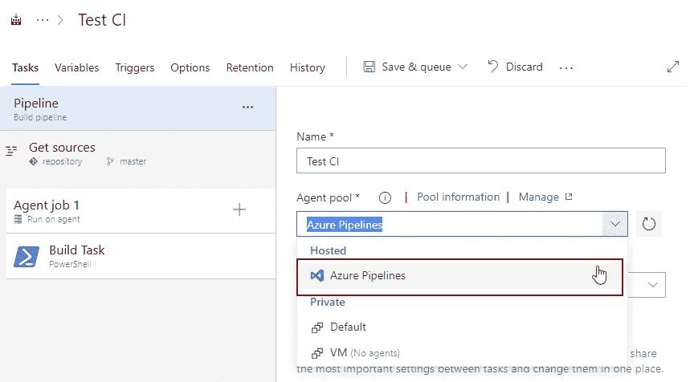

2.在**代理规格**下拉列表框中，选择需要的虚拟机镜像。

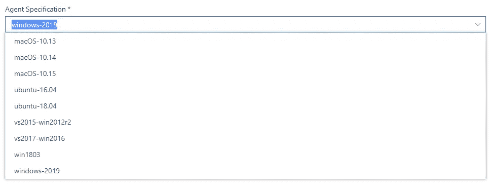

# 配置自托管代理

如上所述，自托管代理的主要任务是使用机器上的所有可用资源，与将要运行 DevOps CI 管道的机器建立连接。为此，请在该计算机上安装一个自托管代理。这可以是您的计算机或虚拟机。

要安装自托管代理，请执行以下操作:

1.下载代理。

有几种方法可以做到这一点。第一个也是最简单的一个是跟随[链接](https://github.com/microsoft/azure-pipelines-agent/releases)并下载您需要的代理，如下所示。

或者，转到您的 Azure 组织的**代理池**页面，然后单击**新建代理**。

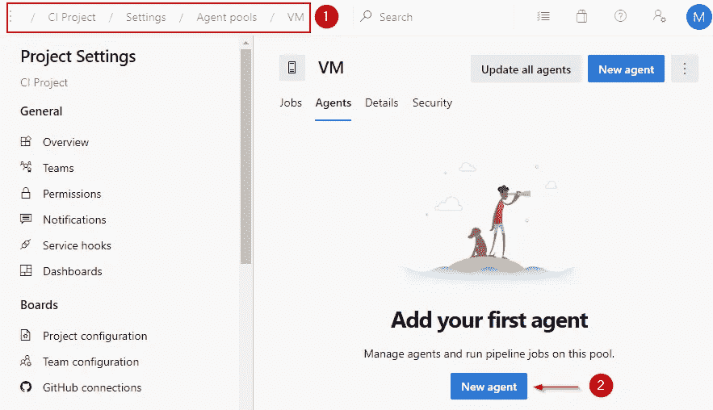

接下来，选择所需的操作系统并点击**下载**。

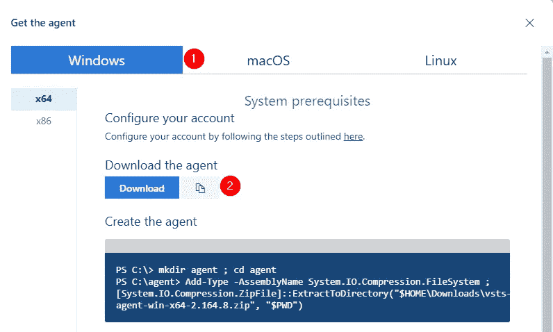

2.现在您需要将下载的 ZIP 文件解压到磁盘上的文件夹中，例如，解压到*vst agent*中，如下所示。

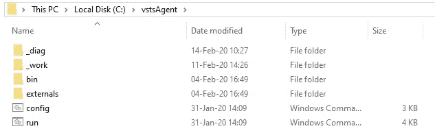

3.运行 *config.cmd* (以管理员身份运行)。

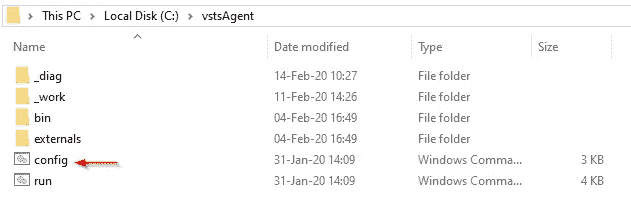

4.当安装程序要求*输入 Azure DevOps 服务的服务器 URL* 时，指定*https://dev . Azure . com/{ your organization name }*。

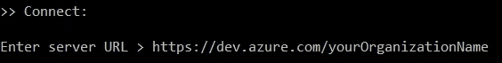

5.当安装程序询问您的认证类型时，按**进入**。


然后安装程序要求输入令牌。


如下所示粘贴您的令牌。


6.当设置要求**输入代理池**时，如果您想使用默认池，请按**输入**。


7.当安装程序要求**输入代理名称**时，输入代理的名称，例如: *vmagentvm* 。


8.当设置要求**进入工作文件夹**时，按**进入**。


如果需要，请指定名称。

9.当安装程序要求输入运行代理作为服务时。(Y/N)，按 Y。


10.当安装程序要求输入用于服务*的用户帐户时，按**输入**。

之后，您将看到一条关于成功配置的消息:

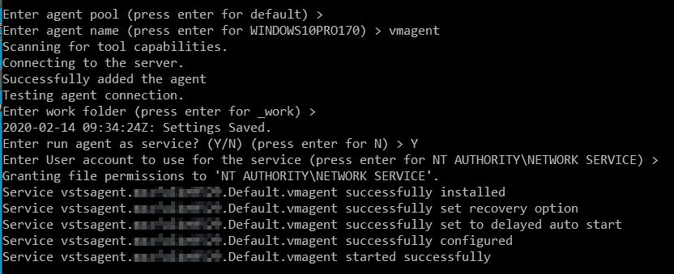

另外，如果您转到**代理池**部分的**默认**页面，您会看到您的代理出现在那里的列表中:

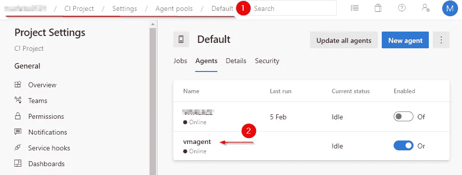

如果为管道选择**默认池**，管道将在安装代理的机器上运行。


此外，在配置您的 CI 流程时，请确保检查 SQL Server 的[**db forge devo PS Automation Azure devo PS**](https://www.devart.com/dbforge/sql/database-devops/)插件。该工具包含所有必要的步骤，允许您在服务器上创建一个数据库，测试它，并部署一个工件对象。如何毫不费力地做到这一点的完整指南隐藏在 [**这里**](https://docs.devart.com/devops-automation-for-sql-server/walkthrough/azure-devops.html) 。

# 结论

本文提供了对 MS 代理和自托管代理的比较描述。它还解释了何时以及为什么使用一种或另一种代理。

本文并不打算深入讨论 Azure Pipelines 代理的工作原理，而是尝试给出存在哪些类型的代理以及如何配置代理以持续集成 Azure Pipelines 的基本概念。

我的文章最初发表在 devart.com 的[](https://docs.devart.com/devops-automation-for-sql-server/walkthrough/create-configure-azuredevops-pipelines%20agent.html)**。**