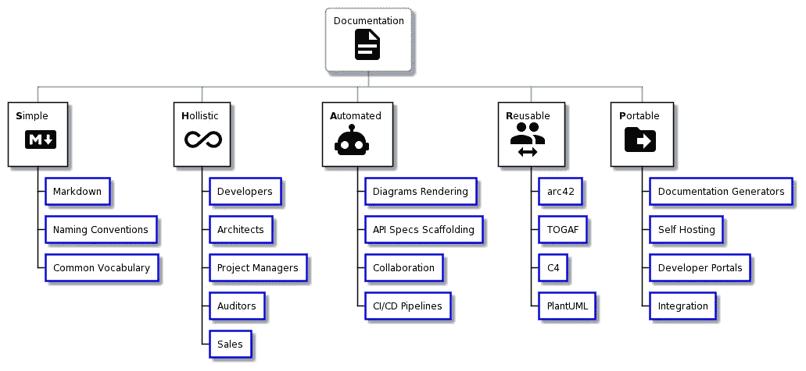
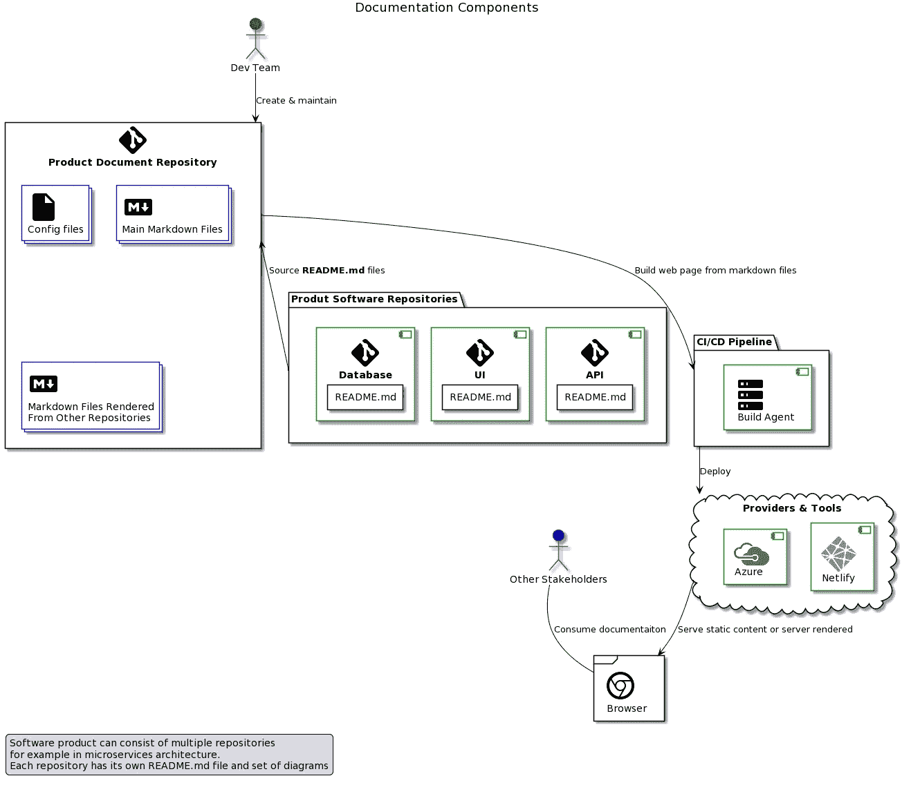

# 如何创建和维护好的软件文档

> 原文：<https://itnext.io/how-to-create-and-maintain-good-software-documentation-bc8b4dcd32bf?source=collection_archive---------2----------------------->

马丁·范·登·霍维尔在 [Unsplash](https://unsplash.com/?utm_source=unsplash&utm_medium=referral&utm_content=creditCopyText) 上的照片

# 介绍

在这个博客中，我们将关注软件文档，即由参与定义和开发软件的团队和个人(架构师和开发人员)产生的文档。还有其他补充类型的文档，如需求、业务分析等，我们不会关注这些。

有多少次，我们投入到一个现有的活动项目中，或者承担“遗留”软件的维护工作，却发现文档要么丢失，要么不充分。

不幸的是，对于许多开发团队来说，这是一个非常普遍的经历。为什么会这样？有几个原因:

*   软件开发的步伐不断加快，以响应越来越复杂的市场需求。被视为“非必要”的活动，如文档，有时甚至是测试(原文如此！)被放到一边，以利于增加特征的输出。
*   随着时间的推移，文档很难维护，因为更复杂的软件会导致更复杂的文档。
*   图表和绘图往往非常脆弱，随着软件的发展，它们也变得过时了。
*   开发文档也很…无聊，大多数开发人员更喜欢关注有趣的功能，提高效率，编码。

## 软件文档目标

知道了解决上述问题所需要的努力和时间，让我们扪心自问:为什么还要费心呢？为什么软件文档很重要？良好的文档在以下场景中起着关键作用:

*   新团队成员的入职。每次新的开发人员加入团队时，好的文档将有助于快速定位，并且不需要其他团队成员投入大量时间来教授项目知识的良好基础。
*   监管要求和审计。如果您正在开发的软件必须经过外部或内部审计，或者受到任何法规要求的影响，那么好的文档会使与审计人员合作变得容易得多。有时文档甚至是审计的一个严格要求。
*   与所有利益相关者沟通。好的文档使所有类型的涉众能够理解他们感兴趣的上下文中的软件。如果文档考虑了不同类型的利益相关者，并且仔细地调整措辞，使其更少或更多地具有技术性，那么它将为团队节省大量时间，否则这些时间将花费在向每个人解释和翻译软件系统属性上。

## 软件文档特征

让我们定义软件文档的期望特征，以适应现代快速发展的步伐。

S **imple** 。文档应该简单明了，以减少维护工作，并确保所有利益相关者(包括新开发人员)都能理解核心概念。

H **olistic。不同类型的文档消费者将需要不同的上下文。好的文档应该考虑到所有的利益相关者，并确保每个人都能参与和理解。实现实时协作是另一个重要目标。**

一个一个**全自动**。为了确保文档随着时间的推移得到维护，并且只对开发团队产生最小的影响，大多数图表、图表和规范应该尽可能地自动化。

Ru 可用。软件文档结构、词汇和模型对于任何新的软件项目都应该是可重用的，因此拥有一个结构化但同时又灵活的文档模型是非常有用的。

P 或**或**表格。在任何托管介质上独立地生成和分发文档应该是容易的。与任何其他软件一样，避免供应商锁定可能是您公司关心的问题，因此以可移植的方式设计文档的核心是一个好的实践。

# 履行

在这一节中，我们将研究不同的工具、框架和文档模型，以满足文档特征需求。我们将主要关注开源工具和标准。

下图显示了我们稍后将用来实现文档策略的工具、框架和标准。

夏普

## 工具和标准

现在，我们将重点关注可用于实施我们战略的特定工具和标准。请注意，每个工具、框架或标准几乎都有替代方案。为了简单起见，我推荐那些我熟悉的、我知道能很好地一起工作的。您可以将它视为优秀软件文档的入门包。

## 简单的

为了保持文档简单，我们需要一个合适的媒介。现在的大多数文档不是 Word 就是 pdf，但是我相信 Markdown 是更好的选择。Markdown 是一种轻量级的类似 HTML 的标记语言，在软件项目(README.md 文件等)中非常常见。对于开发者来说，使用 markdown 比使用 MS Word 等复杂的文本编辑器更具扩展性，也更容易。额外的好处是，markdown 文件可以直接在 ide 或代码编辑器中编辑，如 Visual Studio、Visual Studio Code、Atom 或 WebSharper 等。

 [## 降价指南

### 解释如何使用 Markdown 的免费开源参考指南。

www.markdownguide.org](https://www.markdownguide.org/) 

## 整体的

据我所知，没有一个特定的工具可以让所有涉众理解你的文档；).你需要努力做到这一点。定义通用词汇以及逻辑命名约定是一个很好的开端！

## 自动化的

PlantUML 是我最喜欢的绘制图表的工具之一。PlantUML 中的图遵循“…作为代码”的运动。其中图表是从简单的领域特定语言动态生成的。

PlantUML 的一个重要特性是能够动态地呈现图表，而无需将它们转换成图片。这是非常有用的，并且允许所有链接到集中式图表存储库的在线文档自动更新

 [## 使用简单的文本描述来绘制漂亮的 UML 图的开源工具。

### PlantUML 是一个允许快速编写的组件:也支持以下非 UML 图:图是…

plantuml.com](https://plantuml.com/) 

为了以自动化的方式记录 API 资源(REST)或方法(RPC ),我们可以使用像 Swagger 这样的文档生成器，它从代码注释或 API 规范中生成文档。

 [## API 文档

### Swagger 用一系列的解决方案来生成、可视化和…

swagger.io](https://swagger.io/solutions/api-documentation/) 

每个单独的 markdown 文件或整个文档库都可以导入到 HackMD 中，所有利益相关者都可以参与到实时协作会话中来，共同添加注释和开发文档。HackMD 本身是一个非常强大的工具，还具有其他有用的特性，看看吧！导入特定的降价文件后，可以将其导出回存储库。

 [## HackMD -协作降价知识库

### 我们一直在寻找方法，让我们的团队讨论和流程对所有用户来说更加清晰可见。我们最近…

hackmd.io](https://hackmd.io/) 

最后，特定软件项目的文档应该封装在它自己的存储库中，链接来自属于同一软件项目的其他存储库的 markdown 文件和其他工件。CI/CD 管道的一部分应该是文档工件的自动构建和部署。

尽可能自动化将确保文档随着时间的推移得到维护。

## 可重复使用的

为了使文档可重用，我们需要同意并遵循所有软件项目都将遵守的标准和最佳实践。

这里有一些标准和模型，我发现它们对定义文档大纲很有帮助。

TOGAF 是一种企业架构方法，主要面向企业架构师，为高级企业架构提供指南和模型。

对于开发团队来说，遵循 TOGAF 标准的文档可能是上游参考，允许与全球公司架构标准保持一致。

 [## 托加夫

### TOGAF 标准版本 9.2 是对 TOGAF 9.1 标准的更新，提供了改进的指导，纠正了错误…

www.opengroup.org](https://www.opengroup.org/togaf) 

arc42 是用于通信和文档的模板。它创建了脚手架和结构，有助于将主题放在恰当的环境中，恰当地解决各种利益相关者的问题。

 [## arc42 模板概述

### arc42 以务实的方式回答了以下两个问题，但可以根据您的特定需求进行定制:应该…

arc42.org](https://arc42.org/overview/) 

C4 模型有助于将结构放在软件文档的图表和可视工件周围。它非常适合 arc42 方法。

 [## 软件体系结构可视化的 C4 模型

### 一个人代表你的软件系统的一个人类用户(例如演员、角色、人物角色等)。一个软件…

c4model.com](https://c4model.com/) 

PlantUML 之前在图表自动化渲染的上下文中被提到过，但是它是一个以“…作为代码”的方式可视化软件的惊人工具。

PlantUML 有很多不同编程语言的插件，允许基于源代码快速生成图表。还有可以做逆向操作的插件，即 g [基于 planUML 类图](https://github.com/bafolts/plantuml-code-generator)生成代码。

我们不打算深入研究不同的软件图类型和它们的用法，但是可以说它们都受到 PlantUML 的支持。

 [## 使用简单的文本描述来绘制漂亮的 UML 图的开源工具。

### PlantUML 是一个允许快速编写的组件:也支持以下非 UML 图:图是…

plantuml.com](https://plantuml.com/) 

## 轻便的

到目前为止，我们的文档是基于开放标准的，使用开放源代码的灵活而强大的工具。现在是时候让所有利益相关者都可以使用它了。

为了使文档具有可移植性，我们需要能够基于我们的降价文件生成文档，并以一种易于使用的形式呈现。最好的方法是以基于静态文件或动态生成的 HTML 的网页形式交付文档。

Docsify 是我最喜欢的工具之一，它可以根据一些简单的配置文件将 markdown 文件转换成 HTML。你可以在我专门准备 Docker 认证助理的网站上看到这种转变的结果[。](https://dcaguide.net/#/)

 [## docsify

### 一个神奇的文档生成器。

docsify.js.org](https://docsify.js.org/#/) 

另一种方法是在构建过程(CI/CD 管道的一部分)中构建一个静态网站来提供文档。有大量的静态站点生成器，顺便说一下，它们比生成的文档在更多的场景中有用。我最喜欢的发电机之一是雨果

 [## 世界上最快的网站建设框架

### 世界上最快的网站建设框架

世界上构建网站最快的框架 gohugo.io](https://gohugo.io/) 

一旦我们的文档准备就绪，CI/CD 管道创建完成，我们就可以将其部署到托管提供商。Netlify 就是这样一个提供商，但还有许多其他提供商。如果你对如何部署静态站点感兴趣，可以看看我关于这个话题的博客。

 [## Netlify:在创纪录的时间内开发和部署最佳网络体验

### 功能强大的无服务器平台，具有直观的基于 git 的工作流程。自动化部署、可共享预览，以及…

www.netlify.com](https://www.netlify.com/) 

## 高级主题

还有三个更高级的主题，但我认为值得简单讨论一下。如果有兴趣，请进一步研究，提供链接。

*   开发者门户
*   自动化部署图
*   文件转换

开发人员门户使开发团队不仅可以共享公共文档，还可以做更多的事情。Spotify 最近[向 CNFC](https://backstage.io/blog/2020/09/23/backstage-cncf-sandbox) 捐赠了他们自己开发的开发者门户，其中包含智能文档。

 [## 后台服务目录和开发人员平台用于构建开发人员门户的开放平台

### 在 Spotify，我们一直相信自主开发团队带来的速度和独创性。但是…

后台. io](https://backstage.io/) 

部署图，尤其是公共云提供商的部署图，应该代表基础设施的实际状态。Hava 可以实现这种自动化(请注意，这是一种商业产品)。还有一个叫做 Arcentry 的工具，它是开源的，但是现在已经停止使用了。

 [## Azure、GCP 和 AWS 图表自动化| Hava

### 如果您想了解 hava.io 如何帮助您的团队记录、监控和诊断您的云基础架构…

www.hava.io](https://www.hava.io/) 

最后，为了满足公司对文档格式(如 pdf 或 docx)的要求，您可以使用 Pandoc 在不同的文档类型之间快速转换。Pandoc 对各种格式都有丰富的支持，不仅仅是 pdf 或者 docx，那些都是最常见的。

 [## 关于 pandoc

### 如果你需要将文件从一种标记格式转换成另一种，pandoc 就是你的瑞士军刀。

pandoc.org](https://pandoc.org/) 

## 把所有的放在一起

下图显示了如何使用每个产品或项目的一个集中式文档库来维护软件文档，包括来自不同库的文件，以构成软件(例如，使用微服务架构)。

## 摘要

软件文档非常重要，但是它的创建和维护可能会有问题。在这个博客中，我们已经学习了使用 SHARP 缩写词(简单、整体、自动化、可重用、可移植)来构成好的文档。

我们已经定义了什么是好的文档，什么是软件文档实现的目标。

最后，我们回顾了不同的开源工具，它们可以帮助我们创建、维护和发布高质量的软件文档。

希望这是您迈向高质量、可持续软件文档的良好开端。有很多值得探索的地方！