# 如何在 CSS 中创建漂亮的形状——三个形状的拆卸，纯 CSS 制作

> 原文：<https://itnext.io/how-to-create-beautiful-shapes-in-css-a-teardown-of-3-shapes-purely-made-in-css-c3ac7cb99c4?source=collection_archive---------1----------------------->

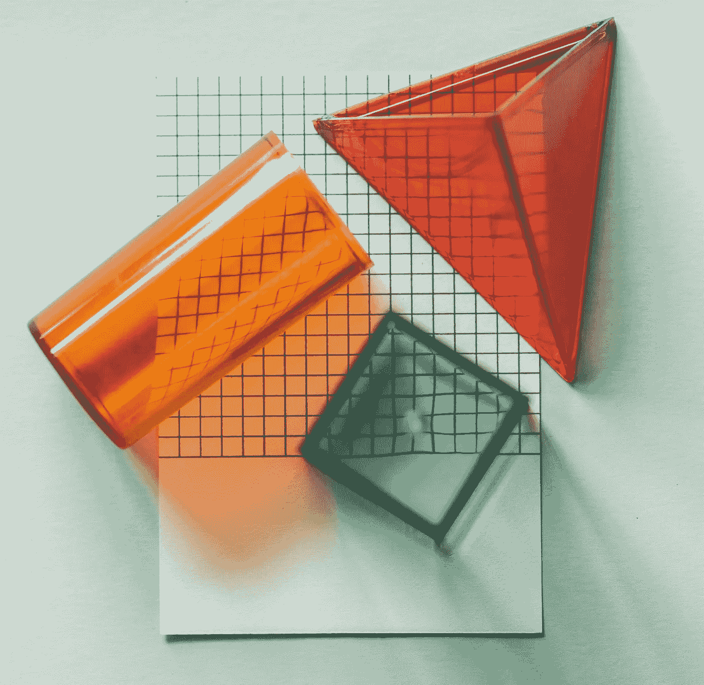

图像由 [rawpixel](https://www.instagram.com/byrawpixel/) 生成

随着时间的推移，我遇到了一些非常有趣的形状，完全是用 CSS 制作的，我总是问自己，CSS 属性的组合是如何创建如此复杂而优雅的形状的。

我挑选了 3 个形状，我们将在本文中重新创建。

在 CSS 中绘制形状通常可以归结为使用**宽度、高度、边框、顶部、右侧、左侧、底部和转换**属性与伪元素的组合，如 **:before** 和 **:after。**

让我们看看这个彩色的盒子:

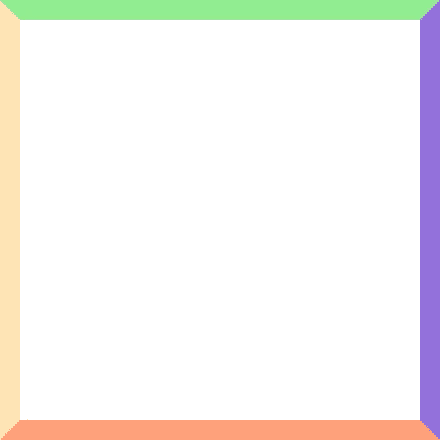

```
.box {
  width: 200px;
  height: 200px;

  border-top: 10px solid lightgreen;
  border-right: 10px solid mediumpurple;
  border-bottom: 10px solid lightsalmon;
  border-left: 10px solid moccasin;
}
```

你可以看到边界的切割边缘是彼此成对角线的。让我们删除框的宽度和高度，并增加所有边框的宽度:

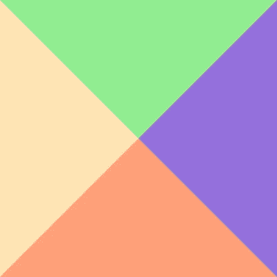

```
.box {
  width: **0**;
  height: **0**;

  border-top: **100px** solid lightgreen;
  border-right: **100px** solid mediumpurple;
  border-bottom: **100px** solid lightsalmon;
  border-left: **100px** solid moccasin;
}
```

突然间我们得到了 4 个三角形。厉害！

但是如果我只想有一个三角形呢？

只需将其他边框颜色设置为透明:

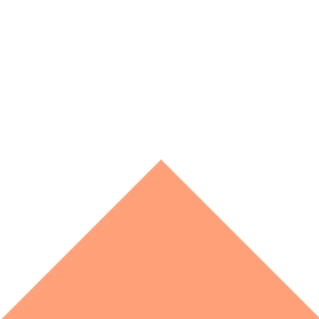

```
.box {
  width: 0;
  height: 0;

  border-top: 100px solid **transparent**;
  border-right: 100px solid **transparent**;
  border-bottom: 100px solid lightsalmon;
  border-left: 100px solid **transparent**;
}
```

或者添加一些转换:

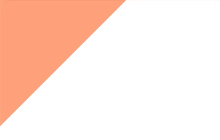

```
.box {
  width: 0;
  height: 0;

  border-top: 100px solid transparent;
  border-right: 100px solid transparent;
  border-bottom: 100px solid lightsalmon;
  border-left: 100px solid transparent;

 **transform: translateX(-100px) translateY(-100px) rotate(-45deg);** }
```

这就是你如何在 CSS 中创建一个基本的三角形。使用 CSS 进入这种样式当然需要一些练习和创造力，但是一旦你掌握了窍门，唯一的限制就是你自己💡。

现在让我们创造一些真正惊人的形状！

## ❤️之心

虽然心形看起来很复杂，但因为它的曲线，它真的不是心形(哈，明白了吗？)在 CSS 中创建它。

我们基本上是在添加两个带弯曲角的盒子，并将它们相互转化:

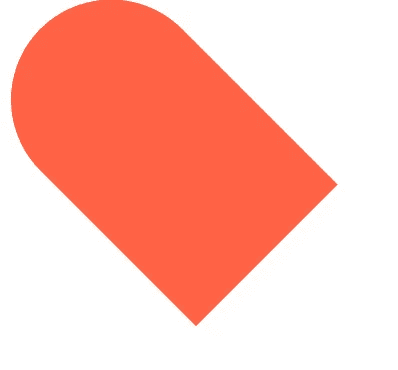

```
.heart {
  position: relative;

  width: 200px;
  height: 160px;
}.heart:before,
.heart:after {
  position: absolute;
  content: "";

  width: 100px;
  height: 160px;
  left: 100px;

  background-color: tomato;

  border-radius: 100px 100px 0 0;

  transform: rotate(-45deg);
  transform-origin: 0 100%;
}
```

由于他已经创建了两个伪元素，我们可以在 Y 轴上翻转另一个元素以获得最终的形状:

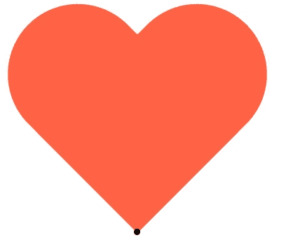

```
.heart {
  position: relative;

  width: 200px;
  height: 160px;
}.heart:before,
.heart:after {
  position: absolute;
  content: "";

  width: 100px;
  height: 160px;
  left: 100px;

  background-color: tomato;

  border-radius: 100px 100px 0 0;

  transform: rotate(-45deg);
  transform-origin: 0 100%;
}**.heart:after {
  left: 0;

  transform-origin: 100% 100%;
  transform: rotate(45deg);
}**
```

需要注意的是，通过将 *transform-origin* 设置为右下角或 *100% 100%* ，变换的原点(或本例中的旋转)已被更改，如上图中的黑点所示。

这就是你如何在 css 中创建一个心脏，并不复杂，对吗？😃

## 钻石💎

像心脏一样，钻石其实并不复杂。我鼓励你花 10 分钟时间，试着自己创造钻石。

让我们首先创建一个我们之前的 4 个三角形的拉伸变体:

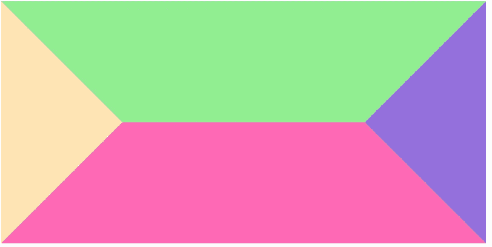

```
.diamond {
  width: 200px;
  height: 0;

  border-top: 100px solid lightgreen;
  border-right: 100px solid mediumpurple;
  border-bottom: 100px solid hotpink;
  border-left: 100px solid moccasin;
}
```

如果你仔细看，你可以在图片底部看到钻石的顶部。

现在，让我们改变颜色，调整一些边界宽度，去掉顶部边界，因为我们不再需要它了。

您最终应该得到这样的形状:

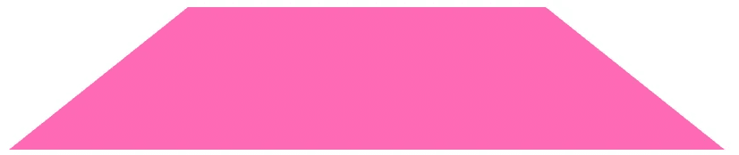

```
.diamond {
 **position: relative;**  
  width: 200px;
  height: 0; **/* border-top: 100px solid lightgreen; */**  border-right: 100px solid **transparent**;
  border-bottom: **80px** solid hotpink;
  border-left: 100px solid **transparent**;
}
```

最后，我们在之后添加一个伪元素**:在本例中为，并应用与我们创建单个三角形时相同的技术:**

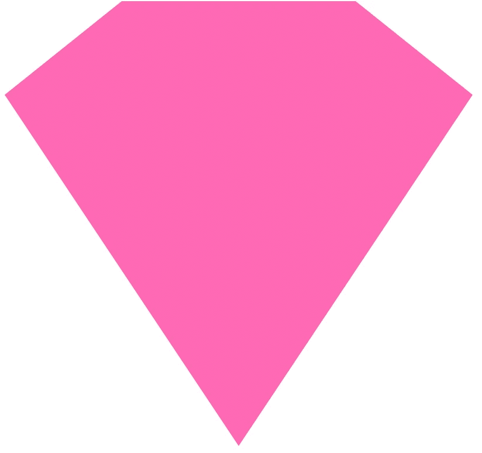

```
.diamond {
  position: relative;

  width: 200px;
  height: 0;

  border-right: 100px solid transparent;
  border-bottom: 80px solid hotpink;
  border-left: 100px solid transparent;
}**.diamond:after {
  content: "";
  position: absolute;** **border-top: 300px solid hotpink;
  border-right: 200px solid transparent;
  border-left: 200px solid transparent;

  transform: translateX(-100px) translateY(80px);
}**
```

并不是说伪元素上的*位置*属性被设置为*绝对*以将底部更好地定位在菱形的顶部之下。

现在你可以轻松地冰出你的项目！🤑💎

## 放大镜🔍

你有没有想过自己用 CSS 创建一个放大镜图标，而不是用一个无聊的 svg？

是啊，可能不会…但不管怎样，让我们创建一个吧！

首先，创建一个带彩色边框的圆:

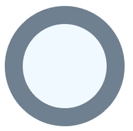

```
.magnifying-glass {
  position: relative;

  width: 100px;
  height: 100px; 

  box-sizing: border-box;
  background-color: aliceblue;

  border: 15px solid slategray;
  border-radius: 50%;
}
```

这就是我们中途的速度。剩下唯一要做的事情是创建和定位放大镜的手柄。


```
.magnifying-glass {
  position: relative;

  width: 100px;
  height: 100px; 

  box-sizing: border-box;
  background-color: aliceblue;

  border: 15px solid slategray;
  border-radius: 50%;
}**.magnifying-glass:after {
  content: "";
  position: absolute;
  bottom: 0;
  right: 0;

  width: 50px;
  height: 15px;
  background-color: slategray;

  border-radius: 0 7.5px 7.5px 0;

  transform-origin: 0 50%;
  transform: translateX(100%) rotate(45deg);
}**
```

瞧，在 CSS 中创建一个放大镜就是这么简单。

## 但是为什么我不应该直接使用 SVG 呢？

当然，你必须花更多的时间在 CSS 中创建这样的形状，而不是使用 SVG 或图标字体，但由于这些形状纯粹是 CSS，所以非常容易使它们具有交互性，如添加悬停效果:

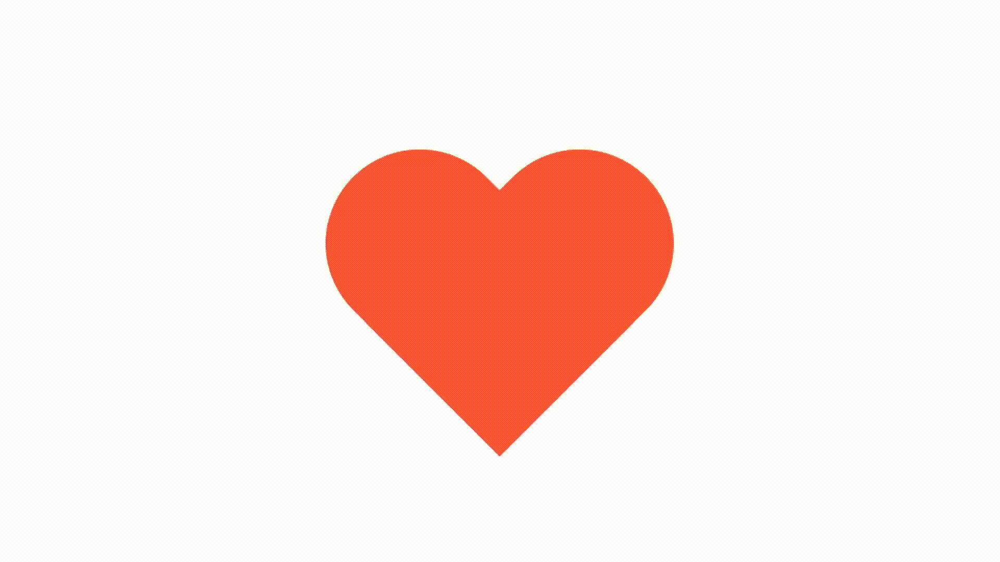

我建议您在要设计样式的形状周围添加一个包装，以保留形状本身的变换。

```
<div class="heart-wrapper">
  <div class="heart"></div>
</div>
```

例如，让我们添加一个缩放变换:

```
.heart {
  position: relative;

  width: 200px;
  height: 160px;
}.heart:before,
.heart:after {
  position: absolute;
  content: "";

  width: 100px;
  height: 160px;
  left: 100px;

  background-color: tomato;

  border-radius: 100px 100px 0 0;

  transform: rotate(-45deg);
  transform-origin: 0 100%;
}.heart:after {
  left: 0;

  transform-origin: 100% 100%;
  transform: rotate(45deg);
}**.heart-wrapper {
  cursor: pointer;

  width: 200px;
  height: 160px;

  transition: transform 0.3s cubic-bezier(.25, .8, .25, 1);
}****.heart-wrapper:hover {
  transform-origin: 50% 50%;
  transform: scale(1.3);
}**
```

现在轮到你了，试着在 CSS 中重新创建一些你喜欢的形状或图标，记住:唯一的限制是你自己！

我希望我可以用这个小教程向你展示一些巧妙的技巧。

干杯，麦克斯。