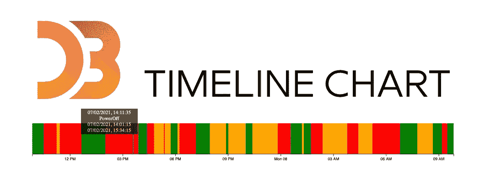
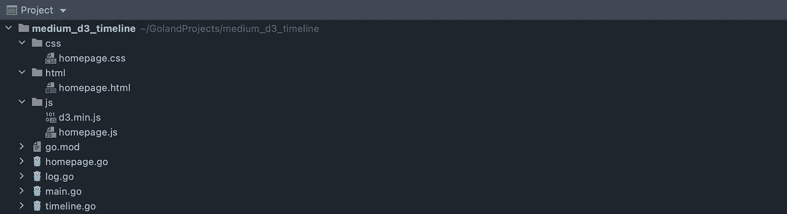
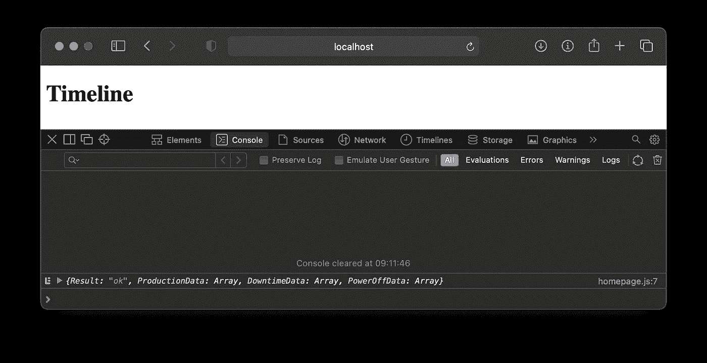
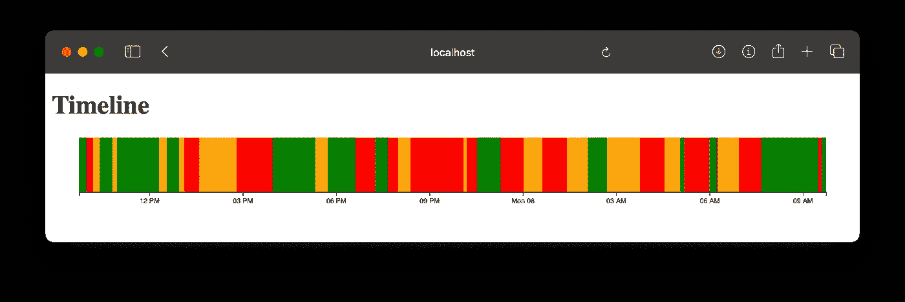
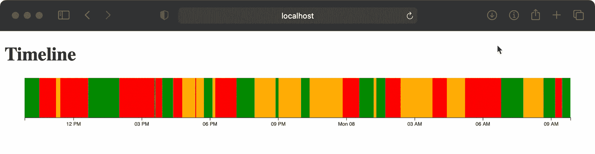

# 如何创建 D3js v6 时间线图表

> 原文：<https://itnext.io/how-to-create-d3js-v6-timeline-1a32e586fe56?source=collection_archive---------1----------------------->

## 使用 Go 后端，发送 JSON 数据

D3js 是一个 Javascript 库，用于对数据进行图形化处理。在 2020 年，它被升级到版本 6。

 [## D3.js -数据驱动的文档

### D3 是一个用 HTML、SVG 和 CSS 可视化数据的 JavaScript 库。

d3js.org](https://d3js.org) 

这给我们带来了一个小问题。官方示例库不使用 Javascript，而是使用特殊的 *Observable Notebook 语言。如今，要找到 D3js 图表的最新版本 6 示例并不容易。*

这就是这篇文章的原因。我找不到版本 6 时间表的工作示例，所以我决定做一个。

请注意，这项工作是站在别人的肩膀上的。

在本文中，我们将使用我在 Amelia Wattenberger 的书中学到的策略，并在这些步骤的基础上进行构建:

1.  访问数据
2.  创建图表维度和比例
3.  画画布
4.  绘制数据
5.  设置互动

截至 2021 年 2 月 8 日，我们将使用最新版本的 D3js，即版本 6.5.0。我们将使用 Go 作为 web 服务器来模拟一些伪真实世界的后端数据发送。我们将使用 Goland 作为 IDE。

如果你只需要 D3js 信息，你可以跳过*准备项目*。和往常一样，你会在文章末尾找到 Github 资源库的链接。

这里有一个关于在 Go 中创建 web 服务器的更具描述性的教程。

 [## 作为 web 服务器提供服务

### 提供 HTML、CSS 和 Javascript 文件

medium.com](https://medium.com/swlh/create-go-service-the-easy-way-iii-c84489cc1ee0) 

这里有一个关于使用 D3v6 创建热图日历的附加教程。

 [## D3 v6 日历热图

### 使用 Go 后端，发送 JSON 数据

itnext.io](/d3-v6-calendar-heat-map-c709fe20e737) 

# 准备项目

在 Goland 创建新项目，命名为 *medium_d3_timeline*

1.  创建三个新目录: **css** 、 **html** 和 **js** 。
2.  下载最新的 D3 库并保存到这个 **js** 目录中。在这个 **js** 目录下创建新文件`homepage.js`。
3.  在 **html** 目录下创建新文件`homepage.html`
4.  在 **css** 目录下创建新文件`homepage.css`
5.  在主项目目录下新建三个文件:`main.go`、`homepage.go`、`timeline.go`和`log.go`

## 更新 main.go

下面是创建和运行 web 服务器服务的完整代码。如果你想知道每个部分的解释，请使用文章前面的链接。

## 更新日志. go

这个文件只负责记录到控制台，这里没有太多代码。

## 更新主页. go

这个文件只包含一个服务于主页的功能。

## 更新时间轴. go

用下面的代码更新这个文件。这段代码是基础，我们将在此基础上继续构建。函数`getTimelineData()`会在未来生成一些伪随机数据并发送回浏览器。

# 初始测试

使用内置 Goland 功能或使用命令`go get -u all`同步所有 Go 模块。运行`main.go`，不要忘记将其设置为打包模式。如果一切顺利，我们准备走得更远。

# 准备前端

切换到**homepage.html**并用下面的代码更新它。这里没有什么特别的，只是加载这两个 javascript 文件，创建 heading 和一个`
`元素，它将保存我们的时间线。

切换到 **homepage.css** 并在下面插入代码。这将在工具提示中使用。

切换到 **homepage.js** 并在下面插入代码。同样，没什么特别的，这段代码只是向`/get_timeline_data`发送一个 JSON 请求，并打印它返回的任何内容。

通过插入`d3.json` fetch 方法(建立在标准 javascript fetch 方法之上),我们开始使用 D3 库。

# 更新后端

现在切换到 **timeline.go，**，我们将在这里更新`getTimelineData()`函数。

在我们解释之前。`TimelineData struct`将保存我们生成的数据，而`TimelineOutput struct`将保存我们对浏览器的响应数据。该响应数据将有三个子数据:`ProductionData`、`DowntimeData`和`PowerOffData`。想象一下，这些是机器的数据，可以有三种状态:关闭*(断电数据)*或开启，开启时产生*(生产数据)*或不产生*(停机数据)*。

这些数据需要同时开始和结束。当生产开始时，其他两个必须关闭，反之亦然。在特定时间内，您只能有一种类型的数据。

该函数将生成过去 24 小时的随机数据。这是更新后的**时间表。**

# 后端-前端通信测试

现在全部测试一下。在`[http://localhost](http://localhost./)`运行项目并打开浏览器。打开您的控制台，您应该看到结果:三个数组。

# 更新前端

打开 **homepage.js** ，导航到`DrawTimeLine()`功能。

## 存取数据

这很简单。为日期和值添加两个访问变量。

## 设置尺寸

只需添加几行，让我们的时间表图表在屏幕上很好地展开。

## 绘制画布

这四行将为我们的时间表图表准备画布。`ViewBox`会让它负责任。

## 设定比例

我们需要一个合适的比例。对于我们的时间表图表，我们将使用 x 轴的第一个和最后一个日期。那就是`chartsStartsAt`和`chartEndsAt`常数。对于 y 轴，我们将仅使用一个数值范围，在本例中为 0 和 1，使用`d3.extent`。

## 准备数据

我们将使用面积图绘制我们的数据(有许多选项可以选择，面积图对我来说似乎是最简单的)。

我们将有三个数据生成器，用于所有三个不同的数据集。

## 准备工具提示

因为 tooltip 是可选的，所以我们将把所有关于 tooltip 的内容合并到一组代码中。

## 绘制数据

这些是最后几行，以得出我们想要的结果。

# 没有工具提示的测试

运行代码并导航到 [http://localhost](http://localhost) 。你可以在下面的截图中看到时间表。

每次刷新页面，时间线都会改变。

# 添加工具提示

导航到之前添加的 9 行代码，用下面的代码更新它们。d3 新增了两个功能:`mousemove`和`mouseout`。

当悬停在图表上时(`mousemove`)，我们需要检查光标坐标并将 x 坐标转换为时间。我们将在工具提示中显示这个时间。

因为我们还想显示悬停状态(生产、停机、断电)的开始和结束，所以有两个 javascript 函数来访问这两个值。

当指针移出时，我们将隐藏工具提示。

# 用工具提示测试

再运行一遍。这就是结果，你会看到的。

# 摘要

你并不局限于三种不同的状态。你可以有尽可能多的不同状态。

此外，一种状态不一定要在另一种状态开始时结束。如果你需要的话，可以有空白的地方。

你可以有更多的时间表图表，一个接一个。数据可能是人，你可以这样画出他们的任务。

下面是完整代码的链接

 [## petrjahoda/medium _ D3 _ 时间轴

### 通过在 GitHub 上创建帐户，为 petrjahoda/medium_d3_timeline 开发做出贡献。

github.com](https://github.com/petrjahoda/medium_d3_timeline)