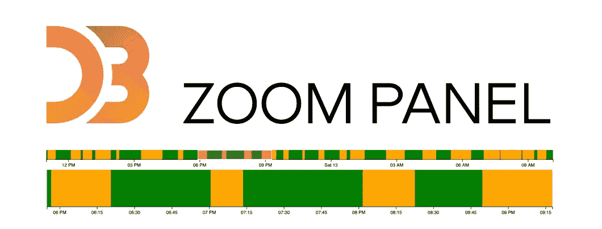
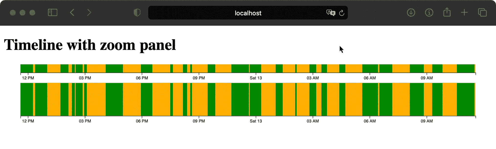

# 如何创建 D3js v6 缩放面板

> 原文：<https://itnext.io/how-to-create-d3js-v6-zoom-panel-4a3442678ca9?source=collection_archive---------7----------------------->

## 使用 Go 后端，发送 JSON 数据

D3js 是一个 Javascript 库，用于对数据进行图形化处理。在 2020 年，它被升级到版本 6。

 [## D3.js -数据驱动的文档

### D3 是一个用 HTML、SVG 和 CSS 可视化数据的 JavaScript 库。

d3js.org](https://d3js.org) 

这给我们带来了一个小问题。官方示例库不使用 Javascript，而是使用特殊的 *Observable Notebook 语言。如今，要找到 D3js 图表的最新版本 6 示例并不容易。*

这就是这篇文章的原因。我找不到版本 6 时间表的工作示例，所以我决定做一个。

请注意，这项工作是站在别人的肩膀上的。

在本文中，我们将使用我在 Amelia Wattenberger 的书中学到的策略，并在这些步骤的基础上进行构建:

1.  访问数据
2.  创建图表维度和比例
3.  画画布
4.  绘制数据
5.  设置交互，在这种情况下，缩放面板

这就是你将得到的结果。

截至 2021 年 2 月 13 日，我们将使用最新版本的 D3js，即版本 6.5.0。我们将使用 Go 作为 web 服务器来模拟一些伪真实世界的后端数据发送。我们将使用 Goland 作为 IDE。

如果您只需要 D3js 信息，可以跳过*准备项目*。和往常一样，你会在文章末尾找到 Github 资源库的链接。

这里有一个关于在 Go 中创建 web 服务器的更具描述性的教程。

 [## 作为 web 服务器提供服务

### 提供 HTML、CSS 和 Javascript 文件

medium.com](https://medium.com/swlh/create-go-service-the-easy-way-iii-c84489cc1ee0) 

这里有两个关于 D3 附加教程。本教程是基于这两个教程所做的工作，但可以分开处理。

 [## D3 v6 日历热图

### 使用 Go 后端，发送 JSON 数据

itnext.io](/d3-v6-calendar-heat-map-c709fe20e737)  [## 如何创建 D3js v6 时间轴

### 使用 Go 后端，发送 JSON 数据

itnext.io](/how-to-create-d3js-v6-timeline-1a32e586fe56) 

# 准备项目

在 Goland 创建新项目，命名为 *medium_d3_timeline*

1.  创建三个新目录: **css** 、 **html** 和 **js** 。
2.  下载最新的 D3 库并保存到这个 **js** 目录下。在这个 **js** 目录下创建新文件`homepage.js`。
3.  在 **html** 目录下创建新文件`homepage.html`
4.  在 **css** 目录下创建新文件`homepage.css`
5.  在主项目目录下新建三个文件:`main.go`、`homepage.go`、`timeline.go`和`log.go`

我们在这个项目中使用 Go。当然，您可以使用任何想要的后端语言。如果你想知道，为什么我们在这里使用 Go，请查看这篇文章。

 [## 你应该尝试围棋的 7 个理由

### 原因，我们停止使用 Java 和 C#

itnext.io](/7-reasons-you-should-try-use-go-5fb4714015d1) 

# 更新后端

## 更新 main.go

下面是创建和运行 web 服务器服务的完整代码。如果你想知道每个部分的解释，请使用文章前面的链接。

## 更新日志. go

这个文件只负责记录到控制台，这里没有太多代码。

## 更新主页. go

这个文件只包含一个服务于主页的功能。

## 更新时间轴. go

用下面的代码更新这个文件。这段代码是基础，我们将在此基础上继续构建。函数`getTimelineData()`将生成一些过去 24 小时的伪随机数据，并将其发送回浏览器。

我所说的*数据*是指两个数组，只包含 UNIX 格式的日期和值(1 或 0，表示开或关)。

# 初始测试

使用内置 Goland 功能或使用命令`go get -u all`同步所有 Go 模块。运行`main.go`，不要忘记将其设置为打包模式。如果一切顺利，我们准备走得更远。

# 准备前端

切换到**homepage.html**并用下面的代码更新它。这里没有什么特别的，只是加载这两个 javascript 文件，创建 heading 和两个`
`元素，它们将保存我们的时间轴和缩放面板。

切换到 **homepage.css** 并在下面插入代码。这将在工具提示中使用。

切换到 **homepage.js** 并在下面插入代码。同样，没什么特别的，这段代码只是向`/get_timeline_data`发送一个 JSON 请求，并打印它返回的任何内容。

通过插入`d3.json` fetch 方法(建立在标准 javascript fetch 方法之上),我们开始使用 D3 库。

有两个功能。`DrawTimeline()`创建时间轴，`DrawTimeLinePanel()`绘制缩放功能面板。

## 更新`DrawTimeLine()`功能

插入下面的代码。这项工作是基于以前的文章，请检查它的详细信息。

 [## 如何创建 D3js v6 时间轴

### 使用 Go 后端，发送 JSON 数据

itnext.io](/how-to-create-d3js-v6-timeline-1a32e586fe56) 

## 更新`DrawTimeLinePanel()`功能

用下面的代码更新函数。代码与`DrawTimeLine()`类似，但有所不同。

最后，我们正在创建画笔。画笔是缩放功能，您可以用鼠标选择缩放区域。

当用`.on(“brush”, updateData)`选择数据时，我们用选择的数据更新时间线。当我们用`.on(“brush”, updateData)`完成缩放时，我们再次更新数据。

`UpdateData()`功能首先检查是否有任何东西被选中(以防你不小心点击进入缩放面板。如果选择了某样东西，它将获取画笔选择的鼠标坐标，并将它们存储到`startBrush`和`endBrush`中。

然后，该函数使用`document.getElementById(“timeline”).innerHTML = “”`删除时间线`
`中的所有内容，更新数据并用新数据重新绘制该时间线`
`。

现在我们需要更新数据，这意味着添加`updateDatasets()` 函数。代码如下。我添加了日志记录，所以你知道，通过浏览代码，代码在做什么。但是为了在这里说清楚，这里是主要的步骤。

1.  为新数据创建两个空数组
2.  因为我们想要正确地启动这些数组，我们需要知道，**何时**是鼠标选择的第一个数据，因此得到了`startBrushing`值。
3.  因为我们想要正确地关闭这些数组，我们需要知道，**鼠标选择的最后一个数据是什么**，因此有了`lastValueInBrush`变量
4.  因为你可以放大现在是数据的部分，我们需要知道，在你选择鼠标之前最后的数据是什么**，因此有了`lastValueBeforeBrush`变量**
5.  然后我们在原始数据中循环，在循环的同时更新那些变量，并将数据添加到我们原来的空数组中。
6.  循环完成后，我们检查这两个数组的长度，如果两个数组都是空的，就插入适当的数据(当你放大一个区域，那里所有的东西都是绿色或橙色的，所以没有通过画笔选择数据)。如果这些数组不为空，我们将用正确的数据关闭这些数组。

# 全部运行

现在运行代码，您将看到结果。你会看到两张*图表*。第一个是带有鼠标选择功能的缩放面板。第二个是您的时间表图表，在您选择鼠标后更新。

# 摘要

您可以使用此功能更新任意数量的图表。你也可以使用不同类型的图表，D3 提供了。

如果你看了这篇文章，你现在知道，如何

1.  创建 D3 时间线图表
2.  创建一个 D3 *缩放面板*
3.  从后端下载数据(在这种情况下转到后端)
4.  绘制数据
5.  从缩放面板更新时间线图表中的数据

下面是完整代码的链接。

 [## petrjahoda/medium _ D3 _ 时间轴

### 通过在 GitHub 上创建帐户，为 petrjahoda/medium_d3_timeline 开发做出贡献。

github.com](https://github.com/petrjahoda/medium_d3_timeline/tree/timeline-panel)