# 如何用 Wireguard 和 Netmaker 快速创建四种类型的 VPN

> 原文：<https://itnext.io/how-to-create-four-types-of-vpns-quickly-with-wireguard-and-netmaker-1db7a6270a0f?source=collection_archive---------0----------------------->

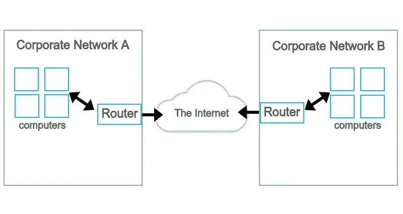

*(这是两部分系列的第 1 部分)*

VPN 可以是很多东西。你可能认为你知道 VPN 是什么…但是你真的知道吗？虚拟专用网络只是通过公共网络发送专用流量。但是，这些流量流向哪里，目的是什么？毕竟，网络有各种形状和大小。

在这个由两部分组成的教程中，我们将讨论四种“类型”的 VPN，它们可以被认为是使用案例，并用 WireGuard 和免费网络平台 [Netmaker](https://github.com/gravitl/netmaker) 在 10 分钟内设置好它们:

*   个人(私人浏览)
*   远程存取
*   站点到站点
*   网格(虚拟局域网/广域网)

WireGuard 是一种新的非常快速的 VPN 技术。通常，VPN 会使你的网络变慢。有了 WireGuard，差别可以忽略不计。Netmaker 在幕后使用 WireGuard，可以简化从家庭实验室到企业规模的环境设置。

让我们从描述 4 种类型的 VPN 开始。然后，我们将使用一个命令设置一个 Netmaker 服务器。最后，我们将介绍每种类型的 VPN，并快速进行示例设置。注意，这些教程需要一些基本的 Linux 技能。如果你以前没有接触过终端，你可以跳过这些。

在第一部分中，我们将介绍家庭使用的个人和远程访问 VPN。这些用例非常容易设置。在第二部分中，我们将讨论站点到站点和网状 VPN，它们要复杂得多，并且面向业务用例。

# VPN 的四种类型

首先，免责声明。VPN 可以有很多很多拓扑。在这里，我们将它分成四个粗略的“类别”，但是在我们浏览教程时要记住，在现实中，VPN 可以采用许多任意的设计。这些只是一些有用的和常见的方法来分解它。

## **#1 -个人 VPN(私人浏览)**

大多数人都熟悉这种类型的 VPN。如果你曾经为你的个人电脑使用过付费的 VPN 服务，可能是这样的。这种类型的 VPN 实际上也是类似于#2 中的“远程访问”VPN，但是有不同的目的。

它的工作原理是，在你的任何网络流量进入互联网之前，它首先被加密，然后通过一些公司的服务器路由。这样，没有人知道流量的来源，给你一些匿名。

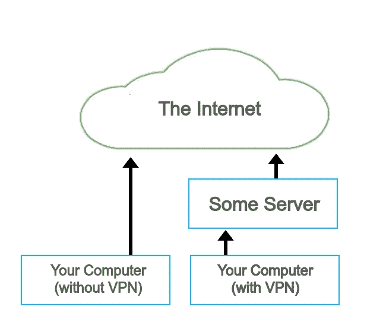

## **#2 -远程访问 VPN**

你曾经不得不使用企业 VPN 吗？如果你在远程工作，就像 2021 年的许多人一样，答案可能是肯定的。

这种类型的 VPN 实际上非常类似于“个人”VPN，只有一个关键区别:VPN“服务器”可以将您的流量路由到公司网络，而不是将您的流量路由到互联网。然而，通常*也是*为普通互联网路由流量！这样，他们就可以阻止你整天玩视频游戏和浏览 Reddit。

通过 VPN 访问公司网络，您可以访问不在公共互联网上的公司应用程序和服务(人力资源、工资单等)。

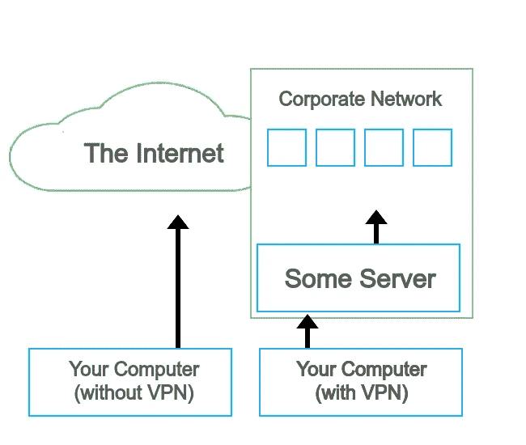

## **#3 -点对点 VPN**

除非你从事网络工程，否则你可能从未遇到过这种情况。尽管如此，你可能已经*经历过*而不自知。假设您有两个办公室，A 和 B。A 和 B 需要相互通信并共享服务，但它们在不同的网络上！他们可以建立一个“站点到站点”的 VPN，用一条专用链路把两个网络连接起来，而不是把所有这些服务都暴露在互联网上。


## **#4 -网状 VPN(虚拟局域网/广域网)**

由于其复杂性，这是目前最不常见的 VPN 之一，但它越来越受欢迎。如果您从事高级计算领域的工作，如 multi-cloud、Kubernetes 或 IoT，您很可能会遇到这种情况。在网状 VPN 中，每台设备都与其它设备有直接的 VPN 连接。这对于创建“扁平”网络很有用，在这种网络中，您不必通过其他设备路由流量，否则会增加延迟或降低安全性。

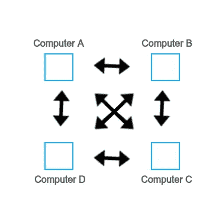

现在我们已经描述了四个用例，让我们用四个例子来演示它们，使用 Netmaker 和 WireGuard。在每个示例中，我们将使用相同的 Netmaker 服务器设置不同的 VPN，它可以创建和管理许多网络:

*   个人:我们将建立一个 VPN，用它从我们的手机接入互联网**。**
*   **远程访问:**我们将建立一个 VPN，用它从我们的手机访问**我们的** **家庭网络**。
*   **站点到站点:**我们将建立一个 VPN，并使用它从云环境访问私有子网，反之亦然。
*   **Mesh:** 我们将建立一个 VPN，将不同云中的虚拟机连接在一起，以便它们能够协调工作。

在第一部分中，我们将讨论前两个例子，这两个例子与个人更相关，然后在第二部分中，我们将继续讨论站点到站点和网状 VPN，这两个例子与组织更相关。

# **入门:部署网络制造者**

Netmaker 服务器将管理我们的各种网络。Netmaker 是一个用于部署和自动化基于 WireGuard 的网络的平台。我们将运行快速安装。这些说明也可以在 GitHub 上的[自述文件中找到。](https://github.com/gravitl/netmaker)

要部署 Netmaker，您需要一个云虚拟机，或者任何一台拥有公共 IP 的机器。我用的是 5 美元/月的数字海洋水滴([你可以在这里](https://m.do.co/c/496ffcf1e252)使用我们的推荐代码获得 100 美元的免费信用)。

我们建议部署一个 Ubuntu 20.04 实例。最重要的是，你要记得为你的虚拟机**打开防火墙**，并在必要时配置安全组。机器上的以下端口必须打开并且可以访问:

*   443 (TCP 和 UDP)
*   53 (TCP 和 UDP)
*   51821–51830(UDP)

如果您使用的是 DigitalOcean，这些端口将已经开放。一旦您创建了一个 VM 并打开了端口，部署 Netmaker 就变得轻而易举了。只需运行以下命令:

```
ssh root@yourhost
sudo wget -qO - https://raw.githubusercontent.com/gravitl/netmaker/develop/scripts/nm-quick.sh | bash -s -- -v true -c 10 
```

该命令将安装 WireGuard 和其他一些本地依赖项，部署 Netmaker，并为 Netmaker 配置**两个网络:**一个默认(对等)网络和一个“VPN”网络(这是选项`-v true -c 10`添加的)。

**不要清除输出**，它包含配置网络的重要信息。您可能希望将它保存在文本编辑器中。示例输出:

```
checking for root permissions...setting flags...checking for root permissions...checking dependencies...setting caddyfile...setting docker-compose...starting containers...visit dashboard.nm.148-188-172-168.nip.io to log increating default network (10.101.0.0/16)creating default keyconfiguring netmaker server as ingress gatewayfinished configuring server and network. You can now add clients.**For Linux and Mac clients, install with the following command:**curl -sfL https://raw.githubusercontent.com/gravitl/netmaker/develop/scripts/netclient-install.sh | sudo KEY=eyaJjbb3JcaiaaefI6IjE0N5y4xOa6aDeIeuMTcyaaLjaE2OCIsImFwaWNviJhcGkubm0uMTQ3LTE4Maefi0xNzItMTY4Lm5pcC5pbaDMiLCJhcGloba3NaefiYXBpLm5tLjEa0Ny0xODItMTsrgaBjd2dwb3J0IjoiIiwiZ3JwY3dncHViasrgiIiwiZ3JwaY3dnZW5kxfahiOiIaifQ== sh -**For Windows clients, perform the following from powershell, as administrator:**1\. Make sure WireGuardNT is installed - https://download.wireguard.com/windows-client/wireguard-installer.exe2\. Download netclient.exe - wget https://github.com/gravitl/netmaker/releases/download/latest/netclient.exe3\. Install Netclient - powershell.exe .\netclient.exe join -t eyaJjbb3JcaiaaefI6IjE0N5y4xOa6aDeIeuMTcyaaLjaE2OCIsImFwaWNviJhcGkubm0uMTQ3LTE4Maefi0xNzItMTY4Lm5pcC5pbaDMiLCJhcGloba3NaefiYXBpLm5tLjEa0Ny0xODItMTsrgaBjd2dwb3J0IjoiIiwiZ3JwY3dncHViasrgiIiwiZ3JwaY3dnZW5kxfahiOiIaifQ==4\. Whitelist C:\ProgramData\Netclient in Windows Defender**For Android and iOS clients, perform the following steps:**1\. Log into UI at dashboard.nm.147-182-172-168.nip.io2\. Navigate to "EXTERNAL CLIENTS" tab3\. Select the gateway and create clients4\. Scan the QR Code from WireGuard app in iOS or AndroidNetmaker setup is now complete. You are ready to begin using Netmaker.creating vpn network (10.201.0.0/16)configuring netmaker server as vpn inlet...configuring netmaker server vpn gateway...creating client configs...finished configuring vpn server.**To configure clients, perform the following steps:****1\. log into dashboard.nm.148-188-172-168.nip.io****2\. Navigate to "EXTERNAL CLIENTS" tab****3\. Download or scan a client config (vpnclient-x) to the appropriate device****4\. Follow the steps for your system to configure WireGuard on the appropriate device****5\. Create and delete clients as necessary. Changes to netmaker server settings require regenerating ext clients.****Netmaker setup is now complete. You are ready to begin using Netmaker.**
```

这最后一部分(突出显示)是我们将用于我们的第一个 VPN。

# 个人(私人浏览)VPN

正如我们前面讨论的，个人 VPN 允许你匿名浏览网页。通常，你会付钱给一家公司来为你托管 VPN。这里，我们刚刚部署了自己的 VPN 服务器，所以我们将使用它。

通过使用可选的"-v true "命令运行 Netmaker 安装脚本，Netmaker 为我们建立了一个个人(私人浏览)VPN。我们需要做的就是遵循输出的最后步骤。

```
**To configure clients, perform the following steps:****1\. log into dashboard.nm.148-188-172-168.nip.io****2\. Navigate to "EXTERNAL CLIENTS" tab****3\. Download or scan a client config (vpnclient-x) to the appropriate device****4\. Follow the steps for your system to configure WireGuard on the appropriate device****5\. Create and delete clients as necessary. Changes to netmaker server settings require regenerating ext clients.**
```

**1。导航到控制面板并创建一个管理员用户。**

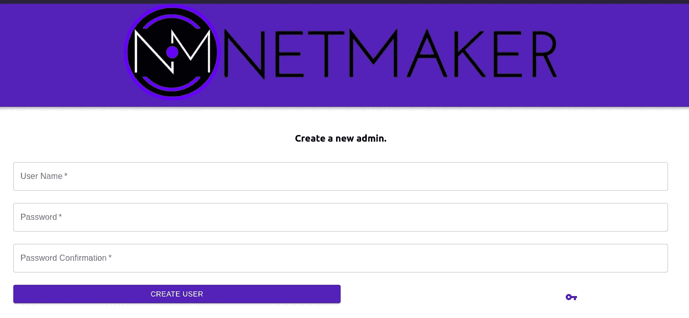

**2。使用您的新管理员用户登录。**

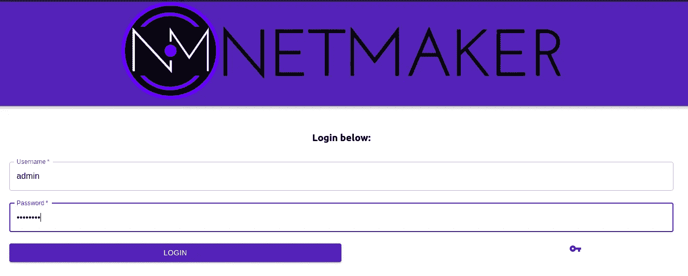

**3。您将被带到主屏幕。单击右上角的外部客户端。**

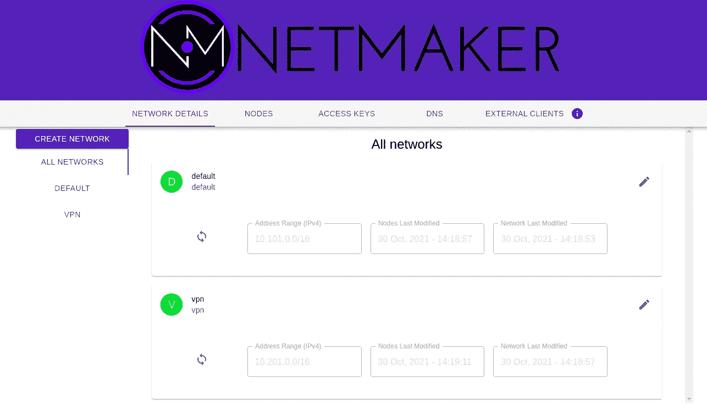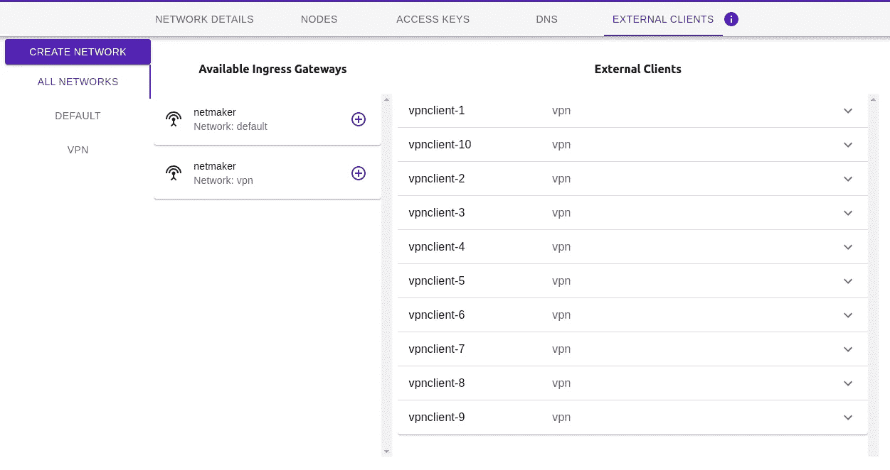

**4。配置客户端:**

Netmaker 配置了 10 个 VPN 客户端，可用于连接 WireGuard。此时，您需要决定哪些设备将使用 VPN。这些装置[需要安装铁丝网](https://www.wireguard.com/install/)。对于我们的教程，我将从 Mac 连接，[这意味着从苹果商店安装](https://apps.apple.com/us/app/wireguard/id1451685025?ls=1&mt=12)。

一旦你有了应用程序，打开它，并点击“添加隧道”。然后，您可以点击“从 QR 码创建”，并扫描其中一个客户端的 QR 码(例如，vpnclient-1。

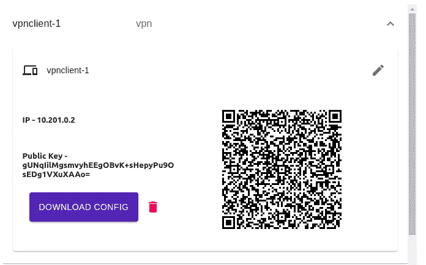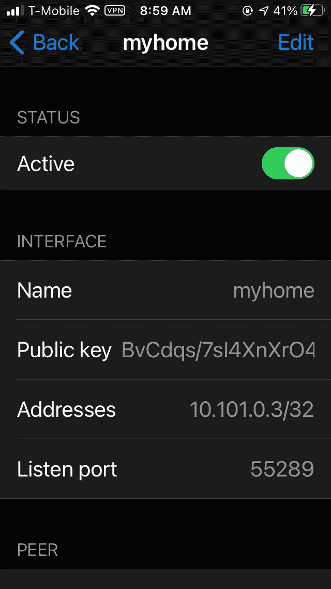

激活隧道，参观 whatsmyip.org。您将看到您的 IP 地址现在是服务器的 IP 地址。恭喜你。您已经设置了自己的个人 VPN。

现在，你准备好更进一步了吗？

# 远程访问 VPN

还记得我们说过的“远程访问”VPN 吗？通常，它们用于访问工作环境。但是，您可能没有权限配置您公司的网络访问控制。对于本教程，让我们假设您想要访问您的家庭网络。它实际上非常相似。

为此，我们需要一个进入家庭网络的“网关”。这可能是路由器，也可能是网络上的设备。Netmaker 还不提供对路由器的“官方”支持(尽管它可以在例如 OpenWRT 上运行)，所以我们将使用网络上的一个设备，即我的个人电脑。

要使用 Netmaker 创建网关，我们需要地址范围和要使用的本地网络接口。首先，从我的电脑上，我将检查我可以访问哪些网络:

```
afeiszli@alex-sys76:~$ ip routedefault via 192.168.40.1 dev wlo1 proto dhcp metric 600**192.168.40.0/24 dev wlo1 proto kernel scope link src 192.168.40.75 metric 600**
```

基于此，我的本地网络是 192.168.40.0/24，我通过 wlo1 接口访问该网络。现在，是安装网络客户端的时候了。

如果您还记得安装时，创建了两个网络，默认网络和 VPN 网络。在这个设置中，我们将使用默认的网络。在安装的输出中，有一个部分包含在各种设备上安装的说明:

```
**For Linux and Mac clients, install with the following command:**curl -sfL https://raw.githubusercontent.com/gravitl/netmaker/develop/scripts/netclient-install.sh | sudo KEY=eyaJjbb3JcaiaaefI6IjE0N5y4xOa6aDeIeuMTcyaaLjaE2OCIsImFwaWNviJhcGkubm0uMTQ3LTE4Maefi0xNzItMTY4Lm5pcC5pbaDMiLCJhcGloba3NaefiYXBpLm5tLjEa0Ny0xODItMTsrgaBjd2dwb3J0IjoiIiwiZ3JwY3dncHViasrgiIiwiZ3JwaY3dnZW5kxfahiOiIaifQ== sh -**For Windows clients, perform the following from powershell, as administrator:**1\. Make sure WireGuardNT is installed - https://download.wireguard.com/windows-client/wireguard-installer.exe2\. Download netclient.exe - wget https://github.com/gravitl/netmaker/releases/download/latest/netclient.exe3\. Install Netclient - powershell.exe .\netclient.exe join -t eyaJjbb3JcaiaaefI6IjE0N5y4xOa6aDeIeuMTcyaaLjaE2OCIsImFwaWNviJhcGkubm0uMTQ3LTE4Maefi0xNzItMTY4Lm5pcC5pbaDMiLCJhcGloba3NaefiYXBpLm5tLjEa0Ny0xODItMTsrgaBjd2dwb3J0IjoiIiwiZ3JwY3dncHViasrgiIiwiZ3JwaY3dnZW5kxfahiOiIaifQ==
```

请记住，网关目前只能安装在 Linux 设备上。幸运的是，我的电脑运行 Linux！所以我们只需运行第一个命令。

```
curl -sfL https://raw.githubusercontent.com/gravitl/netmaker/develop/scripts/netclient-install.sh | sudo KEY=xxxxxx sh -checking dependencies...wireguardwireguard is installedno $VERSION provided, fallback to latestOS Version = LinuxNetclient Version = latestBinary = netclient2021/10/31 11:42:06 [netclient] node created on remote server...updating configs2021/10/31 11:42:06 [netclient] retrieving peers2021/10/31 11:42:07 [netclient] starting wireguard2021/10/31 11:42:08 [netclient] joined default
```

太好了！我们现在在网络中。转到控制面板，我们现在可以将这台机器变成一个网关。

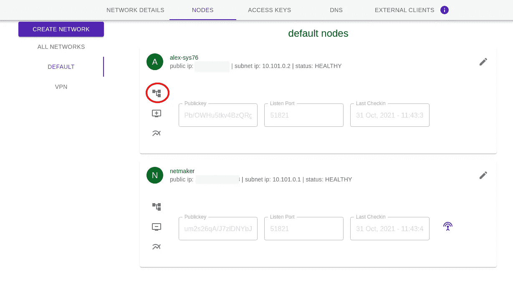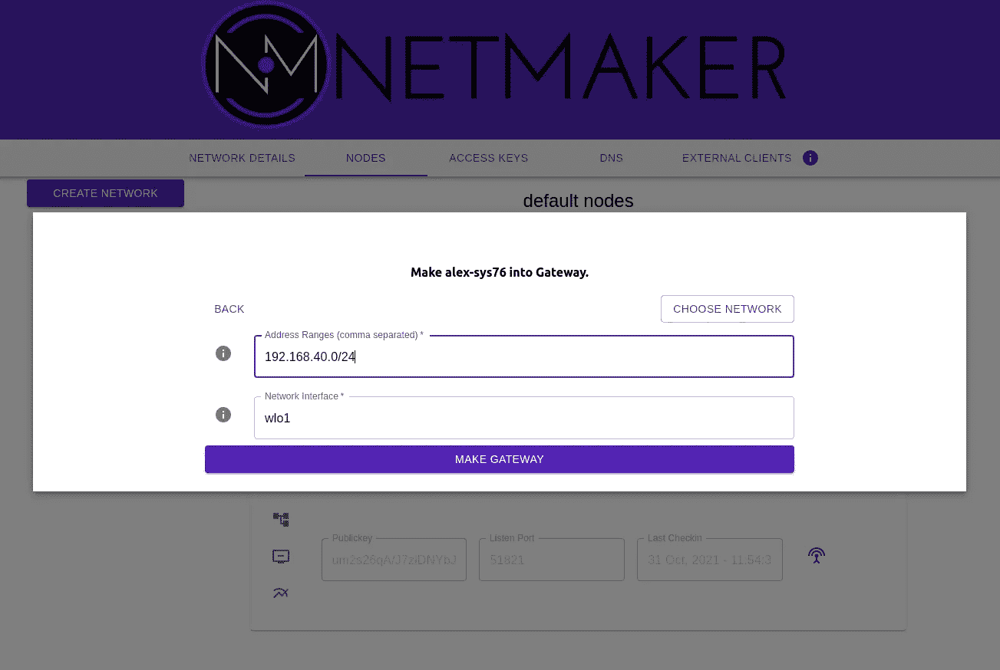

小图标表示机器现在是网关:

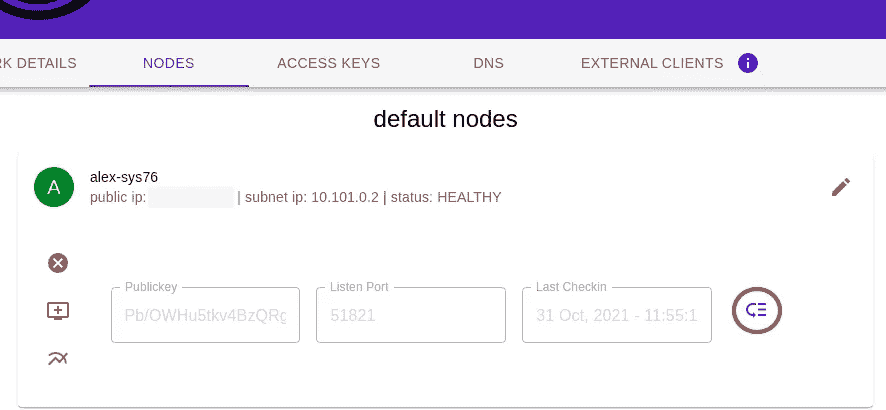

现在，如果我在家庭网络之外添加一台新机器，它将能够访问该网络上的任何内容。例如，我在 192.168.40.30 上部署了一个 Wordpress 站点:

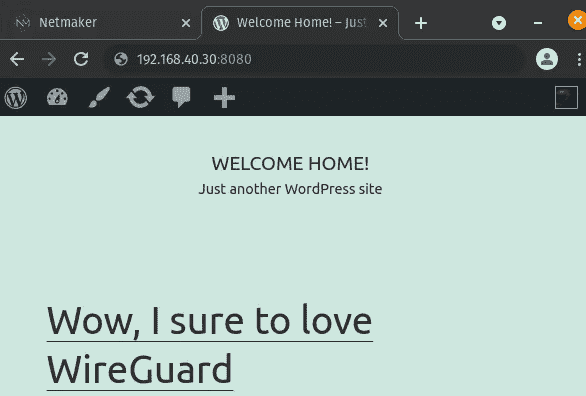

现在，我如何从路上进入这个网站？让我们使用外部客户端，就像我们对个人 VPN 所做的那样:

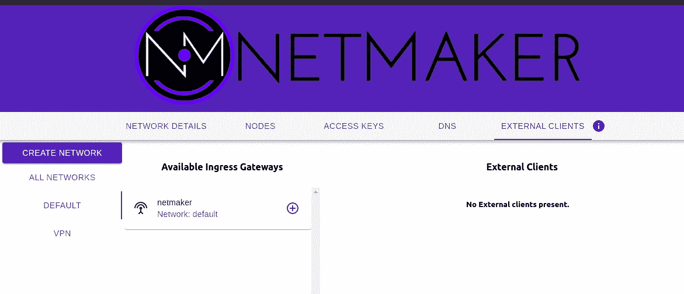

我们点击小加号按钮并确认，然后！

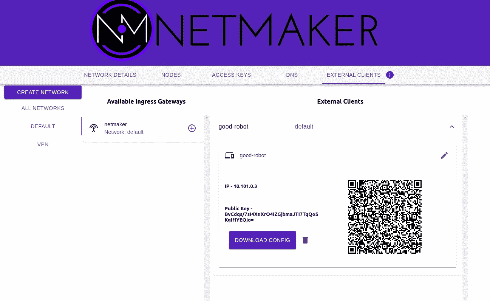

现在，像以前一样从手机连接(使用 WireGuard 应用程序)，然后…

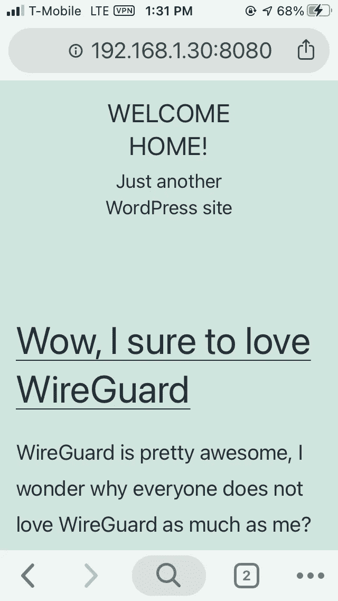

不错！我现在可以在路上访问家庭网络。

# 还有一点

我们可以很容易地在我们的“VPN”网络上创建“家庭网关”节点，并将两者合二为一！安全访问我们的家庭网络，以及安全访问互联网。那太好了，对吧？如果你感兴趣，我将挑战你自己设置它。

# 结论/第二部分

这就结束了我们关于四种 VPN 的教程的第 1 部分。订阅第二部分，了解如何配置点对点虚拟网络和网状 VPN 网络。那真的进入一些沉重的网络材料，并且是为更高级的用户准备的。与此同时，请在我们的[资源页面](https://gravitl.com/resources)查看更多运行 Netmaker 的例子。

***免责声明:****[*wire guard*](https://wireguard.com/)*是 Jason A. Donenfeld 的注册商标。**