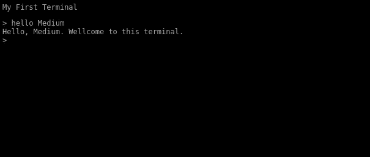
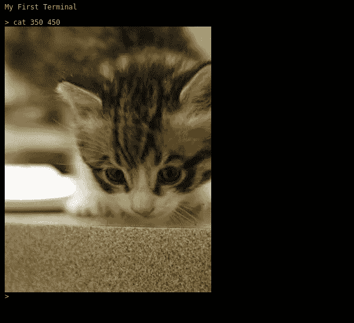
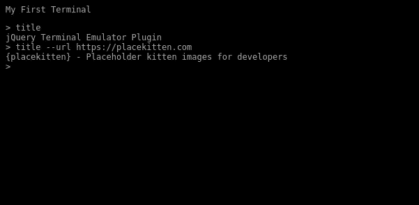

# 如何用 JavaScript 创建类似网站的交互终端？

> 原文：<https://itnext.io/how-to-create-interactive-terminal-like-website-888bb0972288?source=collection_archive---------0----------------------->

你可以创建一个静态的网站或文件夹，看起来像一个终端。但是，如果有人访问网页，实际上可以键入一些命令，并像在真正的风格终端中一样获得输出，那就更好了。您可以称之为伪终端，因为它不会提供真正的类似 shell 的 SSH 所提供的东西(除非您决定要这样做并显式地对其进行编码)。您需要自己编写每个命令，但这很有趣，也没那么难。你甚至可以创建一个互动游戏，用户可以输入他们的命令并与游戏互动，就像在一个真实的终端上，但却是在他们的浏览器上。

我提到的那些真正的终端通常在 GNU/Linux 系统或 Mac OSX 上使用，但 Windows 用户也可以使用 PowerShell、 **cmd.exec** ，或在 Windows 10 WSL 控制台(Linux 的 Windows 子系统)上使用，它只是 Windows 上的 Linux。它是任何系统管理员或更高级用户最常用的工具，在本文中，我将向您展示如何将 JavaScript 终端嵌入到网站中。

如果您有一个库，它将为您提供真实终端模拟器的外观和感觉，并带有一个很好的 API 来创建命令，那么创建这样一个风格化的控制台网站或假终端网站会更容易，所以您不需要从头开始创建它。我们将使用[JavaScript 终端库:jQuery 终端](https://terminal.jcubic.pl/)，它提供了一个简单但强大的 API 来创建任何网站上的交互终端。该库不使用任何 HTML5 特性，使用 ES5，因此它可以在任何浏览器上工作，甚至在 IE11 中。

这篇文章将向你展示，如何在任何网站上创建一个简单的基于 web 的交互式 HTML 终端。

# **创建您的第一个基于网络的终端**

首先，您需要创建一个基本的 HTML 页面，其中包含所有的依赖项:

```
<!DOCTYPE html>
<html>
<head>
<script src="https://code.jquery.com/jquery-3.3.1.min.js"></script>
<script src="https://cdn.jsdelivr.net/npm/jquery.terminal/js/jquery.terminal.min.js"></script>
<link rel="stylesheet" href="https://cdn.jsdelivr.net/npm/jquery.terminal/css/jquery.terminal.min.css"/>
</head>
<body>
</body>
</html>
```

然后在 body 标记中，您可以用第一个命令创建您的第一个终端:

```
<script>
$('body').terminal({
    hello: function(what) {
        this.echo('Hello, ' + what +
                  '. Wellcome to this terminal.');
    }
}, {
    greetings: 'My First Web Terminal'
});
</script>
```

这是一个基本的 HTML 模板，你可以用它来进行基于网络的类似终端的输入。

如果您键入“hello Medium ”,输出如下所示:



简单交互式终端网站

见[现场演示](https://codepen.io/jcubic/pen/QWmbZOY?editors=0010)。

# 抱歉，但是终端说你使用了无效的选择器！

如果您将得到一个错误消息，表明 body 不是库中的有效选择器。这意味着你需要把你的脚本放在 标签里面。这是因为浏览器在读取 HTML 时会对其进行解析，如果你的脚本在 head 标签内，那么你的主体还没有被定义。

```
<!-- rest of the HTML: from first code example -->
<body>
<script>
$('body').terminal({
    hello: function(what) {
        this.echo('Hello, ' + what +
                  '. Wellcome to this terminal.');
    }
}, {
    greetings: 'My First Web Terminal'
});
</script>
</body>
</html>
```

或者可以使用 jQuery ready 事件，当 DOM([Document object model](https://en.wikipedia.org/wiki/Document_Object_Model))准备就绪时(您的 HTML 已完全加载)运行您的代码。

```
<script>
$(function() {
    $('body').terminal({
        hello: function(what) {
            this.echo('Hello, ' + what +
                      '. Wellcome to this terminal.');
        }
    }, {
        greetings: 'My First Web Terminal'
    });
});
</script>
```

如果您想在 div 而不是主体上创建一个终端并出现错误，情况也是如此。这意味着该元素还不存在。尝试添加一个类似上面代码的就绪事件，或者在关闭< **/body >** 之前添加一个脚本标签。

# 在终端上显示图像

可以添加到终端主题网站的另一个命令示例是显示图像。下面的代码将添加命令“cat”，它将显示一只小猫的图像。

```
$('body').terminal({
    cat: function() {
        this.echo($(''));
    }
});
```

您还可以向命令添加参数。您可以添加两个参数来确定图像的具体大小(这将反过来创建一个不同的图像，这就是 placekitten.com 的工作方式)。

```
$('body').terminal({
    cat: function(width, height) {
        const img = $('');
        this.echo(img);
    }
});
```

如果您键入具有特定大小的命令“cat ”,将会得到以下输出:



显示猫图像的终端

参见[现场演示](https://codepen.io/jcubic/pen/dymogJR?editors=0010)。

**注意**:注意有 jQuery $()调用包装器，不能只回显 HTML 文本，但是可以回显 jQuery 对象。这种限制是出于安全原因。您还可以将 options 对象与{raw: true}一起用作 echo 的第二个参数。

```
$('body').terminal({
    cat: function(width, height) {
        this.echo('', {raw: true});
    }
});
```

# 带有异步命令的 JavaScript 终端

有些命令是异步的，需要一段时间来计算。图像的加载不是即时的，尤其是在慢速网络上。所以您可以在命令处理异步请求时暂停终端。

```
$('body').terminal({
    cat: function(width, height) {
        const img = $('');
        img.on('load', this.resume);
        this.pause();
        this.echo(img);
    }
}, {
    greetings: 'My First JavaScript Terminal\n'
});
```

另一个选项是从函数返回一个承诺:

```
function get_image(url) {
    return new Promise(function(resolve, reject) {
        const img = $('');
        img.on('load', () => resolve(img));
        img.on('error', reject);
    });
}
$('body').terminal({
    cat: function(width, height) {
        return get_image('https://placekitten.com/' + width +
                         '/' + height);
    },
    dog: function(width, height) {
        return get_image('https://placedog.net/' + width +
                         '/' + height);
    }
}, {
    greetings: 'My First JavaScript Terminal\n'
});
```

并且你不需要回显任何东西，终端会处理承诺。

**注意:**从版本 2.34.0 开始，默认情况下图像会暂停终端，因此您不再需要 get_image 函数。我一直保存着，只是作为使用承诺的参考。

参见[现场演示](https://codepen.io/jcubic/pen/KKopGZL?editors=0010)。

由于这个特性，您可以使用 fetch 并获得 AJAX 调用的输出:

```
$('body').terminal({
    cat: function(width, height) {
        return $('');
    },
    title: function() {
        return fetch('https://terminal.jcubic.pl')
            .then(r => r.text())
            .then(html => html.match(/<title>([^>]+)<\/title>/)[1]);
    }
}, {
    greetings: 'My First JavaScript Terminal\n'
});
```

此命令将显示库的主页标题。正如你所看到的，cat 命令也改变了，它不回显图像，只从函数中返回图像。从函数返回值的工作原理与 echo 相同。

参见[现场演示](https://codepen.io/jcubic/pen/wvmaQvZ?editors=0010)。

你可以用任何你想要的语言来创建你自己的后端服务(例如 Python 和 Django/Flask，Ruby 和 Ruby on Rails，PHP 和任何框架如 Laravel，Symfony，CodeIgniter，或者 C#和. Net 或 ASP。网)。

# 使用 JSON-RPC 服务的后端终端

使用 jQuery 终端，如果您创建了一个 [JSON-RPC](https://en.wikipedia.org/wiki/JSON-RPC) 服务，您也可以快速创建一个后端。这里是 [JSON-RPC 实现](https://github.com/jcubic/json-rpc-list)的列表(不完整)。

如果你已经创建了一个后端，你所要做的就是添加一个 URL 到后端服务。

```
$('body').terminal("service.py", {
    greetings: 'My First JavaScript Terminal\n'
});
```

# 将 ASCII 艺术显示为问候语

如果你想要好看的 ASCII 艺术作为你的欢迎信息，你可以使用 figlet.js 库来查看这个 CodePen 演示。如果你以不同的方式生成 ASCII 艺术，比如使用 figlet Linux 命令或使用[在线工具](http://patorjk.com/software/taag/#p=display&f=Standard&t=My%20Terminal)，或者如果你将获得一些其他的 ASCII 艺术，注意，要在 JavaScript 文件中使用它，你将需要转义引号和反斜杠。另一种选择是使用一个允许输入任何文本的模板标签。

```
<template id="greetings">
 _______  _______  ______    __   __  ___   __    _  _______  ___     
|       ||       ||    _ |  |  |_|  ||   | |  |  | ||   _   ||   |    
|_     _||    ___||   | ||  |       ||   | |   |_| ||  |_|  ||   |    
  |   |  |   |___ |   |_||_ |       ||   | |       ||       ||   |    
  |   |  |    ___||    __  ||       ||   | |  _    ||       ||   |___ 
  |   |  |   |___ |   |  | || ||_|| ||   | | | |   ||   _   ||       |
  |___|  |_______||___|  |_||_|   |_||___| |_|  |__||__| |__||_______|
</template>
<script>
$('body').terminal("service.py", {
    greetings: greetings.innerHTML
});
</script>
```

**注意:**如果你定义一个带有 id 属性的标签，它在 JavaScript 中被定义为一个全局变量。

如果要创建响应性的 ASCII 图片，您可以准备不同版本的 ASCII 图片，以适合每行不同数量的字符，并使用如下代码:

```
term.echo(function() {
   if (this.cols() > 100) { 
      return bigText();
   } else {
      return smallerText();
   }
});
```

您还可以使用 filget.js 库，并在函数中包含一个包装选项。

# 解析命令，比如在 Unix 终端上

如果您想拥有与 GNU/Linux 或 MacOSX 终端仿真器中相同的命令，在那里您可以添加可选的参数和选项，您可以使用一个函数来解析选项并返回一个漂亮的对象。下面的代码将向您展示如何做到这一点。

```
$('body').terminal({
    title: function(...args) {
        const options = $.terminal.parse_options(args);
        return fetch(options.url || 'https://terminal.jcubic.pl')
            .then(r => r.text())
            .then(html => html.match(/<title>([^>]+)<\/title>/)[1]);
    }
}, {
    checkArity: false,
    greetings: 'My First JavaScript Terminal\n'
});
```

**checkArity** 选项很重要。如果没有这个选项，当函数的参数个数大于零时，终端将抛出一个错误(这就是 ES6 变量参数的工作方式，树点，终端认为函数接受 0 个参数)。

该命令的输出如下所示:



使用 jQuery 终端的几个命令的交互式终端会话。

参见[现场演示](https://codepen.io/jcubic/pen/oNqXQgE?editors=0010)。

当然，如果只有一个可选参数，就不需要解析选项。在这种情况下，您可以只使用一个参数 URL:

```
$('body').terminal({
    title: function(url) {
        return fetch(url || 'https://terminal.jcubic.pl')
            .then(r => r.text())
            .then(html => html.match(/<title>([^>]+)<\/title>/)[1]);
    }
}, {
    checkArity: false,
    greetings: 'My First JavaScript Terminal\n'
});
```

但是如果您需要更复杂的命令，解析选项会很有用。你可以像前面的例子一样在 GNU 风格中使用长选项，但是像 **-u** 这样的短选项也可以在 **options.u** 变量中访问。你可以在这个 [wiki 页面](https://github.com/jcubic/jquery.terminal/wiki/Parsing-commands)上阅读更多关于解析命令和选项的信息。添加选项使命令更像真正的命令行应用程序，因此它越来越不像一个假终端。

您想要添加的另一个特性是制表符补全。如果您像这样设置终端(在文档中可以找到其他选项),那么您只需要一个选项:

```
$('body').terminal({
    title: function(...args) {
        const options = $.terminal.parse_options(args);
        return fetch(options.url || 'https://terminal.jcubic.pl')
            .then(r => r.text())
            .then(html => html.match(/<title>([^>]+)<\/title>/)[1]);
    }
}, {
    checkArity: false,
    completion: true,
    greetings: 'My First JavaScript Terminal\n'
});
```

现在，当您键入“t”并按下键盘上的 tab 键时，它将完成命令“title ”,因此您不需要手动键入整个命令。

您可能还需要一些“帮助”命令来列出可用命令。

见[现场演示](https://codepen.io/jcubic/pen/NWYqEPQ?editors=0010)。

# 放大字体

默认情况下，终端的字体是 14 像素，你可以用 CSS 把它放大。

```
<style>
:root {
   --size: 1.4;
}
</style>
```

**:root** 表示整个文档，size 是 CSS 自定义属性，也叫 CSS 变量。jQuery Terminal 还允许您更改其他一些东西，如颜色、背景、光标动画或添加发光效果。在[维基](https://github.com/jcubic/jquery.terminal/wiki/CSS-Style)上有更多关于样式的内容(包括如何让字体大小更好地适应不同的屏幕尺寸)。

# 当你创建自己的终端式网站时，下一步该怎么做

这就是了。以此为基础，您应该能够编写自己的简单 HTML 终端。本文没有讨论的 jQuery 终端库的特性包括:

*   [格式和语法高亮显示](https://github.com/jcubic/jquery.terminal/wiki/Formatting-and-Syntax-Highlighting)。
*   [改变和制作动态提示](https://github.com/jcubic/jquery.terminal/wiki/Getting-Started#prompt)。
*   [屏蔽密码](https://github.com/jcubic/jquery.terminal/wiki/Getting-Started#masking-password)。
*   [认证](https://github.com/jcubic/jquery.terminal/wiki/Authentication)。
*   像在 Unix 终端中一样用管道操作符组合命令。[参见演示](https://codepen.io/jcubic/pen/vYLvvXx?editors=0110)。
*   [键盘快捷键](https://github.com/jcubic/jquery.terminal/wiki/Getting-Started#key-shortcuts)(这里可以找到[的内置列表)。](https://terminal.jcubic.pl/api_reference.php#shortcuts)
*   从用户处读取文本。
*   处理表情符号(如果系统不像 Windows10 那样开箱即用)，参见[演示](https://codepen.io/jcubic/pen/qPVMPg?editors=0010)。
*   [ASCII 格式元素](https://github.com/jcubic/jquery.terminal/wiki/Forms)。
*   [动画](https://github.com/jcubic/jquery.terminal/wiki/Animation)和[打字动画](https://github.com/jcubic/jquery.terminal/wiki/Typing-Animation)。
*   [从 JavaScript 执行命令](https://github.com/jcubic/jquery.terminal/wiki/Getting-Started#executing-commands-from-javascript)。
*   [从服务器](https://github.com/jcubic/jquery.terminal/wiki/Invoking-Commands-and-terminal-methods-from-Server)调用命令和终端方法。
*   [更新行](https://github.com/jcubic/jquery.terminal/wiki/Getting-Started#updating-lines)。
*   在 URL 哈希中保存状态并执行保存的命令。参见[库 404 错误页面](https://terminal.jcubic.pl/404)上的**记录开始**命令。

您还可以在[示例页面](https://terminal.jcubic.pl/examples.php)中查看使用该库的创意示例和网站或单个网页的大列表。这包括例如动画或一个 [404 页面](https://terminal.jcubic.pl/examples.php#404)(如上所述)给出你可以探索的命令(像维基百科文章或行话文件:也称为黑客字典，以印刷形式，或黑客会说死树版本)。404 错误页面还有一个[聊天](https://terminal.jcubic.pl/404#[[0,1,%22chat%22]])和一些文字游戏。

要了解更多信息，这篇文章中没有涉及，请查看[入门指南](https://github.com/jcubic/jquery.terminal/wiki/Getting-Started)和[高级教程](https://github.com/jcubic/jquery.terminal/wiki/Advanced-jQuery-Terminal-Tutorial)中的更多高级内容。

最后，我想给你们看一个演示，给你们一个复古外观的控制台，就像电脑诞生之初的老式 CRT 显示器。你可以把它作为一个复古终端网站的基础。


你可以在这个[codden 演示](https://codepen.io/jcubic/pen/BwBYOZ)中找到代码。你也可以在窗口中创建终端，它不需要全屏。

# 盖曼编程语言

当我在一个付费项目中工作时，我想出了一种由 JSON 文件驱动的引擎。这是一种互动游戏或非常差的文本冒险游戏。我已经问过我为其创建这个项目的人，我是否可以发布这个游戏，以便其他人可以使用它。非常酷。后来我想到了更好的东西。我自己的编程语言，编译成 JavaScript。该项目是在测试版本，我仍然需要在操场和文档工作。你可以去看看。下面是[盖曼的 GitHub 回购](https://github.com/jcubic/gaiman)。如果你想创建一个有用户交互的复杂项目，用 Gaiman 可能更容易，因为它简化了事情。JavaScript 中的相同代码会复杂得多。

# 有偿支持

jQuery 终端是开源的，但是如果你自己创建一个终端网站有问题，我也会给[付费支持](https://support.jcubic.pl/)。如果你有一个代码的问题，你将只支付如果修复需要超过 15 分钟我的时间。付费支持的原因是为你写完整的代码，可能需要一个多小时。

# 你能帮什么忙？

如果你读到这里，你可以通过填写[这个非常短的调查](https://forms.gle/xdnKy7aMmQYAPBKf8)来帮助这个开源项目。

# 结论

如果您想为任何可以在 web 浏览器中访问的网站创建一个终端模拟器，那么 jQuery 终端模拟器是一个非常好的 JavaScript 库。它让你的网站设计看起来像一个真正的终端。你甚至可以用一点 CSS 自定义输出网站的颜色。如果你只想要基本的东西，API 很简单，但是它非常大，并且允许很大的灵活性。您不应该担心它使用 jQuery 作为基本库。之所以用 jQuery 创建它，是因为它是一个相当老的项目(但它仍然被积极地维护着)。由于使用了 jQuery，这个 web 终端库比用普通 JavaScript 编写的要小得多。

使用 jQuery 终端，你可以很容易地创建一个看起来像终端的好看的网站，一个例子可以是一份简历，一个文件夹，或者一个在网站上提供类似终端输入的互动游戏。您可以用 JavaScript 创建一个非常高级的终端应用程序，只需看看例子，它们将为您的下一个超级酷的类似终端的应用程序提供许多想法。

如果你喜欢这个你可以在 Twitter 上关注我: [@jcubic](https://twitter.com/jcubic) 你也可以查看我的[主页](https://jakub.jankiewicz.org/)。