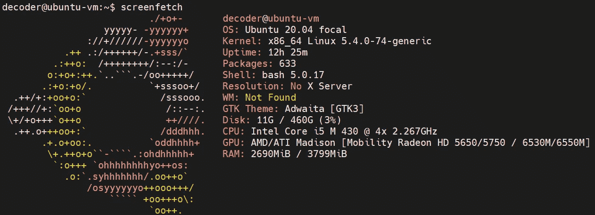
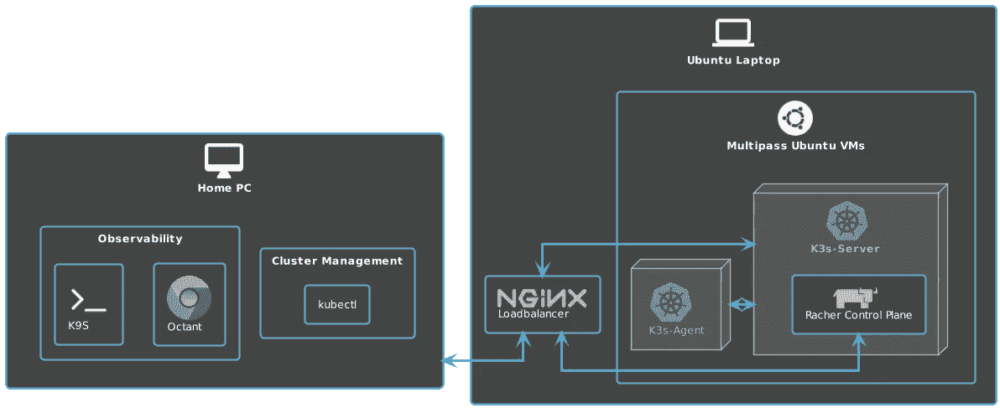
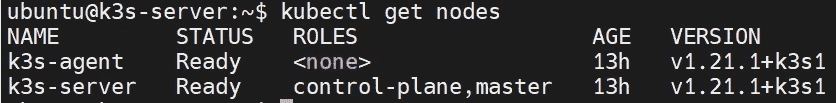
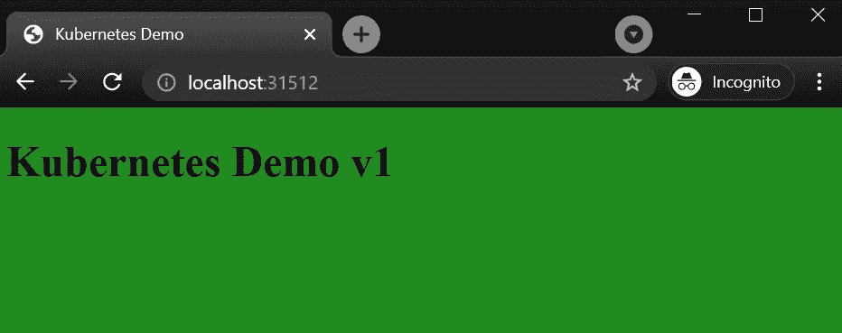

# 如何在旧笔记本电脑上创建 Kubernetes 家庭实验室

> 原文：<https://itnext.io/how-to-create-kubernetes-home-lab-on-an-old-laptop-1de6cc12c13e?source=collection_archive---------0----------------------->


[粘土银行](https://unsplash.com/@claybanks?utm_source=unsplash&utm_medium=referral&utm_content=creditCopyText)在 [Unsplash](https://unsplash.com/?utm_source=unsplash&utm_medium=referral&utm_content=creditCopyText) 拍摄的照片

## 介绍

我最近“发现”了一台被遗忘在地下室深处的旧笔记本电脑，并决定用它创建一个迷你家庭实验室，我可以在那里玩 Kubernetes。

以下是规格:



笔记本电脑规格

在这篇博客中，我们将介绍整个设置过程，并以一个可用的 Kubernetes 设置结束。我们的目标是创建一个简单但功能齐全的 Kubernetes 设置，我们可以快速启动并保持一段时间来运行简单的工作负载和学习/测试。

最终架构会是这样的:



## 安装 ubuntu

从下载 ubuntu 并刻录到 USB 开始。我已经使用了[蚀刻机](https://www.balena.io/etcher/)并且使用[种子链接](https://releases.ubuntu.com/20.04/ubuntu-20.04.2-live-server-amd64.iso.torrent)从官方页面下载了 ubuntu 20.04.2 LTS。对于 torrents 下载，我推荐 [qBittorrent](https://www.qbittorrent.org/download.php) ，但是使用你觉得舒服的任何东西。

一切准备就绪后，将带有 Ubuntu 映像的 USB 插头插入笔记本电脑，并按照 Ubuntu 页面上的安装说明进行操作。你也可以找一个 YouTube 视频来帮助你完成这个过程。这里有一个 https://www.youtube.com/watch?v=K2m52F0S2w8。

选择以下附加包:

*   openssh
*   码头工人

在“SSH 设置”阶段，请确保选择“允许通过 SSH 进行密码验证”。这将允许在不设置 PKI 的情况下快速登录。一旦您对设置感到满意并希望保持运行，就很容易禁用它并切换到基于密钥的身份验证模式。

## 启用 Wi-Fi[可选]

第一次启动后，我决定启用 Wi-Fi，因为我只有一根 Lan 电缆。如果您有笔记本电脑的专用电缆，这是可选的。

## 禁用默认 lid 操作

通常，笔记本电脑被用作桌面设备，并配置有屏幕/省电选项。其中一个选项是当笔记本电脑盖子合上时关机或休眠。让我们更改它，以确保我们的笔记本电脑即使合上盖子也能保持开机状态。

## 使用多路创建虚拟机

> Multipass 是一个轻量级的虚拟机管理器，适用于 Linux、Windows 和 macOS。它是为那些想要一个全新的 Ubuntu 环境的开发者设计的，只需要一个命令。它在 Linux 上使用 KVM，在 Windows 上使用 Hyper-V，在 macOS 上使用 HyperKit，以最小的开销运行虚拟机。它也可以在 Windows 和 macOS 上使用 VirtualBox。Multipass 将为您获取图像，并使它们保持最新。
> 
> 因为它支持 cloud-init 的元数据，所以您可以在笔记本电脑或工作站上模拟一个小型的云部署。

[](https://github.com/canonical/multipass) [## 规范/多遍

### Multipass 是一个轻量级的虚拟机管理器，适用于 Linux、Windows 和 macOS。它是为想要一个新鲜的…

github.com](https://github.com/canonical/multipass) 

## 安装 k3s 服务器和代理

由于笔记本电脑的规格很低，特别是在内存方面，我们需要一个在低端硬件上运行良好的 Kubernetes 发行版。

有两种选择:

*   牧场主 [k3s](https://k3s.io/)
*   米兰蒂斯 [k0s](https://www.mirantis.com/software/k0s/)

我选择 k3s 是因为我对它们很熟悉，最后，我希望能够用 Rancher Management 来管理我的集群。

*如果你有兴趣阅读更多关于 k3s 和 k0s 的比较，这里有一个不错的博客:*[*https://saiyampathak . medium . com/k0s-yet-another-kubernetes-distro-7201 ea 425165*](https://saiyampathak.medium.com/k0s-yet-another-kubernetes-distro-7201ea425165)

如果 k3s 配置仍然不可写，请使用

`sudo chmod 644 /etc/rancher/k3s/k3s.yaml`

安装之后，让我们确保我们的集群启动并运行

```
# Login to ks3 server vm
multipass shell ks3-server# Check if the nodes are up and running
kubeclt get nodes
```

输出应该如下所示:



运行节点

关于污点的快速注释。通常，我们不希望我们的工作负载在主节点上运行，并使用污点和容忍来确保 pods 只在一个工作节点上调度。在我们的例子中，由于硬件资源的限制，设置不是 HA(高可用性),我们将允许 pods 在主节点上调度。

## 设置负载平衡器

到目前为止，我们的设置包括裸机“服务器”，上面有 2 个虚拟机。为了在主机(在我的例子中是 windows 10)和 Kubernetes 集群之间建立流量，我们需要确保发送到服务器的所有请求都被转发到 Kubernetes IP 或我们的 k3s-server VM。

为此，我们将使用 nginx，并用集群负载平衡替换默认配置。

[https://Ubuntu . com/tutorials/install-and-configure-nginx # 4-setting-up-virtual-host](https://ubuntu.com/tutorials/install-and-configure-nginx#4-setting-up-virtual-host)

```
sudo apt install nginxsudo cat >/etc/nginx/nginx.conf<< EOFevents {}stream {
 upstream k3s_servers {
  server ${K3S_NODEIP_SERVER}:6443;
 }server {
 listen 6443;
  proxy_pass k3s_servers;
 }
}
EOF
```

## 从您的 PC 连接到集群

我们有一个正在运行的双节点集群。现在，让我们从家用电脑连接到它。

在从我们的 PC 连接之前，我们需要从 VM 复制 kube 配置设置，并将其与家用 PC 上的 kube 配置文件合并。

*我建议提前将 kubectl 升级到最新版本，按照 Kubernetes 页面*[](https://kubernetes.io/docs/tasks/tools/install-kubectl-linux/)**的安装步骤进行。**

```
*# Login to k3s-server vm
multipass shell k3s-server# Copy content of the kube config
kubectl config view --raw# Create a new file on your machine in the ~./kube directory and copy content
cat > config_k3s [enter] 
<paste content>
[enter — adds one line to the file]
[Ctrl + C — exit]# Merge two config files using KUBECONFIG variable
KUBECONFIG=/root/.kube/config:/root/.kube/config_k3s*
```

*如果您想了解更多关于管理 kube 配置的信息，请访问 Kubernetes.io 上的[Kubectl context and Configuration](https://kubernetes.io/docs/reference/kubectl/cheatsheet/#kubectl-context-and-configuration)*

*确保您切换到新创建的上下文。*

```
*# Check all contexts
kubectl config get-contexts# Swap to "default" (this is the name in my case)
kubectl config use-context default*
```

*现在，从您的家庭 PC 终端运行 **kubectl get nodes** 命令应该会产生相同的输出。*

## *安装集群可视化工具*

*最后，让我们安装两个我最喜欢的集群可视化工具:*

*   *[Octant](https://octant.dev/) 是一款 VMWare 开源集群可视化工具，在浏览器中运行，因此无需本地安装。*
*   *k9s 是一个非常棒的基于控制台的集群可视化工具。*

## *安装 Rancher 来管理您的集群[可选]*

*在任何 Kubernetes 平台上安装 Rancher 都有很多选择。由于这个例子是用于测试目的，我们将使用 docker 中的 [Rancher 来遵循安装步骤。](https://rancher.com/docs/rancher/v2.5/en/installation/other-installation-methods/single-node-docker/#option-a-default-rancher-generated-self-signed-certificate)*

## *运行一个示例工作负载*

*让我们确保我们的集群能够接受和服务简单的工作负载*

*因为我们已经公开了 NodePort 上的一个部署，所以我们需要查看 Kubernetes 分配了什么端口:*

```
*# Check node port
kubectl get svc*
```

**

## *摘要*

*这个安装应该作为一个入门，甚至用一台旧笔记本电脑建立一个家庭实验室，并开始玩 Kubernetes。有许多事情我们还没有尝试或测试，我鼓励你自己尝试，分享你的经验。*

## *额外资源*

*以下是我在创建这个博客时使用的额外资源和一些材料的列表。*

*使用 K3sup 工具可以更容易地安装 k3s，请查看 GitHub 上 Alex Ellis 的回购:*

*[](https://github.com/alexellis/k3sup) [## alexellis/k3sup

### k3sup 是一个轻量级实用程序，可以在任何本地或远程虚拟机上使用 k3s 从零配置到 KUBECONFIG。你只需要嘘…

github.com](https://github.com/alexellis/k3sup) 

如果你想学习如何编写一些手工操作的脚本，请查看在 Rancher 工作的 Sebastiaan van Steenis 的报告

[](https://github.com/superseb/multipass-k3s/blob/master/multipass-k3s.sh) [## 超组/多通道-k3s

### 使用多遍实例创建 k3s 集群超集/多遍 k3s

github.com](https://github.com/superseb/multipass-k3s/blob/master/multipass-k3s.sh) 

如果你想经历类似的设置，但有视频，我强烈建议看看 Techno Tim 的 YouTube 频道。

最后，如果您有兴趣了解 k3s 的更多信息，这里有一个很好的概述:

到目前为止，这个设置主要是手动完成的，在下一篇博客中，我将使用 rancher 2 的 terraform provider 来实现 Rancher 部署的自动化

[https://registry . terraform . io/providers/rancher/rancher 2/latest/docs](https://registry.terraform.io/providers/rancher/rancher2/latest/docs)

如果您在此过程中遇到了任何问题，发现了一个 bug，或者只是想分享您的想法，请发表评论，并在您的家庭实验室中体验乐趣:)*