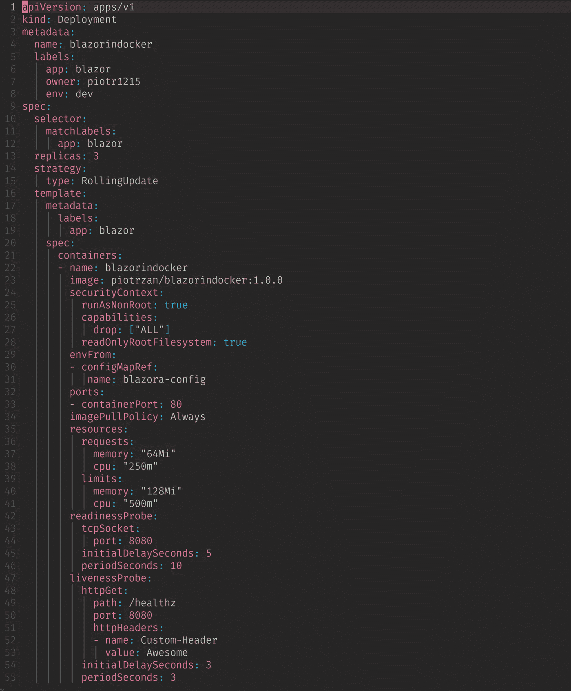
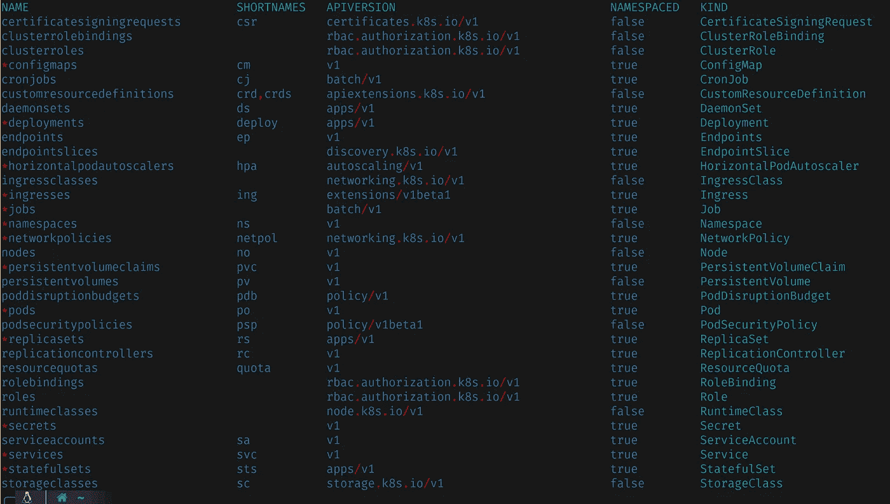
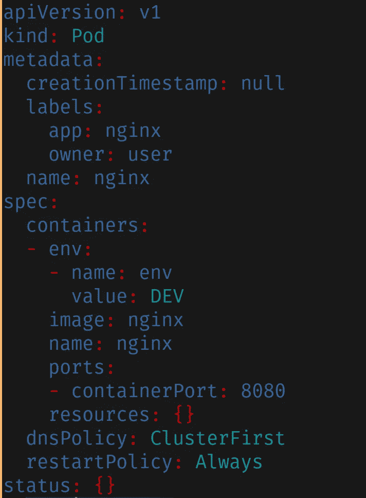
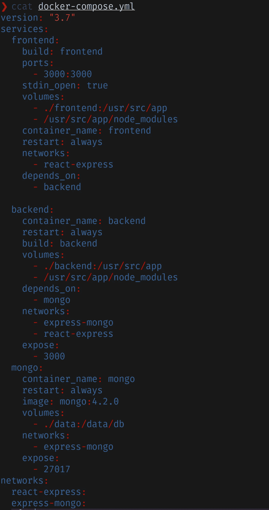
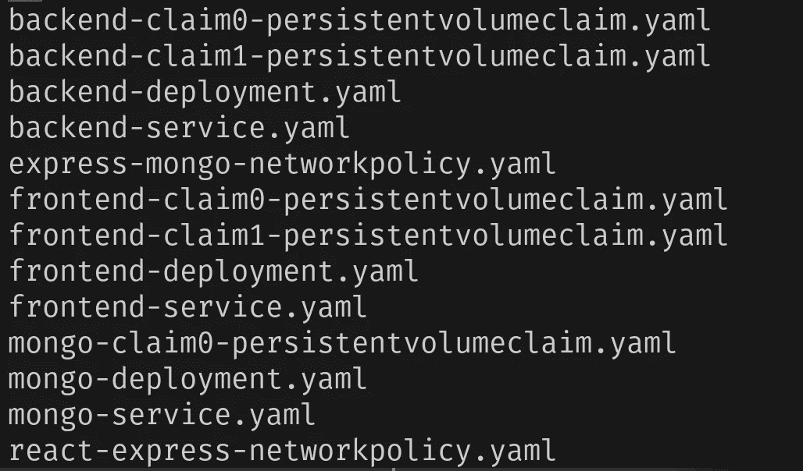
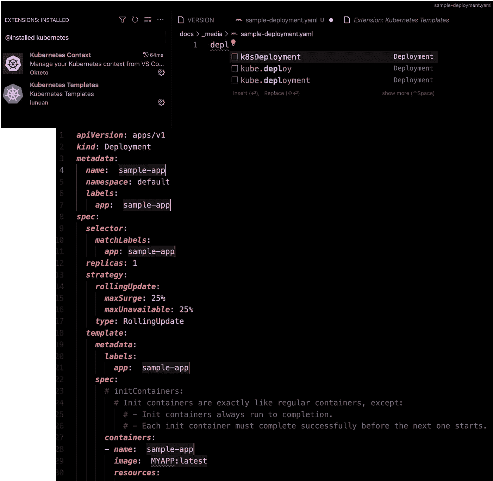
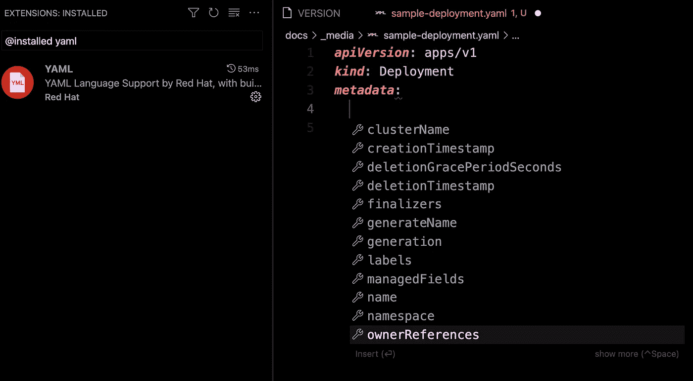
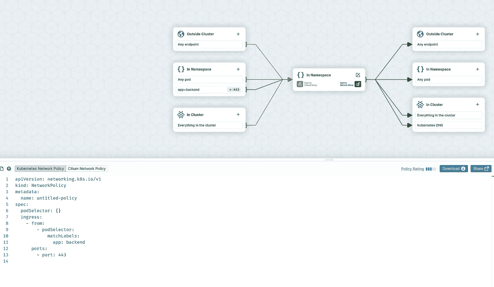

# 如何创建 Kubernetes YAML 文件

> 原文：<https://itnext.io/how-to-create-kubernetes-yaml-files-abb8426eeb45?source=collection_archive---------0----------------------->


图片由 [200 度](https://pixabay.com/users/200degrees-2051452/?utm_source=link-attribution&utm_medium=referral&utm_campaign=image&utm_content=1745705)来自 [Pixabay](https://pixabay.com/?utm_source=link-attribution&utm_medium=referral&utm_campaign=image&utm_content=1745705)

## 在 Kubernetes 上开发

## 介绍

本文旨在作为创建 Kubernetes 清单文件的指南。

[YAML](https://yaml.org/) 代表 YAML，不是用标记语言来创建 Kubernetes 清单的。根据定义:

> YAML 是一种对所有编程语言都友好的数据序列化语言。

事实上，一旦你意识到缩进是构建数据结构的方式，阅读 YAML 就相当简单了。如果您熟悉 Python、F#或其他支持缩进的语言，这将非常容易。

另一方面，写 YAML 就没那么有趣了。如果您熟悉无模式 REST API 开发，那么可以将 Kubernetes YAML 视为一个 API 的 JSON 有效负载。没有要验证的模式，所有的旋钮都作为有效负载中的数据公开。

创建一个简单的 YAML 文件相对简单，但是对于生产应用，需要更多的设置。这里有一个 Kubernetes [部署](https://kubernetes.io/docs/concepts/workloads/controllers/deployment/)清单的例子。如果您对 Kubernetes 有所了解，那么当您阅读该文件时，大多数设置都是有意义的。现在想象一下，你需要从头开始创建一些(入口、服务、配置映射、秘密……)



来源:作者— [Blazor PWA Repo](https://github.com/Piotr1215/pwa-sample)

作为开发人员，您需要创建几种不同类型的清单。以下是 Kubernetes 资源列表， ***** 表示通常由开发人员创建/维护的资源。请注意，这仅适用于你有一个专门的 Kubernetes 管理员可以照顾其余的。该列表仅缩写为公共资源，在生产中，场景可能包括各种 CRD(自定义资源定义)。



来源:作者 Kubernetes 资源

> 如果你不困惑，你就没有注意。
> 
> 汤姆·彼得斯

## 你将学到什么

让我们试着减轻一些关于编写 YAML 文件的困惑，让这个过程变得更容易和不那么痛苦。

阅读本文后，您将了解到:

*   创建 Kubernetes YAML 文件的不同方法
*   如何在开发过程中自动检测和纠正错误
*   使用什么开发工具来简化 YAML 文件的创建
*   了解专门用于生成不同种类的 YAML 文件的在线工具

## 先决条件

如果你想继续下去，并得到你的手脏与 YAML，你需要:

*   带有[远程开发扩展](https://github.com/Microsoft/vscode-remote-release)的 VS 代码
*   [docker 桌面](https://www.docker.com/products/docker-desktop)或任何替代品(需要能够运行容器)
*   克隆[这个仓库](https://github.com/Piotr1215/generate-k8s-yaml)

请注意，存储库使用了一个 [devcontainer](https://code.visualstudio.com/docs/remote/containers) ，其中包含了运行示例构建所需的所有工具和配置。因此，图像很大，所以请在运行容器之前对其进行相应的修改。

## 创建与生成

最初，您可能会尝试生成尽可能多的样板文件。我的建议是，不要！尤其是如果你是 Kubernetes 或 YAML 的新手，尝试从 Kubernetes 文档中复制粘贴，但是不要在第一天就使用发电机。

一旦你熟悉了基础知识，逐步添加工具，这将使你的生活更容易。有好消息；你会很快理解基础知识。

一个很好的方法来知道你是否足够熟悉一个特定资源的 YAML 内容，如果它变得，嗯…无聊。从现在开始，你应该一头扎进发电机和助手的世界，保持头脑清醒，让你的生活更轻松。

## 第一季度

我要说的第一个工具是 [yq](https://mikefarah.gitbook.io/yq/) 。Yq 不是 Kubernetes 特有的，而是 YAML 的“万金油”。学习这个工具将帮助您直接从命令行查询和操作 YAML 文件。它有助于完成任务，例如:

*   针对特定值过滤 YAML 文件，例如从部署文件中检索映像名称

从 YAML 文件中选择值是有用的，但是掌握 yq 将主要有助于对多个文件的批量操作和更复杂的转换。

## #3 库贝克特尔

使用 [kubectl](https://kubernetes.io/docs/reference/kubectl/kubectl/) 很容易开始为大多数资源生成 YAML 文件。您可以使用“ [kubectl create](https://kubernetes.io/docs/reference/generated/kubectl/kubectl-commands#create) ”或“ [kubectl run](https://kubernetes.io/docs/reference/generated/kubectl/kubectl-commands#run) ”命令上的“-dry-run = client-oy AML>YAML _ file . YAML”标志来生成大部分资源。

例如，要为 nginx pod 生成 YAML 文件，您可以运行:

kubectl run nginx—image = nginx—port = 8080—env = env = DEV—labels = app = nginx，owner = user—privileged = false—dry-run = client-oy AML > nginx-pod . YAML

该命令将生成以下 YAML:



YAML 用 kubectl 生成

文件需要清理一点，但这是一个很好的起点。

现在，您可以使用以下命令创建部署:

kubectl 创建部署 my-dep-image = nginx-dry-run = client-oy AML > deployment . YAML

并使用 yq 来合并这两个文件。

这个过程可能会很快变得复杂，但是使用 shell 脚本来自动化大多数任务是很容易的。

使用 kubectl 和 yq 的组合对于开始一个简单的一次性项目来说是非常好的，并且有助于自动化这两者之间的事情。

如果你对 kubectl 技巧和诀窍感兴趣，我在本文[中列出了越来越多的有用命令。](https://gist.github.com/Piotr1215/443fb83c89958139f0c67ec70b111da2)

## # 3 Docker-撰写

您的项目中有 docker-compose.yaml 文件吗？使用名为 [kompose](https://kompose.io/) 的工具可以从 docker-compose 文件生成 Kubernetes 清单。

让我们来看看实际情况。我们将使用来自 [awesome-compose 存储库](https://github.com/docker/awesome-compose.git)的 docker-compose 文件。

下面是一个 docker-compose 文件示例:



来源:Awesome-Compose repo

现在，让我们使用 **kompose:** 生成 Kubernetes 清单

kompose 生成 K8s 清单

该命令将 docker-compose 作为输入，并将生成的 Kubernetes YAML 输出到 k8s-manifests 文件夹中。



kompose 生成的文件

如果你已经有一个 docker-compose 文件，使用 kompose 是一个不错的选择。经常需要做一些调整，但是这会让你离一个良好的起点更近一步。

## #4 VS 带插件的代码

VS 代码有 2 个插件，帮助创建 YAML 文件。非常感谢 Avi Nehama 的建议。

[Kubernetes 模板](https://marketplace.visualstudio.com/items?itemName=lunuan.kubernetes-templates)

该模板支持任何 Kubernetes 资源的快速搭建。

创建 yaml 文件，开始输入 Kubernetes 资源的名称，然后点击 TAB 插入一个模板。继续循环使用 TAB 键，在必填字段中填入名称。



[YAML](https://marketplace.visualstudio.com/items?itemName=redhat.vscode-yaml)

这个来自 Red Hat 的扩展在后台运行 YAML 服务器，并为任何 Kubernetes 资源添加上下文感知智能完成。

记得在设置里激活它，重新加载 VS 代码。将这一行添加到设置中，以便在所有 YAML 文件上启用 Kubernetes 补全。

```
"yaml.schemas": {
  "Kubernetes": "*.yaml"
}
```



## # 5 CDK8s

从命令行转移到编程领域。如果你不得不写很多 YAML，但碰巧知道 Python、Typescript、JavaScript、Java 或 Go，你可以利用编程语言的力量使写 YAML 的过程变得容易得多。

介绍 [CDK8s](https://cdk8s.io/)

> cdk8s 是一个开源软件开发框架，使用熟悉的编程语言和丰富的面向对象 API 来定义 Kubernetes 应用程序和可重用的抽象。 **cdk8s** 应用综合成标准的 Kubernetes 清单，可应用于任何 Kubernetes 集群。

CDK8s 的工作原理是公开 Kubernetes 资源对象，并使用一个称为构造的对象来进一步抽象和自动化 YAML 文件的创建。

这种方法背后的真正力量是能够:

*   创建可重用的组件和抽象来捕获您的需求
*   使用本地编程语言结构来自动化、测试和验证创建 YAML 的过程

## 第六名 NAML

如果你碰巧知道去，不喜欢 YAML，并希望不惜一切代价避免它，这个项目可能是你的东西！

由[Kris Nova](https://medium.com/u/158602cec861?source=post_page-----abb8426eeb45--------------------------------)([Github profile](https://github.com/kris-nova))设计的一个非常有趣的方法是一个名为 naml 的以 Go 为中心的工具，它的工作原理是直接在 Go 中创建 Kubernetes 清单，并通过 CLI install 命令将它们安装在集群上。

该工具可以生成类似于 CKD8s 的 YAML，但仅适用于 Go。

[](https://github.com/kris-nova/naml) [## GitHub - kris-nova/naml:不是另一种标记语言。用…替换库本内特斯 YAML 的框架

### NAML 是一个 Go 库和命令行工具，可以用作开发和部署 Kubernetes 的框架…

github.com](https://github.com/kris-nova/naml) 

## #7 在线工具

一个沮丧的开发人员偶尔会创建一个简单的 Web UI，用一个表单收集输入来生成 YAML 文件。这些项目通常是短命的，维护得不是很好，所以我的建议是远离在线 Kubernetes YAML 发电机。

有一个例外，一个由 [cilium](https://editor.cilium.io/) 在线编辑的专门创建 Kubernetes 资源叫做[网络政策](https://kubernetes.io/docs/tasks/administer-cluster/declare-network-policy/)



来源:https://editor.cilium.io/

## 结束语

我们已经看到了创建 Kubernetes YAML 文件的各种方法，其中一些使用简单的命令行工具，自动生成文件。其他人公开完整的编程语言。

这很好，但是我们如何确保我们的 YAML 是正确的呢？验证文件内容的一些最佳实践是什么？这些实践如何实现自动化？

如果你想知道这些和类似问题的答案，请继续关注下一篇文章。