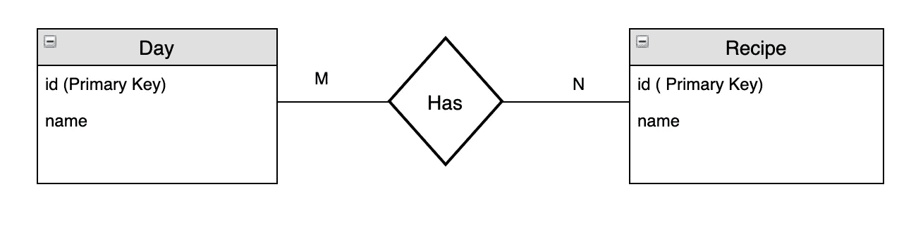
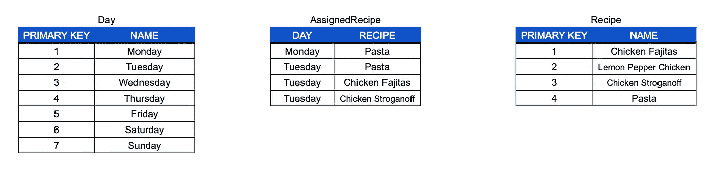
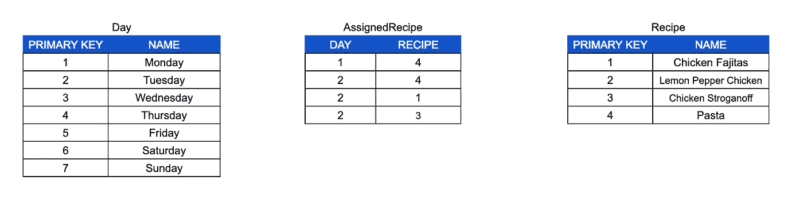
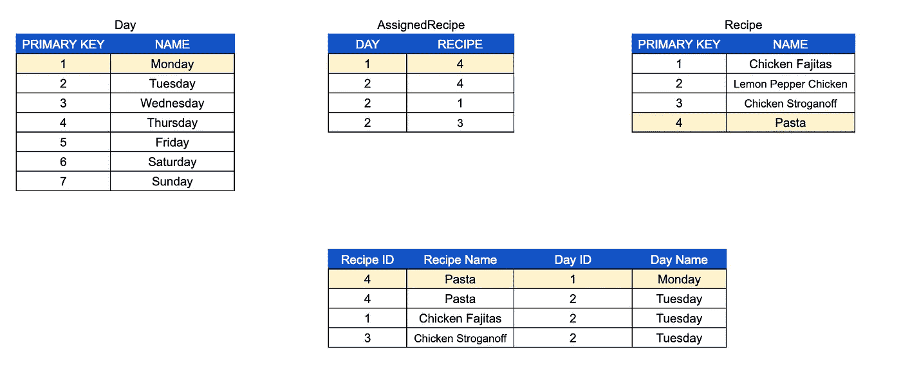
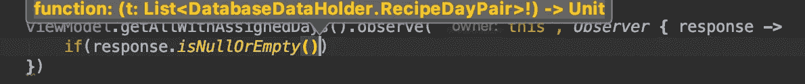
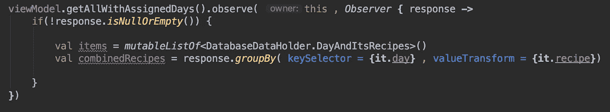

# 如何与 Room 和 Kotlin 建立 M:N 关系

> 原文：<https://itnext.io/how-to-create-m-n-relationship-with-room-and-kotlin-ddbdebf0ee38?source=collection_archive---------0----------------------->


如何与 Room 和 Kotlin 建立 M:N 关系

在本文中，我将解释如何使用 [Room](https://developer.android.com/topic/libraries/architecture/room) 创建多对多关系。我会尽量多练习，不写很多理论，只写必要的。我将遵循以下几点:

*   多对多关系的描述
*   为其创建房间实体
*   插入关系
*   查询关系数据

为此，我将使用以下实体:Recipe 和 Day，其中一个配方可以分配给多天，一天可以包含多个配方。这个例子是我为一个食谱应用程序做的，用户可以创建一周的饮食计划。



表示多对多关系的标准方法是使用连接表。您可以将此表想象为两个实体之间的表:



您可以看到星期二有多种食谱，因此这样我们就建立了多对多的关系。我使用字段名只是为了解释这个表的目的，实际上我们在这里存储的是日期和收件人



让我们看看房间实体如何寻找这些

```
@Entity(primaryKeys = ["id"])
data class Recipe(val id: Int, val name : String)@Entity(primaryKeys = ["id"])
data class Day (val id : Int , val name : String)
```

我们在这里看到的第一件事是，我们不需要指定 ForeignKey，但是我们需要创建一个实体来表示 AssignedRecipe。为此，我将把它存储在一个名为 DatabaseDataHolder 的类中，因为在结束之前我们还需要一些其他的东西。

```
class DatabaseDataHolder {

    @Entity(
        primaryKeys = ["day", "recipe"], foreignKeys = [
            ForeignKey(
                entity = Day::class,
                parentColumns = ["id"],
                childColumns = ["day"],
                onDelete = ForeignKey.*CASCADE* ),
            ForeignKey(
                entity = Recipe::class,
                parentColumns = ["id"],
                childColumns = ["recipe"],
                onDelete = ForeignKey.*CASCADE* )]
    )
    class AssignedRecipe {
        var day: Int = 0
        var recipe: Int = 0
    }
}
```

在这个表中，我们有两个 Int 字段，一个表示日期，另一个表示食谱。这些字段用作 dayId 和 recipeId 的外键。

***记住，您需要将这个表添加到数据库类中的实体列表中。***

既然我们已经定义了一个新的实体并让数据库知道了它，我们需要定义一个函数来分配一个配方。那么让我们定义一个 [*刀*](https://developer.android.com/reference/android/arch/persistence/room/Dao) 叫做累西腓刀

```
@Dao
interface RecipeDao {

    @Insert(onConflict = OnConflictStrategy.*IGNORE*)
    fun addAssignedRecipe( assignedRecipe: AssignedRecipe)

}
```

我使用 OnConflictStrategy。忽略以避免插入已存在的具有相同配方和日期的已分配接收方。

使用这个函数很简单:

```
*thread* **{** var assignedRecipe = DatabaseDataHolder.AssignedRecipe()
    assignedRecipe.day = day
    assignedRecipe.recipe = recipe
    recipeDao.addAssignedRecipe(assignedRecipe)
**}**
```

要取消分配配方，我们删除 AssignedRecipe 表中具有 recipeId/dayId 的所有行，因此我们总是在 RecipeDao 中添加这个函数

```
@Query("DELETE FROM AssignedRecipe WHERE AssignedRecipe.day =:dayId")
fun removeAllAssignedRecipeByDayId( dayId : Int)@Query("DELETE FROM AssignedRecipe WHERE AssignedRecipe.recipe =:recipeId")
fun removeAllAssignedRecipeByRecipeId( recipeId : Int)
```

此时，我们已经有了主表，但是我们真正想要的是从 Recipe 和 Day 获得所有数据，例如，我们想要知道某一天的所有食谱。表示这些信息的一个好方法可能是一对*，*像< 1，4 >或<星期一，意大利面>。我们需要连接 3 个表(日、指定接收、配方),以便获得我们需要的所有数据



让我们看看如何通过查询创建这个结果，首先定义一个表示对<day recipe="">的类</day>

```
class DatabaseDataHolder {

    @Entity(
        primaryKeys = ["day", "recipe"], foreignKeys = [
            ForeignKey(
                entity = Day::class,
                parentColumns = ["id"],
                childColumns = ["day"],
                onDelete = ForeignKey.*CASCADE* ),
            ForeignKey(
                entity = Recipe::class,
                parentColumns = ["id"],
                childColumns = ["recipe"],
                onDelete = ForeignKey.*CASCADE* )]
    )
    class AssignedRecipe {
        var day: Int = 0
        var recipe: Int = 0
    }

    **class RecipeDayPair {
        @Embedded(prefix = "recipe_")
        lateinit var recipe : Recipe

        @Embedded
        var day : Day? = null
    }**}
```

我们知道菜谱不会为空，所以我使用 *lateinit* 来避免菜谱为空。然后我使用*嵌入的*注释来避免与其他表的字段冲突。现在我们可以定义返回*LiveData<List<database data holder 的查询。往复对> >。为了简单起见，我们把它分成不同的部分*

我们从 Recipe 表中选择一些字段，从 day 表中选择所有内容，然后分配 Recipe.day。我用“ *recipe_nameField* 作为 Recipe 字段的前缀，否则我们会与 Day 的列名发生冲突。

```
SELECT Recipe.id as recipe_id, Recipe.name as recipe_name, AssignedRecipe.day , Day.*
```

然后我们开始连接表(我们试图复制我在上一张图中解释过的连接表) :

*   我们使用 Recipe.id 将 Recipe 表与 AssignedRecipe 连接起来

```
FROM Recipe LEFT OUTER JOIN AssignedRecipe on AssignedRecipe.Recipe = Recipe.id
```

*   我们使用 Day.id 连接日表

```
LEFT OUTER JOIN Day on AssignedRecipe.day = Day.id
```

然后我们把所有这些部分放在一起，我们有我们的查询

```
@Query("SELECT Recipe.id as recipe_id, Recipe.name as recipe_name, AssignedRecipe.day , Day.* FROM Recipe LEFT OUTER JOIN AssignedRecipe on AssignedRecipe.Recipe = Recipe.id LEFT OUTER JOIN Day on AssignedRecipe.day = Day.id")
fun getAllWithAssignedDays() : LiveData<List<DatabaseDataHolder.RecipeDayPair>>
```

如果配方未分配，我们预计该配方的日期将为空。

因此，通过这个查询，我们可以获得一个对列表<day recipe="">，例如:</day>

```
{ Pair(Monday , Pasta) , Pair(Tuesday, Chicken Fajitas) ,
Pair(Tuesday , Pasta) }
```

这个结果还可以，但我认为我们可以做得更好，使用比配对列表更方便的东西。我希望有一天和那天的食谱列表，这样我们可以尝试将我们的 Pair 对象列表转换成这个新的表示。就像我们之前用 *RecipeDayPair 所做的一样，*让我们在 DatabaseDataHolder 中创建一个表示日期和食谱列表的类。

```
data class DayAndItsRecipes (val day: Day, 
val recipes: List<Recipe>)
```

现在让我们使用我们之前声明的查询，我们得到的响应将是一个*recipe paypal*的列表

```
viewModel.getAllWithAssignedDays().observe( this , *Observer* **{** response **->** if(!response.*isNullOrEmpty*()) {

    }
**}**)
```



现在，我们想把这个列表转换成更容易操作的形式，比如一个 DayAndItsRecipes 的列表。为此，我将使用 Kotlin[*group by*](https://kotlinlang.org/api/latest/jvm/stdlib/kotlin.collections/group-by.html)*函数按天对每个项目进行分组。*该功能给出一张<日地图，列出<食谱>和>。



我们使用函数[forEachforEach](https://kotlinlang.org/api/latest/jvm/stdlib/kotlin.collections/for-each.html)forEach*遍历这个映射，并填充我们的列表*

```
combinedRecipes.*forEach* **{** items.add(DatabaseDataHolder.DayAndItsRecipes(**it**.key , **it**.value))**}**
```

就这样，我们有了我们的食谱清单。一件重要的事情是使代码可读和可重用，所以最好将这最后一部分代码移到 DatabaseDataHolder 类中，使它在任何地方都可以重用。

我们可以在任何地方使用这个函数，它使代码更具可读性:)

这不是一个简单的话题，我知道，我也没有在谷歌上找到好的教程。尽管我的英语不好，但我希望这篇文章能帮助你，如果你有任何问题，请随时通过 Linkedin 联系我。